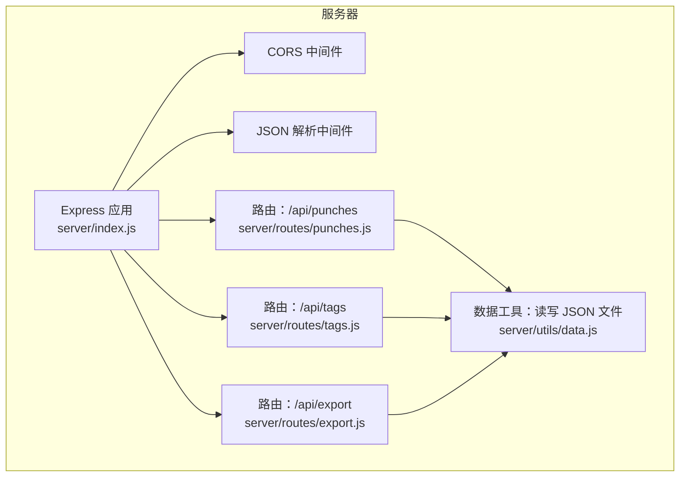
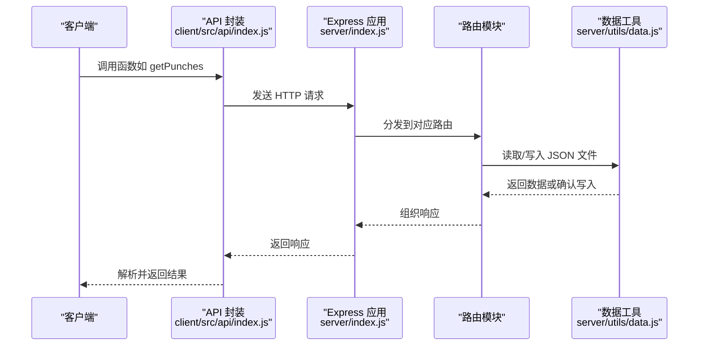
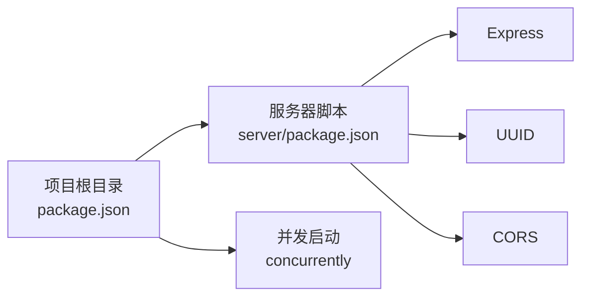

# API 接口文档

<cite>
**本文档引用的文件**
- [server/index.js](file://server/index.js)
- [server/routes/punches.js](file://server/routes/punches.js)
- [server/routes/tags.js](file://server/routes/tags.js)
- [server/routes/export.js](file://server/routes/export.js)
- [server/utils/data.js](file://server/utils/data.js)
- [client/src/api/index.js](file://client/src/api/index.js)
- [client/src/components/PunchPanel.jsx](file://client/src/components/PunchPanel.jsx)
- [client/src/components/ExportDialog.jsx](file://client/src/components/ExportDialog.jsx)
- [client/src/components/TagManager.jsx](file://client/src/components/TagManager.jsx)
- [package.json](file://package.json)
- [server/package.json](file://server/package.json)
</cite>

## 目录
1. [简介](#简介)
2. [项目结构](#项目结构)
3. [核心组件](#核心组件)
4. [架构总览](#架构总览)
5. [详细组件分析](#详细组件分析)
6. [依赖关系分析](#依赖关系分析)
7. [性能考虑](#性能考虑)
8. [故障排除指南](#故障排除指南)
9. [结论](#结论)
10. [附录](#附录)

## 简介
本项目提供一个轻量级的时间记录与导出系统，包含以下功能：
- 打卡记录管理：按天存储打卡记录，支持获取、创建、更新、删除
- 标签管理：创建、更新、删除标签，并自动生成颜色
- CSV 导出：按日期范围导出打卡记录为 CSV 文件

后端基于 Express.js，采用模块化路由设计；前端通过 fetch API 调用后端接口，提供直观的用户界面。

## 项目结构
后端服务通过中间件启用 CORS 和 JSON 解析，注册三个路由模块：
- /api/punches：打卡记录相关接口
- /api/tags：标签管理相关接口
- /api/export：CSV 导出相关接口

**图表来源**
- [server/index.js:16-35](file://server/index.js#L16-L35)
- [server/routes/punches.js:1-117](file://server/routes/punches.js#L1-L117)
- [server/routes/tags.js:1-75](file://server/routes/tags.js#L1-L75)
- [server/routes/export.js:1-88](file://server/routes/export.js#L1-L88)
- [server/utils/data.js:1-57](file://server/utils/data.js#L1-L57)

**章节来源**
- [server/index.js:16-35](file://server/index.js#L16-L35)
- [server/package.json:1-15](file://server/package.json#L1-L15)

## 核心组件
- Express 应用与中间件：启用跨域访问与 JSON 请求体解析
- 路由模块：分别处理打卡记录、标签与导出业务逻辑
- 数据工具：封装对 data 目录下 JSON 文件的读写操作

**章节来源**
- [server/index.js:16-35](file://server/index.js#L16-L35)
- [server/utils/data.js:12-57](file://server/utils/data.js#L12-L57)

## 架构总览
后端采用模块化设计，路由层负责请求处理与校验，数据层负责持久化。前端通过统一的 API 封装调用后端接口。

**图表来源**
- [client/src/api/index.js:1-75](file://client/src/api/index.js#L1-L75)
- [server/index.js:16-35](file://server/index.js#L16-L35)
- [server/utils/data.js:12-57](file://server/utils/data.js#L12-L57)

## 详细组件分析

### 打卡记录 API（/api/punches）
- 基础路径：/api/punches
- 支持方法：
  - GET：获取某一天的打卡记录
  - POST：创建新的打卡记录
  - PUT：更新指定 ID 的打卡记录
  - DELETE：删除指定 ID 的打卡记录

- 查询参数
  - date（GET/PUT/DELETE）：YYYY-MM-DD 格式的日期字符串，用于定位目标日期的数据文件

- 请求体字段（POST/PUT）
  - time（必填，POST；可选，PUT）：ISO 8601 时间字符串
  - description（可选）：描述文本

- 响应数据结构
  - GET：数组，元素为记录对象
  - POST/PUT：单个记录对象
  - DELETE：无内容（204）

- 错误码
  - 400：缺少必要参数或请求体不合法
  - 404：更新或删除的目标记录不存在

- 使用示例
  - 获取当天记录：GET /api/punches?date=YYYY-MM-DD
  - 创建记录：POST /api/punches
  - 更新记录：PUT /api/punches/:id?date=YYYY-MM-DD
  - 删除记录：DELETE /api/punches/:id?date=YYYY-MM-DD

- 客户端集成要点
  - 前端通过 API 封装函数调用，自动设置 Content-Type 为 application/json
  - 更新与删除需要在 URL 中携带 date 查询参数

**章节来源**
- [server/routes/punches.js:32-114](file://server/routes/punches.js#L32-L114)
- [client/src/api/index.js:3-34](file://client/src/api/index.js#L3-L34)

### 标签管理 API（/api/tags）
- 基础路径：/api/tags
- 支持方法：
  - GET：获取所有标签
  - POST：创建新标签
  - PUT：更新指定 ID 的标签（支持部分更新 name/color）
  - DELETE：删除指定 ID 的标签

- 请求体字段（POST/PUT）
  - name（POST 必填；PUT 可选）：标签名称，去除前后空白
  - color（PUT 可选）：颜色值（HSL 或其他有效 CSS 颜色）

- 响应数据结构
  - GET：数组，元素为标签对象
  - POST/PUT/DELETE：单个标签对象

- 错误码
  - 400：POST 时 name 为空
  - 404：更新或删除的目标标签不存在

- 使用示例
  - 获取标签：GET /api/tags
  - 创建标签：POST /api/tags
  - 更新标签：PUT /api/tags/:id
  - 删除标签：DELETE /api/tags/:id

- 客户端集成要点
  - 标签颜色由后端根据现有标签数量生成，避免重复且视觉上区分明显
  - 前端通过 API 封装函数进行 CRUD 操作

**章节来源**
- [server/routes/tags.js:16-72](file://server/routes/tags.js#L16-L72)
- [client/src/api/index.js:36-68](file://client/src/api/index.js#L36-L68)

### CSV 导出 API（/api/export）
- 基础路径：/api/export
- 支持方法：GET
- 查询参数
  - start（必填）：起始日期 YYYY-MM-DD
  - end（必填）：结束日期 YYYY-MM-DD

- 响应
  - Content-Type：text/csv; charset=utf-8
  - Content-Disposition：附件下载，文件名形如 time-records-YYYY-MM-DD-to-YYYY-MM-DD.csv
  - 内容：CSV 表头与行，表头为“开始时间,结束时间,时长(分钟),描述”

- 处理逻辑
  - 遍历日期范围内的每一天
  - 对每天的记录按时间升序排列
  - 相邻两条记录配对形成时间段，计算时长（分钟）
  - 对描述中的逗号进行 CSV 转义

- 错误码
  - 400：缺少 start 或 end 参数

- 使用示例
  - 导出某日 CSV：GET /api/export?start=YYYY-MM-DD&end=YYYY-MM-DD

- 客户端集成要点
  - 前端直接发起 GET 请求，接收二进制 Blob 并触发浏览器下载
  - 提供快捷设置今日/本周的功能

**章节来源**
- [server/routes/export.js:46-85](file://server/routes/export.js#L46-L85)
- [client/src/api/index.js:70-74](file://client/src/api/index.js#L70-L74)
- [client/src/components/ExportDialog.jsx:29-48](file://client/src/components/ExportDialog.jsx#L29-L48)

### 数据持久化与文件组织
- 存储位置：server/data/
- 文件命名规则
  - 每日打卡记录：YYYY-MM-DD.json
  - 标签数据：tags.json
- 读写行为
  - 若文件不存在，读取返回空数组
  - 写入时以缩进格式保存 JSON

**章节来源**
- [server/utils/data.js:12-57](file://server/utils/data.js#L12-L57)

## 依赖关系分析
- 后端依赖
  - express：Web 框架
  - cors：跨域支持
  - uuid：生成唯一标识符
- 前端依赖
  - concurrently：同时启动前后端开发环境
- 运行脚本
  - npm run dev：同时启动服务器与客户端
  - npm run server：仅启动服务器
  - npm run client：仅启动客户端

**图表来源**
- [package.json:5-8](file://package.json#L5-L8)
- [server/package.json:9-12](file://server/package.json#L9-L12)

**章节来源**
- [package.json:1-14](file://package.json#L1-L14)
- [server/package.json:1-15](file://server/package.json#L1-L15)

## 性能考虑
- 文件 I/O：每次请求都会读写 JSON 文件，建议在生产环境中引入缓存或数据库替代方案
- 排序复杂度：按时间排序为 O(n log n)，其中 n 为当日记录数
- 导出复杂度：遍历日期范围并对每条记录排序，整体复杂度与记录总数成正比
- 建议优化方向
  - 引入内存缓存减少磁盘访问
  - 使用数据库替换本地文件存储
  - 对导出任务异步化，避免阻塞请求线程

[本节为通用性能建议，无需特定文件来源]

## 故障排除指南
- 400 错误
  - 打卡记录：缺少 time 字段或 date 查询参数缺失
  - 标签：POST 时 name 为空
  - 导出：缺少 start 或 end 参数
- 404 错误
  - 更新或删除：目标记录或标签不存在
- 常见问题
  - CORS：确保前端与后端在同一域名或正确配置 CORS
  - 日期格式：请使用 YYYY-MM-DD 格式
  - 导出文件名：浏览器会根据 Content-Disposition 自动命名

**章节来源**
- [server/routes/punches.js:43-45](file://server/routes/punches.js#L43-L45)
- [server/routes/punches.js:67-69](file://server/routes/punches.js#L67-L69)
- [server/routes/tags.js:25-27](file://server/routes/tags.js#L25-L27)
- [server/routes/tags.js:47-49](file://server/routes/tags.js#L47-L49)
- [server/routes/export.js:50-52](file://server/routes/export.js#L50-L52)

## 结论
本项目提供了简洁实用的打卡记录与导出能力，接口设计清晰、易于集成。建议在生产环境中替换文件存储为数据库，并增加鉴权与限流等安全措施。

[本节为总结性内容，无需特定文件来源]

## 附录

### API 列表与规范
- 打卡记录
  - GET /api/punches?date=YYYY-MM-DD
  - POST /api/punches
  - PUT /api/punches/:id?date=YYYY-MM-DD
  - DELETE /api/punches/:id?date=YYYY-MM-DD
- 标签管理
  - GET /api/tags
  - POST /api/tags
  - PUT /api/tags/:id
  - DELETE /api/tags/:id
- CSV 导出
  - GET /api/export?start=YYYY-MM-DD&end=YYYY-MM-DD

**章节来源**
- [server/routes/punches.js:32-114](file://server/routes/punches.js#L32-L114)
- [server/routes/tags.js:16-72](file://server/routes/tags.js#L16-L72)
- [server/routes/export.js:46-85](file://server/routes/export.js#L46-L85)

### 客户端集成指南
- 基础路径：/api
- 认证机制：未实现（可按需扩展）
- 限流策略：未实现（可按需扩展）
- 常见场景
  - 打卡：调用 createPunch，传入 time 与 description
  - 导出：调用 exportCSV，传入 start 与 end
  - 标签管理：调用 getTags/createTag/updateTag/deleteTag

**章节来源**
- [client/src/api/index.js:1-75](file://client/src/api/index.js#L1-L75)
- [client/src/components/PunchPanel.jsx:28-45](file://client/src/components/PunchPanel.jsx#L28-L45)
- [client/src/components/ExportDialog.jsx:29-48](file://client/src/components/ExportDialog.jsx#L29-L48)
- [client/src/components/TagManager.jsx:16-69](file://client/src/components/TagManager.jsx#L16-L69)