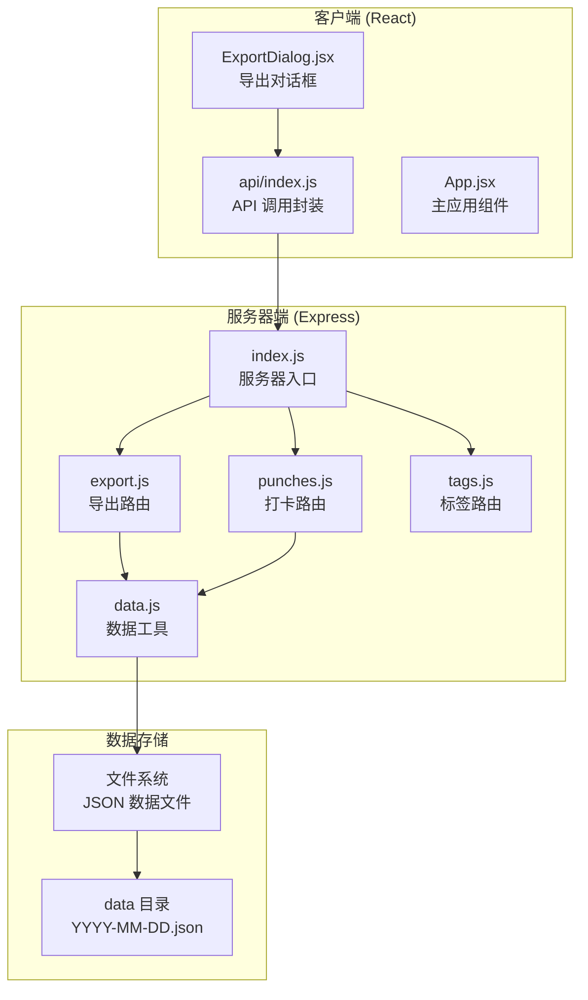
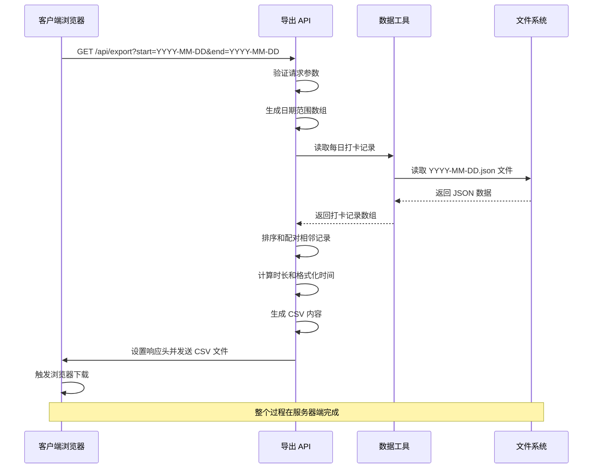
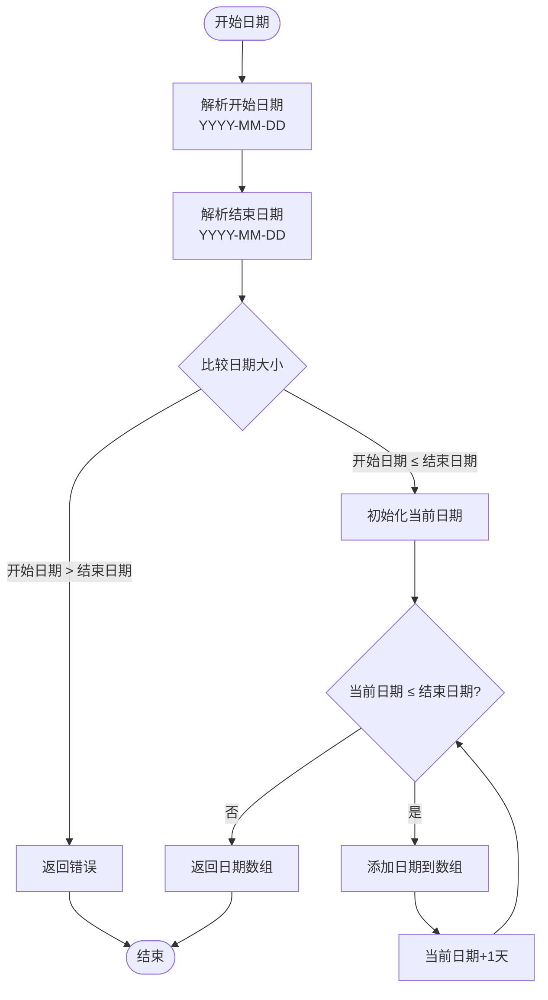
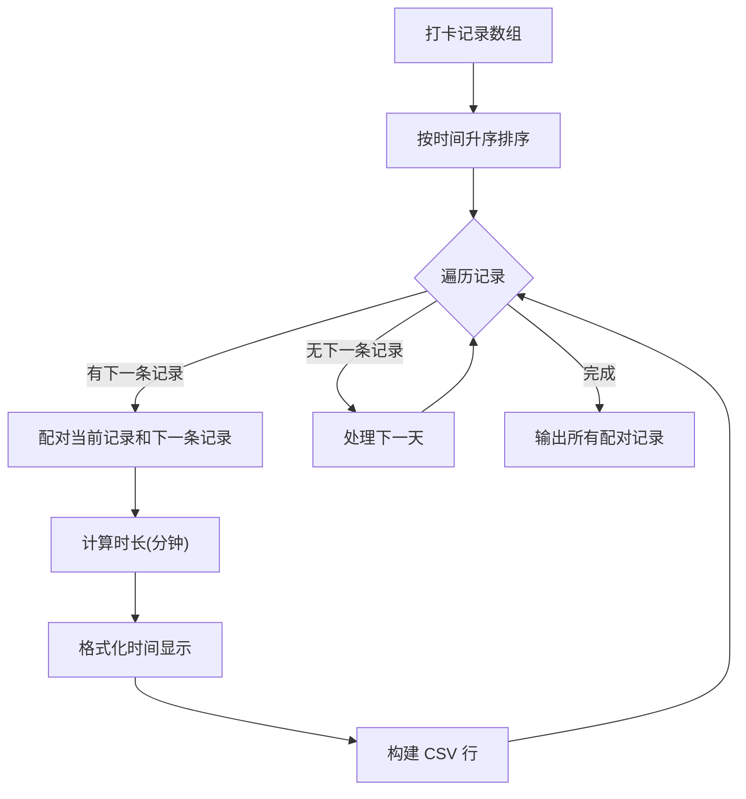
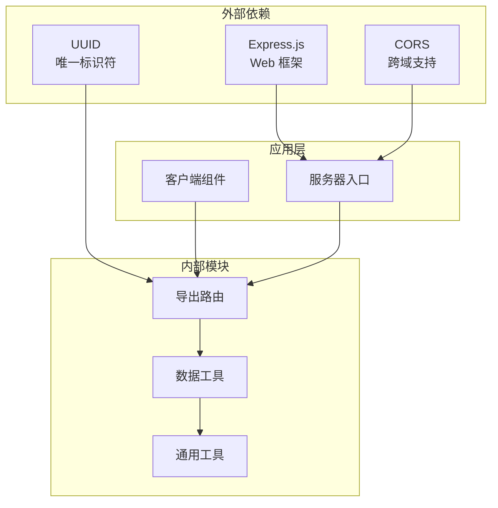

# CSV 导出 API

<cite>
**本文档引用的文件**
- [server/routes/export.js](file://server/routes/export.js)
- [server/utils/data.js](file://server/utils/data.js)
- [server/index.js](file://server/index.js)
- [client/src/components/ExportDialog.jsx](file://client/src/components/ExportDialog.jsx)
- [client/src/api/index.js](file://client/src/api/index.js)
- [server/routes/punches.js](file://server/routes/punches.js)
- [server/package.json](file://server/package.json)
- [package.json](file://package.json)
</cite>

## 目录
1. [简介](#简介)
2. [项目结构](#项目结构)
3. [核心组件](#核心组件)
4. [架构概览](#架构概览)
5. [详细组件分析](#详细组件分析)
6. [依赖关系分析](#依赖关系分析)
7. [性能考虑](#性能考虑)
8. [故障排除指南](#故障排除指南)
9. [结论](#结论)
10. [附录](#附录)

## 简介

CSV 导出 API 是任务记录系统中的一个关键功能模块，允许用户导出指定日期范围内的打卡记录数据。该 API 提供了灵活的数据导出能力，支持按日期范围筛选、自动时间配对计算和标准 CSV 格式输出。

本接口通过 HTTP GET 请求实现，要求提供开始日期和结束日期两个必需参数，返回包含完整打卡记录信息的 CSV 文件。系统采用前后端分离架构，前端负责用户界面交互，后端提供数据处理和导出服务。

## 项目结构

任务记录系统的整体架构采用现代全栈开发模式，分为客户端和服务器端两个独立的应用程序：

**图表来源**
- [server/index.js:1-35](file://server/index.js#L1-L35)
- [server/routes/export.js:1-88](file://server/routes/export.js#L1-L88)
- [server/utils/data.js:1-57](file://server/utils/data.js#L1-L57)

**章节来源**
- [server/index.js:1-35](file://server/index.js#L1-L35)
- [package.json:1-14](file://package.json#L1-L14)

## 核心组件

### 导出路由处理器

导出路由是整个 CSV 导出功能的核心组件，负责处理 HTTP 请求、数据验证、文件生成和响应发送。

主要功能特性：
- **日期范围验证**：确保 start 和 end 参数都存在且格式正确
- **数据遍历**：遍历指定日期范围内的所有日期
- **记录配对**：将相邻的打卡记录配对形成时间段
- **CSV 生成**：构建符合标准的 CSV 文件内容
- **响应头设置**：正确设置 Content-Type 和 Content-Disposition 头

### 数据工具模块

数据工具模块提供了文件系统操作的抽象层，负责与本地文件系统进行交互。

核心功能包括：
- **文件读取**：读取指定日期的打卡记录文件
- **文件写入**：保存打卡记录到对应日期文件
- **目录管理**：确保数据目录存在并可访问
- **JSON 解析**：处理 JSON 格式的文件内容

### 前端导出组件

前端导出组件提供了用户友好的界面，支持快速选择日期范围和触发导出操作。

主要特性：
- **快捷日期选择**：提供"今天"和"本周"等常用选项
- **日期输入验证**：确保日期格式的正确性
- **异步导出流程**：处理导出过程中的加载状态
- **浏览器兼容性**：使用标准的 Blob API 进行文件下载

**章节来源**
- [server/routes/export.js:46-85](file://server/routes/export.js#L46-L85)
- [server/utils/data.js:12-34](file://server/utils/data.js#L12-L34)
- [client/src/components/ExportDialog.jsx:29-48](file://client/src/components/ExportDialog.jsx#L29-L48)

## 架构概览

CSV 导出 API 的工作流程展示了完整的数据处理管道：

**图表来源**
- [server/routes/export.js:47-84](file://server/routes/export.js#L47-L84)
- [server/utils/data.js:17-24](file://server/utils/data.js#L17-L24)

## 详细组件分析

### 导出路由实现

导出路由实现了完整的 CSV 导出逻辑，包括参数验证、数据处理和响应生成。

#### 参数验证机制

路由首先检查必需的查询参数：
- **start 参数**：开始日期，必须提供
- **end 参数**：结束日期，必须提供
- **格式要求**：必须符合 YYYY-MM-DD 格式

如果缺少任何必需参数，API 将返回 400 错误状态码和相应的错误信息。

#### 日期范围处理

系统使用专门的函数来生成日期范围数组：

**图表来源**
- [server/routes/export.js:9-21](file://server/routes/export.js#L9-L21)

#### 数据配对算法

系统将相邻的打卡记录配对形成时间段，实现逻辑如下：

**图表来源**
- [server/routes/export.js:57-74](file://server/routes/export.js#L57-L74)

#### CSV 格式规范

生成的 CSV 文件遵循以下规范：

**文件头部**：
- 包含 UTF-8 BOM 标记
- 字段标题：开始时间,结束时间,时长(分钟),描述

**数据行格式**：
- 每行包含四个字段，用逗号分隔
- 包含逗号的描述字段会被双引号包围
- 时间格式：YYYY-MM-DD HH:mm
- 时长单位：分钟（四舍五入到整数）

**章节来源**
- [server/routes/export.js:46-85](file://server/routes/export.js#L46-L85)

### 数据工具模块

数据工具模块提供了文件系统操作的抽象层，确保数据的可靠存储和检索。

#### 文件读取机制

读取指定日期的打卡文件时，系统执行以下步骤：
1. 构建文件路径：`data/YYYY-MM-DD.json`
2. 检查文件是否存在
3. 如果文件不存在，返回空数组
4. 读取文件内容并解析为 JSON
5. 返回打卡记录数组

#### 文件写入机制

写入数据时，系统确保：
- 使用缩进格式化 JSON 内容
- 以 UTF-8 编码写入文件
- 自动创建必要的目录结构

**章节来源**
- [server/utils/data.js:17-34](file://server/utils/data.js#L17-L34)

### 前端集成组件

前端导出组件提供了完整的用户交互体验，包括日期选择、快捷操作和导出流程。

#### 日期选择器功能

组件支持多种日期选择方式：
- **手动输入**：使用 HTML5 date 输入控件
- **快捷按钮**：提供"今天"和"本周"快速选择
- **格式验证**：自动格式化为 YYYY-MM-DD 格式

#### 导出流程控制

导出过程包含完整的错误处理和状态管理：
1. 验证日期输入的有效性
2. 设置导出状态为进行中
3. 发送 HTTP 请求到后端 API
4. 处理响应并创建 Blob 对象
5. 触发浏览器下载机制
6. 清理临时资源

**章节来源**
- [client/src/components/ExportDialog.jsx:29-48](file://client/src/components/ExportDialog.jsx#L29-L48)
- [client/src/api/index.js:70-74](file://client/src/api/index.js#L70-L74)

## 依赖关系分析

系统各组件之间的依赖关系清晰明确，遵循单一职责原则：

**图表来源**
- [server/package.json:9-13](file://server/package.json#L9-L13)
- [server/index.js:1-35](file://server/index.js#L1-L35)

### 核心依赖说明

**服务器端依赖**：
- **Express.js**：提供 Web 服务器和路由功能
- **CORS**：启用跨域资源共享支持
- **UUID**：生成唯一的记录标识符

**客户端依赖**：
- **React**：构建用户界面组件
- **Vite**：开发服务器和构建工具

### 模块耦合度

系统设计具有良好的模块化特性：
- 导出路由仅依赖数据工具模块
- 数据工具模块不依赖其他业务逻辑
- 前端组件通过 API 接口与后端通信
- 各模块之间没有循环依赖

**章节来源**
- [server/package.json:9-13](file://server/package.json#L9-L13)
- [client/src/api/index.js:1-75](file://client/src/api/index.js#L1-L75)

## 性能考虑

### 数据处理优化

系统在数据处理方面采用了多项优化策略：

**内存效率**：
- 逐日处理数据，避免一次性加载所有日期的数据
- 使用流式处理减少内存占用
- 及时释放临时变量和中间结果

**计算优化**：
- 使用高效的日期比较和计算方法
- 避免重复的文件系统操作
- 优化 CSV 生成过程

### 文件系统考虑

**存储策略**：
- 每日数据存储为独立文件，便于管理和查询
- 自动创建数据目录，确保运行时可用性
- 使用 JSON 格式存储，便于人类阅读和调试

**并发处理**：
- 单线程事件循环模型，避免并发冲突
- 文件操作采用同步方式，确保数据一致性
- 导出操作不会影响正常的 CRUD 操作

## 故障排除指南

### 常见问题及解决方案

**1. 导出失败错误**
- **症状**：前端弹出"导出失败，请重试"提示
- **原因**：网络连接问题或服务器错误
- **解决**：检查网络连接，确认服务器正常运行

**2. 空数据导出**
- **症状**：导出的 CSV 文件只有表头
- **原因**：指定日期范围内没有打卡记录
- **解决**：调整日期范围或确认数据是否正确存储

**3. 日期格式错误**
- **症状**：API 返回 400 错误
- **原因**：start 或 end 参数格式不正确
- **解决**：确保使用 YYYY-MM-DD 格式

**4. 浏览器兼容性问题**
- **症状**：文件无法下载或下载异常
- **原因**：浏览器不支持某些 API
- **解决**：使用现代浏览器，确保 Blob API 可用

### 调试建议

**服务器端调试**：
- 检查服务器日志输出
- 验证数据文件的存在性和完整性
- 确认文件权限设置正确

**客户端调试**：
- 使用浏览器开发者工具查看网络请求
- 检查控制台是否有 JavaScript 错误
- 验证日期格式和参数传递

**章节来源**
- [server/routes/export.js:50-52](file://server/routes/export.js#L50-L52)
- [client/src/components/ExportDialog.jsx:42-47](file://client/src/components/ExportDialog.jsx#L42-L47)

## 结论

CSV 导出 API 是任务记录系统中的重要功能模块，提供了完整的数据导出能力。系统设计具有以下优势：

**技术优势**：
- 清晰的模块化架构，职责分离明确
- 标准化的 CSV 格式输出
- 完善的错误处理和边界情况处理
- 良好的性能表现和内存使用效率

**用户体验**：
- 直观的前端界面设计
- 快速的日期选择功能
- 流畅的导出流程体验

**扩展性**：
- 易于添加新的导出格式
- 支持自定义字段映射
- 可扩展的数据存储方案

该 API 为用户提供了便捷的数据导出功能，满足了日常数据管理和分析需求。

## 附录

### API 规范详情

**端点定义**：
- **方法**：GET
- **路径**：/api/export
- **查询参数**：
  - start (必需)：开始日期，格式 YYYY-MM-DD
  - end (必需)：结束日期，格式 YYYY-MM-DD

**响应格式**：
- **内容类型**：text/csv; charset=utf-8
- **内容编码**：UTF-8
- **文件名**：time-records-{start}-to-{end}.csv

**成功响应**：
- **状态码**：200 OK
- **响应体**：CSV 格式的打卡记录数据

**错误响应**：
- **状态码**：400 Bad Request
- **响应体**：包含错误信息的 JSON 对象

### 数据字段说明

| 字段名称 | 字段类型 | 描述 | 示例值 |
|---------|---------|------|--------|
| 开始时间 | 字符串 | 打卡开始时间 | 2024-01-01 09:00 |
| 结束时间 | 字符串 | 打卡结束时间 | 2024-01-01 18:00 |
| 时长(分钟) | 整数 | 工作时长（分钟） | 540 |
| 描述 | 字符串 | 打卡描述信息 | 项目开发 |

### 兼容性说明

**浏览器支持**：
- Chrome 60+
- Firefox 55+
- Safari 11+
- Edge 79+

**服务器环境**：
- Node.js 14+
- Express.js 4.x
- Windows/Linux/macOS

**文件系统要求**：
- 支持 UTF-8 编码
- 具备文件读写权限
- 足够的磁盘空间存储数据文件