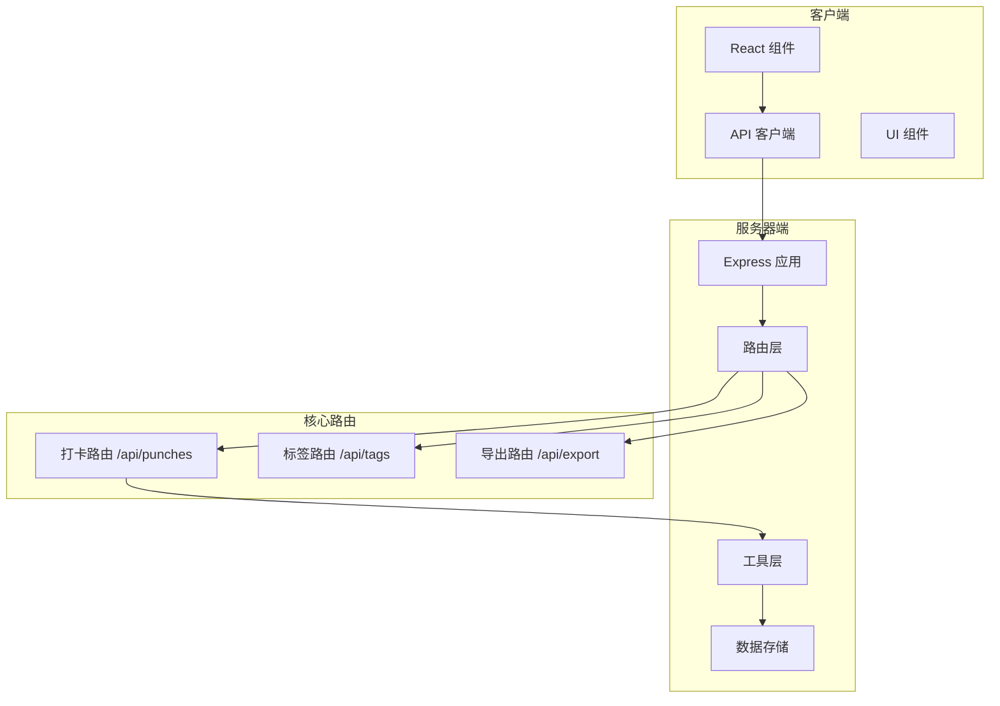
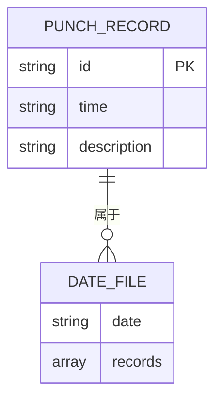
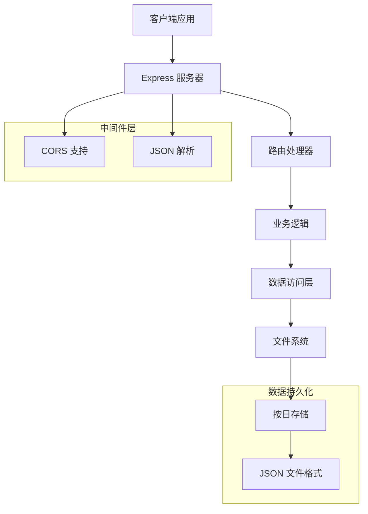
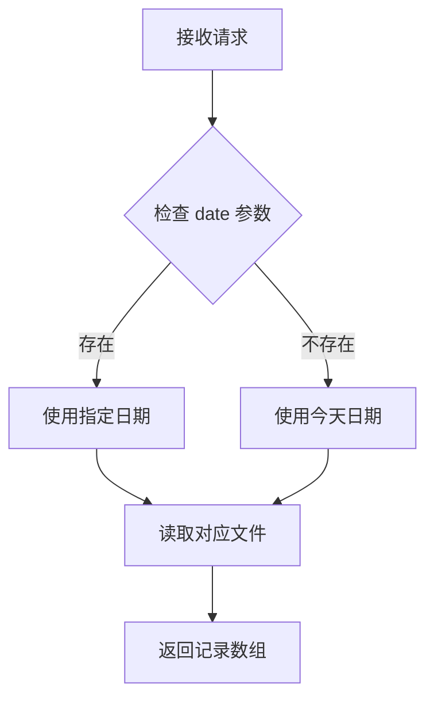
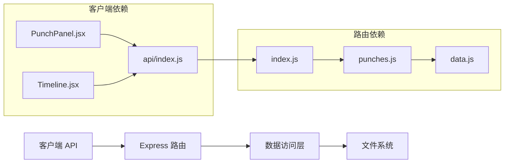

# 打卡记录 API

<cite>
**本文档引用的文件**
- [server/routes/punches.js](file://server/routes/punches.js)
- [server/utils/data.js](file://server/utils/data.js)
- [server/index.js](file://server/index.js)
- [client/src/api/index.js](file://client/src/api/index.js)
- [client/src/components/PunchPanel.jsx](file://client/src/components/PunchPanel.jsx)
- [client/src/components/Timeline.jsx](file://client/src/components/Timeline.jsx)
</cite>

## 目录
1. [简介](#简介)
2. [项目结构](#项目结构)
3. [核心组件](#核心组件)
4. [架构概览](#架构概览)
5. [详细接口文档](#详细接口文档)
6. [依赖关系分析](#依赖关系分析)
7. [性能考虑](#性能考虑)
8. [故障排除指南](#故障排除指南)
9. [结论](#结论)

## 简介

打卡记录 API 是一个基于 Node.js 和 Express 的轻量级时间记录系统，允许用户创建、查询、更新和删除打卡记录。系统采用文件存储方式，将每日的打卡记录保存为独立的 JSON 文件，支持按日期进行查询和管理。

该系统主要面向个人或小型团队的时间管理工作，提供简单直观的打卡功能，支持描述信息和标签管理，并能够自动生成时间段记录。

## 项目结构

项目采用前后端分离的架构设计，主要分为以下模块：



**图表来源**
- [server/index.js:1-35](file://server/index.js#L1-L35)
- [server/routes/punches.js:1-117](file://server/routes/punches.js#L1-L117)

**章节来源**
- [server/index.js:1-35](file://server/index.js#L1-L35)
- [server/routes/punches.js:1-117](file://server/routes/punches.js#L1-L117)

## 核心组件

### 服务器端核心组件

系统的核心由三个主要组件构成：

1. **Express 应用服务器** - 提供 RESTful API 服务
2. **数据访问层** - 负责文件系统的读写操作
3. **业务逻辑层** - 处理具体的业务规则和数据验证

### 数据模型

打卡记录采用简洁的数据结构：



**图表来源**
- [server/routes/punches.js:48-52](file://server/routes/punches.js#L48-L52)
- [server/utils/data.js:17-24](file://server/utils/data.js#L17-L24)

**章节来源**
- [server/utils/data.js:1-57](file://server/utils/data.js#L1-L57)
- [server/routes/punches.js:1-117](file://server/routes/punches.js#L1-L117)

## 架构概览

系统采用分层架构设计，确保关注点分离和代码的可维护性：



**图表来源**
- [server/index.js:16-35](file://server/index.js#L16-L35)
- [server/routes/punches.js:32-37](file://server/routes/punches.js#L32-L37)

**章节来源**
- [server/index.js:1-35](file://server/index.js#L1-L35)

## 详细接口文档

### GET /api/punches

获取指定日期的打卡记录列表。

#### 请求参数

| 参数名 | 类型 | 必需 | 默认值 | 描述 |
|--------|------|------|--------|------|
| date | string | 否 | 今日日期 | ISO 8601 日期格式 YYYY-MM-DD |

#### 响应格式

成功响应返回 JSON 数组，每个元素包含：

| 字段名 | 类型 | 描述 |
|--------|------|------|
| id | string | 唯一标识符 |
| time | string | ISO 8601 时间戳 |
| description | string | 描述信息 |

#### 错误码

| 状态码 | 错误信息 | 描述 |
|--------|----------|------|
| 200 | 成功 | 查询成功 |
| 400 | 参数错误 | 日期格式不正确 |

#### 使用示例

**请求示例**
```
GET /api/punches?date=2024-01-15
```

**响应示例**
```json
[
  {
    "id": "123e4567-e89b-12d3-a456-426614174000",
    "time": "2024-01-15T09:00:00.000Z",
    "description": "开始工作"
  },
  {
    "id": "87654321-1234-5678-9abc-def123456789",
    "time": "2024-01-15T18:00:00.000Z",
    "description": "结束工作"
  }
]
```

**章节来源**
- [server/routes/punches.js:32-37](file://server/routes/punches.js#L32-L37)
- [server/utils/data.js:17-24](file://server/utils/data.js#L17-L24)

### POST /api/punches

创建新的打卡记录。

#### 请求参数

| 参数名 | 类型 | 必需 | 描述 |
|--------|------|------|------|
| time | string | 是 | ISO 8601 时间戳 |
| description | string | 否 | 描述信息，默认为空字符串 |

#### 响应格式

成功响应返回创建的记录对象：

| 字段名 | 类型 | 描述 |
|--------|------|------|
| id | string | 唯一标识符 |
| time | string | ISO 8601 时间戳 |
| description | string | 描述信息 |

#### 错误码

| 状态码 | 错误信息 | 描述 |
|--------|----------|------|
| 201 | 创建成功 | 打卡记录创建成功 |
| 400 | 缺少参数 | time 参数是必需的 |

#### 使用示例

**请求示例**
```json
{
  "time": "2024-01-15T10:30:00.000Z",
  "description": "参加会议"
}
```

**响应示例**
```json
{
  "id": "550e8400-e29b-41d4-a716-446655440000",
  "time": "2024-01-15T10:30:00.000Z",
  "description": "参加会议"
}
```

**章节来源**
- [server/routes/punches.js:39-60](file://server/routes/punches.js#L39-L60)

### PUT /api/punches/:id

更新指定 ID 的打卡记录。

#### 路径参数

| 参数名 | 类型 | 必需 | 描述 |
|--------|------|------|------|
| id | string | 是 | 打卡记录的唯一标识符 |

#### 查询参数

| 参数名 | 类型 | 必需 | 描述 |
|--------|------|------|------|
| date | string | 是 | 记录所属日期 YYYY-MM-DD |

#### 请求参数

| 参数名 | 类型 | 必需 | 描述 |
|--------|------|------|------|
| time | string | 否 | ISO 8601 时间戳 |
| description | string | 否 | 描述信息 |

#### 响应格式

成功响应返回更新后的记录对象。

#### 错误码

| 状态码 | 错误信息 | 描述 |
|--------|----------|------|
| 200 | 更新成功 | 记录更新成功 |
| 400 | 参数错误 | 缺少 date 查询参数 |
| 404 | 记录不存在 | 指定 ID 的记录不存在 |

#### 使用示例

**请求示例**
```
PUT /api/punches/123e4567-e89b-12d3-a456-426614174000?date=2024-01-15
```

**请求体**
```json
{
  "time": "2024-01-15T11:00:00.000Z",
  "description": "会议进行中"
}
```

**响应示例**
```json
{
  "id": "123e4567-e89b-12d3-a456-426614174000",
  "time": "2024-01-15T11:00:00.000Z",
  "description": "会议进行中"
}
```

**章节来源**
- [server/routes/punches.js:62-92](file://server/routes/punches.js#L62-L92)

### DELETE /api/punches/:id

删除指定 ID 的打卡记录。

#### 路径参数

| 参数名 | 类型 | 必需 | 描述 |
|--------|------|------|------|
| id | string | 是 | 打卡记录的唯一标识符 |

#### 查询参数

| 参数名 | 类型 | 必需 | 描述 |
|--------|------|------|------|
| date | string | 是 | 记录所属日期 YYYY-MM-DD |

#### 响应格式

删除成功返回空响应。

#### 错误码

| 状态码 | 错误信息 | 描述 |
|--------|----------|------|
| 204 | 删除成功 | 记录删除成功 |
| 400 | 参数错误 | 缺少 date 查询参数 |
| 404 | 记录不存在 | 指定 ID 的记录不存在 |

#### 使用示例

**请求示例**
```
DELETE /api/punches/123e4567-e89b-12d3-a456-426614174000?date=2024-01-15
```

**响应示例**
```
空响应 (204 No Content)
```

**章节来源**
- [server/routes/punches.js:94-114](file://server/routes/punches.js#L94-L114)

### 时间戳格式要求

系统严格遵循 ISO 8601 标准的时间格式：

- **格式**: `YYYY-MM-DDTHH:mm:ss.sssZ`
- **示例**: `2024-01-15T10:30:00.000Z`
- **时区**: 必须包含时区信息
- **验证**: 服务器端会自动从时间戳中提取日期部分用于文件存储

### 日期过滤机制

系统通过以下机制实现日期过滤：



**图表来源**
- [server/routes/punches.js:33-36](file://server/routes/punches.js#L33-L36)

### 排序规则

系统采用时间升序排列：

1. **排序算法**: 基于时间戳的数值比较
2. **排序时机**: 
   - 创建记录时自动排序
   - 更新记录时重新排序
   - 查询记录时返回已排序结果
3. **排序稳定性**: 使用稳定的排序算法确保相同时间戳的记录顺序一致

**章节来源**
- [server/routes/punches.js:25-30](file://server/routes/punches.js#L25-L30)
- [server/routes/punches.js:56](file://server/routes/punches.js#L56)
- [server/routes/punches.js:87](file://server/routes/punches.js#L87)

## 依赖关系分析

系统各组件之间的依赖关系如下：



**图表来源**
- [server/routes/punches.js:1-3](file://server/routes/punches.js#L1-L3)
- [server/index.js:3-5](file://server/index.js#L3-L5)

**章节来源**
- [server/routes/punches.js:1-117](file://server/routes/punches.js#L1-L117)
- [server/index.js:1-35](file://server/index.js#L1-L35)

## 性能考虑

### 存储优化

1. **文件组织**: 每天一个 JSON 文件，避免单个大文件导致的性能问题
2. **内存管理**: 仅在需要时加载特定日期的记录到内存
3. **I/O 优化**: 使用同步文件操作确保数据一致性

### 排序性能

- **时间复杂度**: O(n log n)，其中 n 为当天记录数量
- **空间复杂度**: O(n)，用于临时存储排序结果
- **优化建议**: 对于大量记录，考虑实现索引机制

### 并发处理

- **竞态条件**: 当前实现未处理并发写入场景
- **解决方案**: 可考虑引入文件锁或数据库替代方案

## 故障排除指南

### 常见错误及解决方案

#### 400 错误 (参数错误)

**症状**: 请求被拒绝，返回 400 状态码

**可能原因**:
1. 缺少必需的查询参数
2. 日期格式不正确
3. 缺少必要的请求体参数

**解决方法**:
```javascript
// 确保提供正确的查询参数
const response = await fetch('/api/punches?date=2024-01-15');

// 确保提供必需的请求体参数
const response = await fetch('/api/punches', {
  method: 'POST',
  headers: {'Content-Type': 'application/json'},
  body: JSON.stringify({
    time: new Date().toISOString(),
    description: '描述信息'
  })
});
```

#### 404 错误 (资源不存在)

**症状**: 更新或删除操作返回 404

**可能原因**:
1. 记录 ID 不存在
2. 日期参数与记录实际日期不符

**解决方法**:
```javascript
// 确保使用正确的日期参数
const response = await fetch(
  `/api/punches/${recordId}?date=${recordDate}`,
  { method: 'PUT' }
);
```

#### 数据一致性问题

**症状**: 数据显示异常或丢失

**解决方法**:
1. 检查服务器日志中的错误信息
2. 验证文件权限设置
3. 确认磁盘空间充足

**章节来源**
- [server/routes/punches.js:43-45](file://server/routes/punches.js#L43-L45)
- [server/routes/punches.js:67-69](file://server/routes/punches.js#L67-L69)
- [server/routes/punches.js:74-76](file://server/routes/punches.js#L74-L76)
- [server/routes/punches.js:99-101](file://server/routes/punches.js#L99-L101)
- [server/routes/punches.js:106-108](file://server/routes/punches.js#L106-L108)

## 结论

打卡记录 API 提供了一个简洁而功能完整的解决方案，适用于个人和小型团队的时间管理工作。系统的主要优势包括：

1. **简单易用**: 直观的 RESTful API 设计
2. **数据持久化**: 基于文件系统的可靠存储
3. **实时排序**: 自动按时间顺序排列记录
4. **前端集成**: 完整的 React 前端组件支持

### 改进建议

1. **数据库迁移**: 考虑迁移到数据库以支持更好的并发处理
2. **缓存机制**: 实现内存缓存以提高查询性能
3. **API 版本控制**: 添加 API 版本管理
4. **认证授权**: 添加用户认证和权限控制
5. **数据备份**: 实现自动备份机制

该系统为时间管理工作提供了一个良好的起点，可以根据具体需求进行扩展和定制。