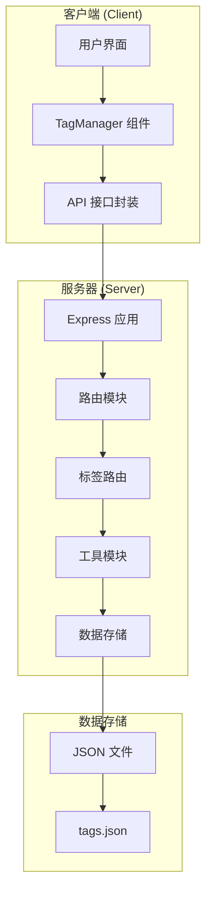
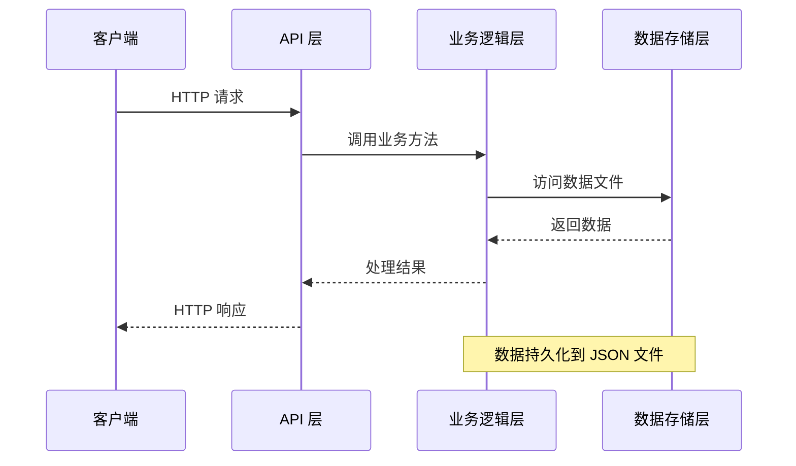
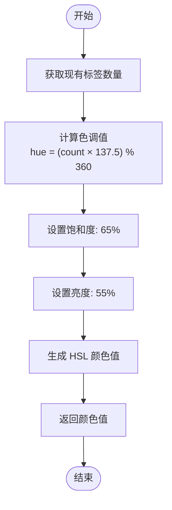
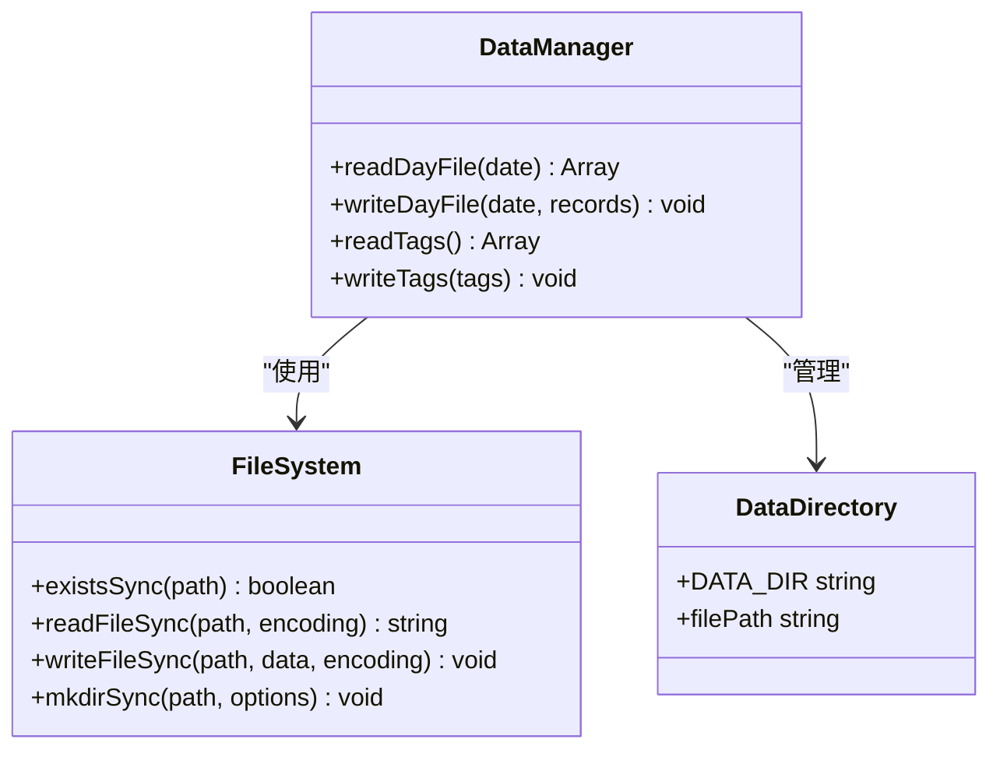
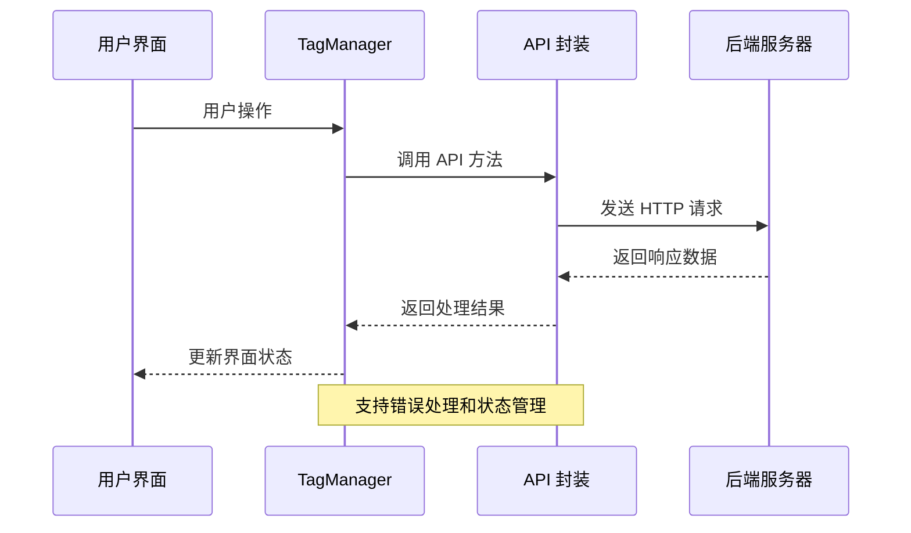
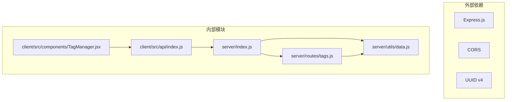
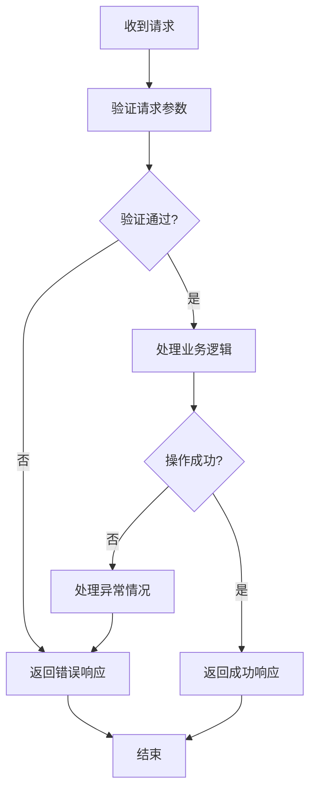

# 标签管理 API

<cite>
**本文档引用的文件**
- [server/routes/tags.js](file://server/routes/tags.js)
- [server/utils/data.js](file://server/utils/data.js)
- [server/index.js](file://server/index.js)
- [client/src/api/index.js](file://client/src/api/index.js)
- [client/src/components/TagManager.jsx](file://client/src/components/TagManager.jsx)
</cite>

## 目录
1. [简介](#简介)
2. [项目结构](#项目结构)
3. [核心组件](#核心组件)
4. [架构概览](#架构概览)
5. [详细组件分析](#详细组件分析)
6. [依赖关系分析](#依赖关系分析)
7. [性能考虑](#性能考虑)
8. [故障排除指南](#故障排除指南)
9. [结论](#结论)

## 简介

标签管理 API 是一个基于 Node.js 和 Express 构建的 RESTful API，用于管理系统中的标签资源。该 API 提供了完整的 CRUD 操作，包括获取所有标签、创建新标签、更新标签信息和删除标签功能。系统采用本地文件存储机制，使用 JSON 文件作为数据持久化层。

## 项目结构

该项目采用前后端分离的架构设计，前端使用 React 构建用户界面，后端提供 RESTful API 服务。



**图表来源**
- [server/index.js:16-35](file://server/index.js#L16-L35)
- [server/routes/tags.js:1-75](file://server/routes/tags.js#L1-L75)
- [server/utils/data.js:36-57](file://server/utils/data.js#L36-L57)

**章节来源**
- [server/index.js:1-35](file://server/index.js#L1-L35)
- [server/routes/tags.js:1-75](file://server/routes/tags.js#L1-L75)
- [server/utils/data.js:1-57](file://server/utils/data.js#L1-L57)

## 核心组件

### 数据模型定义

标签数据模型包含以下字段：

| 字段名 | 类型 | 必填 | 描述 | 示例值 |
|--------|------|------|------|--------|
| id | String | 是 | 标签唯一标识符 | `"550e8400-e29b-41d4-a716-446655440000"` |
| name | String | 是 | 标签名称 | `"重要任务"` |
| color | String | 是 | 标签颜色值 | `"hsl(137.5, 65%, 55%)"` |

### 颜色规范

系统支持多种颜色格式：
- **HSL 格式**: `hsl(hue, saturation%, lightness%)`
- **十六进制格式**: `#RRGGBB`
- **RGB 格式**: `rgb(r, g, b)`
- **颜色名称**: `red`, `blue`, `green` 等

颜色生成算法使用黄金角度（137.5°）确保颜色之间的视觉区分度。

**章节来源**
- [server/routes/tags.js:10-14](file://server/routes/tags.js#L10-L14)
- [server/routes/tags.js:30-34](file://server/routes/tags.js#L30-L34)

## 架构概览

系统采用分层架构设计，清晰分离了表示层、业务逻辑层和数据访问层。



**图表来源**
- [server/index.js:20-27](file://server/index.js#L20-L27)
- [server/utils/data.js:36-57](file://server/utils/data.js#L36-L57)

## 详细组件分析

### 标签路由模块

标签路由模块实现了完整的 RESTful API，包含四个主要端点：

#### GET /api/tags
获取所有标签列表

**请求格式**
- 方法: GET
- 路径: `/api/tags`
- 请求头: `Accept: application/json`

**响应格式**
- 状态码: 200 OK
- 响应体: 标签对象数组

**成功响应示例**
```json
[
  {
    "id": "550e8400-e29b-41d4-a716-446655440000",
    "name": "重要任务",
    "color": "hsl(137.5, 65%, 55%)"
  },
  {
    "id": "660f9511-f30c-52e5-b827-557766551111",
    "name": "紧急任务",
    "color": "hsl(275, 65%, 55%)"
  }
]
```

#### POST /api/tags
创建新标签

**请求格式**
- 方法: POST
- 路径: `/api/tags`
- 请求头: `Content-Type: application/json`
- 请求体: `{ "name": "标签名称" }`

**响应格式**
- 状态码: 201 Created
- 响应体: 新创建的标签对象

**请求验证规则**
- `name` 字段必须存在且非空
- 自动分配唯一 UUID 作为 `id`
- 自动生成 HSL 格式的颜色值

**成功响应示例**
```json
{
  "id": "771f0622-g41d-63f6-c938-668877662222",
  "name": "新标签",
  "color": "hsl(137.5, 65%, 55%)"
}
```

#### PUT /api/tags/:id
更新指定 ID 的标签信息

**请求格式**
- 方法: PUT
- 路径: `/api/tags/:id`
- 请求头: `Content-Type: application/json`
- 路径参数: `id` (标签唯一标识符)
- 请求体: 可选字段 `{ "name": "新名称", "color": "新颜色" }`

**响应格式**
- 状态码: 200 OK
- 响应体: 更新后的标签对象

**请求验证规则**
- `id` 参数必须存在且对应现有标签
- 支持部分更新（仅更新提供的字段）
- 不提供字段时保持原值不变

#### DELETE /api/tags/:id
删除指定 ID 的标签

**请求格式**
- 方法: DELETE
- 路径: `/api/tags/:id`
- 路径参数: `id` (标签唯一标识符)

**响应格式**
- 状态码: 200 OK
- 响应体: 被删除的标签对象

**章节来源**
- [server/routes/tags.js:16-72](file://server/routes/tags.js#L16-L72)

### 颜色生成算法

系统实现了智能的颜色生成算法，确保新创建的标签具有鲜明且相互区分的颜色。



**图表来源**
- [server/routes/tags.js:10-14](file://server/routes/tags.js#L10-L14)

**算法特点**
- 使用黄金角度（137.5°）确保颜色分布均匀
- 固定饱和度和亮度值保证颜色对比度
- 确保新标签与现有标签在视觉上易于区分

**章节来源**
- [server/routes/tags.js:10-14](file://server/routes/tags.js#L10-L14)

### 数据持久化层

数据存储采用本地文件系统，使用 JSON 文件进行数据持久化。



**图表来源**
- [server/utils/data.js:12-57](file://server/utils/data.js#L12-L57)

**数据存储特性**
- 自动创建 `data/` 目录
- 使用 `tags.json` 存储标签数据
- JSON 格式便于人类阅读和调试
- 文件编码统一使用 UTF-8

**章节来源**
- [server/utils/data.js:12-57](file://server/utils/data.js#L12-L57)

### 前端集成

前端组件通过 API 封装模块与后端进行通信。



**图表来源**
- [client/src/components/TagManager.jsx:16-69](file://client/src/components/TagManager.jsx#L16-L69)
- [client/src/api/index.js:36-68](file://client/src/api/index.js#L36-L68)

**前端功能特性**
- 实时标签列表加载
- 异步数据操作
- 错误状态处理
- 用户交互反馈

**章节来源**
- [client/src/components/TagManager.jsx:1-135](file://client/src/components/TagManager.jsx#L1-L135)
- [client/src/api/index.js:1-75](file://client/src/api/index.js#L1-L75)

## 依赖关系分析

系统依赖关系清晰，模块职责明确。



**图表来源**
- [server/index.js:1-35](file://server/index.js#L1-L35)
- [server/routes/tags.js:1-3](file://server/routes/tags.js#L1-L3)
- [client/src/api/index.js:1](file://client/src/api/index.js#L1)

**依赖特性**
- Express.js 提供 Web 服务器功能
- UUID v4 生成唯一标识符
- CORS 支持跨域请求
- 模块化设计便于维护

**章节来源**
- [server/index.js:1-35](file://server/index.js#L1-L35)
- [server/routes/tags.js:1-3](file://server/routes/tags.js#L1-L3)

## 性能考虑

### 数据访问模式
- 所有数据操作都是内存中处理，然后一次性写入文件
- 读取操作会缓存整个标签集合到内存
- 对于大量标签的情况，建议考虑数据库替代方案

### 并发处理
- 当前实现没有内置的并发控制机制
- 多个客户端同时修改标签可能导致竞态条件
- 建议在生产环境中添加适当的锁机制

### 内存使用
- 标签数据完全驻留在内存中
- 每次请求都会重新读取完整数据集
- 对于大数据量场景需要优化策略

## 故障排除指南

### 常见错误及解决方案

| 错误类型 | HTTP 状态码 | 错误原因 | 解决方案 |
|----------|-------------|----------|----------|
| 标签不存在 | 404 Not Found | 请求的标签 ID 不存在 | 检查标签 ID 是否正确，确认标签已被创建 |
| 名称为空 | 400 Bad Request | 标签名称为空或只包含空白字符 | 确保提供有效的非空名称 |
| 服务器错误 | 500 Internal Server Error | 文件系统访问失败 | 检查数据目录权限，确认磁盘空间充足 |

### 错误处理流程



**章节来源**
- [server/routes/tags.js:25-27](file://server/routes/tags.js#L25-L27)
- [server/routes/tags.js:47-49](file://server/routes/tags.js#L47-L49)

### 调试建议

1. **检查网络连接**: 确认客户端能够访问 `http://localhost:3001/api/tags`
2. **验证数据格式**: 确保请求体符合 JSON 格式要求
3. **查看服务器日志**: 监听端口 3001 的启动日志
4. **检查文件权限**: 确认应用程序对 `data/` 目录有读写权限

## 结论

标签管理 API 提供了一个简洁而功能完整的标签管理系统。其设计特点包括：

**优势**
- 清晰的 RESTful API 设计
- 自动化的颜色生成机制
- 简单的数据持久化方案
- 前后端分离的架构设计

**限制**
- 单机部署，不支持分布式扩展
- 缺少数据完整性约束验证
- 没有内置的并发控制机制
- 错误处理相对简单

**改进建议**
- 添加数据库支持以提高性能和可靠性
- 实现数据验证和约束检查
- 添加并发控制和事务支持
- 增强错误处理和日志记录
- 考虑添加标签分类和层级结构

该 API 适合小型团队或个人使用的标签管理场景，为更复杂的应用需求提供了良好的基础架构。