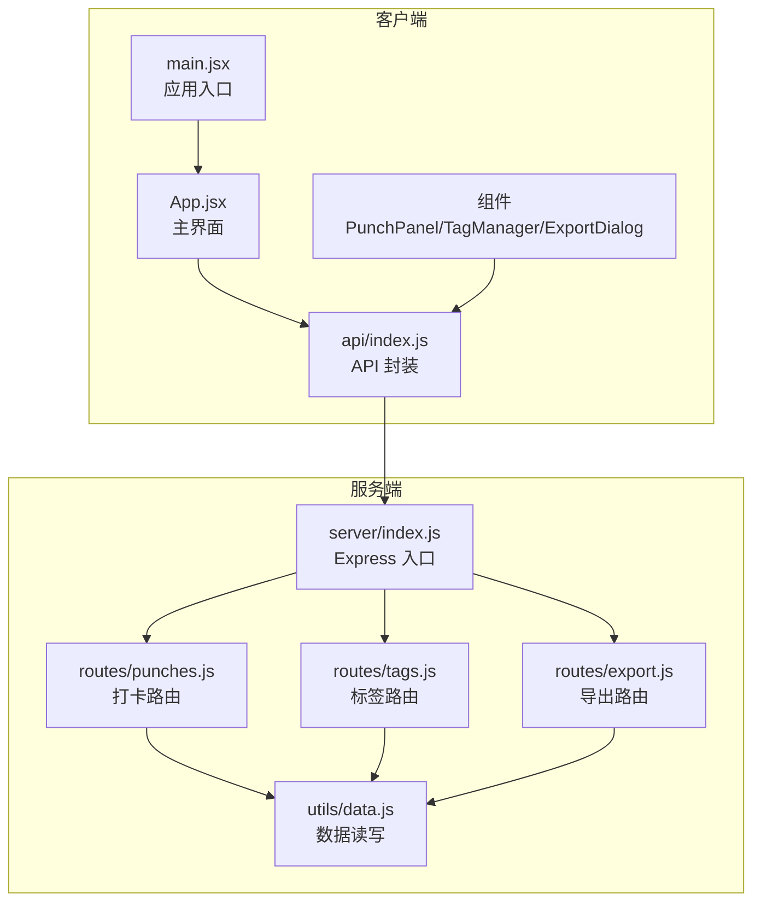
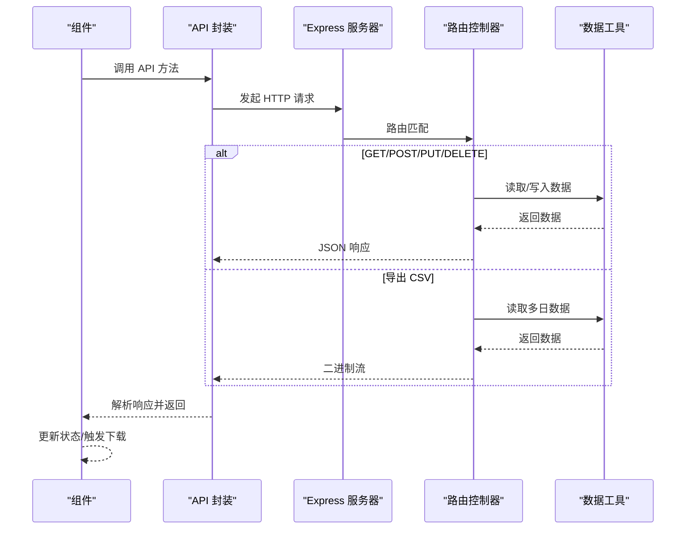
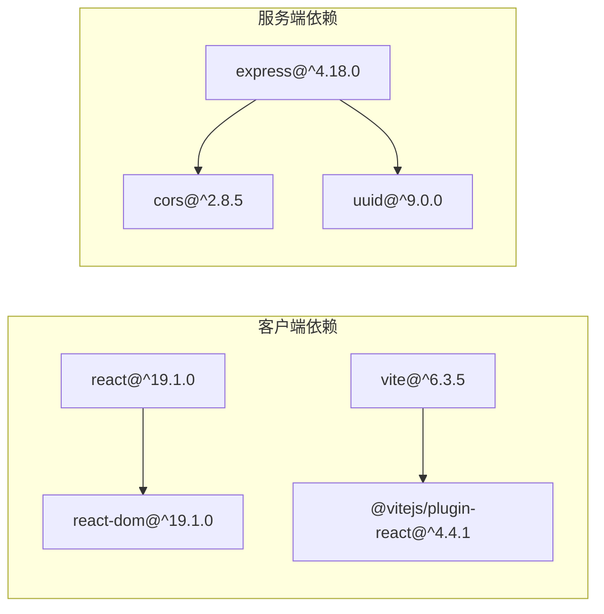

# API 通信层

<cite>
**本文引用的文件**
- [client/src/api/index.js](file://client/src/api/index.js)
- [client/src/App.jsx](file://client/src/App.jsx)
- [client/src/main.jsx](file://client/src/main.jsx)
- [client/src/components/PunchPanel.jsx](file://client/src/components/PunchPanel.jsx)
- [client/src/components/TagManager.jsx](file://client/src/components/TagManager.jsx)
- [client/src/components/ExportDialog.jsx](file://client/src/components/ExportDialog.jsx)
- [server/index.js](file://server/index.js)
- [server/routes/punches.js](file://server/routes/punches.js)
- [server/routes/tags.js](file://server/routes/tags.js)
- [server/routes/export.js](file://server/routes/export.js)
- [server/utils/data.js](file://server/utils/data.js)
- [client/package.json](file://client/package.json)
- [server/package.json](file://server/package.json)
</cite>

## 目录
1. [简介](#简介)
2. [项目结构](#项目结构)
3. [核心组件](#核心组件)
4. [架构总览](#架构总览)
5. [详细组件分析](#详细组件分析)
6. [依赖关系分析](#依赖关系分析)
7. [性能考虑](#性能考虑)
8. [故障排查指南](#故障排查指南)
9. [结论](#结论)
10. [附录](#附录)

## 简介
本文件聚焦于 taskRecordre 项目的 API 通信层设计与实现，系统性阐述前端 API 封装的设计理念、HTTP 请求的统一处理机制、错误处理策略与响应数据格式，并解释 API 层如何简化后端接口调用、提供一致的错误处理与数据转换。同时给出请求拦截、响应拦截与网络异常处理的扩展建议、最佳实践、性能优化与缓存策略，以及 API 扩展指南与测试策略。

## 项目结构
该项目采用前后端分离架构：
- 前端基于 Vite + React，通过模块化的 API 封装统一访问后端服务。
- 后端基于 Express，按功能拆分路由模块，数据持久化到本地 JSON 文件。

图表来源
- [client/src/main.jsx:1-11](file://client/src/main.jsx#L1-L11)
- [client/src/App.jsx:1-86](file://client/src/App.jsx#L1-L86)
- [client/src/api/index.js:1-75](file://client/src/api/index.js#L1-L75)
- [server/index.js:1-35](file://server/index.js#L1-L35)
- [server/routes/punches.js:1-117](file://server/routes/punches.js#L1-L117)
- [server/routes/tags.js:1-75](file://server/routes/tags.js#L1-L75)
- [server/routes/export.js:1-88](file://server/routes/export.js#L1-L88)
- [server/utils/data.js:1-57](file://server/utils/data.js#L1-L57)

章节来源
- [client/src/main.jsx:1-11](file://client/src/main.jsx#L1-L11)
- [client/src/App.jsx:1-86](file://client/src/App.jsx#L1-L86)
- [server/index.js:1-35](file://server/index.js#L1-L35)

## 核心组件
- 前端 API 封装：集中定义了所有后端接口的调用方法，统一处理请求头、序列化与响应解析，提供一致的错误抛出策略。
- 组件层：各业务组件通过 API 封装发起请求，负责 UI 状态与交互反馈。
- 后端路由：按资源划分（punches/tags/export），统一处理参数校验、业务逻辑与响应格式。
- 数据工具：封装文件系统读写，保证数据目录存在与 JSON 序列化一致性。

章节来源
- [client/src/api/index.js:1-75](file://client/src/api/index.js#L1-L75)
- [client/src/components/PunchPanel.jsx:1-119](file://client/src/components/PunchPanel.jsx#L1-L119)
- [client/src/components/TagManager.jsx:1-135](file://client/src/components/TagManager.jsx#L1-L135)
- [client/src/components/ExportDialog.jsx:1-98](file://client/src/components/ExportDialog.jsx#L1-L98)
- [server/routes/punches.js:1-117](file://server/routes/punches.js#L1-L117)
- [server/routes/tags.js:1-75](file://server/routes/tags.js#L1-L75)
- [server/routes/export.js:1-88](file://server/routes/export.js#L1-L88)
- [server/utils/data.js:1-57](file://server/utils/data.js#L1-L57)

## 架构总览
从前端到后端的数据流如下：
- 前端组件通过 API 封装发起 HTTP 请求，统一前缀为 /api。
- Express 服务器注册路由，按路径分发至对应控制器。
- 控制器读取或写入本地 JSON 文件，返回标准 JSON 或二进制流。
- 前端在组件层根据响应结果更新 UI 状态或触发下载。

图表来源
- [client/src/api/index.js:1-75](file://client/src/api/index.js#L1-L75)
- [server/index.js:1-35](file://server/index.js#L1-L35)
- [server/routes/punches.js:1-117](file://server/routes/punches.js#L1-L117)
- [server/routes/tags.js:1-75](file://server/routes/tags.js#L1-L75)
- [server/routes/export.js:1-88](file://server/routes/export.js#L1-L88)
- [server/utils/data.js:1-57](file://server/utils/data.js#L1-L57)

## 详细组件分析

### 前端 API 封装（client/src/api/index.js）
- 设计理念
  - 统一前缀 BASE="/api"，隐藏具体路径细节，便于迁移与维护。
  - 对每类资源提供 CRUD 方法，参数与响应类型明确，便于上层组件使用。
  - 统一错误处理：当响应非 OK 时抛出错误，交由调用方捕获与展示。
  - 明确响应解析：JSON 接口返回对象/数组；导出接口返回 Blob。
- 关键点
  - GET/POST/PUT/DELETE 方法均设置 Content-Type 为 application/json。
  - 导出接口返回二进制流，供组件层触发浏览器下载。
  - 错误消息为中文提示，便于用户理解。

章节来源
- [client/src/api/index.js:1-75](file://client/src/api/index.js#L1-L75)

### 组件层调用示例
- 主界面加载数据：在组件挂载时调用 API 获取打卡与标签数据，错误通过控制台输出与 UI 提示。
- 打卡面板：点击“打卡”时构造请求体，成功后刷新数据；失败弹出提示。
- 标签管理：支持增删改查，每次操作后刷新标签列表。
- 导出对话框：选择日期范围后触发导出，下载 CSV 文件。

章节来源
- [client/src/App.jsx:1-86](file://client/src/App.jsx#L1-L86)
- [client/src/components/PunchPanel.jsx:1-119](file://client/src/components/PunchPanel.jsx#L1-L119)
- [client/src/components/TagManager.jsx:1-135](file://client/src/components/TagManager.jsx#L1-L135)
- [client/src/components/ExportDialog.jsx:1-98](file://client/src/components/ExportDialog.jsx#L1-L98)

### 后端路由与数据持久化
- Express 入口
  - 注册 CORS 与 JSON 中间件，统一处理跨域与请求体解析。
  - 挂载三类路由：/api/punches、/api/tags、/api/export。
- 打卡路由
  - GET：按日期查询，未传日期默认当天。
  - POST：创建记录，自动生成 UUID，按时间排序后写入文件。
  - PUT：按 ID 与日期更新，支持部分字段更新。
  - DELETE：按 ID 与日期删除。
- 标签路由
  - GET：返回标签列表。
  - POST：创建标签，自动生成唯一 ID 与颜色。
  - PUT：按 ID 更新标签名称与颜色。
  - DELETE：按 ID 删除标签。
- 导出路由
  - GET：计算日期范围，遍历每日记录，相邻记录配对形成时间段，生成 CSV 并设置下载头。
- 数据工具
  - 读写每日打卡文件与标签文件，自动创建 data 目录。

章节来源
- [server/index.js:1-35](file://server/index.js#L1-L35)
- [server/routes/punches.js:1-117](file://server/routes/punches.js#L1-L117)
- [server/routes/tags.js:1-75](file://server/routes/tags.js#L1-L75)
- [server/routes/export.js:1-88](file://server/routes/export.js#L1-L88)
- [server/utils/data.js:1-57](file://server/utils/data.js#L1-L57)

### 错误处理策略
- 前端
  - API 层：统一检查 res.ok，失败抛出错误，便于上层组件集中处理。
  - 组件层：try/catch 捕获错误，控制台输出并弹出用户提示。
- 后端
  - 参数缺失或非法时返回 4xx 并携带错误信息。
  - 资源不存在时返回 404。
  - 成功时返回 200/201/204，数据以 JSON 形式返回。

章节来源
- [client/src/api/index.js:1-75](file://client/src/api/index.js#L1-L75)
- [client/src/components/PunchPanel.jsx:1-119](file://client/src/components/PunchPanel.jsx#L1-L119)
- [client/src/components/TagManager.jsx:1-135](file://client/src/components/TagManager.jsx#L1-L135)
- [client/src/components/ExportDialog.jsx:1-98](file://client/src/components/ExportDialog.jsx#L1-L98)
- [server/routes/punches.js:1-117](file://server/routes/punches.js#L1-L117)
- [server/routes/tags.js:1-75](file://server/routes/tags.js#L1-L75)
- [server/routes/export.js:1-88](file://server/routes/export.js#L1-L88)

### 响应数据格式
- JSON 接口
  - GET：返回数组或对象。
  - POST/PUT：返回新创建或更新的对象。
  - DELETE：返回 204 表示删除成功（无内容）。
- 导出接口
  - 返回 CSV 文本流，设置 Content-Type 与 Content-Disposition 头，触发浏览器下载。

章节来源
- [client/src/api/index.js:1-75](file://client/src/api/index.js#L1-L75)
- [server/routes/punches.js:1-117](file://server/routes/punches.js#L1-L117)
- [server/routes/tags.js:1-75](file://server/routes/tags.js#L1-L75)
- [server/routes/export.js:1-88](file://server/routes/export.js#L1-L88)

### 请求拦截、响应拦截与网络异常处理
- 当前实现
  - 前端未实现全局拦截器，API 方法内直接处理 res.ok 与 JSON 解析。
  - 组件层在调用处进行 try/catch，错误提示较为基础。
- 扩展建议
  - 请求拦截：在 API 封装层增加统一的请求头注入、Token 认证、超时控制与重试策略。
  - 响应拦截：统一解析响应体，处理 4xx/5xx 并映射为统一错误对象，支持国际化提示。
  - 网络异常：捕获网络错误与超时，提供重试与降级策略（如离线模式）。
  - 缓存策略：对 GET 请求增加缓存控制，结合 ETag/Last-Modified 实现条件请求。

章节来源
- [client/src/api/index.js:1-75](file://client/src/api/index.js#L1-L75)
- [client/src/components/PunchPanel.jsx:1-119](file://client/src/components/PunchPanel.jsx#L1-L119)
- [client/src/components/TagManager.jsx:1-135](file://client/src/components/TagManager.jsx#L1-L135)
- [client/src/components/ExportDialog.jsx:1-98](file://client/src/components/ExportDialog.jsx#L1-L98)

### API 调用最佳实践
- 参数校验：在调用 API 前对必填参数进行前端校验，减少无效请求。
- 幂等性：对重复提交进行去重（如按钮禁用、防抖）。
- 错误分类：区分网络错误、业务错误与权限错误，分别处理。
- 用户反馈：在 loading 状态下提供反馈，错误时给出明确提示。
- 资源清理：导出完成后释放 Blob URL，避免内存泄漏。

章节来源
- [client/src/components/PunchPanel.jsx:1-119](file://client/src/components/PunchPanel.jsx#L1-L119)
- [client/src/components/ExportDialog.jsx:1-98](file://client/src/components/ExportDialog.jsx#L1-L98)

### 性能优化与缓存策略
- 前端
  - 使用 useMemo/useCallback 缓存派生数据，减少渲染开销。
  - 对高频请求进行节流/防抖，降低网络压力。
  - 对 GET 请求增加缓存：短期缓存 + 条件请求，减少不必要的网络往返。
- 后端
  - 数据文件读写为同步操作，建议在高并发场景引入异步与锁机制。
  - 对导出接口进行分页或限制日期范围，避免一次性读取过多数据。

章节来源
- [client/src/App.jsx:1-86](file://client/src/App.jsx#L1-L86)
- [server/routes/export.js:1-88](file://server/routes/export.js#L1-L88)
- [server/utils/data.js:1-57](file://server/utils/data.js#L1-L57)

### API 扩展指南
- 新增资源
  - 在 server/routes 下新增路由模块，遵循现有命名与参数规范。
  - 在 server/utils/data.js 中新增读写函数，确保目录存在与 JSON 序列化。
  - 在 client/src/api/index.js 中新增对应方法，保持一致的错误处理与响应解析。
- 跨域与认证
  - 在 server/index.js 中配置 CORS 与鉴权中间件，确保安全访问。
- 版本化
  - 可将 /api 前缀升级为 /api/v1，便于后续演进。

章节来源
- [server/routes/punches.js:1-117](file://server/routes/punches.js#L1-L117)
- [server/routes/tags.js:1-75](file://server/routes/tags.js#L1-L75)
- [server/routes/export.js:1-88](file://server/routes/export.js#L1-L88)
- [server/utils/data.js:1-57](file://server/utils/data.js#L1-L57)
- [client/src/api/index.js:1-75](file://client/src/api/index.js#L1-L75)

### 测试策略
- 单元测试
  - 对 API 封装方法进行 Mock Fetch，验证错误抛出与响应解析。
  - 对导出逻辑进行单元测试，覆盖日期范围、CSV 转义与下载头。
- 集成测试
  - 启动后端服务，调用真实路由，验证数据读写与响应格式。
- 端到端测试
  - 使用组件测试框架模拟用户交互，验证 UI 与 API 的联动。

章节来源
- [client/src/api/index.js:1-75](file://client/src/api/index.js#L1-L75)
- [server/routes/export.js:1-88](file://server/routes/export.js#L1-L88)
- [server/utils/data.js:1-57](file://server/utils/data.js#L1-L57)

## 依赖关系分析
- 前端依赖
  - React 生态：React 与 ReactDOM，用于构建用户界面。
  - 开发工具：Vite 与 React 插件，提供开发与构建能力。
- 后端依赖
  - Express：Web 框架，提供路由与中间件。
  - CORS：跨域支持。
  - UUID：生成唯一标识符。

图表来源
- [client/package.json:1-20](file://client/package.json#L1-L20)
- [server/package.json:1-15](file://server/package.json#L1-L15)

章节来源
- [client/package.json:1-20](file://client/package.json#L1-L20)
- [server/package.json:1-15](file://server/package.json#L1-L15)

## 性能考虑
- 前端
  - 减少不必要的 re-render：合理使用 React.memo、useMemo、useCallback。
  - 避免阻塞主线程：将耗时任务放入 Web Worker 或分片执行。
- 后端
  - 文件 I/O 为同步操作，建议改为异步版本并引入锁机制，避免并发冲突。
  - 对导出接口增加并发限制与进度反馈，提升用户体验。

## 故障排查指南
- 常见问题
  - 网络错误：检查代理与跨域配置，确认后端服务已启动。
  - 参数错误：核对必填字段与格式，确保日期与 ID 正确。
  - 数据不一致：确认文件写入是否成功，检查 data 目录权限。
- 定位手段
  - 前端：在 API 层打印请求与响应，定位错误发生点。
  - 后端：查看控制台日志与文件写入状态，确认路由与中间件生效。

章节来源
- [client/src/api/index.js:1-75](file://client/src/api/index.js#L1-L75)
- [server/index.js:1-35](file://server/index.js#L1-L35)

## 结论
本项目的 API 通信层通过简洁的前端封装与清晰的后端路由实现了稳定的前后端协作。当前实现具备良好的可读性与可维护性，但仍可在请求拦截、响应拦截、缓存与错误处理方面进一步增强。通过引入统一的拦截器与缓存策略，可显著提升用户体验与系统性能。

## 附录
- 运行与构建
  - 客户端：使用 Vite 提供开发与构建脚本。
  - 服务端：使用 Express 提供 REST API，监听本地端口。

章节来源
- [client/package.json:1-20](file://client/package.json#L1-L20)
- [server/package.json:1-15](file://server/package.json#L1-L15)
- [server/index.js:1-35](file://server/index.js#L1-L35)