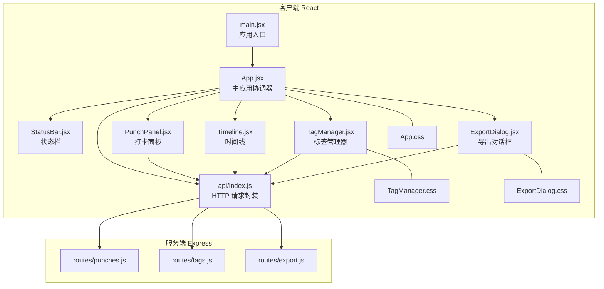
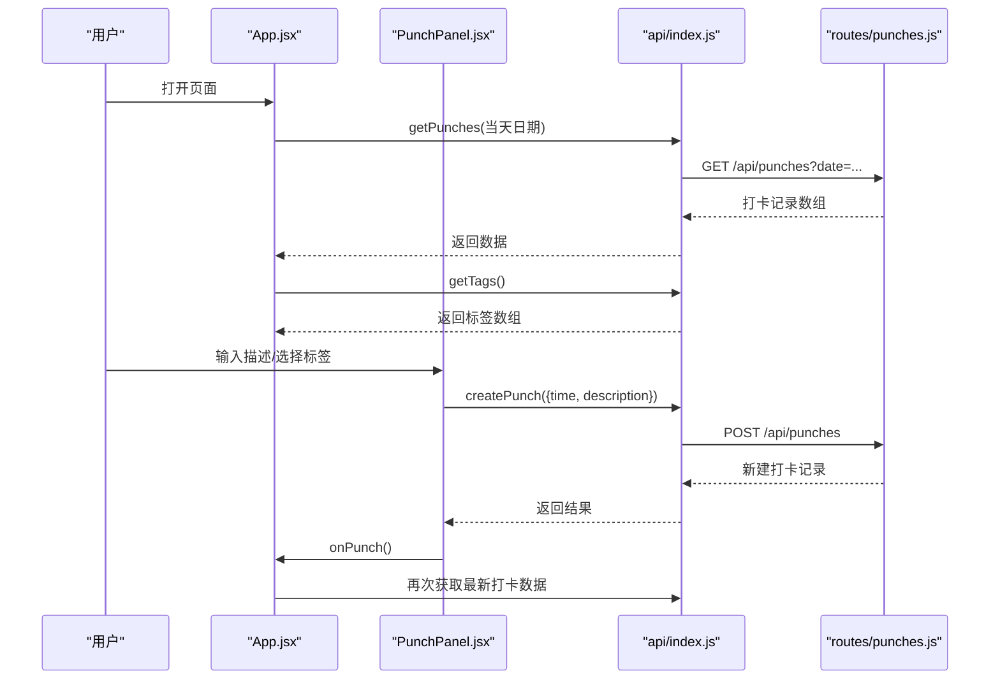
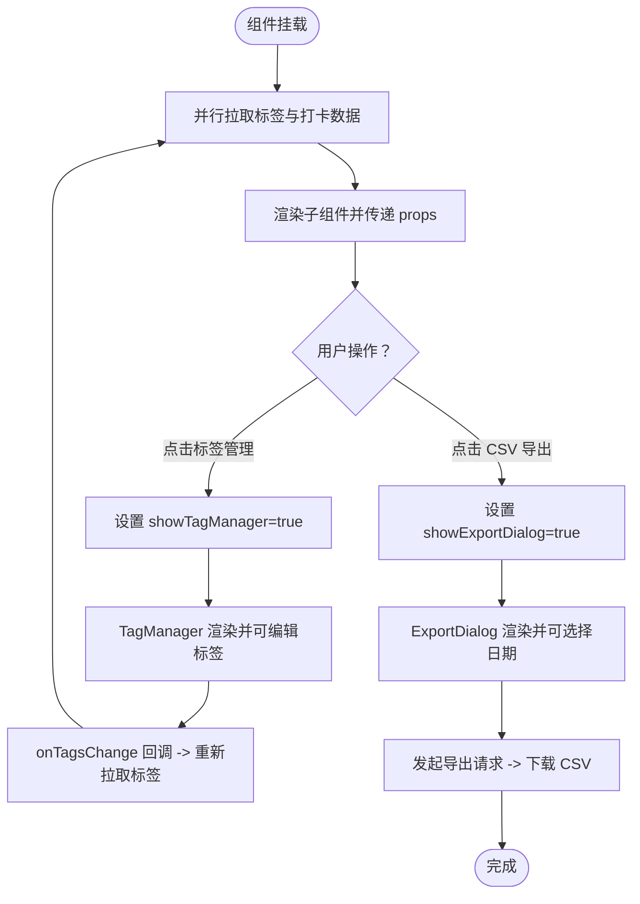
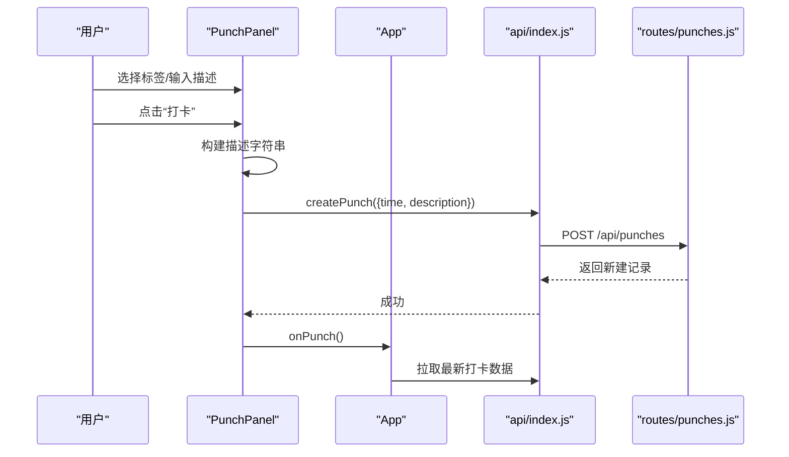
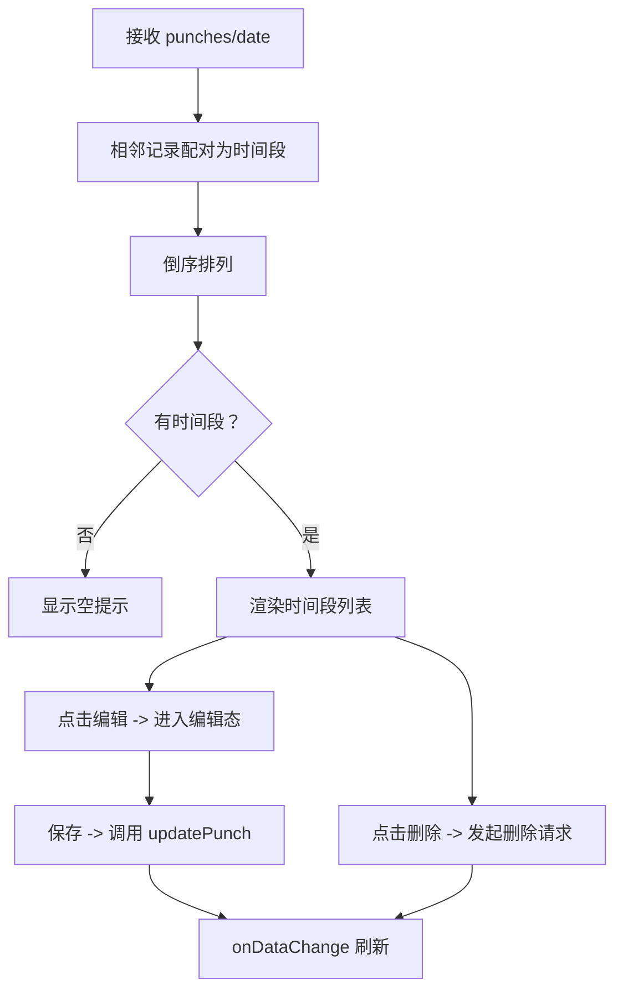
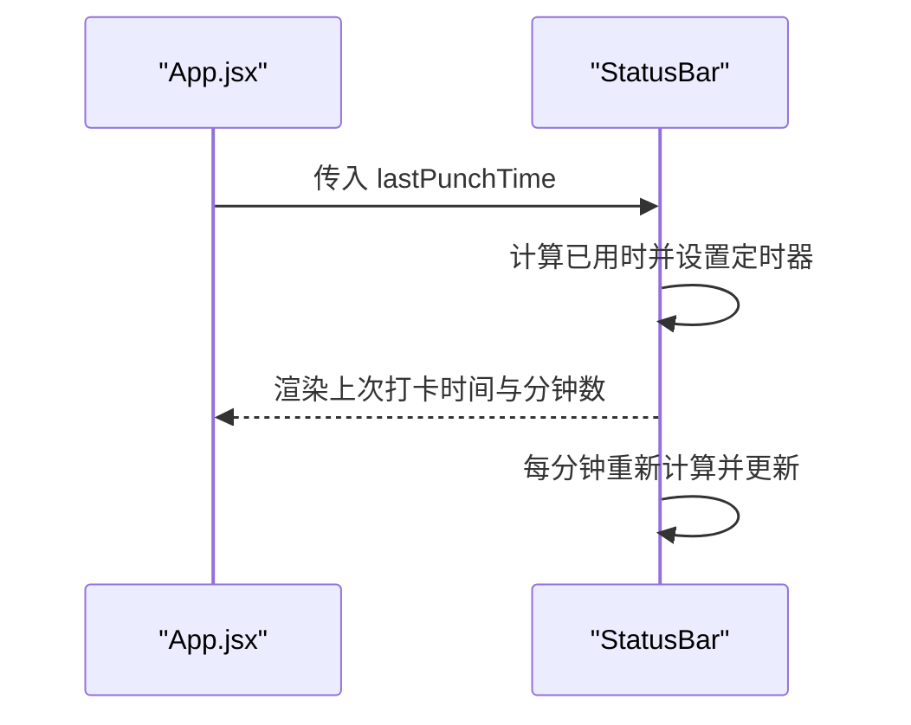
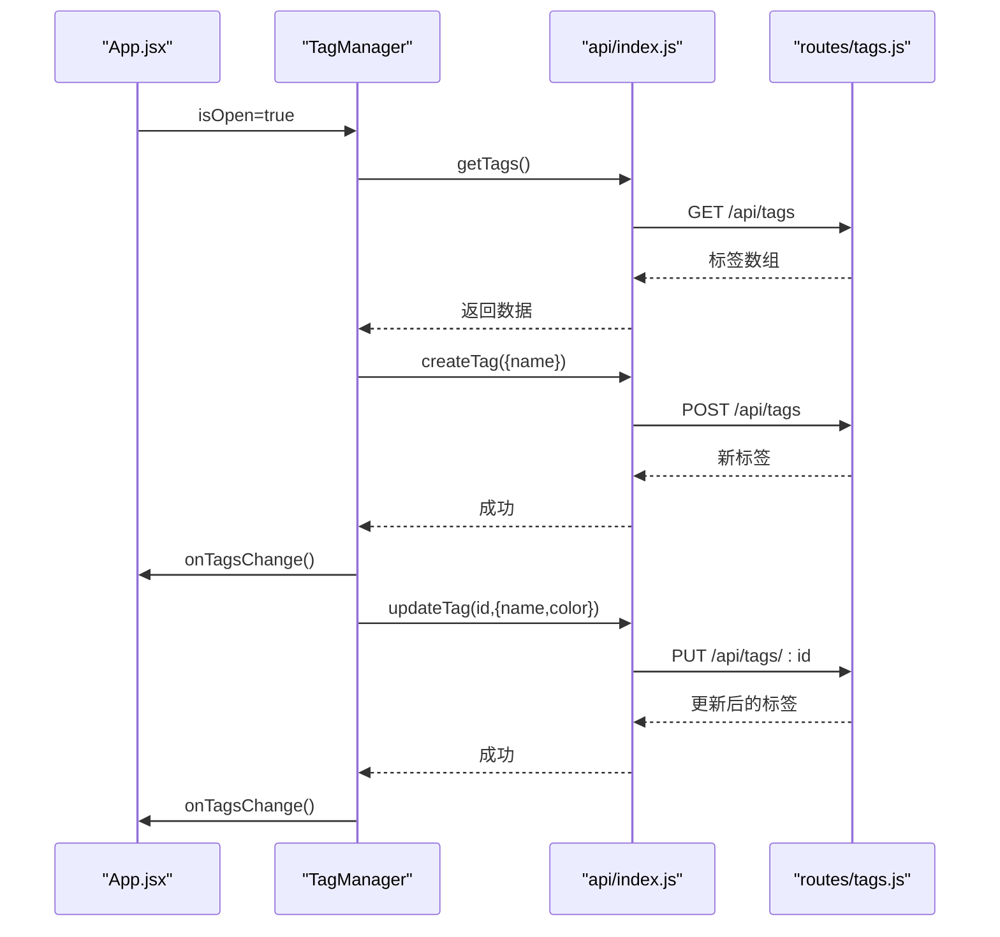
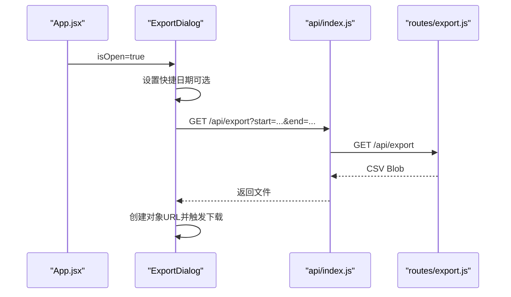
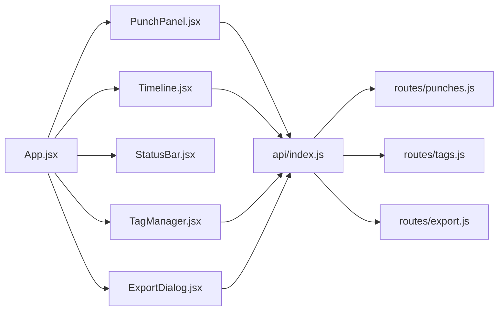

# React 组件体系

<cite>
**本文引用的文件**
- [App.jsx](file://client/src/App.jsx)
- [PunchPanel.jsx](file://client/src/components/PunchPanel.jsx)
- [Timeline.jsx](file://client/src/components/Timeline.jsx)
- [StatusBar.jsx](file://client/src/components/StatusBar.jsx)
- [TagManager.jsx](file://client/src/components/TagManager.jsx)
- [ExportDialog.jsx](file://client/src/components/ExportDialog.jsx)
- [api/index.js](file://client/src/api/index.js)
- [App.css](file://client/src/App.css)
- [TagManager.css](file://client/src/components/TagManager.css)
- [ExportDialog.css](file://client/src/components/ExportDialog.css)
- [main.jsx](file://client/src/main.jsx)
- [package.json](file://client/package.json)
- [routes/punches.js](file://server/routes/punches.js)
- [routes/tags.js](file://server/routes/tags.js)
- [routes/export.js](file://server/routes/export.js)
</cite>

## 目录
1. [简介](#简介)
2. [项目结构](#项目结构)
3. [核心组件](#核心组件)
4. [架构总览](#架构总览)
5. [组件详细分析](#组件详细分析)
6. [依赖关系分析](#依赖关系分析)
7. [性能考量](#性能考量)
8. [故障排查指南](#故障排查指南)
9. [结论](#结论)
10. [附录](#附录)

## 简介
本项目是一个基于 React 的轻量级“打卡与时间线”应用，前端通过自定义 API 模块与后端 Express 路由交互，实现“打卡记录、标签管理、时间段计算与 CSV 导出”的完整闭环。主应用组件 App.jsx 作为协调者，负责状态管理、数据拉取与子组件编排；各子组件职责清晰、边界明确，采用 props 下传与回调上行的单向数据流，配合本地状态实现高内聚、低耦合。

## 项目结构
- 客户端（React）位于 client/，包含入口 main.jsx、主应用 App.jsx 以及若干功能组件与样式文件。
- API 抽象位于 client/src/api/index.js，封装了对 /api/* 的请求方法。
- 样式文件分布在 App.css 与各组件的独立样式文件中。
- 服务端（Express）位于 server/，提供 /api/punches、/api/tags、/api/export 等路由，数据持久化于 server/utils/data.js（未在本文展开）。

图表来源
- [main.jsx:1-11](file://client/src/main.jsx#L1-L11)
- [App.jsx:1-86](file://client/src/App.jsx#L1-L86)
- [api/index.js:1-75](file://client/src/api/index.js#L1-L75)
- [routes/punches.js:1-117](file://server/routes/punches.js#L1-L117)
- [routes/tags.js:1-75](file://server/routes/tags.js#L1-L75)
- [routes/export.js:1-88](file://server/routes/export.js#L1-L88)

章节来源
- [main.jsx:1-11](file://client/src/main.jsx#L1-L11)
- [package.json:1-20](file://client/package.json#L1-L20)

## 核心组件
- 主应用 App.jsx
  - 负责全局状态：是否显示标签管理器、是否显示导出对话框、打卡记录、标签列表、当前日期。
  - 负责数据拉取：使用 useCallback 包装异步函数，避免重复渲染导致的重复请求；在 useEffect 中初始化拉取。
  - 协调子组件：向下传递 props，向上接收回调以刷新数据。
  - 条件渲染：根据是否有打卡记录决定是否显示“首次打卡提示”，根据是否有标签决定是否渲染标签按钮区。
  - 事件与交互：顶部动作栏触发弹窗开关；弹窗关闭后通过回调刷新标签或打卡数据。
- PunchPanel 打卡面板
  - 负责标签多选、描述输入、保存为标签、提交打卡。
  - 内部状态：选中的标签集合、描述文本、加载状态。
  - 交互逻辑：Enter 触发打卡；保存标签后刷新标签列表。
- Timeline 时间线
  - 将相邻打卡记录配对为时间段，倒序展示。
  - 支持编辑时间段描述与结束时间、删除时间段，并通过回调通知父组件刷新。
- StatusBar 状态栏
  - 显示上次打卡时间与距今已用时（分钟），每分钟自动刷新。
- TagManager 标签管理器
  - 弹窗形式管理标签：新增、编辑（名称与颜色）、删除。
  - 打开时加载标签；变更后通过回调通知 App 刷新。
- ExportDialog 导出对话框
  - 提供快捷日期（今天、本周）与手动日期选择，发起 CSV 导出下载。

章节来源
- [App.jsx:10-86](file://client/src/App.jsx#L10-L86)
- [PunchPanel.jsx:1-119](file://client/src/components/PunchPanel.jsx#L1-L119)
- [Timeline.jsx:1-138](file://client/src/components/Timeline.jsx#L1-L138)
- [StatusBar.jsx:1-46](file://client/src/components/StatusBar.jsx#L1-L46)
- [TagManager.jsx:1-135](file://client/src/components/TagManager.jsx#L1-L135)
- [ExportDialog.jsx:1-98](file://client/src/components/ExportDialog.jsx#L1-L98)

## 架构总览
整体采用“容器组件 + 展示组件”的分层思想：
- App.jsx 作为容器，集中管理状态与副作用，向下注入 props。
- 子组件专注于自身 UI 与交互，通过回调与父组件通信。
- API 层统一处理网络请求，隐藏具体路由细节。
- 服务端路由按资源划分（punches/tags/export），遵循 REST 风格。

图表来源
- [App.jsx:17-38](file://client/src/App.jsx#L17-L38)
- [PunchPanel.jsx:28-45](file://client/src/components/PunchPanel.jsx#L28-L45)
- [api/index.js:3-17](file://client/src/api/index.js#L3-L17)
- [routes/punches.js:32-60](file://server/routes/punches.js#L32-L60)

## 组件详细分析

### App.jsx：应用协调器
- 状态与派生值
  - showTagManager/showExportDialog 控制弹窗显示。
  - punches/tags 用于子组件渲染。
  - date 作为查询参数固定为“当日”。
  - isFirstPunch、lastPunchTime 用于 StatusBar 与 PunchPanel 的条件渲染。
- 数据拉取与副作用
  - fetchTags/fetchPunches 使用 useCallback 保证依赖稳定，避免重复请求。
  - useEffect 在挂载时并行拉取标签与打卡数据。
- 子组件编排
  - StatusBar 接收 lastPunchTime。
  - PunchPanel 接收 tags、isFirstPunch、onPunch、onTagsChange。
  - Timeline 接收 punches、date、onDataChange。
  - TagManager/ExportDialog 接收 isOpen/onClose/onTagsChange。
- 生命周期管理
  - 组件挂载时执行一次数据拉取。
  - 弹窗组件通过 isOpen 控制显隐，避免不必要的渲染。
- 用户交互
  - 动作栏按钮切换弹窗状态。
  - 弹窗内部操作完成后通过回调刷新数据。

图表来源
- [App.jsx:17-38](file://client/src/App.jsx#L17-L38)
- [App.jsx:67-80](file://client/src/App.jsx#L67-L80)
- [TagManager.jsx:32-36](file://client/src/components/TagManager.jsx#L32-L36)
- [ExportDialog.jsx:29-48](file://client/src/components/ExportDialog.jsx#L29-L48)

章节来源
- [App.jsx:10-86](file://client/src/App.jsx#L10-L86)

### PunchPanel.jsx：打卡面板
- 功能职责
  - 多标签选择：点击切换选中状态，动态样式体现选中态。
  - 描述输入：支持回车直接打卡。
  - 保存为标签：将输入的描述作为新标签创建。
  - 提交打卡：构建描述（标签名+自定义描述），调用 createPunch 并清空输入。
- 状态与交互
  - 内部状态：selectedTags/description/loading。
  - 条件渲染：首次打卡提示。
  - 错误处理：捕获异常并提示。
- 性能与可用性
  - 使用 useCallback 包装异步函数，减少重渲染。
  - 加载态禁用按钮，提升用户体验。

图表来源
- [PunchPanel.jsx:28-45](file://client/src/components/PunchPanel.jsx#L28-L45)
- [App.jsx:52-57](file://client/src/App.jsx#L52-L57)
- [api/index.js:9-17](file://client/src/api/index.js#L9-L17)
- [routes/punches.js:39-60](file://server/routes/punches.js#L39-L60)

章节来源
- [PunchPanel.jsx:1-119](file://client/src/components/PunchPanel.jsx#L1-L119)

### Timeline.jsx：时间线
- 功能职责
  - 将相邻两条打卡记录配对为时间段，计算时长（分钟）。
  - 支持编辑结束时间与描述、删除时间段。
  - 倒序展示，最新的在上方。
- 状态与交互
  - 内部状态：editingId/editDesc/editTime。
  - 条件渲染：空状态提示。
  - 错误处理：保存/删除失败时提示。
- 性能与可用性
  - 仅在需要时进入编辑态，避免全量重渲染。
  - 通过 onDataChange 回调统一刷新数据。

图表来源
- [Timeline.jsx:9-79](file://client/src/components/Timeline.jsx#L9-L79)
- [Timeline.jsx:46-70](file://client/src/components/Timeline.jsx#L46-L70)
- [api/index.js:19-34](file://client/src/api/index.js#L19-L34)

章节来源
- [Timeline.jsx:1-138](file://client/src/components/Timeline.jsx#L1-L138)

### StatusBar.jsx：状态栏
- 功能职责
  - 显示上次打卡时间与距今已用时（分钟）。
  - 首次打卡时显示提示文案。
- 生命周期与计时
  - 使用 useEffect 在 lastPunchTime 变化时启动定时器，每分钟更新一次。
  - 清理定时器防止内存泄漏。

图表来源
- [StatusBar.jsx:6-17](file://client/src/components/StatusBar.jsx#L6-L17)
- [App.jsx:40-41](file://client/src/App.jsx#L40-L41)

章节来源
- [StatusBar.jsx:1-46](file://client/src/components/StatusBar.jsx#L1-L46)

### TagManager.jsx：标签管理器
- 功能职责
  - 新增标签（自动生成颜色）、编辑标签（名称与颜色）、删除标签。
  - 打开时加载标签列表；变更后通过回调刷新 App。
- 状态与交互
  - 内部状态：tags/newName/editingId/editName/editColor。
  - 条件渲染：未打开时返回 null。
  - 错误处理：加载/保存/删除失败时打印日志。
- 可扩展性
  - 支持颜色选择器，便于视觉区分。
  - 回调机制解耦 UI 与数据刷新。

图表来源
- [TagManager.jsx:12-23](file://client/src/components/TagManager.jsx#L12-L23)
- [TagManager.jsx:25-36](file://client/src/components/TagManager.jsx#L25-L36)
- [TagManager.jsx:44-54](file://client/src/components/TagManager.jsx#L44-L54)
- [api/index.js:36-68](file://client/src/api/index.js#L36-L68)
- [routes/tags.js:16-39](file://server/routes/tags.js#L16-L39)

章节来源
- [TagManager.jsx:1-135](file://client/src/components/TagManager.jsx#L1-L135)

### ExportDialog.jsx：导出对话框
- 功能职责
  - 快捷设置“今天/本周”日期范围。
  - 自定义日期范围，发起 CSV 导出请求并触发浏览器下载。
- 状态与交互
  - 内部状态：startDate/endDate/exporting。
  - 条件渲染：未打开时返回 null。
  - 错误处理：导出失败时提示。

图表来源
- [ExportDialog.jsx:13-48](file://client/src/components/ExportDialog.jsx#L13-L48)
- [api/index.js:70-74](file://client/src/api/index.js#L70-L74)
- [routes/export.js:46-85](file://server/routes/export.js#L46-L85)

章节来源
- [ExportDialog.jsx:1-98](file://client/src/components/ExportDialog.jsx#L1-L98)

## 依赖关系分析
- 组件间依赖
  - App.jsx 依赖所有子组件，形成“单向数据流”。
  - PunchPanel/Timeline/TagManager/ExportDialog 依赖 api/index.js。
- 外部依赖
  - React 19 与 Vite 开发工具链。
- 后端集成
  - /api/punches：增删改查打卡记录。
  - /api/tags：增删改查标签。
  - /api/export：按日期范围导出 CSV。

图表来源
- [App.jsx:3-8](file://client/src/App.jsx#L3-L8)
- [api/index.js:1-75](file://client/src/api/index.js#L1-L75)
- [routes/punches.js:1-117](file://server/routes/punches.js#L1-L117)
- [routes/tags.js:1-75](file://server/routes/tags.js#L1-L75)
- [routes/export.js:1-88](file://server/routes/export.js#L1-L88)

章节来源
- [package.json:11-19](file://client/package.json#L11-L19)

## 性能考量
- 减少不必要渲染
  - 使用 useCallback 包装异步函数，避免因函数引用变化导致子组件重渲染。
  - 将弹窗组件通过 isOpen 控制显隐，减少 DOM 结构常驻。
- 优化数据获取
  - 在 App.jsx 中统一拉取标签与打卡数据，避免子组件各自请求造成重复。
- 交互反馈
  - 加载态禁用按钮，避免重复提交。
  - 导出过程禁用按钮，防止并发下载。
- 样式与布局
  - 使用 CSS 变量与响应式断点，适配移动端体验。

## 故障排查指南
- 打卡失败
  - 检查网络请求是否成功（createPunch）。
  - 确认服务端 /api/punches 路由返回状态码与数据格式。
- 标签管理异常
  - 新增/编辑/删除失败时查看控制台错误信息。
  - 确认 /api/tags 路由参数与返回值。
- 导出失败
  - 确认日期范围参数是否正确传递。
  - 检查 /api/export 是否返回 200 且 Content-Type 为 text/csv。
- 状态栏计时不更新
  - 确认 lastPunchTime 是否存在且被正确传入。
  - 检查定时器是否被清理或重复创建。

章节来源
- [PunchPanel.jsx:39-44](file://client/src/components/PunchPanel.jsx#L39-L44)
- [TagManager.jsx:20-23](file://client/src/components/TagManager.jsx#L20-L23)
- [ExportDialog.jsx:42-47](file://client/src/components/ExportDialog.jsx#L42-L47)
- [StatusBar.jsx:14-17](file://client/src/components/StatusBar.jsx#L14-L17)

## 结论
该 React 组件体系以 App.jsx 为核心协调器，围绕“打卡记录、标签、时间线、导出”四大功能模块构建，采用清晰的 props 传递与回调机制，结合本地状态与副作用管理，实现了良好的可维护性与可扩展性。通过统一的 API 层与服务端路由，前后端职责明确、边界清晰，适合进一步扩展更多标签类型、时间段规则与导出格式。

## 附录
- 组件复用策略
  - 将弹窗类组件（TagManager、ExportDialog）抽象为受控组件，通过 isOpen/onClose 控制显示，便于在不同场景复用。
  - 将 CRUD 操作抽象为 API 方法，便于在多个组件中复用。
- 可扩展性设计
  - 新增标签类型：在 TagManager 中扩展颜色与图标；在 PunchPanel 中增加对应渲染逻辑。
  - 新增导出格式：在 ExportDialog 中增加格式选项，服务端路由中扩展导出逻辑。
- 最佳实践
  - 使用 useCallback 与 useMemo 降低重渲染成本。
  - 对外部依赖（API）进行统一封装，便于测试与替换。
  - 对关键流程（导入/导出/编辑）提供明确的错误提示与回退路径。
- 开发指南与调试技巧
  - 使用 React DevTools 检查组件树与 props 变更。
  - 在 App.jsx 中集中打点日志，定位数据流转问题。
  - 使用浏览器网络面板检查 /api/* 请求的参数与响应。
  - 对高频交互（如时间线编辑）进行节流或防抖处理。