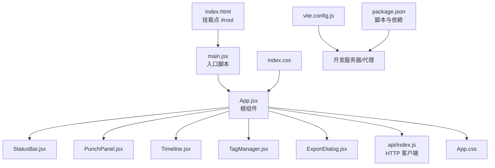
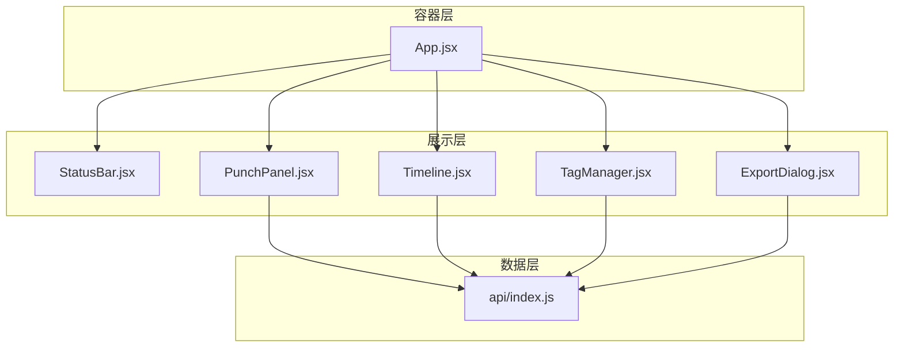
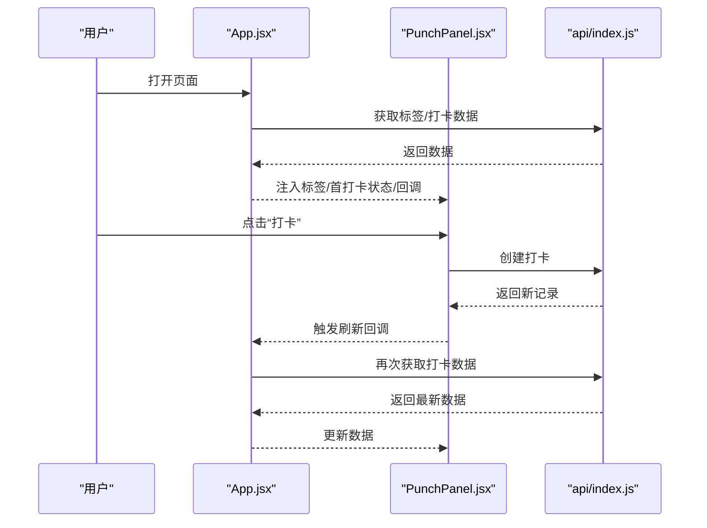
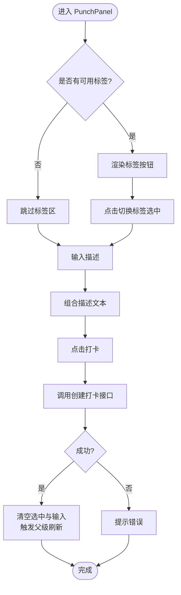
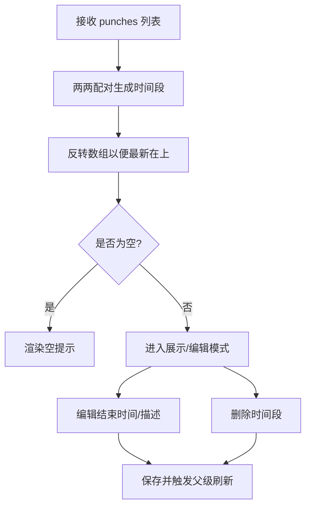
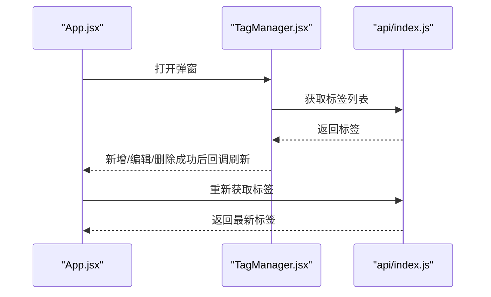
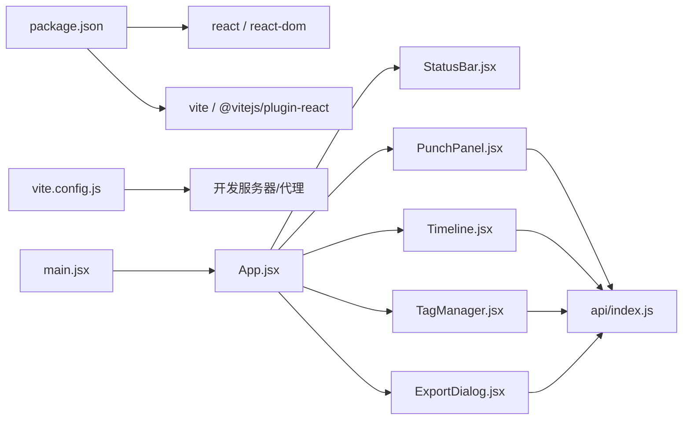

# 前端架构

<cite>
**本文引用的文件**
- [main.jsx](file://client/src/main.jsx)
- [App.jsx](file://client/src/App.jsx)
- [vite.config.js](file://client/vite.config.js)
- [package.json](file://client/package.json)
- [api/index.js](file://client/src/api/index.js)
- [PunchPanel.jsx](file://client/src/components/PunchPanel.jsx)
- [StatusBar.jsx](file://client/src/components/StatusBar.jsx)
- [TagManager.jsx](file://client/src/components/TagManager.jsx)
- [ExportDialog.jsx](file://client/src/components/ExportDialog.jsx)
- [Timeline.jsx](file://client/src/components/Timeline.jsx)
- [App.css](file://client/src/App.css)
- [index.css](file://client/src/index.css)
- [TagManager.css](file://client/src/components/TagManager.css)
- [ExportDialog.css](file://client/src/components/ExportDialog.css)
- [index.html](file://client/index.html)
</cite>

## 目录
1. [简介](#简介)
2. [项目结构](#项目结构)
3. [核心组件](#核心组件)
4. [架构总览](#架构总览)
5. [组件详解](#组件详解)
6. [依赖关系分析](#依赖关系分析)
7. [性能与构建优化](#性能与构建优化)
8. [故障排查指南](#故障排查指南)
9. [结论](#结论)
10. [附录：开发规范与最佳实践](#附录开发规范与最佳实践)

## 简介
本项目采用 React 19.1.0 + Vite 6.3.5 的现代前端技术栈，围绕“时间打卡记录”场景构建了以组件化为核心的用户界面。应用通过统一的 API 层与后端交互，使用 React Hooks 管理本地状态与副作用，配合 Vite 提供快速开发与高效生产构建。本文档系统梳理架构设计、组件协作、状态管理、API 通信与构建优化，并给出可扩展的开发指南。

## 项目结构
客户端目录 client 下采用按功能分层的组织方式：
- 入口与根组件：main.jsx、App.jsx
- API 层：src/api/index.js
- 组件层：src/components 下各功能组件
- 样式层：App.css、index.css、各组件样式文件
- 构建与运行：vite.config.js、package.json、index.html

图示来源
- [index.html:1-14](file://client/index.html#L1-L14)
- [main.jsx:1-11](file://client/src/main.jsx#L1-L11)
- [App.jsx:1-86](file://client/src/App.jsx#L1-L86)
- [api/index.js:1-75](file://client/src/api/index.js#L1-L75)
- [vite.config.js:1-15](file://client/vite.config.js#L1-L15)
- [package.json:1-20](file://client/package.json#L1-L20)

章节来源
- [index.html:1-14](file://client/index.html#L1-L14)
- [main.jsx:1-11](file://client/src/main.jsx#L1-L11)
- [package.json:1-20](file://client/package.json#L1-L20)

## 核心组件
- 根组件 App.jsx：负责全局状态（打卡记录、标签、当前日期）、初始化加载与子组件编排；通过回调函数向下传递事件处理逻辑，维持自上而下的数据流。
- 子组件：
  - PunchPanel.jsx：负责标签选择、描述输入与打卡提交，支持“保存为标签”的快捷能力。
  - StatusBar.jsx：显示最近一次打卡时间与距今已过分钟数，定时刷新。
  - Timeline.jsx：将连续打卡对映射为时间段，支持编辑结束时间与描述、删除时间段。
  - TagManager.jsx：弹窗式标签管理，支持增删改查与颜色设置。
  - ExportDialog.jsx：弹窗式 CSV 导出，支持快捷日期与手动日期范围选择。

章节来源
- [App.jsx:1-86](file://client/src/App.jsx#L1-L86)
- [PunchPanel.jsx:1-119](file://client/src/components/PunchPanel.jsx#L1-L119)
- [StatusBar.jsx:1-46](file://client/src/components/StatusBar.jsx#L1-L46)
- [Timeline.jsx:1-138](file://client/src/components/Timeline.jsx#L1-L138)
- [TagManager.jsx:1-135](file://client/src/components/TagManager.jsx#L1-L135)
- [ExportDialog.jsx:1-98](file://client/src/components/ExportDialog.jsx#L1-L98)

## 架构总览
应用采用“容器组件 + 展示组件”的分层模式：
- 容器层：App.jsx 聚合状态与副作用，向子组件注入 props 与回调。
- 展示层：各功能组件专注于 UI 表现与用户交互，尽量保持纯函数特性。
- 数据流：自上而下传递状态与回调，子组件通过回调触发顶层刷新或弹窗控制。
- API 层：集中封装 HTTP 请求，统一错误处理与响应解析。

图示来源
- [App.jsx:1-86](file://client/src/App.jsx#L1-L86)
- [api/index.js:1-75](file://client/src/api/index.js#L1-L75)

## 组件详解

### App.jsx：根组件与状态编排
- 状态管理
  - showTagManager/showExportDialog：控制弹窗开关
  - punches/tags/date：应用级数据与当前日期
- 副作用与回调
  - fetchTags/fetchPunches：通过 useCallback 包装，避免子组件重复渲染
  - useEffect 在首次渲染时拉取初始数据
- 组件协调
  - 向 PunchPanel 注入标签、是否首打卡、回调
  - 向 Timeline 注入数据与刷新回调
  - 向 StatusBar 注入最近一次打卡时间
  - 通过按钮打开 TagManager/ExportDialog 并传入回调

图示来源
- [App.jsx:17-38](file://client/src/App.jsx#L17-L38)
- [PunchPanel.jsx:28-45](file://client/src/components/PunchPanel.jsx#L28-L45)
- [api/index.js:3-17](file://client/src/api/index.js#L3-L17)

章节来源
- [App.jsx:1-86](file://client/src/App.jsx#L1-L86)

### PunchPanel.jsx：打卡与标签选择
- 功能要点
  - 多选标签与输入描述，组合为最终描述
  - 支持将描述保存为新标签
  - 防抖式加载态，异常提示
- 交互流程

图示来源
- [PunchPanel.jsx:1-119](file://client/src/components/PunchPanel.jsx#L1-L119)
- [api/index.js:9-17](file://client/src/api/index.js#L9-L17)

章节来源
- [PunchPanel.jsx:1-119](file://client/src/components/PunchPanel.jsx#L1-L119)

### StatusBar.jsx：状态栏与计时
- 功能要点
  - 若无打卡记录，显示提示文案
  - 有打卡记录时，计算距今分钟数并每分钟刷新一次
- 生命周期
  - 初始化时根据 lastPunchTime 设置计时器
  - 卸载时清理定时器，避免内存泄漏

章节来源
- [StatusBar.jsx:1-46](file://client/src/components/StatusBar.jsx#L1-L46)

### Timeline.jsx：时间段列表与编辑
- 功能要点
  - 将相邻打卡对映射为时间段条目，倒序展示
  - 支持编辑结束时间与描述、删除时间段
  - 删除后触发父级刷新，保证视图一致性
- 算法流程

图示来源
- [Timeline.jsx:9-70](file://client/src/components/Timeline.jsx#L9-L70)

章节来源
- [Timeline.jsx:1-138](file://client/src/components/Timeline.jsx#L1-L138)

### TagManager.jsx：标签管理弹窗
- 功能要点
  - 打开时加载标签列表
  - 支持新增、编辑（含颜色）、删除
  - 修改后触发父级标签刷新
- 交互流程

图示来源
- [TagManager.jsx:12-23](file://client/src/components/TagManager.jsx#L12-L23)
- [api/index.js:36-40](file://client/src/api/index.js#L36-L40)

章节来源
- [TagManager.jsx:1-135](file://client/src/components/TagManager.jsx#L1-L135)

### ExportDialog.jsx：CSV 导出弹窗
- 功能要点
  - 快捷设置“今天/本周”
  - 选择起止日期后发起导出请求，下载 CSV 文件
- 错误处理
  - 导出失败时提示并保持弹窗

章节来源
- [ExportDialog.jsx:1-98](file://client/src/components/ExportDialog.jsx#L1-L98)

### API 通信层：统一请求封装
- 设计思路
  - 使用 fetch 发起请求，统一前缀 /api
  - 对每个 CRUD 场景提供独立函数，参数明确
  - 对非 OK 响应抛出错误，便于上层捕获
- 关键接口
  - 打卡：查询、创建、更新、删除
  - 标签：查询、创建、更新、删除
  - 导出：返回二进制 Blob

章节来源
- [api/index.js:1-75](file://client/src/api/index.js#L1-L75)

## 依赖关系分析
- 组件依赖
  - App.jsx 依赖所有子组件与其样式
  - 子组件依赖 api/index.js 进行网络请求
  - 弹窗组件依赖各自样式文件
- 外部依赖
  - React 19.1.0、React DOM 19.1.0
  - Vite 6.3.5 与 @vitejs/plugin-react
- 开发服务器与代理
  - 本地开发时将 /api 代理到后端服务地址

图示来源
- [package.json:11-18](file://client/package.json#L11-L18)
- [vite.config.js:4-14](file://client/vite.config.js#L4-L14)
- [main.jsx:1-11](file://client/src/main.jsx#L1-L11)
- [App.jsx:1-86](file://client/src/App.jsx#L1-L86)
- [api/index.js:1-75](file://client/src/api/index.js#L1-L75)

章节来源
- [package.json:1-20](file://client/package.json#L1-L20)
- [vite.config.js:1-15](file://client/vite.config.js#L1-L15)

## 性能与构建优化
- Vite 配置要点
  - 使用 @vitejs/plugin-react，启用快速热更新与 JSX 语法支持
  - 开发服务器配置 /api 代理至后端，避免跨域问题
- React 19 与 Hooks 优化
  - useCallback 包裹异步函数，减少子组件重渲染
  - useEffect 清理定时器，避免内存泄漏
  - useState 合理拆分细粒度状态，降低无关更新
- 样式与体积
  - 组件内联少量必要样式，减少外部依赖
  - 使用 CSS 变量统一主题，便于维护
- 构建产物
  - 生产构建由 Vite 生成静态资源，按需加载

章节来源
- [vite.config.js:1-15](file://client/vite.config.js#L1-L15)
- [App.jsx:17-38](file://client/src/App.jsx#L17-L38)
- [StatusBar.jsx:6-17](file://client/src/components/StatusBar.jsx#L6-L17)
- [PunchPanel.jsx:28-45](file://client/src/components/PunchPanel.jsx#L28-L45)

## 故障排查指南
- 打卡失败
  - 现象：点击“打卡”后弹出提示
  - 排查：检查网络面板 /api/punches 是否返回 2xx；确认后端服务可达
- 标签管理异常
  - 现象：新增/编辑/删除失败
  - 排查：确认 /api/tags 接口状态；查看控制台错误日志
- 导出失败
  - 现象：点击“导出 CSV”无响应或提示失败
  - 排查：确认 /api/export 接口可用；检查日期范围是否合法
- 弹窗无法关闭
  - 现象：点击遮罩未关闭
  - 排查：确认弹窗组件的点击事件冒泡被阻止；检查回调是否正确传递
- 首次渲染空白
  - 现象：页面加载后一段时间才显示数据
  - 排查：确认 useEffect 中的异步请求已执行；检查代理配置

章节来源
- [PunchPanel.jsx:39-41](file://client/src/components/PunchPanel.jsx#L39-L41)
- [TagManager.jsx:33-35](file://client/src/components/TagManager.jsx#L33-L35)
- [ExportDialog.jsx:42-44](file://client/src/components/ExportDialog.jsx#L42-L44)
- [vite.config.js:7-12](file://client/vite.config.js#L7-L12)

## 结论
本项目以 React 19 + Vite 为基础，采用清晰的组件分层与自上而下的数据流，结合统一的 API 层实现前后端解耦。通过合理使用 Hooks 与样式模块化，既保证了开发效率也兼顾了可维护性。建议后续可在以下方面持续演进：引入轻量状态库（如 Zustand）以进一步简化全局状态、增加类型定义（TS）提升健壮性、完善测试覆盖与自动化流程。

## 附录：开发规范与最佳实践
- 命名约定
  - 组件文件：帕斯卡命名（如 PunchPanel.jsx）
  - 样式文件：与组件同名（如 PunchPanel.css）
  - 函数与变量：驼峰命名（如 fetchPunches）
- 代码组织
  - 按功能划分目录，组件与样式就近存放
  - API 方法与路由一一对应，便于维护
- Hooks 使用
  - useCallback 包裹异步回调，避免子组件重渲染
  - useEffect 中务必清理定时器与订阅
  - 将副作用集中在容器组件，展示组件保持纯函数
- 样式规范
  - 使用 CSS 变量统一主题色与圆角、阴影等基础样式
  - 弹窗类组件独立样式文件，避免样式污染
- 构建与部署
  - 使用 Vite 的预设插件，确保开发体验与构建性能
  - 通过代理解决开发期跨域问题，生产环境由反向代理统一转发 /api