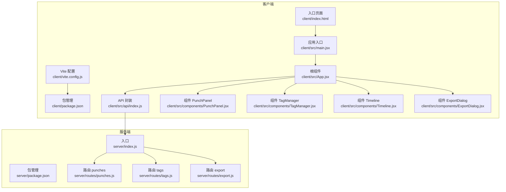
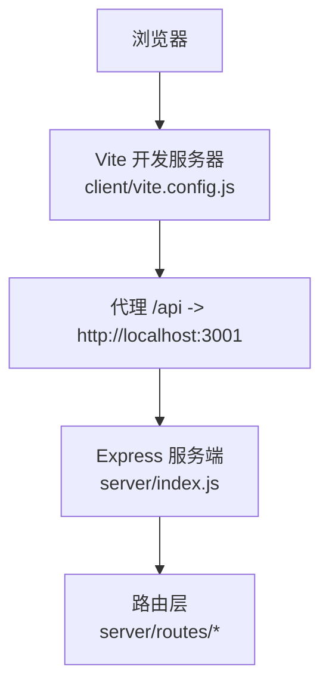
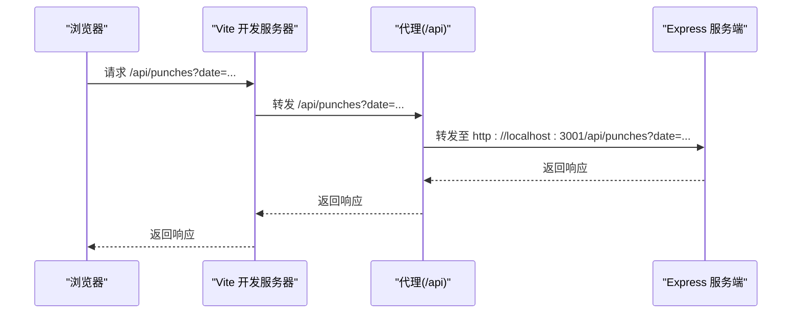
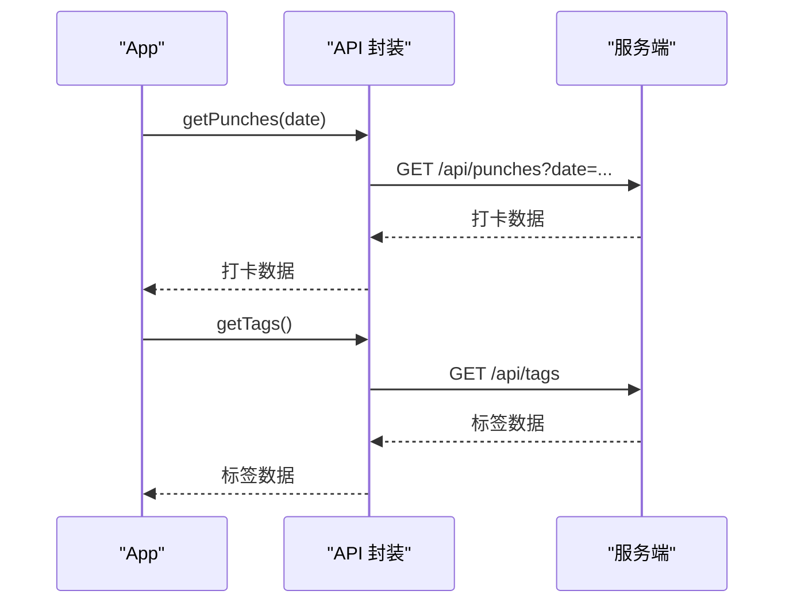
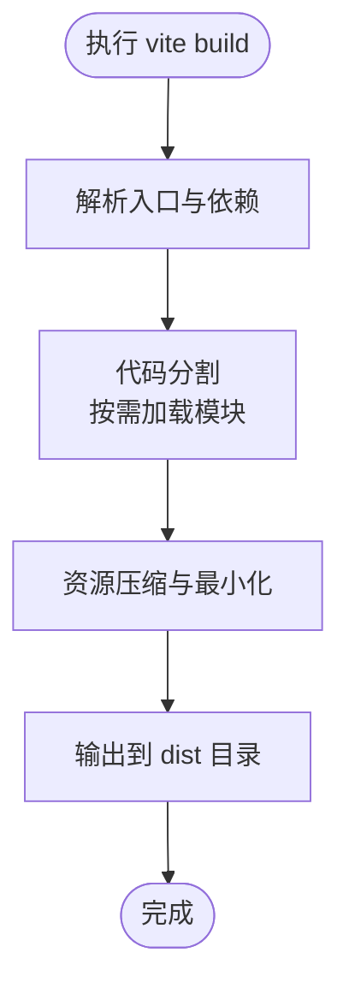
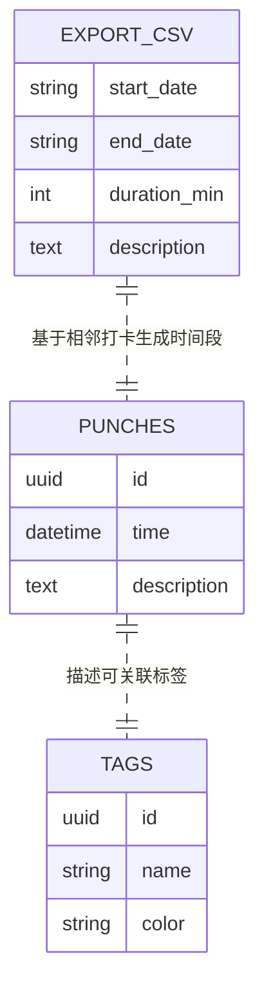
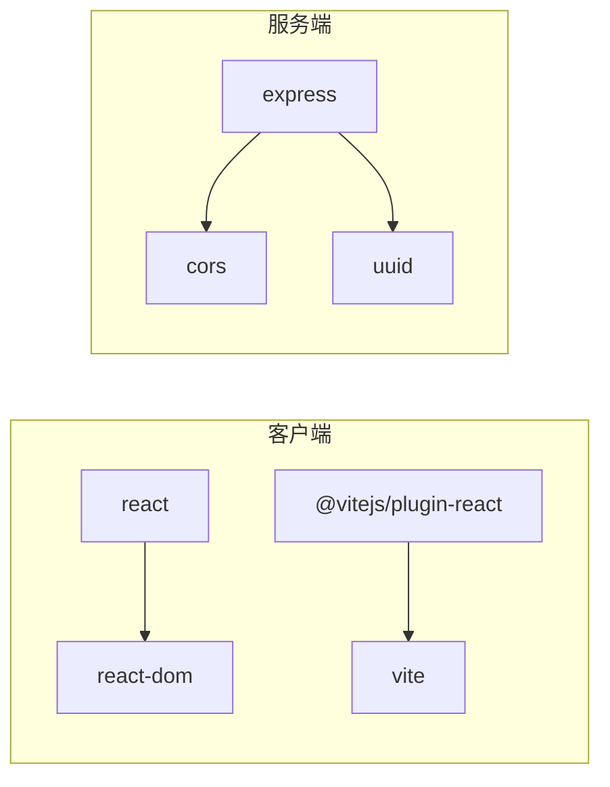

# 构建配置

<cite>
**本文引用的文件**
- [vite.config.js](file://client/vite.config.js)
- [package.json](file://client/package.json)
- [index.html](file://client/index.html)
- [main.jsx](file://client/src/main.jsx)
- [App.jsx](file://client/src/App.jsx)
- [api/index.js](file://client/src/api/index.js)
- [PunchPanel.jsx](file://client/src/components/PunchPanel.jsx)
- [TagManager.jsx](file://client/src/components/TagManager.jsx)
- [Timeline.jsx](file://client/src/components/Timeline.jsx)
- [ExportDialog.jsx](file://client/src/components/ExportDialog.jsx)
- [package.json](file://server/package.json)
- [index.js](file://server/index.js)
- [punches.js](file://server/routes/punches.js)
- [tags.js](file://server/routes/tags.js)
- [export.js](file://server/routes/export.js)
</cite>

## 目录
1. [简介](#简介)
2. [项目结构](#项目结构)
3. [核心组件](#核心组件)
4. [架构总览](#架构总览)
5. [详细组件分析](#详细组件分析)
6. [依赖关系分析](#依赖关系分析)
7. [性能考量](#性能考量)
8. [故障排除指南](#故障排除指南)
9. [结论](#结论)
10. [附录](#附录)

## 简介
本文件面向 taskRecordre 项目的前端构建配置，围绕 Vite 6.3.5 的配置与优化策略展开，重点覆盖以下方面：
- 开发服务器配置、热重载机制与代理设置
- 生产环境构建优化、代码分割与资源压缩策略
- 依赖管理与打包配置
- 开发与生产环境差异配置
- 性能监控与调试技巧
- 构建优化建议与故障排除指南

本项目采用客户端 Vite + React 技术栈，服务端使用 Express 提供 REST API，前后端通过代理实现联调。

## 项目结构
客户端与服务端分离，客户端通过 Vite 提供开发服务器与构建产物，服务端提供 /api 路由接口。关键文件如下：
- 客户端
  - 构建配置：client/vite.config.js
  - 包管理：client/package.json
  - 入口页面：client/index.html
  - 应用入口：client/src/main.jsx
  - 根组件：client/src/App.jsx
  - API 封装：client/src/api/index.js
  - 组件：client/src/components/*.jsx
- 服务端
  - 包管理：server/package.json
  - 入口：server/index.js
  - 路由：server/routes/*.js

图表来源
- [vite.config.js:1-15](file://client/vite.config.js#L1-L15)
- [package.json:1-20](file://client/package.json#L1-L20)
- [index.html:1-14](file://client/index.html#L1-L14)
- [main.jsx:1-11](file://client/src/main.jsx#L1-L11)
- [App.jsx:1-86](file://client/src/App.jsx#L1-L86)
- [api/index.js:1-75](file://client/src/api/index.js#L1-L75)
- [PunchPanel.jsx:1-119](file://client/src/components/PunchPanel.jsx#L1-L119)
- [TagManager.jsx:1-135](file://client/src/components/TagManager.jsx#L1-L135)
- [Timeline.jsx:1-138](file://client/src/components/Timeline.jsx#L1-L138)
- [ExportDialog.jsx:1-98](file://client/src/components/ExportDialog.jsx#L1-L98)
- [package.json:1-15](file://server/package.json#L1-L15)
- [index.js:1-35](file://server/index.js#L1-L35)
- [punches.js:1-117](file://server/routes/punches.js#L1-L117)
- [tags.js:1-75](file://server/routes/tags.js#L1-L75)
- [export.js:1-88](file://server/routes/export.js#L1-L88)

章节来源
- [vite.config.js:1-15](file://client/vite.config.js#L1-L15)
- [package.json:1-20](file://client/package.json#L1-L20)
- [index.html:1-14](file://client/index.html#L1-L14)
- [main.jsx:1-11](file://client/src/main.jsx#L1-L11)
- [App.jsx:1-86](file://client/src/App.jsx#L1-L86)
- [api/index.js:1-75](file://client/src/api/index.js#L1-L75)
- [PunchPanel.jsx:1-119](file://client/src/components/PunchPanel.jsx#L1-L119)
- [TagManager.jsx:1-135](file://client/src/components/TagManager.jsx#L1-L135)
- [Timeline.jsx:1-138](file://client/src/components/Timeline.jsx#L1-L138)
- [ExportDialog.jsx:1-98](file://client/src/components/ExportDialog.jsx#L1-L98)
- [package.json:1-15](file://server/package.json#L1-L15)
- [index.js:1-35](file://server/index.js#L1-L35)
- [punches.js:1-117](file://server/routes/punches.js#L1-L117)
- [tags.js:1-75](file://server/routes/tags.js#L1-L75)
- [export.js:1-88](file://server/routes/export.js#L1-L88)

## 核心组件
- Vite 配置与插件
  - 使用 @vitejs/plugin-react 启用 React 快速刷新与 JSX 支持
  - 开发服务器启用代理，将 /api 前缀转发到本地服务端地址
- 客户端脚本与依赖
  - scripts.dev/build/preview 对应 dev、build、preview 命令
  - 依赖 React 与 React-DOM，开发依赖 Vite 与 @vitejs/plugin-react
- 服务端脚本与依赖
  - scripts.start/dev 对应启动与监听开发模式
  - 依赖 Express、CORS、UUID

章节来源
- [vite.config.js:1-15](file://client/vite.config.js#L1-L15)
- [package.json:1-20](file://client/package.json#L1-L20)
- [package.json:1-15](file://server/package.json#L1-L15)

## 架构总览
客户端通过 Vite 开发服务器提供静态资源与热重载；服务端以 Express 提供 REST 接口。客户端通过 /api 前缀访问服务端路由，开发阶段由 Vite 代理转发请求，避免跨域问题。

图表来源
- [vite.config.js:6-13](file://client/vite.config.js#L6-L13)
- [index.js:16-35](file://server/index.js#L16-L35)

章节来源
- [vite.config.js:6-13](file://client/vite.config.js#L6-L13)
- [index.js:16-35](file://server/index.js#L16-L35)

## 详细组件分析

### 开发服务器与代理配置
- 开发服务器
  - 通过 Vite 提供本地开发服务器，默认监听端口（由 Vite 决定）
  - 自动注入模块热替换（HMR）支持，提升开发体验
- 代理设置
  - 将 /api 前缀的请求转发至 http://localhost:3001
  - changeOrigin: true 用于处理跨域头与 Host 头
- 页面入口
  - index.html 中通过 script type="module" 加载 /src/main.jsx
  - main.jsx 渲染根组件 App，StrictMode 包裹保证严格模式

图表来源
- [vite.config.js:6-13](file://client/vite.config.js#L6-L13)
- [index.js:23-30](file://server/index.js#L23-L30)
- [api/index.js:1-75](file://client/src/api/index.js#L1-L75)

章节来源
- [vite.config.js:6-13](file://client/vite.config.js#L6-L13)
- [index.html:10-11](file://client/index.html#L10-L11)
- [main.jsx:6-10](file://client/src/main.jsx#L6-L10)
- [api/index.js:1-75](file://client/src/api/index.js#L1-L75)
- [index.js:23-30](file://server/index.js#L23-L30)

### API 封装与组件交互
- API 封装
  - 统一前缀 BASE = '/api'
  - 提供获取/创建/更新/删除 打卡与标签，以及导出 CSV 的方法
- 组件交互
  - App 在挂载后拉取标签与打卡数据
  - PunchPanel 触发创建打卡与保存为标签
  - TagManager 管理标签增删改
  - Timeline 展示时间段并支持编辑/删除
  - ExportDialog 发起 CSV 导出请求

图表来源
- [App.jsx:17-38](file://client/src/App.jsx#L17-L38)
- [api/index.js:1-75](file://client/src/api/index.js#L1-L75)
- [punches.js:32-37](file://server/routes/punches.js#L32-L37)
- [tags.js:16-20](file://server/routes/tags.js#L16-L20)

章节来源
- [App.jsx:17-38](file://client/src/App.jsx#L17-L38)
- [api/index.js:1-75](file://client/src/api/index.js#L1-L75)
- [PunchPanel.jsx:28-45](file://client/src/components/PunchPanel.jsx#L28-L45)
- [TagManager.jsx:25-36](file://client/src/components/TagManager.jsx#L25-L36)
- [Timeline.jsx:46-70](file://client/src/components/Timeline.jsx#L46-L70)
- [ExportDialog.jsx:29-48](file://client/src/components/ExportDialog.jsx#L29-L48)

### 生产环境构建与优化
- 构建命令
  - 使用 vite build 生成生产构建产物，输出至 client/dist
- 代码分割与资源压缩
  - Vite 默认启用基于动态导入的代码分割
  - 生产构建自动进行资源压缩与最小化
- 资源路径与入口
  - index.html 作为入口模板，构建后由 Vite 注入带哈希的资源链接
  - main.jsx 作为运行时入口，渲染 React 应用

图表来源
- [package.json:8](file://client/package.json#L8)
- [index.html:10-11](file://client/index.html#L10-L11)
- [main.jsx:6-10](file://client/src/main.jsx#L6-L10)

章节来源
- [package.json:8](file://client/package.json#L8)
- [index.html:10-11](file://client/index.html#L10-L11)
- [main.jsx:6-10](file://client/src/main.jsx#L6-L10)

### 服务端路由与数据持久化
- 路由组织
  - /api/punches：打卡 CRUD
  - /api/tags：标签 CRUD
  - /api/export：CSV 导出
- 数据读写
  - 通过工具函数读取/写入每日数据与标签数据
  - 导出时按日期范围聚合并生成 CSV

图表来源
- [punches.js:40-60](file://server/routes/punches.js#L40-L60)
- [tags.js:22-39](file://server/routes/tags.js#L22-L39)
- [export.js:46-85](file://server/routes/export.js#L46-L85)

章节来源
- [punches.js:32-114](file://server/routes/punches.js#L32-L114)
- [tags.js:16-72](file://server/routes/tags.js#L16-L72)
- [export.js:46-85](file://server/routes/export.js#L46-L85)

## 依赖关系分析
- 客户端依赖
  - 运行时：react、react-dom
  - 开发时：@vitejs/plugin-react、vite
- 服务端依赖
  - express、cors、uuid

图表来源
- [package.json:11-17](file://client/package.json#L11-L17)
- [package.json:9-13](file://server/package.json#L9-L13)

章节来源
- [package.json:11-17](file://client/package.json#L11-L17)
- [package.json:9-13](file://server/package.json#L9-L13)

## 性能考量
- 开发阶段
  - 启用 React 快速刷新（基于 @vitejs/plugin-react），减少全量重载
  - 代理仅转发 /api 前缀，避免无关请求影响
- 生产阶段
  - 利用 Vite 默认的代码分割与资源压缩，减小首屏体积
  - 建议开启产物缓存与 CDN 部署，结合 HTTP/2 多路复用
- 调试与监控
  - 使用浏览器开发者工具观察网络请求与资源加载
  - 关注 /api 路由的响应时间与错误码，定位服务端瓶颈

## 故障排除指南
- 无法访问 /api 接口
  - 确认服务端已启动且监听端口为 3001
  - 检查代理配置是否正确转发 /api 前缀
- CORS 错误
  - 确认服务端已启用 CORS 中间件
- 构建失败或资源缺失
  - 确认依赖安装完整
  - 检查 index.html 中入口脚本路径与构建输出目录一致
- 导出 CSV 失败
  - 确认查询参数 start 与 end 正确传递
  - 检查日期范围内的数据是否存在

章节来源
- [vite.config.js:6-13](file://client/vite.config.js#L6-L13)
- [index.js:20](file://server/index.js#L20)
- [export.js:46-52](file://server/routes/export.js#L46-L52)

## 结论
本项目基于 Vite 6.3.5 与 React 实现了简洁高效的前端开发与构建流程，配合 Express 服务端提供稳定的数据接口。通过代理统一处理 /api 前缀，有效规避跨域问题；默认的代码分割与压缩策略满足生产环境性能要求。建议在生产部署中进一步结合缓存与 CDN，并持续关注网络与数据层的性能指标。

## 附录
- 开发与生产差异
  - 开发：使用 Vite 本地服务器与代理，启用 HMR
  - 生产：使用 vite build 输出静态资源，结合服务端或静态托管
- 常用命令
  - 客户端：dev/build/preview
  - 服务端：start/dev

章节来源
- [package.json:6-9](file://client/package.json#L6-L9)
- [package.json:5-8](file://server/package.json#L5-L8)