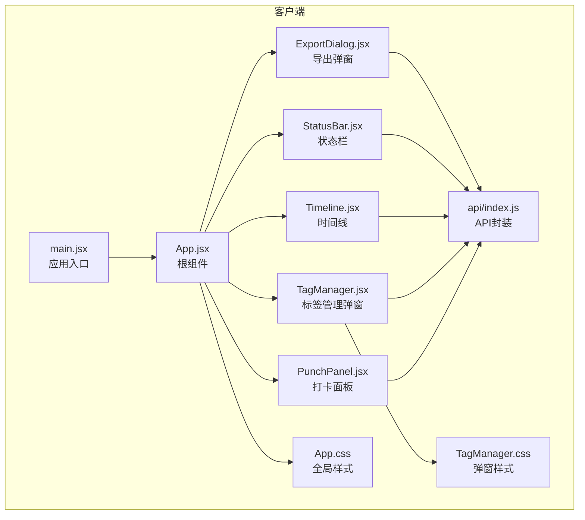
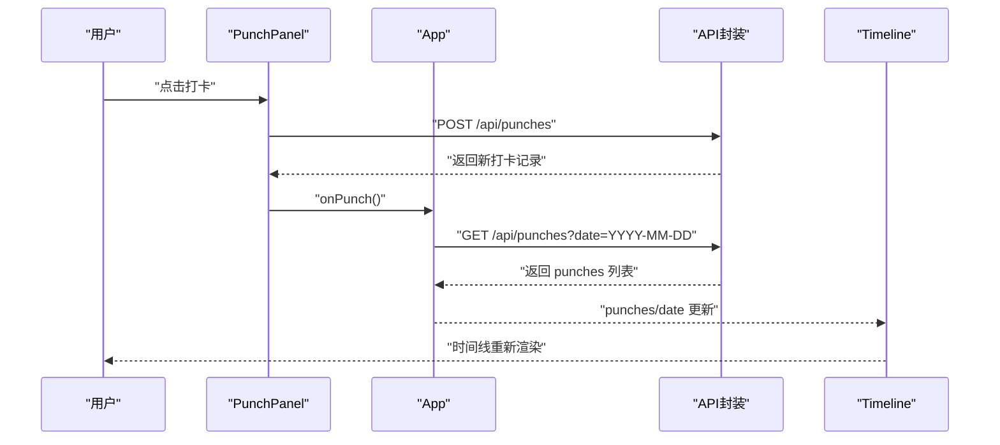
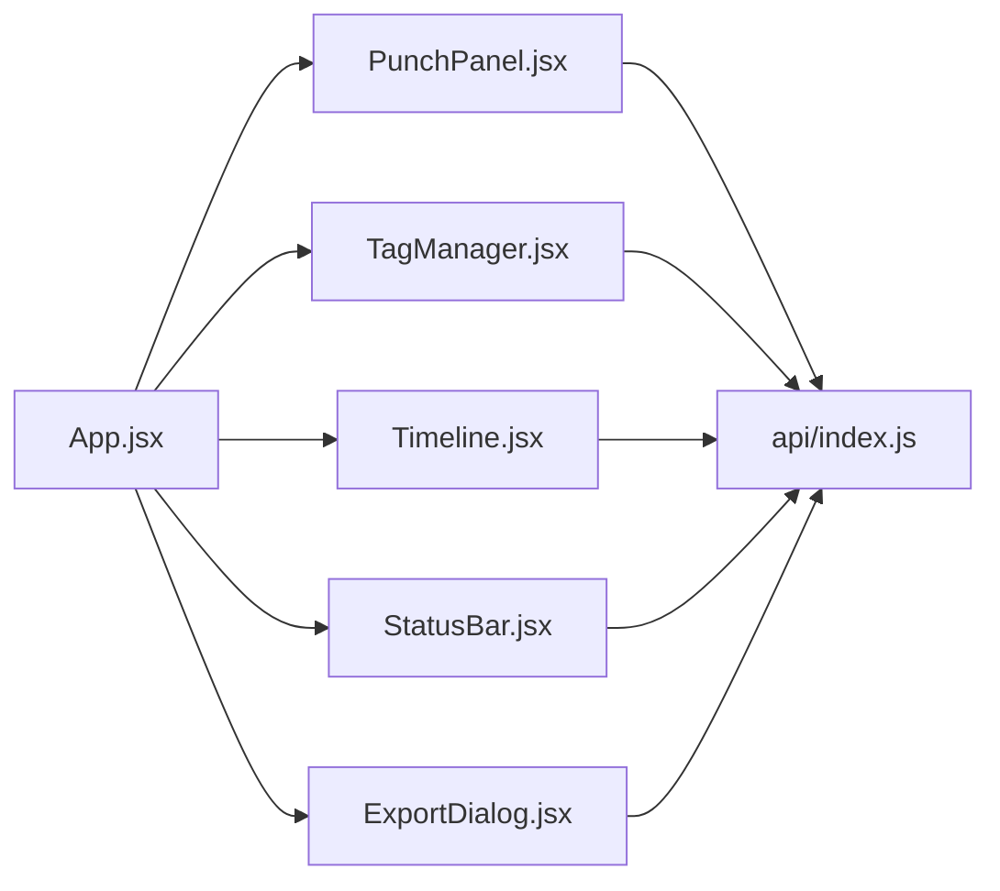

# 状态管理策略

<cite>
**本文引用的文件**
- [App.jsx](file://client/src/App.jsx)
- [main.jsx](file://client/src/main.jsx)
- [PunchPanel.jsx](file://client/src/components/PunchPanel.jsx)
- [TagManager.jsx](file://client/src/components/TagManager.jsx)
- [Timeline.jsx](file://client/src/components/Timeline.jsx)
- [StatusBar.jsx](file://client/src/components/StatusBar.jsx)
- [ExportDialog.jsx](file://client/src/components/ExportDialog.jsx)
- [index.js](file://client/src/api/index.js)
- [App.css](file://client/src/App.css)
- [TagManager.css](file://client/src/components/TagManager.css)
</cite>

## 目录
1. [引言](#引言)
2. [项目结构](#项目结构)
3. [核心组件与状态设计](#核心组件与状态设计)
4. [架构总览](#架构总览)
5. [详细组件分析](#详细组件分析)
6. [依赖关系分析](#依赖关系分析)
7. [性能考量与优化](#性能考量与优化)
8. [故障排查指南](#故障排查指南)
9. [结论](#结论)
10. [附录](#附录)

## 引言
本文件系统性梳理 taskRecordre 的状态管理策略，聚焦于基于 React Hooks 的状态管理模式，重点解析 useState、useEffect、useCallback 在 App.jsx 中的应用，并结合 PunchPanel、TagManager、Timeline、StatusBar、ExportDialog 等组件，阐述状态提升、状态隔离与状态持久化等设计取舍。同时总结 useCallback 的性能优化策略与依赖数组管理原则，给出最佳实践与常见陷阱的规避建议。

## 项目结构
客户端采用以功能模块划分的组件组织方式，主应用通过 App.jsx 聚合各子组件，API 请求集中在 api/index.js 中统一管理，样式文件按组件拆分，便于维护与复用。

图表来源
- [main.jsx:1-11](file://client/src/main.jsx#L1-L11)
- [App.jsx:1-86](file://client/src/App.jsx#L1-L86)
- [PunchPanel.jsx:1-119](file://client/src/components/PunchPanel.jsx#L1-L119)
- [TagManager.jsx:1-135](file://client/src/components/TagManager.jsx#L1-L135)
- [Timeline.jsx:1-138](file://client/src/components/Timeline.jsx#L1-L138)
- [StatusBar.jsx:1-46](file://client/src/components/StatusBar.jsx#L1-L46)
- [ExportDialog.jsx:1-98](file://client/src/components/ExportDialog.jsx#L1-L98)
- [index.js:1-75](file://client/src/api/index.js#L1-L75)
- [App.css:1-385](file://client/src/App.css#L1-L385)
- [TagManager.css:1-180](file://client/src/components/TagManager.css#L1-L180)

章节来源
- [main.jsx:1-11](file://client/src/main.jsx#L1-L11)
- [App.jsx:1-86](file://client/src/App.jsx#L1-L86)

## 核心组件与状态设计
本节聚焦 App.jsx 的状态设计与 Hook 使用策略，涵盖以下要点：
- punches 打卡记录状态：用于渲染时间线与计算状态栏信息
- tags 标签状态：用于打卡面板的标签选择与导出弹窗的数据范围
- 弹窗显示状态：控制标签管理弹窗与导出弹窗的开闭
- 日期状态：固定为当天日期，作为查询参数传递给 API
- useCallback 的使用：将异步数据加载函数稳定化，减少子组件重渲染
- useEffect 的触发机制：在组件挂载时拉取初始数据

状态字段与用途
- showTagManager：布尔值，控制标签管理弹窗是否显示
- showExportDialog：布尔值，控制导出弹窗是否显示
- punches：数组，存储当日打卡记录
- tags：数组，存储可用标签集合
- date：字符串，格式化后的当天日期

触发机制与数据流
- 首次渲染时，useEffect 依赖 fetchPunches 与 fetchTags，二者通过 useCallback 包裹，确保依赖数组稳定
- PunchPanel 通过 onPunch 回调触发 App.jsx 的 fetchPunches，实现打卡后刷新数据
- TagManager 通过 onTagsChange 回调触发 App.jsx 的 fetchTags，实现标签变更后刷新数据
- Timeline 通过 onDataChange 回调触发 App.jsx 的 fetchPunches，实现编辑或删除后刷新数据

章节来源
- [App.jsx:10-86](file://client/src/App.jsx#L10-L86)

## 架构总览
下图展示从用户交互到数据更新的端到端流程，包括状态提升与组件间通信。

图表来源
- [PunchPanel.jsx:28-45](file://client/src/components/PunchPanel.jsx#L28-L45)
- [App.jsx:26-38](file://client/src/App.jsx#L26-L38)
- [index.js:3-17](file://client/src/api/index.js#L3-L17)
- [Timeline.jsx:4-70](file://client/src/components/Timeline.jsx#L4-L70)

## 详细组件分析

### App.jsx：状态设计与 Hook 策略
- 状态定义与职责
  - punches：用于 Timeline 渲染与 StatusBar 计算
  - tags：用于 PunchPanel 的标签选择
  - showTagManager/showExportDialog：控制弹窗开闭
  - date：作为查询参数，避免跨日切换导致的数据错乱
- useCallback 策略
  - fetchTags：空依赖数组，保证在整个应用生命周期内函数引用稳定，避免子组件不必要的重渲染
  - fetchPunches：依赖 date，确保日期变化时函数引用更新，从而触发正确的数据拉取
- useEffect 触发
  - 同步拉取 punches 与 tags，形成初始数据流
- 子组件注入
  - PunchPanel：接收 tags、isFirstPunch、onPunch、onTagsChange
  - Timeline：接收 punches、date、onDataChange
  - 弹窗：通过 isOpen/onClose 控制显示，onTagsChange 用于标签变更后刷新

章节来源
- [App.jsx:10-86](file://client/src/App.jsx#L10-L86)

### PunchPanel.jsx：状态隔离与交互
- 内部状态
  - selectedTags：本地选择的标签名集合，仅影响当前面板交互
  - description：本地输入的描述文本
  - loading：本地加载状态，避免重复提交
- 交互逻辑
  - 标签多选：toggleTag 切换选中状态
  - 描述拼接：buildDescription 将选中标签与输入描述合并
  - 提交打卡：handlePunch 调用 API 并在成功后清空本地状态，触发父组件刷新
  - 保存为标签：handleSaveAsTag 将输入作为新标签创建，触发父组件刷新标签列表
- 状态隔离
  - 本地状态不污染 App.jsx 的全局状态，仅在交互层面与父组件进行最小化同步

章节来源
- [PunchPanel.jsx:1-119](file://client/src/components/PunchPanel.jsx#L1-L119)

### TagManager.jsx：弹窗状态与标签管理
- 弹窗状态
  - isOpen：由 App.jsx 控制显示/隐藏
  - onClose：关闭回调，解除弹窗状态
- 内部状态
  - tags：本地缓存标签列表，随 isOpen 变化而加载
  - 新增：newName
  - 编辑：editingId、editName、editColor
- 生命周期
  - useEffect 在 isOpen 为真时加载标签列表
  - 新增/编辑/删除均通过 API 调用后重新加载并触发 onTagsChange，促使 App.jsx 刷新标签
- 用户体验
  - 支持颜色选择、回车新增、确认删除等交互细节

章节来源
- [TagManager.jsx:1-135](file://client/src/components/TagManager.jsx#L1-L135)

### Timeline.jsx：时间线计算与编辑
- 内部状态
  - editingId、editDesc、editTime：编辑模式下的本地状态
- 数据计算
  - 将 punches 转换为相邻打卡之间的时间段 entries
  - 倒序展示，最新在上
  - 计算时长（分钟）
- 编辑与删除
  - 进入编辑：设置 editingId 与默认值
  - 保存：调用 updatePunch 后触发 onDataChange 刷新
  - 删除：调用 deletePunch 后触发 onDataChange 刷新
- 状态隔离
  - 仅编辑态使用本地状态，其余渲染完全依赖外部传入的 punches 与 date

章节来源
- [Timeline.jsx:1-138](file://client/src/components/Timeline.jsx#L1-L138)

### StatusBar.jsx：计时与状态栏渲染
- 内部状态
  - elapsed：分钟数，每分钟更新一次
- 生命周期
  - 依赖 lastPunchTime，首次无打卡时显示“尚未打卡”
  - 有打卡时启动定时器，每分钟重新计算距离上次打卡的分钟数
- 性能注意
  - 定时器清理在副作用返回中执行，避免内存泄漏

章节来源
- [StatusBar.jsx:1-46](file://client/src/components/StatusBar.jsx#L1-L46)

### ExportDialog.jsx：弹窗与导出流程
- 弹窗状态
  - isOpen/onClose：控制显示/隐藏
- 内部状态
  - startDate、endDate：导出日期范围
  - exporting：导出过程中的加载状态
- 快捷设置
  - 设置今天/本周，自动填充日期范围
- 导出流程
  - 调用 /api/export 接口，下载 CSV 文件
  - 失败时提示错误并恢复 exporting 状态

章节来源
- [ExportDialog.jsx:1-98](file://client/src/components/ExportDialog.jsx#L1-L98)

### API 封装：统一数据访问层
- 功能覆盖
  - 打卡：获取、创建、更新、删除
  - 标签：获取、创建、更新、删除
  - 导出：CSV 导出
- 错误处理
  - 对非 OK 响应抛出错误，便于上层统一处理
- 依赖
  - 所有组件通过 api/index.js 发起请求，保持集中式管理

章节来源
- [index.js:1-75](file://client/src/api/index.js#L1-L75)

## 依赖关系分析
- 组件耦合
  - App.jsx 作为状态中心，向上提供状态，向下分发 props 与回调
  - PunchPanel、TagManager、Timeline、StatusBar、ExportDialog 为纯展示或简单交互组件，依赖 App.jsx 的状态与回调
- 数据流向
  - 上行：子组件通过回调通知 App.jsx 刷新数据
  - 下行：App.jsx 将状态与回调注入子组件
- 外部依赖
  - api/index.js 作为唯一数据源，所有网络请求集中于此

图表来源
- [App.jsx:10-86](file://client/src/App.jsx#L10-L86)
- [PunchPanel.jsx:1-119](file://client/src/components/PunchPanel.jsx#L1-L119)
- [TagManager.jsx:1-135](file://client/src/components/TagManager.jsx#L1-L135)
- [Timeline.jsx:1-138](file://client/src/components/Timeline.jsx#L1-L138)
- [StatusBar.jsx:1-46](file://client/src/components/StatusBar.jsx#L1-L46)
- [ExportDialog.jsx:1-98](file://client/src/components/ExportDialog.jsx#L1-L98)
- [index.js:1-75](file://client/src/api/index.js#L1-L75)

## 性能考量与优化
- useCallback 的使用策略
  - fetchTags：空依赖数组，确保函数引用稳定，避免 PunchPanel、Timeline 等子组件因回调变化而重渲染
  - fetchPunches：依赖 date，确保日期变化时函数引用更新，避免跨日场景下的陈旧数据
- 依赖数组管理
  - 严格遵循“用到的变量必须出现在依赖数组中”的原则，避免闭包捕获过期值
  - 对于只在初始化需要的函数，使用空依赖数组；对于依赖外部状态的函数，明确列出依赖项
- 状态提升与隔离
  - App.jsx 负责全局状态与数据拉取，子组件仅持有局部状态，降低不必要的重渲染
  - 对于弹窗类组件，内部状态与开关状态分离，通过 isOpen/onClose 控制显示，减少对全局状态的依赖
- 渲染优化建议
  - 对频繁渲染的列表（如 Timeline）可考虑使用 React.memo 或 useMemo 优化子节点
  - 将高频交互的本地状态（如 PunchPanel 的输入框）保留在组件内部，避免上提至 App.jsx
- 错误边界与加载状态
  - 在子组件中增加 loading 状态与错误提示，提升用户体验
  - 对于定时器类副作用，务必在清理函数中释放资源

章节来源
- [App.jsx:17-38](file://client/src/App.jsx#L17-L38)
- [PunchPanel.jsx:28-45](file://client/src/components/PunchPanel.jsx#L28-L45)
- [TagManager.jsx:12-23](file://client/src/components/TagManager.jsx#L12-L23)
- [Timeline.jsx:31-70](file://client/src/components/Timeline.jsx#L31-L70)
- [StatusBar.jsx:6-17](file://client/src/components/StatusBar.jsx#L6-L17)

## 故障排查指南
- 打卡失败
  - 现象：点击打卡后无响应或提示失败
  - 排查：检查 API 返回状态码与错误信息；确认 handlePunch 中的异常处理与 loading 状态
  - 关联文件：[PunchPanel.jsx:28-45](file://client/src/components/PunchPanel.jsx#L28-L45)，[index.js:9-17](file://client/src/api/index.js#L9-L17)
- 标签管理异常
  - 现象：新增/编辑/删除标签后未刷新
  - 排查：确认 onTagsChange 是否被调用；检查 loadTags 是否重新拉取数据
  - 关联文件：[TagManager.jsx:25-69](file://client/src/components/TagManager.jsx#L25-L69)，[App.jsx:17-24](file://client/src/App.jsx#L17-L24)
- 时间线为空
  - 现象：打卡两次以下显示“暂无时间段记录”
  - 排查：确认 punches 数组长度与相邻打卡是否正确
  - 关联文件：[Timeline.jsx:72-79](file://client/src/components/Timeline.jsx#L72-L79)，[App.jsx:40-41](file://client/src/App.jsx#L40-L41)
- 导出失败
  - 现象：点击导出后无响应或报错
  - 排查：确认日期范围是否填写；检查 /api/export 接口返回与下载逻辑
  - 关联文件：[ExportDialog.jsx:29-48](file://client/src/components/ExportDialog.jsx#L29-L48)，[index.js:70-75](file://client/src/api/index.js#L70-L75)
- 定时器泄漏
  - 现象：切换页面或组件卸载后仍继续计时
  - 排查：确认 StatusBar 的清理函数是否执行
  - 关联文件：[StatusBar.jsx:6-17](file://client/src/components/StatusBar.jsx#L6-L17)

章节来源
- [PunchPanel.jsx:28-45](file://client/src/components/PunchPanel.jsx#L28-L45)
- [TagManager.jsx:25-69](file://client/src/components/TagManager.jsx#L25-L69)
- [Timeline.jsx:72-79](file://client/src/components/Timeline.jsx#L72-L79)
- [ExportDialog.jsx:29-48](file://client/src/components/ExportDialog.jsx#L29-L48)
- [StatusBar.jsx:6-17](file://client/src/components/StatusBar.jsx#L6-L17)

## 结论
taskRecordre 的状态管理以 App.jsx 为核心，通过 useState、useEffect、useCallback 实现了清晰的状态提升与数据流控制。PunchPanel、TagManager、Timeline、StatusBar、ExportDialog 各司其职，既保持了状态隔离，又通过回调实现了必要的联动。建议在后续迭代中进一步引入 React.memo、useMemo 等优化手段，并完善错误边界与加载态提示，以提升整体性能与用户体验。

## 附录
- 最佳实践清单
  - 使用 useCallback 包裹回调函数，确保依赖数组最小化且准确
  - 将弹窗与临时交互状态保留在组件内部，避免污染全局状态
  - 对高频副作用（如定时器）务必在清理函数中释放资源
  - 明确数据流向：上行回调、下行 props，避免跨层级直接修改
- 常见陷阱
  - 忽视依赖数组导致闭包捕获过期值
  - 将所有状态都提升至根组件，造成过度渲染
  - 忽略错误处理与加载状态，影响用户体验