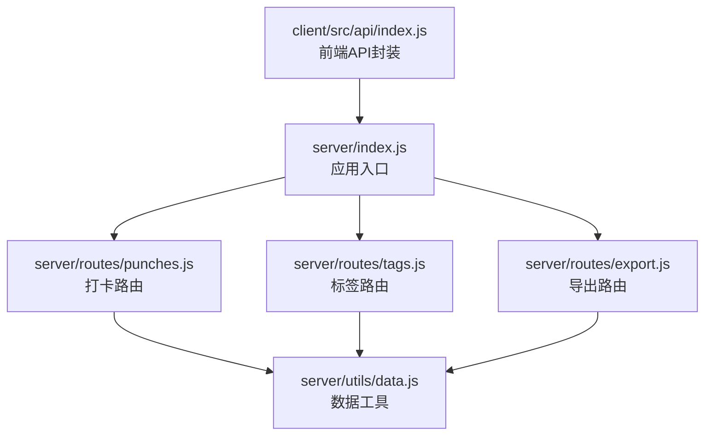
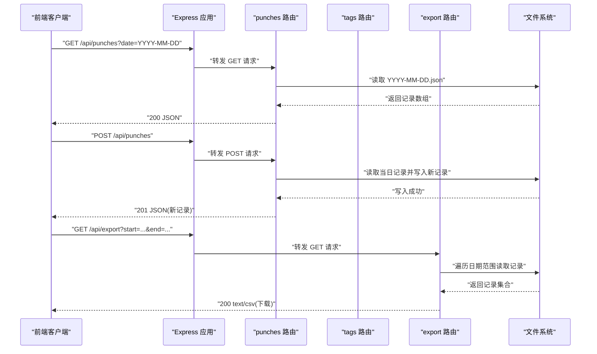
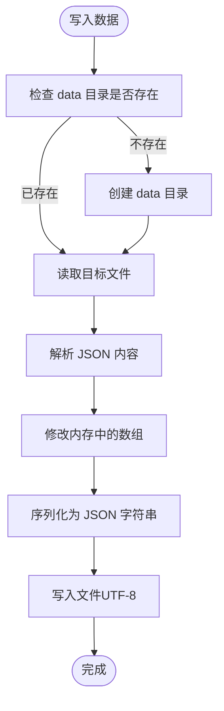
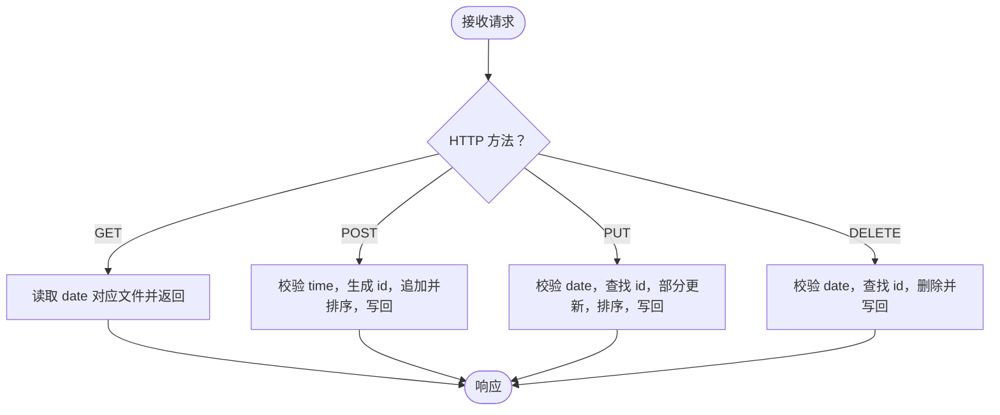
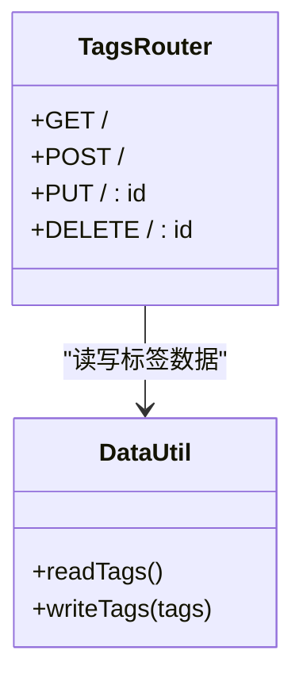
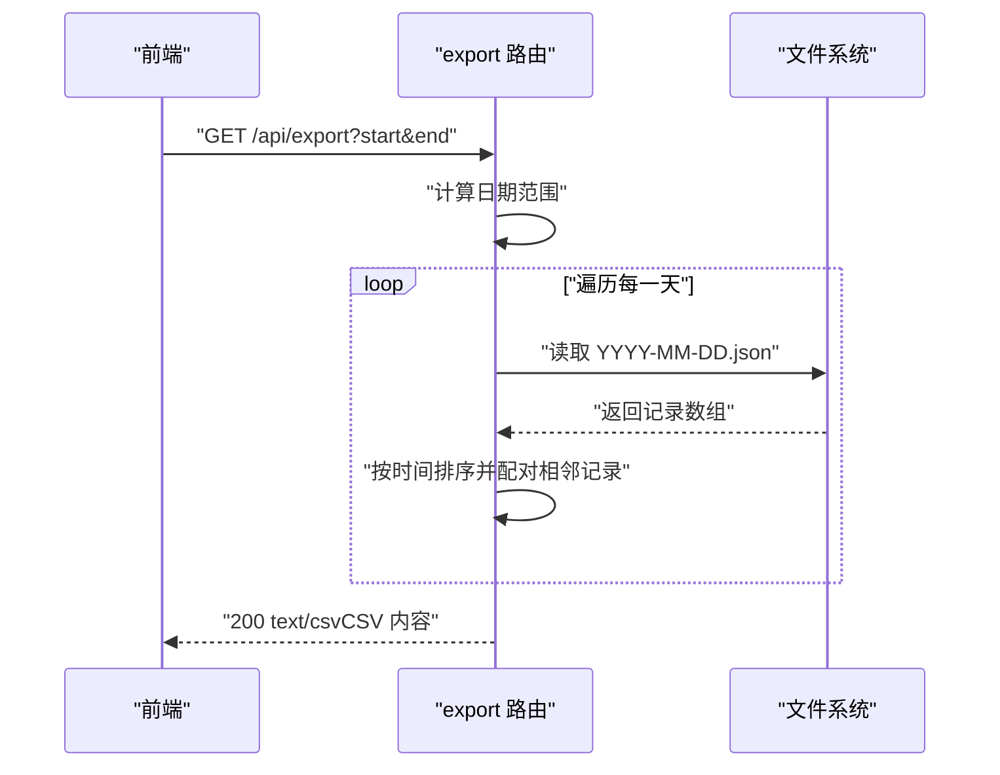
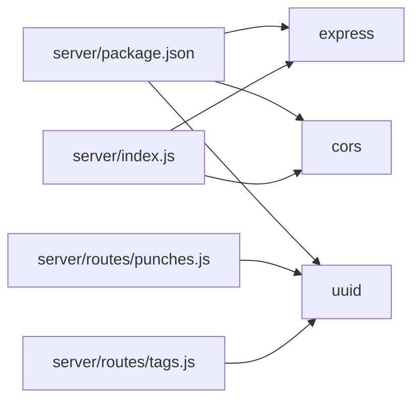

# 后端架构

<cite>
**本文引用的文件**
- [server/index.js](file://server/index.js)
- [server/package.json](file://server/package.json)
- [server/utils/data.js](file://server/utils/data.js)
- [server/routes/punches.js](file://server/routes/punches.js)
- [server/routes/tags.js](file://server/routes/tags.js)
- [server/routes/export.js](file://server/routes/export.js)
- [client/src/api/index.js](file://client/src/api/index.js)
</cite>

## 目录
1. [简介](#简介)
2. [项目结构](#项目结构)
3. [核心组件](#核心组件)
4. [架构总览](#架构总览)
5. [详细组件分析](#详细组件分析)
6. [依赖关系分析](#依赖关系分析)
7. [性能考虑](#性能考虑)
8. [故障排查指南](#故障排查指南)
9. [结论](#结论)
10. [附录](#附录)

## 简介
本文件面向 taskRecordre 后端，围绕基于 Express 4.18.0 的 RESTful API 服务进行系统化文档化，涵盖服务器配置、中间件与路由组织策略；数据持久化方案（文件系统存储）的设计与实现；API 路由结构、请求处理流程与错误处理机制；CORS 配置、UUID 生成与数据验证策略；服务器启动流程、环境配置与部署注意事项；以及 API 扩展指南与性能优化建议。文档同时结合前端调用约定，帮助读者快速理解前后端协作方式。

## 项目结构
后端采用“入口文件 + 路由模块 + 工具模块”的分层组织：
- 入口文件负责应用初始化、中间件装配、路由挂载与服务启动
- 路由模块按功能域划分：打卡、标签、导出
- 工具模块封装数据读写与目录管理
- 客户端通过统一的 /api 前缀调用后端接口

图表来源
- [server/index.js:1-35](file://server/index.js#L1-L35)
- [server/routes/punches.js:1-117](file://server/routes/punches.js#L1-L117)
- [server/routes/tags.js:1-75](file://server/routes/tags.js#L1-L75)
- [server/routes/export.js:1-88](file://server/routes/export.js#L1-L88)
- [server/utils/data.js:1-57](file://server/utils/data.js#L1-L57)
- [client/src/api/index.js:1-75](file://client/src/api/index.js#L1-L75)

章节来源
- [server/index.js:1-35](file://server/index.js#L1-L35)
- [server/package.json:1-15](file://server/package.json#L1-L15)

## 核心组件
- 应用入口与中间件
  - 初始化 Express 实例，启用 CORS 与 JSON 解析中间件
  - 自动创建数据目录，保证运行时可用
  - 将各业务路由挂载到 /api/* 前缀下
  - 在固定端口启动服务
- 数据持久化
  - 使用文件系统作为唯一存储介质
  - 每日打卡记录以独立 JSON 文件保存，文件名格式为 YYYY-MM-DD.json
  - 标签信息集中保存在 tags.json
  - 读写均以 UTF-8 文本形式进行，JSON 序列化保持可读性
- 路由与控制器
  - 打卡路由：支持查询、新增、更新、删除，并按时间排序
  - 标签路由：支持查询、新增、更新、删除，自动生成颜色
  - 导出路由：按日期范围聚合记录，生成 CSV 下载

章节来源
- [server/index.js:16-34](file://server/index.js#L16-L34)
- [server/utils/data.js:17-56](file://server/utils/data.js#L17-L56)
- [server/routes/punches.js:32-114](file://server/routes/punches.js#L32-L114)
- [server/routes/tags.js:16-72](file://server/routes/tags.js#L16-L72)
- [server/routes/export.js:46-84](file://server/routes/export.js#L46-L84)

## 架构总览
后端采用单进程、单实例的轻量级架构，适合开发与小规模生产场景。整体交互如下：

图表来源
- [server/index.js:23-30](file://server/index.js#L23-L30)
- [server/routes/punches.js:32-60](file://server/routes/punches.js#L32-L60)
- [server/routes/export.js:46-84](file://server/routes/export.js#L46-L84)
- [server/utils/data.js:17-34](file://server/utils/data.js#L17-L34)

## 详细组件分析

### 应用入口与服务器配置
- 初始化与中间件
  - 启用 CORS，允许跨域访问
  - 启用 JSON 请求体解析
  - 自动创建数据目录，避免首次运行时报错
- 路由挂载
  - 打卡路由挂载至 /api/punches
  - 标签路由挂载至 /api/tags
  - 导出路由挂载至 /api/export
- 服务启动
  - 固定端口监听，控制台输出启动日志

章节来源
- [server/index.js:16-34](file://server/index.js#L16-L34)

### 数据持久化方案（文件系统）
- 设计决策
  - 选择文件系统而非数据库，降低部署复杂度，适合小规模使用
  - 每日记录独立文件，便于按日期检索与备份
  - 标签集中存储，减少重复数据
- 实现细节
  - 读取：若文件不存在则返回空数组；解析 UTF-8 JSON
  - 写入：序列化为带缩进的 JSON，便于人工查看
  - 目录：自动创建 data 目录，确保运行时可用

图表来源
- [server/utils/data.js:9-34](file://server/utils/data.js#L9-L34)

章节来源
- [server/utils/data.js:17-56](file://server/utils/data.js#L17-L56)

### 打卡路由（/api/punches）
- 查询
  - 支持查询参数 date，默认为当天日期
  - 读取对应日期文件并返回记录数组
- 新增
  - 校验必填字段 time
  - 从 time 提取日期，生成 UUID 作为 id
  - 追加记录并按时间升序排序，写回文件
- 更新
  - 必须提供 date 查询参数
  - 支持部分字段更新（time、description）
  - 更新后重新排序并写回
- 删除
  - 必须提供 date 查询参数
  - 查找匹配 id 并移除，写回文件

图表来源
- [server/routes/punches.js:32-114](file://server/routes/punches.js#L32-L114)

章节来源
- [server/routes/punches.js:32-114](file://server/routes/punches.js#L32-L114)

### 标签路由（/api/tags）
- 查询：返回全部标签
- 新增：校验名称非空，生成 UUID 与颜色，写回
- 更新：支持部分字段更新（name、color）
- 删除：按 id 查找并删除，返回被删除项

图表来源
- [server/routes/tags.js:16-72](file://server/routes/tags.js#L16-L72)
- [server/utils/data.js:40-56](file://server/utils/data.js#L40-L56)

章节来源
- [server/routes/tags.js:16-72](file://server/routes/tags.js#L16-L72)
- [server/utils/data.js:40-56](file://server/utils/data.js#L40-L56)

### 导出路由（/api/export）
- 参数：start、end（YYYY-MM-DD）
- 流程：计算日期范围，逐日读取记录，相邻记录配对为时间段，计算时长（分钟），生成 CSV
- 响应：设置 Content-Type 为 text/csv，附加文件名并返回二进制流

图表来源
- [server/routes/export.js:46-84](file://server/routes/export.js#L46-L84)
- [server/utils/data.js:17-24](file://server/utils/data.js#L17-L24)

章节来源
- [server/routes/export.js:46-84](file://server/routes/export.js#L46-L84)

### 前后端交互与 API 约定
- 前端通过统一的 /api 前缀调用后端接口
- 打卡与标签的更新/删除需要携带 date 或 id 参数
- 导出接口返回 CSV 文件流，前端以 blob 接收并触发下载

章节来源
- [client/src/api/index.js:1-75](file://client/src/api/index.js#L1-L75)

## 依赖关系分析
- 运行时依赖
  - express：Web 框架
  - cors：跨域支持
  - uuid：生成唯一标识
- 开发脚本
  - start：生产启动
  - dev：开发热重载

图表来源
- [server/package.json:9-13](file://server/package.json#L9-L13)
- [server/index.js:1-5](file://server/index.js#L1-L5)

章节来源
- [server/package.json:1-15](file://server/package.json#L1-L15)

## 性能考虑
- 当前实现为单进程、单实例，适合开发与小规模使用
- 若需扩展，建议：
  - 引入数据库（如 SQLite/PostgreSQL）替代文件系统，提升并发与可靠性
  - 为高频查询增加索引或缓存（如内存缓存）
  - 对导出接口增加分页或异步任务队列，避免长时间阻塞
  - 使用连接池与限流中间件，增强稳定性
- 文件系统 I/O
  - 每日记录独立文件，读写开销可控
  - 大量并发写入时建议引入队列或锁机制

[本节为通用指导，不直接分析具体文件]

## 故障排查指南
- 400 错误
  - 打卡新增/更新缺少必要字段（如 time）
  - 导出缺少 start 或 end 参数
- 404 错误
  - 打卡/标签更新/删除未找到对应 id
- CORS 问题
  - 确认浏览器是否正确发送预检请求，后端已启用 cors 中间件
- 文件读写异常
  - 检查 data 目录权限与磁盘空间
  - 确认 JSON 文件格式正确且可读

章节来源
- [server/routes/punches.js:43-101](file://server/routes/punches.js#L43-L101)
- [server/routes/tags.js:25-67](file://server/routes/tags.js#L25-L67)
- [server/routes/export.js:50-52](file://server/routes/export.js#L50-L52)
- [server/index.js:20-21](file://server/index.js#L20-L21)

## 结论
该后端以 Express 为基础，采用文件系统持久化，实现了简洁高效的打卡与标签管理能力，并提供了 CSV 导出功能。整体架构清晰、易于维护，适合个人或小团队使用。随着业务增长，建议逐步引入数据库与缓存、异步任务等机制，以提升性能与可靠性。

[本节为总结性内容，不直接分析具体文件]

## 附录

### 服务器启动流程与环境配置
- 启动命令
  - 生产：npm start（或 yarn start）
  - 开发：npm run dev（或 yarn run dev）
- 端口
  - 默认监听 3001 端口
- 目录
  - 自动创建 data 目录用于存储数据文件

章节来源
- [server/package.json:5-8](file://server/package.json#L5-L8)
- [server/index.js:17-34](file://server/index.js#L17-L34)

### API 扩展指南
- 新增路由
  - 在 routes 目录新建文件，导出 Router 实例
  - 在入口文件中引入并挂载到 /api/*
- 新增数据模型
  - 在 utils/data.js 中添加读写函数
  - 确保文件命名与路径规范一致
- 错误处理
  - 统一返回状态码与错误对象
  - 对必填参数进行前置校验
- 性能优化
  - 对频繁读取的数据建立内存缓存
  - 对大文件操作采用流式处理或分页
  - 引入数据库与连接池

章节来源
- [server/index.js:3-5](file://server/index.js#L3-L5)
- [server/utils/data.js:17-56](file://server/utils/data.js#L17-L56)