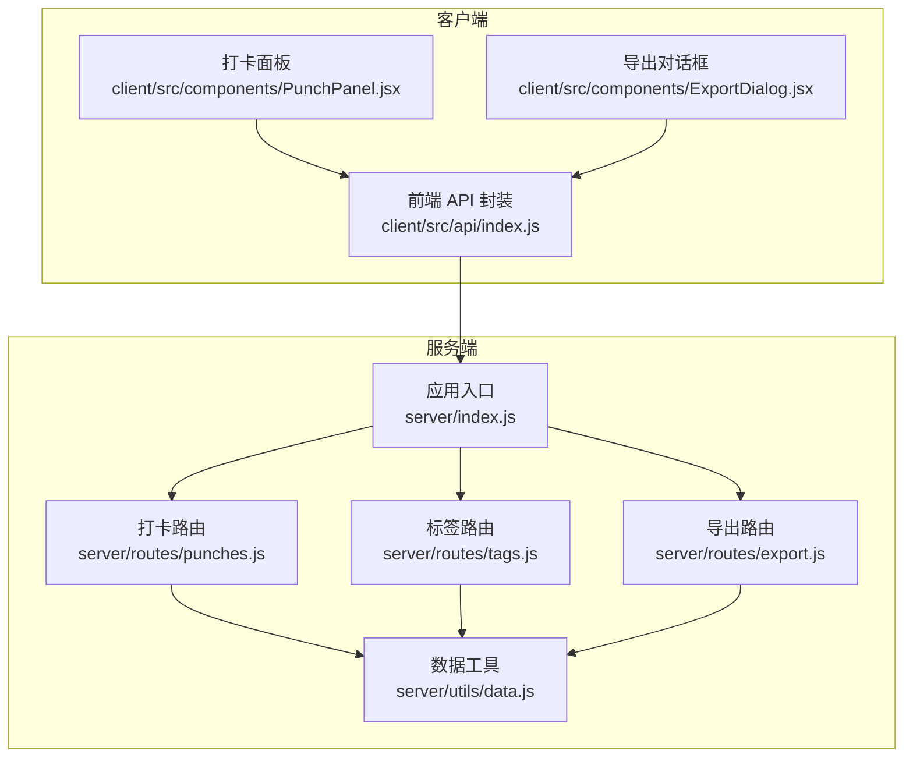
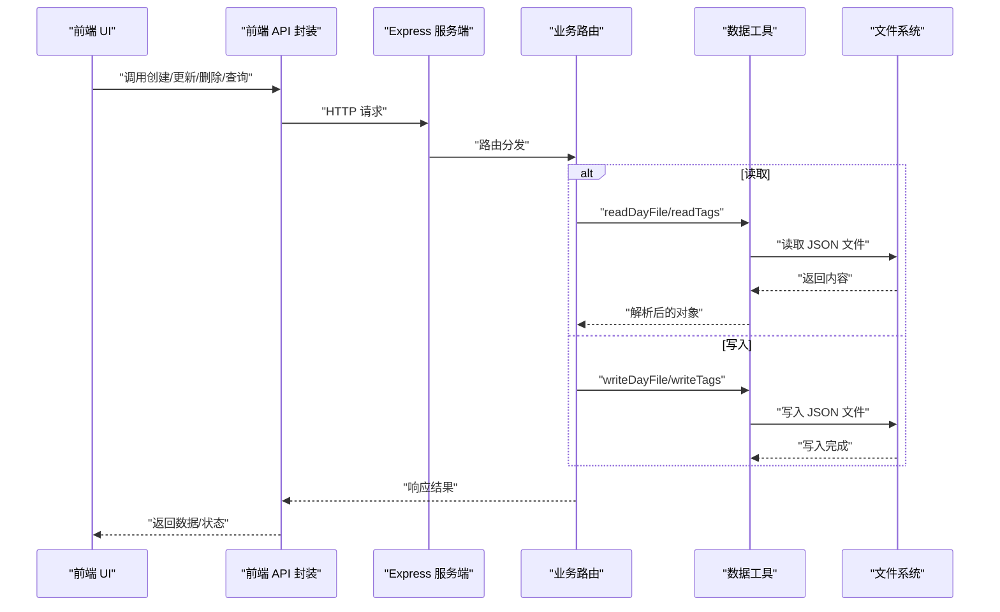
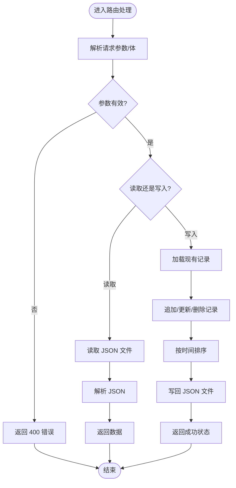
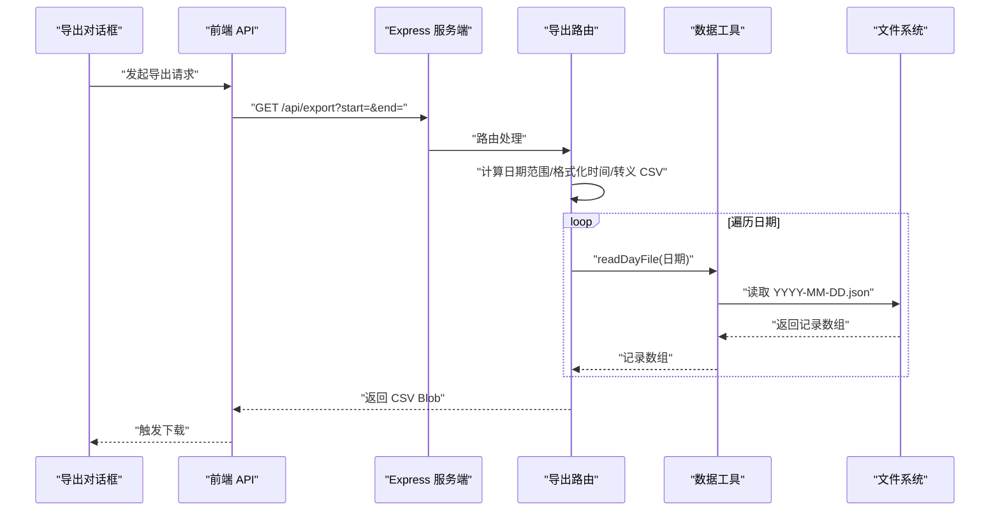
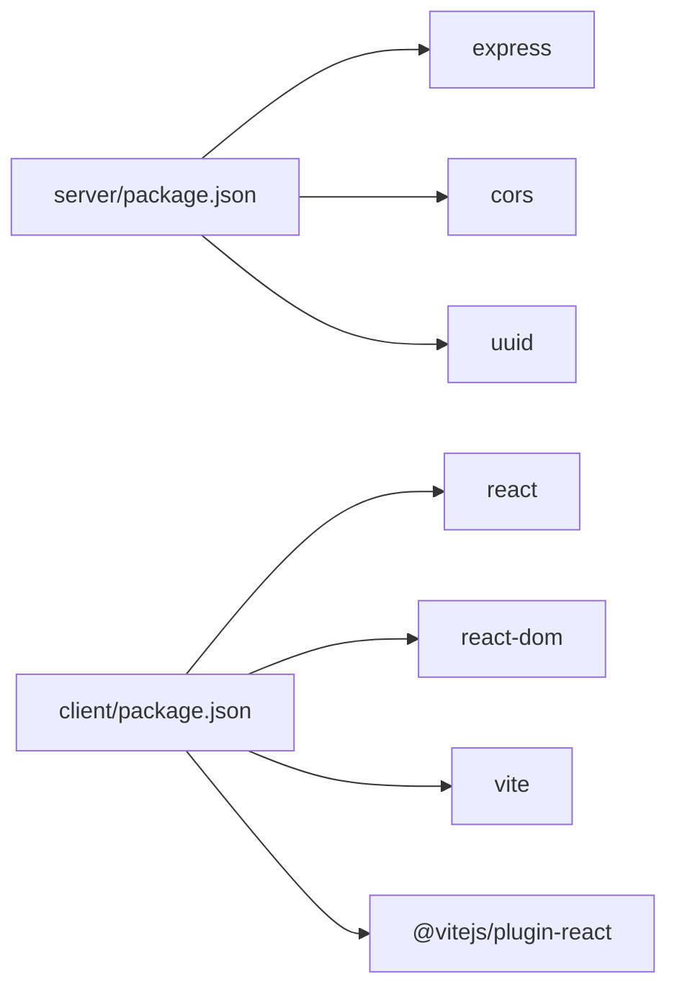

# 数据持久化

<cite>
**本文引用的文件**
- [server/utils/data.js](file://server/utils/data.js)
- [server/index.js](file://server/index.js)
- [server/routes/punches.js](file://server/routes/punches.js)
- [server/routes/tags.js](file://server/routes/tags.js)
- [server/routes/export.js](file://server/routes/export.js)
- [client/src/api/index.js](file://client/src/api/index.js)
- [client/src/components/PunchPanel.jsx](file://client/src/components/PunchPanel.jsx)
- [client/src/components/ExportDialog.jsx](file://client/src/components/ExportDialog.jsx)
- [server/package.json](file://server/package.json)
- [client/package.json](file://client/package.json)
</cite>

## 目录
1. [简介](#简介)
2. [项目结构](#项目结构)
3. [核心组件](#核心组件)
4. [架构总览](#架构总览)
5. [详细组件分析](#详细组件分析)
6. [依赖分析](#依赖分析)
7. [性能考虑](#性能考虑)
8. [故障排查指南](#故障排查指南)
9. [结论](#结论)
10. [附录](#附录)

## 简介
本文件面向 taskRecordre 的数据持久化子系统，聚焦于“基于文件系统的数据存储策略与实现”。系统采用 Node.js + Express 提供后端服务，前端通过 fetch 调用后端 API；数据以 JSON 文件形式按“日”维度分片存储在本地磁盘，标签数据单独存储为独立文件。本文将系统性阐述：
- 数据文件命名规则、存储格式与目录结构
- 读写实现细节、并发与一致性策略
- 序列化/反序列化流程、JSON 规范与完整性保障
- 备份、恢复与迁移策略
- 性能优化、大文件与内存优化方案
- 扩展与替代存储（数据库）迁移路径

## 项目结构
后端服务负责：
- 启动 Express 服务器，挂载路由
- 提供打卡、标签、导出等 API
- 通过工具模块访问本地文件系统进行数据读写

前端负责：
- 调用后端 API 完成 CRUD 与导出
- 维护 UI 状态与交互

图表来源
- [server/index.js:1-35](file://server/index.js#L1-L35)
- [server/routes/punches.js:1-117](file://server/routes/punches.js#L1-L117)
- [server/routes/tags.js:1-75](file://server/routes/tags.js#L1-L75)
- [server/routes/export.js:1-88](file://server/routes/export.js#L1-L88)
- [server/utils/data.js:1-57](file://server/utils/data.js#L1-L57)
- [client/src/api/index.js:1-75](file://client/src/api/index.js#L1-L75)
- [client/src/components/PunchPanel.jsx:1-119](file://client/src/components/PunchPanel.jsx#L1-L119)
- [client/src/components/ExportDialog.jsx:1-98](file://client/src/components/ExportDialog.jsx#L1-L98)

章节来源
- [server/index.js:1-35](file://server/index.js#L1-L35)
- [server/package.json:1-15](file://server/package.json#L1-L15)
- [client/package.json:1-20](file://client/package.json#L1-L20)

## 核心组件
- 数据工具模块：封装文件系统读写、目录初始化、JSON 序列化/反序列化
- 路由层：打卡、标签、导出三个业务路由，负责请求解析、校验与调用数据工具
- 前端 API 封装：统一的 fetch 调用，便于 UI 组件复用
- 前端 UI 组件：打卡面板与导出对话框，负责用户交互与状态管理

章节来源
- [server/utils/data.js:1-57](file://server/utils/data.js#L1-L57)
- [server/routes/punches.js:1-117](file://server/routes/punches.js#L1-L117)
- [server/routes/tags.js:1-75](file://server/routes/tags.js#L1-L75)
- [server/routes/export.js:1-88](file://server/routes/export.js#L1-L88)
- [client/src/api/index.js:1-75](file://client/src/api/index.js#L1-L75)
- [client/src/components/PunchPanel.jsx:1-119](file://client/src/components/PunchPanel.jsx#L1-L119)
- [client/src/components/ExportDialog.jsx:1-98](file://client/src/components/ExportDialog.jsx#L1-L98)

## 架构总览
系统采用“单机文件存储 + REST API”的轻量级持久化方案：
- 存储介质：本地文件系统
- 存储粒度：按“日”切分的 JSON 文件；标签数据单独文件
- 访问方式：HTTP API（GET/POST/PUT/DELETE）
- 并发控制：无显式锁，采用“读写原子性 + 顺序写”策略
- 数据格式：JSON 文本，UTF-8 编码

图表来源
- [client/src/api/index.js:1-75](file://client/src/api/index.js#L1-L75)
- [server/routes/punches.js:1-117](file://server/routes/punches.js#L1-L117)
- [server/routes/tags.js:1-75](file://server/routes/tags.js#L1-L75)
- [server/routes/export.js:1-88](file://server/routes/export.js#L1-L88)
- [server/utils/data.js:1-57](file://server/utils/data.js#L1-L57)

## 详细组件分析

### 数据文件命名规则与目录结构
- 目录位置：服务端启动时确保 data 目录存在，绝对路径由当前脚本所在目录拼接得到
- 日常打卡数据文件：按日期命名，格式为 YYYY-MM-DD.json
- 标签数据文件：固定命名为 tags.json
- 编码与格式：UTF-8 文本，JSON 数组或对象

章节来源
- [server/utils/data.js:7-10](file://server/utils/data.js#L7-L10)
- [server/utils/data.js:17-24](file://server/utils/data.js#L17-L24)
- [server/utils/data.js:31-34](file://server/utils/data.js#L31-L34)
- [server/utils/data.js:40-47](file://server/utils/data.js#L40-L47)
- [server/utils/data.js:53-56](file://server/utils/data.js#L53-L56)
- [server/index.js:13-14](file://server/index.js#L13-L14)

### 读写实现细节与数据模型
- 读取逻辑
  - 打卡：根据日期读取对应 JSON 文件，若文件不存在则返回空数组
  - 标签：读取 tags.json，不存在返回空数组
- 写入逻辑
  - 打卡：将新记录追加到数组末尾，排序后整体写回
  - 标签：直接追加或更新后整体写回
- 排序策略
  - 按时间字段升序排序，确保输出稳定有序
- 错误处理
  - 缺少必要参数时返回 400
  - 未找到资源时返回 404
  - 写入成功返回 201 或 204

图表来源
- [server/routes/punches.js:32-60](file://server/routes/punches.js#L32-L60)
- [server/routes/punches.js:62-92](file://server/routes/punches.js#L62-L92)
- [server/routes/punches.js:94-114](file://server/routes/punches.js#L94-L114)
- [server/routes/tags.js:16-39](file://server/routes/tags.js#L16-L39)
- [server/routes/tags.js:41-57](file://server/routes/tags.js#L41-L57)
- [server/routes/tags.js:59-72](file://server/routes/tags.js#L59-L72)

章节来源
- [server/routes/punches.js:1-117](file://server/routes/punches.js#L1-L117)
- [server/routes/tags.js:1-75](file://server/routes/tags.js#L1-L75)

### 并发处理与一致性策略
- 当前实现
  - 无显式文件锁或事务机制
  - 读写采用同步文件 API，单次操作具备原子性（读取整文件、写入整文件）
  - 写入前先加载再整体写回，避免部分写入
- 潜在风险
  - 多进程或多实例同时写入同一日期文件可能产生覆盖
  - 高频写入可能导致竞态条件
- 建议改进
  - 引入文件锁（如 flock）或临时文件 + 原子替换
  - 对热点日期文件引入队列串行化
  - 使用数据库或 WAL 日志提升可靠性

章节来源
- [server/utils/data.js:17-34](file://server/utils/data.js#L17-L34)
- [server/utils/data.js:40-56](file://server/utils/data.js#L40-L56)

### 序列化与反序列化流程、JSON 规范与完整性
- 序列化
  - 写入时使用 JSON.stringify，缩进格式便于人工阅读
- 反序列化
  - 读取时使用 JSON.parse，若文件为空或格式错误将抛出异常
- 数据完整性
  - 读取前检查文件是否存在，不存在返回空集合
  - 写入前不校验 JSON 结构，需确保调用方传入的数据符合预期
  - 建议在上层增加 Schema 校验与默认值填充

章节来源
- [server/utils/data.js:22-23](file://server/utils/data.js#L22-L23)
- [server/utils/data.js:45-46](file://server/utils/data.js#L45-L46)
- [server/utils/data.js:33](file://server/utils/data.js#L33)
- [server/utils/data.js:55](file://server/utils/data.js#L55)

### 导出功能与 CSV 生成
- 输入参数：start、end（YYYY-MM-DD）
- 日期范围遍历：包含起止日期
- 数据聚合：按日期读取打卡记录，按时间排序，相邻记录配对形成时间段
- 输出格式：CSV，包含开始时间、结束时间、时长（分钟）、描述
- 下载行为：设置 Content-Type 与 Content-Disposition，触发浏览器下载

图表来源
- [client/src/components/ExportDialog.jsx:29-48](file://client/src/components/ExportDialog.jsx#L29-L48)
- [client/src/api/index.js:70-74](file://client/src/api/index.js#L70-L74)
- [server/routes/export.js:46-85](file://server/routes/export.js#L46-L85)
- [server/utils/data.js:17-24](file://server/utils/data.js#L17-L24)

章节来源
- [server/routes/export.js:1-88](file://server/routes/export.js#L1-L88)
- [client/src/components/ExportDialog.jsx:1-98](file://client/src/components/ExportDialog.jsx#L1-L98)
- [client/src/api/index.js:70-74](file://client/src/api/index.js#L70-L74)

### 前端交互与 API 调用
- 前端通过统一的 API 封装调用后端接口，错误统一处理
- 打卡面板支持多标签选择与描述输入，提交时合并为描述文本
- 导出对话框提供快捷日期选择与下载触发

章节来源
- [client/src/api/index.js:1-75](file://client/src/api/index.js#L1-L75)
- [client/src/components/PunchPanel.jsx:1-119](file://client/src/components/PunchPanel.jsx#L1-L119)
- [client/src/components/ExportDialog.jsx:1-98](file://client/src/components/ExportDialog.jsx#L1-L98)

## 依赖分析
- 服务端依赖
  - express：Web 框架
  - cors：跨域支持
  - uuid：生成唯一 ID
- 前端依赖
  - react/react-dom：UI 框架
  - vite：构建工具
  - @vitejs/plugin-react：开发体验插件

图表来源
- [server/package.json:1-15](file://server/package.json#L1-L15)
- [client/package.json:1-20](file://client/package.json#L1-L20)

章节来源
- [server/package.json:1-15](file://server/package.json#L1-L15)
- [client/package.json:1-20](file://client/package.json#L1-L20)

## 性能考虑
- 文件大小与内存占用
  - 单日 JSON 文件随记录增多而增大，读取整个文件会占用相应内存
  - 建议限制单日记录上限或采用分页/游标策略（当前实现未提供）
- I/O 模式
  - 同步文件 API 在高并发下阻塞事件循环，建议迁移到异步版本或引入连接池/队列
- 排序成本
  - 每次写入后对全量记录排序，复杂度 O(n log n)，建议仅在必要时排序或增量维护
- 导出性能
  - 导出遍历日期范围并多次读取文件，建议缓存近期日期文件或预聚合
- 并发与锁
  - 无锁策略在高并发下易出现覆盖，建议引入文件锁或临时文件 + 原子替换
- 建议优化清单
  - 使用异步 fs API + Promise 包装
  - 引入 LRU 缓存减少重复读取
  - 对高频日期文件加队列串行化
  - 分页/游标读取与增量排序
  - 导出前预聚合或分批处理

[本节为通用性能建议，不直接分析具体文件，故无章节来源]

## 故障排查指南
- 常见问题
  - 400 参数缺失：检查请求是否包含必需参数（如打卡的 date 查询参数）
  - 404 资源不存在：确认 ID 是否正确、日期是否合法
  - 文件读取失败：检查 data 目录权限、磁盘空间、文件编码
  - 导出为空：确认日期范围内是否存在记录
- 定位方法
  - 查看服务端日志输出（启动信息）
  - 检查 data 目录下 JSON 文件是否存在且格式正确
  - 使用浏览器开发者工具查看网络请求与响应
- 修复建议
  - 补充缺失参数或修正日期格式
  - 重新生成 data 目录权限
  - 清理损坏的 JSON 文件并重建

章节来源
- [server/routes/punches.js:43-45](file://server/routes/punches.js#L43-L45)
- [server/routes/punches.js:67-69](file://server/routes/punches.js#L67-L69)
- [server/routes/punches.js:100-101](file://server/routes/punches.js#L100-L101)
- [server/routes/export.js:50-52](file://server/routes/export.js#L50-L52)

## 结论
该系统以极简方式实现了“按日分片”的文件存储，满足轻量场景下的数据持久化需求。其优势在于部署简单、易于理解与维护；但随着数据规模增长与并发上升，需要引入锁、缓存、异步 I/O、分页与预聚合等机制以提升稳定性与性能。后续可平滑迁移到数据库或对象存储，保持 API 兼容性。

[本节为总结性内容，不直接分析具体文件，故无章节来源]

## 附录

### 数据备份与恢复
- 备份策略
  - 定期复制 data 目录至安全位置
  - 使用压缩归档（tar/zip）降低存储开销
- 恢复步骤
  - 停止服务
  - 备份原 data 目录
  - 将备份文件解压到原路径
  - 启动服务并验证数据完整性
- 注意事项
  - 恢复前确保服务未运行
  - 恢复后检查文件权限与编码

[本节为通用运维建议，不直接分析具体文件，故无章节来源]

### 数据迁移策略
- 迁移目标
  - 从文件系统迁移到关系型数据库（如 SQLite/MySQL/PostgreSQL）
- 迁移步骤
  - 评估现有 JSON 结构与目标数据库表结构映射
  - 编写迁移脚本：读取 data 目录 JSON -> 解析 -> 写入数据库
  - 切换服务端路由：将 read/write 调用从文件工具切换到数据库适配器
  - 逐步灰度发布，对比一致性与性能
- 兼容性
  - 保持对外 API 不变，内部实现透明替换
  - 保留历史数据导入能力，支持回滚

[本节为通用迁移建议，不直接分析具体文件，故无章节来源]

### 替代存储方案与迁移路径
- 方案一：嵌入式数据库（SQLite）
  - 优点：无需额外服务、零配置、ACID
  - 迁移：将 JSON 文件映射为表，迁移脚本批量导入
- 方案二：对象存储（S3/MinIO）
  - 优点：高可用、可扩展、自动备份
  - 迁移：抽象读写接口，替换为对象存储 SDK
- 方案三：分布式 KV（如 etcd）
  - 优点：强一致、配置中心友好
  - 迁移：键名映射为日期/标签标识，保持 API 不变

[本节为通用方案建议，不直接分析具体文件，故无章节来源]