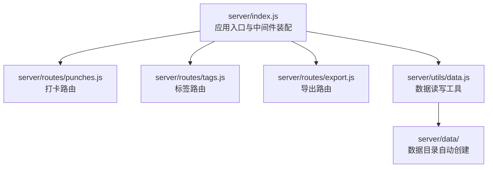
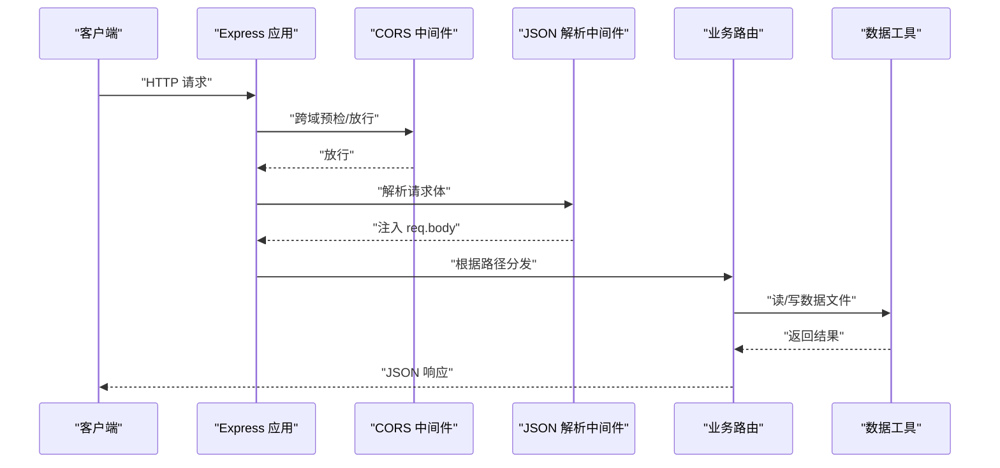
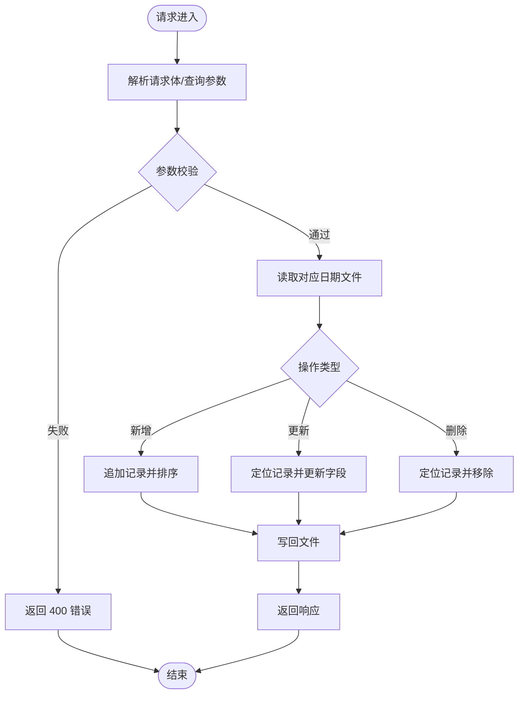
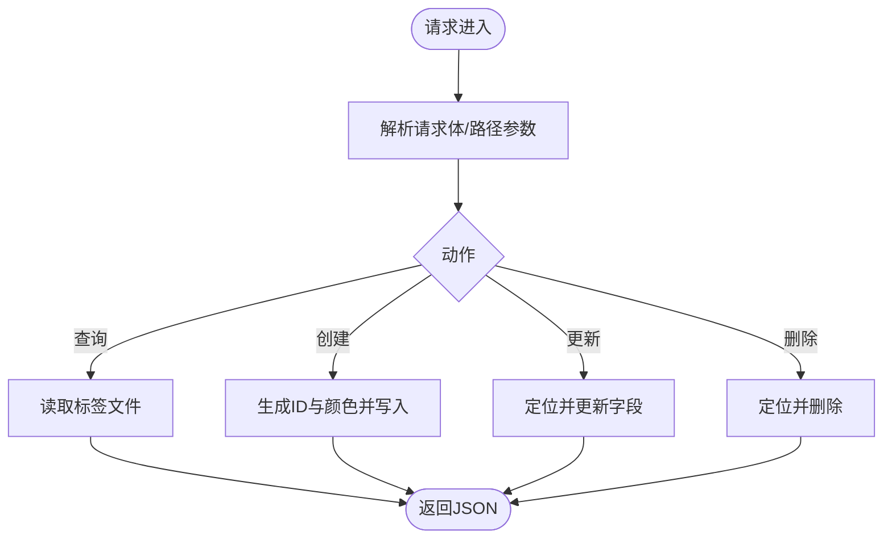
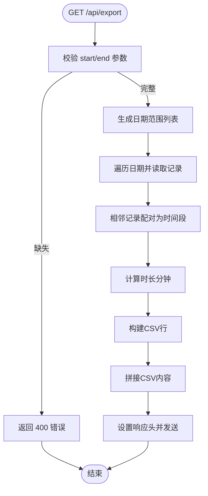
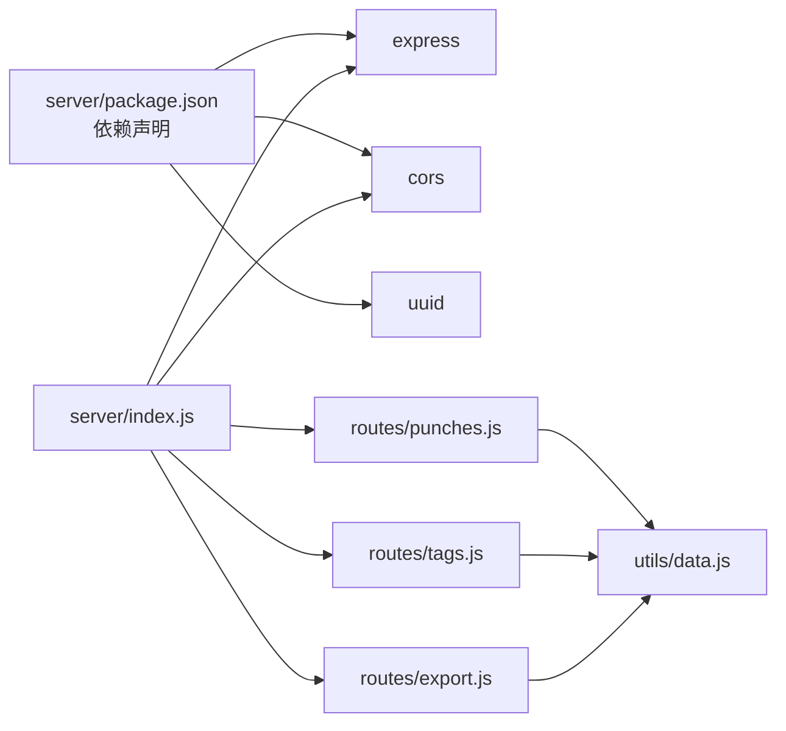

# 服务器配置

<cite>
**本文引用的文件**
- [server/index.js](file://server/index.js)
- [server/package.json](file://server/package.json)
- [server/utils/data.js](file://server/utils/data.js)
- [server/routes/punches.js](file://server/routes/punches.js)
- [server/routes/tags.js](file://server/routes/tags.js)
- [server/routes/export.js](file://server/routes/export.js)
</cite>

## 目录
1. [简介](#简介)
2. [项目结构](#项目结构)
3. [核心组件](#核心组件)
4. [架构总览](#架构总览)
5. [详细组件分析](#详细组件分析)
6. [依赖关系分析](#依赖关系分析)
7. [性能考虑](#性能考虑)
8. [故障排查指南](#故障排查指南)
9. [结论](#结论)
10. [附录](#附录)

## 简介
本文件面向 taskRecordre 的服务器配置与运行，围绕 Express 应用实例初始化、端口配置与基础设置、CORS 跨域策略、JSON 请求体解析、服务器启动流程与运行状态监控、文件系统目录创建与数据存储路径、环境变量使用与错误处理、服务器生命周期管理等主题进行系统化技术文档化。同时提供配置优化建议与生产环境部署注意事项，帮助开发者快速理解与安全稳定地部署该服务。

## 项目结构
服务器侧采用模块化组织方式，入口文件负责应用初始化、中间件装配与路由挂载；工具模块封装数据持久化；各业务路由模块分别处理打卡、标签与导出功能。

图表来源
- [server/index.js:16-34](file://server/index.js#L16-L34)
- [server/utils/data.js:10](file://server/utils/data.js#L10)
- [server/routes/punches.js:1-117](file://server/routes/punches.js#L1-L117)
- [server/routes/tags.js:1-75](file://server/routes/tags.js#L1-L75)
- [server/routes/export.js:1-88](file://server/routes/export.js#L1-L88)

章节来源
- [server/index.js:1-35](file://server/index.js#L1-L35)
- [server/package.json:1-15](file://server/package.json#L1-L15)

## 核心组件
- Express 应用实例与中间件
  - 应用实例在入口文件中创建并配置基础中间件：CORS 与 JSON 解析。
  - 路由通过 app.use 挂载到统一前缀下，便于扩展与维护。
- 数据持久化工具
  - 工具模块负责确保数据目录存在，并提供按日期与标签的读写接口。
- 路由模块
  - 打卡路由：支持查询、新增、更新、删除，按时间排序与唯一 ID 管理。
  - 标签路由：支持查询、创建、更新、删除，自动生成颜色。
  - 导出路由：按日期范围聚合数据并生成 CSV 文件下载。

章节来源
- [server/index.js:16-34](file://server/index.js#L16-L34)
- [server/utils/data.js:17-56](file://server/utils/data.js#L17-L56)
- [server/routes/punches.js:32-114](file://server/routes/punches.js#L32-L114)
- [server/routes/tags.js:16-72](file://server/routes/tags.js#L16-L72)
- [server/routes/export.js:46-84](file://server/routes/export.js#L46-L84)

## 架构总览
下图展示从请求进入至响应返回的关键流程，包括中间件链路、路由分发与数据访问。

图表来源
- [server/index.js:19-30](file://server/index.js#L19-L30)
- [server/routes/punches.js:32-60](file://server/routes/punches.js#L32-L60)
- [server/routes/tags.js:16-38](file://server/routes/tags.js#L16-L38)
- [server/routes/export.js:46-84](file://server/routes/export.js#L46-L84)
- [server/utils/data.js:17-56](file://server/utils/data.js#L17-L56)

## 详细组件分析

### Express 应用初始化与基础设置
- 应用实例创建与端口绑定
  - 在入口文件中创建应用实例，并监听固定端口，启动后在控制台输出运行信息。
- 基础中间件
  - CORS：默认允许简单跨域请求，满足前端本地开发场景。
  - JSON 解析：启用对 application/json 的解析，供后续路由使用。
- 路由挂载
  - 将打卡、标签、导出三个路由模块挂载到统一前缀下，便于扩展。

章节来源
- [server/index.js:16-34](file://server/index.js#L16-L34)

### CORS 中间件配置与跨域处理策略
- 默认行为
  - 使用默认配置启用 CORS，允许常见简单请求头与方法。
- 处理策略
  - 对于前端本地开发（如 Vite）与同源调用无额外配置即可正常工作。
  - 若需更严格的跨域策略（如自定义来源、凭证、复杂头部），可在生产环境显式配置 CORS 选项以收紧权限。

章节来源
- [server/index.js:20](file://server/index.js#L20)

### JSON 请求体解析中间件使用与配置
- 启用方式
  - 通过内置中间件启用对 JSON 请求体的解析，使路由能直接访问 req.body。
- 注意事项
  - 默认未限制最大大小，生产环境建议结合反向代理或中间件限制请求体大小，防止资源滥用。
  - 如需支持二进制上传或表单，请补充相应中间件与校验逻辑。

章节来源
- [server/index.js:21](file://server/index.js#L21)

### 服务器启动流程、控制台输出与运行状态监控
- 启动流程
  - 先确保数据目录存在，再创建应用实例并挂载中间件与路由，最后绑定端口并启动监听。
- 控制台输出
  - 启动成功后输出包含端口号的提示信息，便于确认服务运行状态。
- 运行状态监控
  - 可通过进程管理器（如 PM2）或容器编排平台进行健康检查与日志采集。
  - 建议增加更完善的日志记录与错误捕获，以便生产环境问题定位。

章节来源
- [server/index.js:13-14](file://server/index.js#L13-L14)
- [server/index.js:32-34](file://server/index.js#L32-L34)

### 文件系统目录创建机制与数据存储路径
- 目录创建
  - 在入口与数据工具模块中均确保数据目录存在，避免首次运行时报错。
- 存储路径
  - 数据目录位于 server/data，按日期命名的 JSON 文件存储打卡记录，单独的 JSON 文件存储标签。
- 文件读写
  - 读取与写入均采用 UTF-8 编码，写入时保留缩进以提升可读性。

章节来源
- [server/index.js:13-14](file://server/index.js#L13-L14)
- [server/utils/data.js:7](file://server/utils/data.js#L7)
- [server/utils/data.js:17-56](file://server/utils/data.js#L17-L56)

### 环境变量使用
- 当前实现
  - 端口与数据路径在代码中硬编码，未使用环境变量。
- 建议
  - 将端口、数据目录路径、CORS 来源等敏感或可变配置迁移到环境变量，配合 dotenv 或系统环境变量管理。
  - 生产环境务必通过环境变量注入，避免修改源码。

章节来源
- [server/index.js:17](file://server/index.js#L17)
- [server/utils/data.js:7](file://server/utils/data.js#L7)

### 错误处理与服务器生命周期管理
- 错误处理
  - 路由层对必填字段缺失、资源不存在等情况返回明确的状态码与错误信息。
  - 建议在应用层增加全局错误处理器，统一拦截异常并输出结构化日志。
- 生命周期管理
  - 当前未实现优雅关闭逻辑。建议在应用层注册信号处理器，在收到终止信号时关闭监听、清理资源并退出进程。
  - 结合进程管理器实现自动重启与健康检查。

章节来源
- [server/routes/punches.js:43-45](file://server/routes/punches.js#L43-L45)
- [server/routes/punches.js:74-76](file://server/routes/punches.js#L74-L76)
- [server/routes/tags.js:25-27](file://server/routes/tags.js#L25-L27)
- [server/routes/tags.js:47-49](file://server/routes/tags.js#L47-L49)

### 打卡路由（/api/punches）
- 功能要点
  - 支持按日期查询、新增、更新、删除打卡记录。
  - 新增时自动生成唯一 ID 并按时间排序；更新与删除要求提供日期参数。
- 数据模型
  - 记录包含唯一 ID、时间戳、描述等字段。
- 性能与一致性
  - 每次操作均进行文件读写，适合小规模数据；大规模并发时建议引入数据库与事务。

图表来源
- [server/routes/punches.js:32-114](file://server/routes/punches.js#L32-L114)
- [server/utils/data.js:17-34](file://server/utils/data.js#L17-L34)

章节来源
- [server/routes/punches.js:32-114](file://server/routes/punches.js#L32-L114)
- [server/utils/data.js:17-34](file://server/utils/data.js#L17-L34)

### 标签路由（/api/tags）
- 功能要点
  - 支持查询、创建、更新、删除标签。
  - 创建时自动生成唯一 ID 与基于黄金角的颜色值，保证颜色可区分。
- 数据模型
  - 标签包含唯一 ID、名称、颜色等字段。
- 扩展建议
  - 可增加标签去重、批量导入导出等功能。

图表来源
- [server/routes/tags.js:16-72](file://server/routes/tags.js#L16-L72)
- [server/utils/data.js:40-56](file://server/utils/data.js#L40-L56)

章节来源
- [server/routes/tags.js:16-72](file://server/routes/tags.js#L16-L72)
- [server/utils/data.js:40-56](file://server/utils/data.js#L40-L56)

### 导出路由（/api/export）
- 功能要点
  - 接收起止日期参数，遍历日期范围，读取每日打卡记录并按时间排序。
  - 相邻两条记录配对形成时间段，计算时长并生成 CSV 文件。
- 输出特性
  - 设置正确的 Content-Type 与附件下载头，文件名包含日期范围。
- 性能与可用性
  - 大范围导出会产生较多文件读取与字符串拼接，建议在生产环境限制日期范围或提供异步导出任务队列。

图表来源
- [server/routes/export.js:46-84](file://server/routes/export.js#L46-L84)
- [server/utils/data.js:17-24](file://server/utils/data.js#L17-L24)

章节来源
- [server/routes/export.js:46-84](file://server/routes/export.js#L46-L84)
- [server/utils/data.js:17-24](file://server/utils/data.js#L17-L24)

## 依赖关系分析
- 依赖声明
  - Express、CORS、UUID 为主要运行时依赖。
- 模块耦合
  - 路由模块依赖数据工具模块进行文件读写，耦合度低，便于替换为数据库实现。
- 外部集成点
  - 前端通过统一的 API 前缀进行交互，便于反向代理与微服务化演进。

图表来源
- [server/package.json:9-13](file://server/package.json#L9-L13)
- [server/index.js:1-8](file://server/index.js#L1-L8)
- [server/routes/punches.js:1-3](file://server/routes/punches.js#L1-L3)
- [server/routes/tags.js:1-3](file://server/routes/tags.js#L1-L3)
- [server/routes/export.js:1-2](file://server/routes/export.js#L1-L2)
- [server/utils/data.js:1-3](file://server/utils/data.js#L1-L3)

章节来源
- [server/package.json:1-15](file://server/package.json#L1-L15)
- [server/index.js:1-8](file://server/index.js#L1-L8)

## 性能考虑
- 文件 I/O 成本
  - 每次请求均进行文件读写，适合小规模数据；高并发场景建议迁移至数据库，减少磁盘争用。
- 排序与配对
  - 导出时对记录进行排序与相邻配对，时间复杂度与记录数线性相关；建议限制导出范围或采用索引优化。
- 请求体大小
  - 未限制 JSON 请求体大小，建议在生产环境通过中间件或反向代理限制，防止内存占用过高。
- 缓存与压缩
  - 可引入静态缓存与 Gzip 压缩中间件，降低带宽与 CPU 开销。

## 故障排查指南
- 启动失败
  - 检查端口是否被占用；确认数据目录权限是否可写。
- 跨域失败
  - 确认前端与后端端口一致；若为不同来源，需调整 CORS 配置或在生产环境显式白名单。
- 请求报错
  - 查看路由层返回的错误码与消息，确认必填字段是否齐全、日期参数格式是否正确。
- 导出异常
  - 检查日期范围参数与文件是否存在；关注 CSV 生成过程中的字符转义与编码。

章节来源
- [server/index.js:32-34](file://server/index.js#L32-L34)
- [server/routes/punches.js:43-45](file://server/routes/punches.js#L43-L45)
- [server/routes/export.js:50-52](file://server/routes/export.js#L50-L52)

## 结论
该服务器以最小实现提供了完整的 CRUD 与导出能力，具备良好的可读性与可扩展性。建议在生产环境中完善以下方面：引入环境变量与配置管理、增强错误处理与日志、限制请求体大小、考虑数据库替代文件存储、增加优雅关闭与健康检查、以及必要的安全加固（如限流、鉴权与输入验证）。

## 附录
- 启动脚本
  - 开发模式：热重载监听入口文件。
  - 生产模式：直接运行入口文件。
- 建议的环境变量清单
  - 端口、数据目录路径、CORS 来源白名单、日志级别、请求体大小限制阈值等。

章节来源
- [server/package.json:5-8](file://server/package.json#L5-L8)