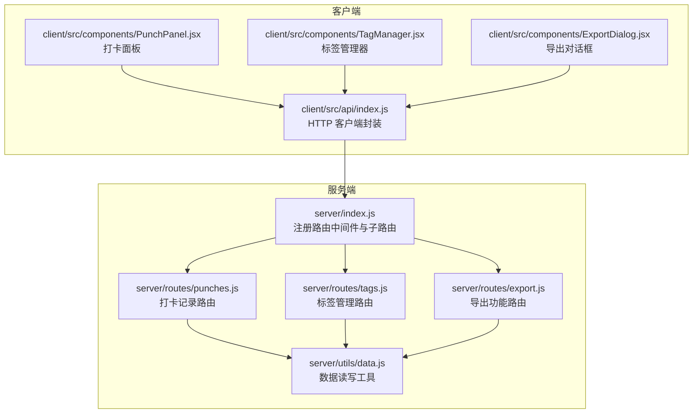
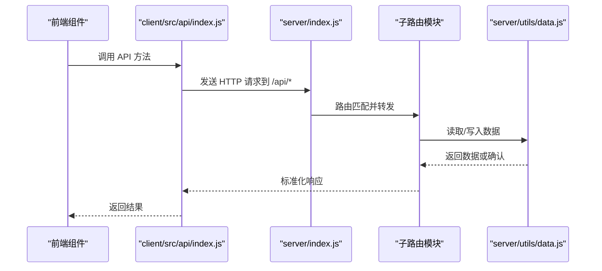
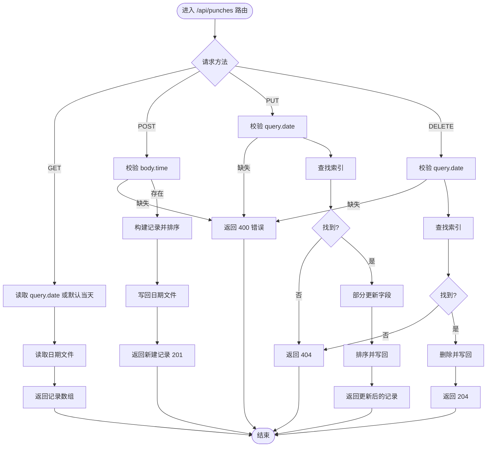
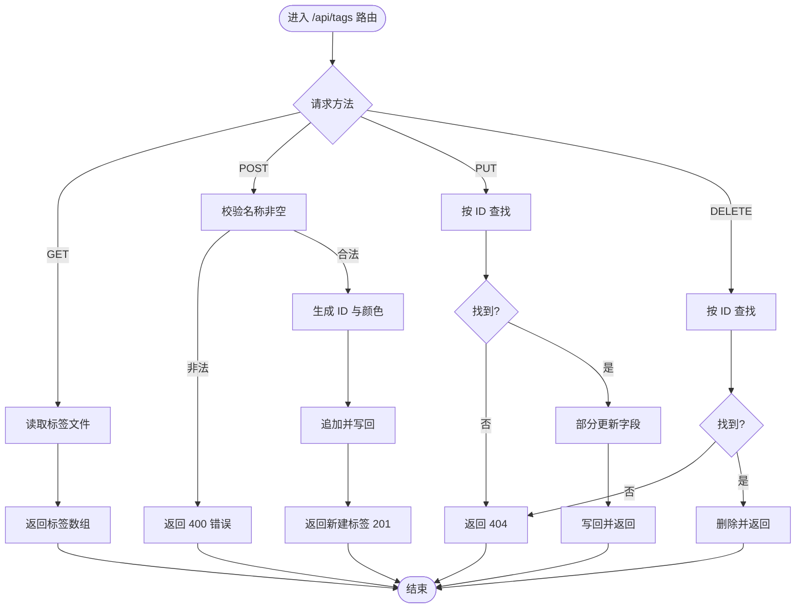
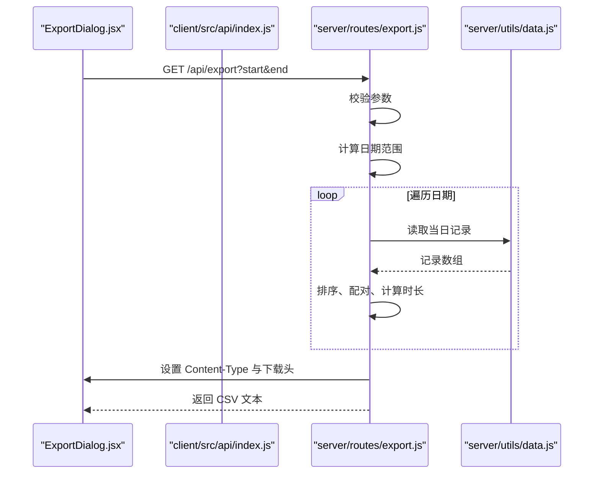
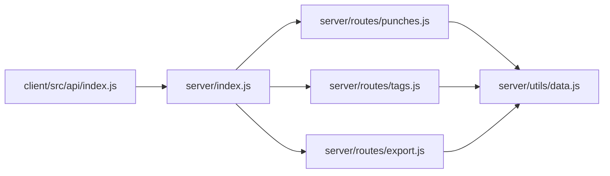

# 路由设计

<cite>
**本文引用的文件**
- [server/index.js](file://server/index.js)
- [server/routes/punches.js](file://server/routes/punches.js)
- [server/routes/tags.js](file://server/routes/tags.js)
- [server/routes/export.js](file://server/routes/export.js)
- [server/utils/data.js](file://server/utils/data.js)
- [client/src/api/index.js](file://client/src/api/index.js)
- [client/src/components/PunchPanel.jsx](file://client/src/components/PunchPanel.jsx)
- [client/src/components/TagManager.jsx](file://client/src/components/TagManager.jsx)
- [client/src/components/ExportDialog.jsx](file://client/src/components/ExportDialog.jsx)
- [package.json](file://package.json)
- [server/package.json](file://server/package.json)
- [client/package.json](file://client/package.json)
</cite>

## 目录
1. [简介](#简介)
2. [项目结构](#项目结构)
3. [核心组件](#核心组件)
4. [架构总览](#架构总览)
5. [详细组件分析](#详细组件分析)
6. [依赖关系分析](#依赖关系分析)
7. [性能考虑](#性能考虑)
8. [故障排查指南](#故障排查指南)
9. [结论](#结论)
10. [附录](#附录)

## 简介
本文件面向 taskRecordre 的“路由设计”目标，系统性梳理后端 Express 路由的组织方式与 URL 模式设计原则，深入解析三大路由模块：打卡记录路由、标签管理路由、导出功能路由；并覆盖中间件使用、参数校验、请求处理流程、模块化导入导出机制、错误处理与响应格式标准化，以及扩展新路由的最佳实践。

## 项目结构
后端采用模块化路由组织，主入口集中注册各子路由模块，每个模块独立实现 CRUD 与业务逻辑，数据持久化通过统一工具模块完成。

图表来源
- [server/index.js:1-35](file://server/index.js#L1-L35)
- [server/routes/punches.js:1-117](file://server/routes/punches.js#L1-L117)
- [server/routes/tags.js:1-75](file://server/routes/tags.js#L1-L75)
- [server/routes/export.js:1-88](file://server/routes/export.js#L1-L88)
- [server/utils/data.js:1-57](file://server/utils/data.js#L1-L57)
- [client/src/api/index.js:1-75](file://client/src/api/index.js#L1-L75)
- [client/src/components/PunchPanel.jsx:1-119](file://client/src/components/PunchPanel.jsx#L1-L119)
- [client/src/components/TagManager.jsx:1-135](file://client/src/components/TagManager.jsx#L1-L135)
- [client/src/components/ExportDialog.jsx:1-98](file://client/src/components/ExportDialog.jsx#L1-L98)

章节来源
- [server/index.js:1-35](file://server/index.js#L1-L35)
- [server/package.json:1-15](file://server/package.json#L1-L15)
- [client/package.json:1-20](file://client/package.json#L1-L20)

## 核心组件
- 主应用与中间件
  - 使用 CORS 与 JSON 解析中间件，提供跨域支持与请求体解析。
  - 在主入口集中挂载三个子路由模块，分别对应打卡、标签、导出。
- 数据层工具
  - 统一的数据读写接口，按日期拆分打卡记录文件，标签单独存储。
- 前端 API 封装
  - 对 /api 前缀下的各端点进行封装，便于组件调用。

章节来源
- [server/index.js:16-30](file://server/index.js#L16-L30)
- [server/utils/data.js:12-56](file://server/utils/data.js#L12-L56)
- [client/src/api/index.js:1-75](file://client/src/api/index.js#L1-L75)

## 架构总览
后端采用“主入口注册 + 子路由模块”的分层设计：
- 主入口负责中间件与路由挂载；
- 各子路由模块各自定义资源路径与控制器逻辑；
- 数据访问通过工具模块抽象，避免重复与耦合；
- 前端通过统一的 API 封装与后端交互。

图表来源
- [server/index.js:23-30](file://server/index.js#L23-L30)
- [server/routes/punches.js:32-114](file://server/routes/punches.js#L32-L114)
- [server/routes/tags.js:16-72](file://server/routes/tags.js#L16-L72)
- [server/routes/export.js:46-84](file://server/routes/export.js#L46-L84)
- [server/utils/data.js:17-56](file://server/utils/data.js#L17-L56)
- [client/src/api/index.js:3-74](file://client/src/api/index.js#L3-L74)

## 详细组件分析

### 打卡记录路由模块（/api/punches）
- URL 模式与方法
  - GET /api/punches?date=YYYY-MM-DD：查询某日打卡记录，默认当天。
  - POST /api/punches：新增一条打卡记录，自动按时间排序并写入对应日期文件。
  - PUT /api/punches/:id?date=YYYY-MM-DD：按 ID 更新某日的记录，需提供 date 查询参数。
  - DELETE /api/punches/:id?date=YYYY-MM-DD：按 ID 删除某日的记录。
- 参数与校验
  - 新增记录必须提供时间字段；描述可选。
  - 更新与删除必须提供 date 查询参数，否则返回 400。
  - 未找到记录时返回 404。
- 处理流程
  - 提取日期、构造记录、读取现有记录、排序、写回文件。
  - 更新时允许部分字段更新，删除时直接移除并写回。
- 响应与状态码
  - 成功新增返回 201 与新建记录；成功更新返回记录；删除成功返回 204。
  - 错误返回 400/404 并携带错误信息对象。
- 关键函数与复杂度
  - 排序按时间升序，复杂度 O(n log n)。
  - 查找按 ID 使用数组查找，复杂度 O(n)。
- 与前端集成
  - 前端通过 API 封装调用，传入时间与描述，支持组合标签与描述。

图表来源
- [server/routes/punches.js:32-114](file://server/routes/punches.js#L32-L114)
- [server/utils/data.js:17-34](file://server/utils/data.js#L17-L34)

章节来源
- [server/routes/punches.js:1-117](file://server/routes/punches.js#L1-L117)
- [server/utils/data.js:17-34](file://server/utils/data.js#L17-L34)
- [client/src/api/index.js:3-34](file://client/src/api/index.js#L3-L34)
- [client/src/components/PunchPanel.jsx:28-45](file://client/src/components/PunchPanel.jsx#L28-L45)

### 标签管理路由模块（/api/tags）
- URL 模式与方法
  - GET /api/tags：返回全部标签。
  - POST /api/tags：创建新标签，自动生成唯一 ID 与颜色。
  - PUT /api/tags/:id：按 ID 部分更新标签（名称/颜色）。
  - DELETE /api/tags/:id：按 ID 删除标签。
- 参数与校验
  - 创建标签必须提供非空名称，前后去空白。
  - 未找到标签时返回 404。
- 处理流程
  - 读取标签数组，追加新标签或按 ID 修改/删除，再写回。
  - 颜色生成采用黄金角策略，保证颜色区分度。
- 响应与状态码
  - 成功新增返回 201 与新建标签；更新/删除返回相应标签对象；未找到返回 404。
- 与前端集成
  - 前端通过 API 封装进行 CRUD 操作，标签管理器支持编辑与删除。

图表来源
- [server/routes/tags.js:16-72](file://server/routes/tags.js#L16-L72)
- [server/utils/data.js:40-56](file://server/utils/data.js#L40-L56)

章节来源
- [server/routes/tags.js:1-75](file://server/routes/tags.js#L1-L75)
- [server/utils/data.js:40-56](file://server/utils/data.js#L40-L56)
- [client/src/api/index.js:36-68](file://client/src/api/index.js#L36-L68)
- [client/src/components/TagManager.jsx:16-69](file://client/src/components/TagManager.jsx#L16-L69)

### 导出功能路由模块（/api/export）
- URL 模式与方法
  - GET /api/export?start=YYYY-MM-DD&end=YYYY-MM-DD：导出 CSV 文件，包含时间段、时长与描述。
- 参数与校验
  - 必须提供 start 与 end 两个查询参数，否则返回 400。
- 处理流程
  - 计算日期范围，遍历每日记录，按时间排序，相邻记录配对为时间段，计算时长（分钟），转义 CSV 字段。
  - 设置响应头为 text/csv，附件下载并命名。
- 响应与状态码
  - 成功返回 200，内容为 CSV 文本；错误返回 400。
- 与前端集成
  - 前端导出对话框选择起止日期，触发下载；客户端直接发起 fetch 下载 Blob。

图表来源
- [server/routes/export.js:46-84](file://server/routes/export.js#L46-L84)
- [server/utils/data.js:17-24](file://server/utils/data.js#L17-L24)
- [client/src/components/ExportDialog.jsx:29-48](file://client/src/components/ExportDialog.jsx#L29-L48)
- [client/src/api/index.js:70-74](file://client/src/api/index.js#L70-L74)

章节来源
- [server/routes/export.js:1-88](file://server/routes/export.js#L1-L88)
- [server/utils/data.js:17-24](file://server/utils/data.js#L17-L24)
- [client/src/components/ExportDialog.jsx:1-98](file://client/src/components/ExportDialog.jsx#L1-L98)
- [client/src/api/index.js:70-74](file://client/src/api/index.js#L70-L74)

## 依赖关系分析
- 模块化导入导出
  - 主入口集中导入三个子路由模块并挂载至 /api/* 前缀。
  - 子路由模块内部通过 ES Module 导出 Router 实例，供主入口使用。
  - 数据工具模块以命名导出形式暴露读写函数，被各路由模块复用。
- 外部依赖
  - Express 提供路由与中间件能力；uuid 用于生成唯一 ID；cors 支持跨域。
- 前后端交互
  - 前端通过统一 API 封装调用后端路由，约定 /api 前缀与标准响应格式。

图表来源
- [server/index.js:3-5](file://server/index.js#L3-L5)
- [server/routes/punches.js:1-3](file://server/routes/punches.js#L1-L3)
- [server/routes/tags.js:1-3](file://server/routes/tags.js#L1-L3)
- [server/routes/export.js:1](file://server/routes/export.js#L1)
- [server/utils/data.js:1-7](file://server/utils/data.js#L1-L7)
- [client/src/api/index.js:1](file://client/src/api/index.js#L1)

章节来源
- [server/index.js:1-35](file://server/index.js#L1-L35)
- [server/package.json:9-13](file://server/package.json#L9-L13)
- [client/package.json:11-19](file://client/package.json#L11-L19)

## 性能考虑
- 时间复杂度
  - 打卡记录排序为 O(n log n)，单次更新/删除为 O(n)；标签操作同理。
- I/O 特性
  - 每日记录与标签分别存储于独立文件，读写粒度小，适合小规模数据。
- 可扩展性
  - 当数据量增大时，建议引入数据库与索引；当前基于文件系统的实现简单但不具备高并发与强一致特性。

## 故障排查指南
- 常见错误与定位
  - 缺少必要参数：如更新/删除打卡记录时未提供 date 查询参数，返回 400。
  - 资源不存在：按 ID 查找不到记录，返回 404。
  - 文件读写异常：检查 data 目录是否存在与权限是否正确。
- 响应格式与状态码
  - 成功新增：201，返回新建对象。
  - 成功更新：返回更新后的对象。
  - 成功删除：204，无内容。
  - 参数错误：400，返回错误信息对象。
  - 资源不存在：404，返回错误信息对象。
- 建议
  - 前端在调用 API 时统一捕获错误并提示用户。
  - 后端可增加更细粒度的日志与错误追踪。

章节来源
- [server/routes/punches.js:43-114](file://server/routes/punches.js#L43-L114)
- [server/routes/tags.js:25-72](file://server/routes/tags.js#L25-L72)
- [server/routes/export.js:50-84](file://server/routes/export.js#L50-L84)

## 结论
该路由设计遵循 RESTful 原则，采用模块化组织，清晰分离了打卡记录、标签与导出三大领域。通过统一的数据工具模块实现低耦合的数据访问，前端 API 封装提供了简洁一致的调用方式。整体结构易于维护与扩展，适合中小规模应用场景。

## 附录

### URL 模式与方法一览
- 打卡记录
  - GET /api/punches?date=YYYY-MM-DD
  - POST /api/punches
  - PUT /api/punches/:id?date=YYYY-MM-DD
  - DELETE /api/punches/:id?date=YYYY-MM-DD
- 标签管理
  - GET /api/tags
  - POST /api/tags
  - PUT /api/tags/:id
  - DELETE /api/tags/:id
- 导出功能
  - GET /api/export?start=YYYY-MM-DD&end=YYYY-MM-DD

章节来源
- [server/routes/punches.js:32-114](file://server/routes/punches.js#L32-L114)
- [server/routes/tags.js:16-72](file://server/routes/tags.js#L16-L72)
- [server/routes/export.js:46-84](file://server/routes/export.js#L46-L84)

### 路由扩展指南与最佳实践
- 新增路由步骤
  - 在 server/routes 下创建新模块，导出 Router 实例。
  - 在 server/index.js 中导入并挂载至合适前缀。
  - 如需数据持久化，优先复用 server/utils/data.js 或新增专用工具函数。
- 参数校验与错误处理
  - 明确必填参数并在路由层尽早校验，返回 400。
  - 对资源不存在场景返回 404。
  - 统一错误响应格式（对象包含错误信息）。
- 响应与状态码
  - 新增：201 + 新建对象。
  - 更新：200 + 更新对象。
  - 删除：204。
  - 错误：400/404 + 错误对象。
- 最佳实践
  - 保持路由职责单一，避免在一个端点承担过多业务。
  - 使用查询参数传递过滤条件，路径参数承载资源标识。
  - 对外部依赖（如 UUID）保持最小化使用，避免过度耦合。
  - 前端调用统一通过 API 封装，便于测试与替换。

章节来源
- [server/index.js:3-30](file://server/index.js#L3-L30)
- [server/routes/punches.js:1-117](file://server/routes/punches.js#L1-L117)
- [server/routes/tags.js:1-75](file://server/routes/tags.js#L1-L75)
- [server/routes/export.js:1-88](file://server/routes/export.js#L1-L88)
- [server/utils/data.js:1-57](file://server/utils/data.js#L1-L57)
- [client/src/api/index.js:1-75](file://client/src/api/index.js#L1-L75)