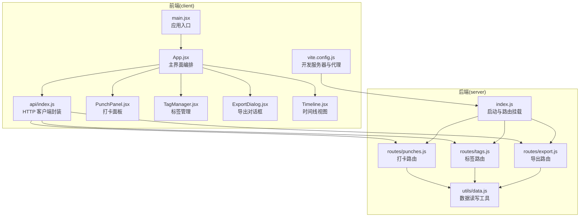
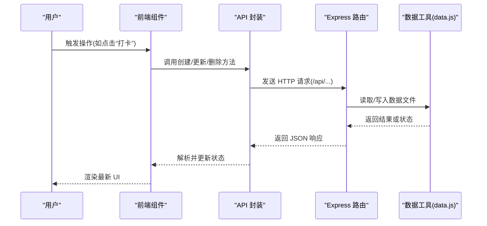
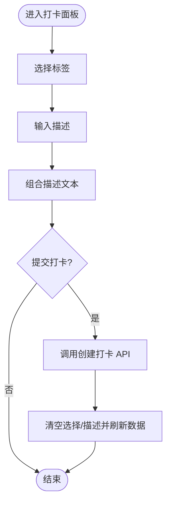
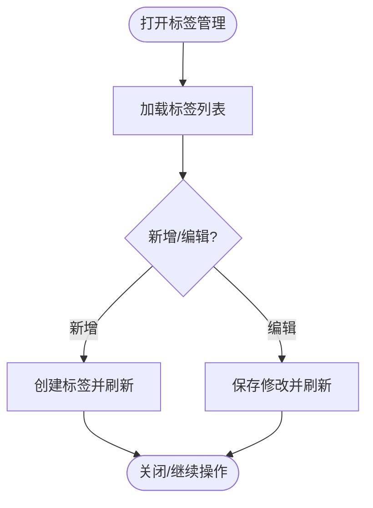
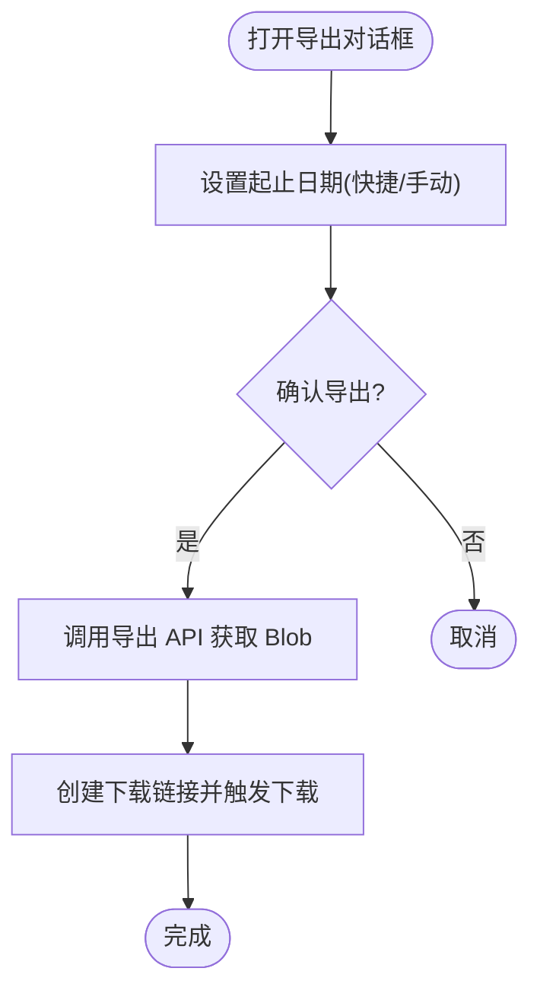
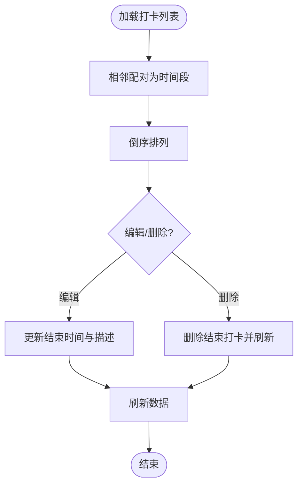
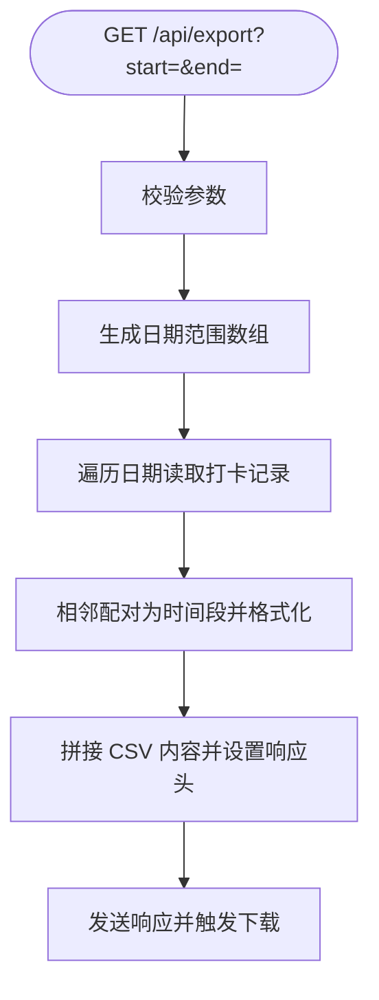
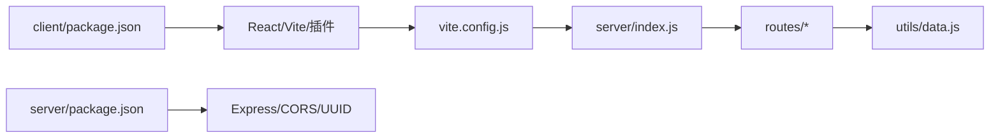

# 开发指南

<cite>
**本文引用的文件**
- [client/package.json](file://client/package.json)
- [server/package.json](file://server/package.json)
- [client/vite.config.js](file://client/vite.config.js)
- [server/index.js](file://server/index.js)
- [client/src/main.jsx](file://client/src/main.jsx)
- [client/src/App.jsx](file://client/src/App.jsx)
- [client/src/api/index.js](file://client/src/api/index.js)
- [server/utils/data.js](file://server/utils/data.js)
- [server/routes/punches.js](file://server/routes/punches.js)
- [server/routes/tags.js](file://server/routes/tags.js)
- [server/routes/export.js](file://server/routes/export.js)
- [client/src/components/PunchPanel.jsx](file://client/src/components/PunchPanel.jsx)
- [client/src/components/TagManager.jsx](file://client/src/components/TagManager.jsx)
- [client/src/components/ExportDialog.jsx](file://client/src/components/ExportDialog.jsx)
- [client/src/components/Timeline.jsx](file://client/src/components/Timeline.jsx)
</cite>

## 目录
1. [简介](#简介)
2. [项目结构](#项目结构)
3. [核心组件](#核心组件)
4. [架构总览](#架构总览)
5. [详细组件分析](#详细组件分析)
6. [依赖关系分析](#依赖关系分析)
7. [性能与优化](#性能与优化)
8. [测试策略](#测试策略)
9. [开发工作流与分支管理](#开发工作流与分支管理)
10. [代码审查标准](#代码审查标准)
11. [新功能开发流程](#新功能开发流程)
12. [调试指南](#调试指南)
13. [错误处理与日志规范](#错误处理与日志规范)
14. [扩展与集成指南](#扩展与集成指南)
15. [代码贡献与维护策略](#代码贡献与维护策略)
16. [结论](#结论)

## 简介
本指南面向 taskRecordre 项目团队成员，系统性阐述开发规范、组件开发流程、测试策略、工作流与分支管理、代码审查标准、新功能开发全流程、性能优化、安全与调试、错误处理与日志规范，以及如何扩展现有功能、新增 API 端点与集成第三方服务。目标是帮助开发者快速上手并高质量交付功能。

## 项目结构
项目采用前后端分离架构：
- 前端使用 Vite + React，通过代理访问后端服务。
- 后端基于 Express，提供打卡、标签与导出相关接口，并以本地 JSON 文件作为简易存储。
- 数据按日期分文件存储，标签统一存储于 tags.json。

图表来源
- [client/src/main.jsx:1-11](file://client/src/main.jsx#L1-L11)
- [client/src/App.jsx:1-86](file://client/src/App.jsx#L1-L86)
- [client/src/api/index.js:1-75](file://client/src/api/index.js#L1-L75)
- [client/vite.config.js:1-15](file://client/vite.config.js#L1-L15)
- [server/index.js:1-35](file://server/index.js#L1-L35)
- [server/routes/punches.js:1-117](file://server/routes/punches.js#L1-L117)
- [server/routes/tags.js:1-75](file://server/routes/tags.js#L1-L75)
- [server/routes/export.js:1-88](file://server/routes/export.js#L1-L88)
- [server/utils/data.js:1-57](file://server/utils/data.js#L1-L57)

章节来源
- [client/package.json:1-20](file://client/package.json#L1-L20)
- [server/package.json:1-15](file://server/package.json#L1-L15)
- [client/vite.config.js:1-15](file://client/vite.config.js#L1-L15)
- [server/index.js:1-35](file://server/index.js#L1-L35)

## 核心组件
- 应用入口与主界面：负责初始化渲染、加载标签与打卡数据、编排各子组件。
- API 封装层：统一处理请求、响应与错误，便于前端调用。
- 组件层：打卡面板、标签管理、导出对话框、时间线视图。
- 路由层：提供打卡、标签、导出的 REST 接口。
- 工具层：封装本地数据读写，按日期拆分文件。

章节来源
- [client/src/main.jsx:1-11](file://client/src/main.jsx#L1-L11)
- [client/src/App.jsx:1-86](file://client/src/App.jsx#L1-L86)
- [client/src/api/index.js:1-75](file://client/src/api/index.js#L1-L75)
- [server/routes/punches.js:1-117](file://server/routes/punches.js#L1-L117)
- [server/routes/tags.js:1-75](file://server/routes/tags.js#L1-L75)
- [server/routes/export.js:1-88](file://server/routes/export.js#L1-L88)
- [server/utils/data.js:1-57](file://server/utils/data.js#L1-L57)

## 架构总览
前后端交互通过 /api 前缀进行，前端通过代理将请求转发至后端服务。后端路由根据资源类型分发到对应模块，数据持久化通过工具函数读写本地 JSON 文件。

图表来源
- [client/src/api/index.js:1-75](file://client/src/api/index.js#L1-L75)
- [server/index.js:1-35](file://server/index.js#L1-L35)
- [server/routes/punches.js:1-117](file://server/routes/punches.js#L1-L117)
- [server/routes/tags.js:1-75](file://server/routes/tags.js#L1-L75)
- [server/routes/export.js:1-88](file://server/routes/export.js#L1-L88)
- [server/utils/data.js:1-57](file://server/utils/data.js#L1-L57)

## 详细组件分析

### 打卡面板（PunchPanel）
- 功能要点
  - 多标签选择与描述组合，生成最终描述文本。
  - 创建打卡记录，清空选择并回调刷新数据。
  - 将输入描述保存为新标签并刷新标签列表。
- 关键流程

图表来源
- [client/src/components/PunchPanel.jsx:1-119](file://client/src/components/PunchPanel.jsx#L1-L119)
- [client/src/api/index.js:1-75](file://client/src/api/index.js#L1-L75)

章节来源
- [client/src/components/PunchPanel.jsx:1-119](file://client/src/components/PunchPanel.jsx#L1-L119)
- [client/src/api/index.js:1-75](file://client/src/api/index.js#L1-L75)

### 标签管理（TagManager）
- 功能要点
  - 加载、新增、编辑、删除标签；支持颜色选择。
  - 新增/编辑后刷新标签列表并通知父组件更新。
- 关键流程

图表来源
- [client/src/components/TagManager.jsx:1-135](file://client/src/components/TagManager.jsx#L1-L135)
- [client/src/api/index.js:1-75](file://client/src/api/index.js#L1-L75)

章节来源
- [client/src/components/TagManager.jsx:1-135](file://client/src/components/TagManager.jsx#L1-L135)
- [client/src/api/index.js:1-75](file://client/src/api/index.js#L1-L75)

### 导出对话框（ExportDialog）
- 功能要点
  - 支持选择起止日期，快捷设置“今天/本周”，触发 CSV 导出下载。
- 关键流程

图表来源
- [client/src/components/ExportDialog.jsx:1-98](file://client/src/components/ExportDialog.jsx#L1-L98)
- [client/src/api/index.js:1-75](file://client/src/api/index.js#L1-L75)

章节来源
- [client/src/components/ExportDialog.jsx:1-98](file://client/src/components/ExportDialog.jsx#L1-L98)
- [client/src/api/index.js:1-75](file://client/src/api/index.js#L1-L75)

### 时间线视图（Timeline）
- 功能要点
  - 将相邻打卡配对为时间段，计算时长，支持编辑描述与结束时间、删除时间段。
  - 列表倒序展示，最新的在上方。
- 关键流程

图表来源
- [client/src/components/Timeline.jsx:1-138](file://client/src/components/Timeline.jsx#L1-L138)
- [client/src/api/index.js:1-75](file://client/src/api/index.js#L1-L75)

章节来源
- [client/src/components/Timeline.jsx:1-138](file://client/src/components/Timeline.jsx#L1-L138)
- [client/src/api/index.js:1-75](file://client/src/api/index.js#L1-L75)

### 后端路由与数据层
- 路由职责
  - 打卡路由：查询、创建、更新、删除打卡记录。
  - 标签路由：查询、创建、更新、删除标签。
  - 导出路由：按日期范围聚合数据，生成 CSV 并下载。
- 数据层
  - 以日期命名的 JSON 文件存储当日打卡记录；标签统一存储于 tags.json。
- 关键流程（导出）

图表来源
- [server/routes/export.js:1-88](file://server/routes/export.js#L1-L88)
- [server/utils/data.js:1-57](file://server/utils/data.js#L1-L57)

章节来源
- [server/routes/punches.js:1-117](file://server/routes/punches.js#L1-L117)
- [server/routes/tags.js:1-75](file://server/routes/tags.js#L1-L75)
- [server/routes/export.js:1-88](file://server/routes/export.js#L1-L88)
- [server/utils/data.js:1-57](file://server/utils/data.js#L1-L57)

## 依赖关系分析
- 前端依赖
  - React 生态与 Vite 构建工具；开发服务器通过代理转发 /api 请求至后端。
- 后端依赖
  - Express 提供 Web 服务；CORS 允许跨域；UUID 用于生成唯一标识；文件系统用于本地数据持久化。

图表来源
- [client/package.json:1-20](file://client/package.json#L1-L20)
- [server/package.json:1-15](file://server/package.json#L1-L15)
- [client/vite.config.js:1-15](file://client/vite.config.js#L1-L15)
- [server/index.js:1-35](file://server/index.js#L1-L35)
- [server/utils/data.js:1-57](file://server/utils/data.js#L1-L57)

章节来源
- [client/package.json:1-20](file://client/package.json#L1-L20)
- [server/package.json:1-15](file://server/package.json#L1-L15)
- [client/vite.config.js:1-15](file://client/vite.config.js#L1-L15)
- [server/index.js:1-35](file://server/index.js#L1-L35)

## 性能与优化
- 前端
  - 使用 React 的 useCallback/useState 合理控制重渲染；避免不必要的状态提升。
  - 在导出等批量数据处理时，尽量减少 DOM 操作与重复计算。
- 后端
  - 读写 JSON 文件为同步操作，建议在高并发场景引入缓存或数据库替换。
  - 对日期范围导出逻辑进行分页/节流，避免一次性处理过多日期导致阻塞。
- 通用
  - 代理仅用于开发环境，生产部署需配置反向代理与静态资源服务。

## 测试策略
- 单元测试
  - 对工具函数（如日期提取、时间格式化、CSV 转义）编写断言，覆盖边界值与异常路径。
- 接口测试
  - 使用工具对 /api/punches、/api/tags、/api/export 进行端到端验证，包括参数校验、状态码与响应体。
- 前端组件测试
  - 使用测试框架模拟用户交互（点击、输入、键盘事件），断言状态变更与 API 调用次数。
- 数据一致性测试
  - 在导出前后的数据读写一致性进行回归，确保文件内容与内存状态一致。

## 开发工作流与分支管理
- 分支模型
  - 主分支：稳定版本，仅合并经审查的特性分支。
  - 特性分支：按功能拆分，如 feature/add-tag-color、feature/export-range。
  - 预发布分支：临近发布时创建，修复关键问题。
- 提交规范
  - 类型：feat、fix、docs、style、refactor、test、chore
  - 示例：feat(punch): 新增标签颜色自动分配
- 合并与发布
  - 合并前必须通过 CI 与代码审查；发布前更新版本号与变更日志。

## 代码审查标准
- 代码质量
  - 函数单一职责；变量命名清晰；注释简洁明确。
- 安全
  - 输入校验与参数过滤；避免明文敏感信息；限制文件写入范围。
- 可维护性
  - 易于测试；错误处理完备；日志可追踪。
- 性能
  - 避免阻塞主线程；合理使用缓存；减少不必要 IO。

## 新功能开发流程
- 需求分析
  - 明确用户场景、边界条件与数据模型。
- 设计
  - 前后端接口设计（RESTful 资源与字段）、组件拆分与状态设计。
- 实现
  - 先实现后端路由与数据工具，再实现前端组件与 API 调用。
- 测试
  - 补充单元与集成测试，覆盖正常与异常路径。
- 文档与发布
  - 更新 README 与变更日志，走分支合并与发布流程。

## 调试指南
- 前端
  - 使用浏览器开发者工具检查网络请求与响应；在组件中打印关键状态；利用 React DevTools 检查渲染树。
- 后端
  - 在关键节点输出日志；使用 curl 或 Postman 验证接口；检查 data 目录权限与文件是否存在。
- 代理与跨域
  - 确认 Vite 代理配置正确；检查 CORS 是否允许前端来源。

## 错误处理与日志规范
- 前端
  - 对 API 调用进行 try/catch；对非 2xx 状态抛出可读错误；在 UI 上给出明确提示。
- 后端
  - 参数缺失与业务异常返回 400/404/409 等语义化状态码；记录请求方法、路径与关键参数。
- 日志
  - 统一输出格式（时间戳、级别、消息、上下文），避免敏感信息泄露。

## 扩展与集成指南
- 扩展现有功能
  - 在现有路由与组件基础上增加字段或行为，保持接口兼容。
- 新增 API 端点
  - 在 server/routes 下新增路由模块，注册到 server/index.js；在 server/utils/data.js 中完善数据读写。
- 集成第三方服务
  - 如需云存储或数据库，先在工具层抽象数据接口，再替换实现；保持对外路由不变。

## 代码贡献与维护策略
- 贡献流程
  - Fork 仓库 -> 创建特性分支 -> 提交更改 -> 发起 Pull Request -> 审查与合并。
- 维护策略
  - 定期升级依赖；修复安全漏洞；补充测试覆盖率；持续重构以降低耦合度。

## 结论
本指南提供了从架构理解、组件开发、测试策略到工作流与维护的完整路径。请严格遵循规范与审查标准，确保代码质量与团队协作效率。