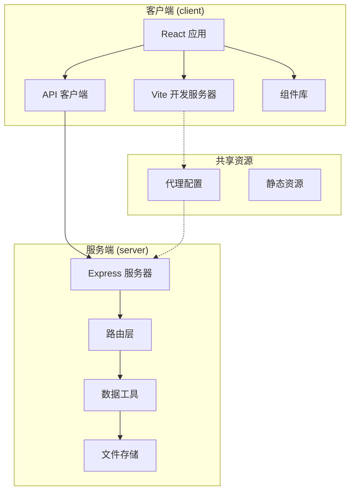
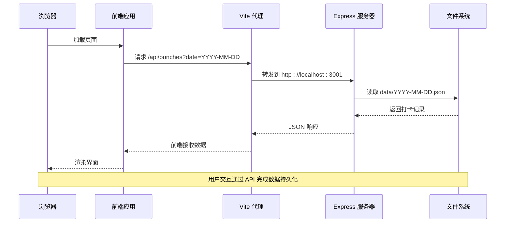
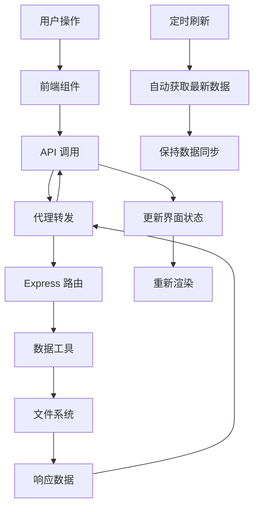

# 快速开始

<cite>
**本文档引用的文件**
- [client/package.json](file://client/package.json)
- [server/package.json](file://server/package.json)
- [client/vite.config.js](file://client/vite.config.js)
- [server/index.js](file://server/index.js)
- [client/src/main.jsx](file://client/src/main.jsx)
- [client/src/App.jsx](file://client/src/App.jsx)
- [client/src/api/index.js](file://client/src/api/index.js)
- [server/routes/punches.js](file://server/routes/punches.js)
- [server/utils/data.js](file://server/utils/data.js)
- [client/src/components/PunchPanel.jsx](file://client/src/components/PunchPanel.jsx)
- [client/src/components/TagManager.jsx](file://client/src/components/TagManager.jsx)
- [server/routes/tags.js](file://server/routes/tags.js)
- [server/routes/export.js](file://server/routes/export.js)
- [client/index.html](file://client/index.html)
</cite>

## 目录
1. [简介](#简介)
2. [开发环境要求](#开发环境要求)
3. [项目结构概览](#项目结构概览)
4. [本地环境搭建](#本地环境搭建)
5. [核心功能与运行原理](#核心功能与运行原理)
6. [常见问题与解决方案](#常见问题与解决方案)
7. [调试技巧与故障排除](#调试技巧与故障排除)
8. [总结](#总结)

## 简介

taskRecordre 是一个基于 React + Express 的时间打卡记录系统。该项目采用前后端分离架构，前端使用 Vite + React 构建现代化的用户界面，后端使用 Express 提供 RESTful API 接口，数据以 JSON 文件形式存储在本地文件系统中。

该系统允许用户：
- 记录工作时间的开始和结束
- 使用标签分类不同的工作内容
- 查看和管理打卡历史
- 导出 CSV 格式的统计报表

## 开发环境要求

### 系统要求
- **操作系统**: Windows 10/11、macOS 10.15+、Linux Ubuntu 18.04+
- **内存**: 至少 4GB RAM
- **磁盘空间**: 至少 500MB 可用空间

### 软件依赖
- **Node.js**: 18.x 或更高版本（推荐 18.17.0+）
- **npm**: 8.x 或更高版本
- **Git**: 可选（用于代码版本控制）

### 验证环境
```bash
# 检查 Node.js 版本
node --version

# 检查 npm 版本  
npm --version

# 检查 Git（可选）
git --version
```

**章节来源**
- [client/package.json:1-20](file://client/package.json#L1-L20)
- [server/package.json:1-15](file://server/package.json#L1-L15)

## 项目结构概览



**图表来源**
- [client/src/main.jsx:1-11](file://client/src/main.jsx#L1-L11)
- [server/index.js:1-35](file://server/index.js#L1-L35)
- [client/vite.config.js:1-15](file://client/vite.config.js#L1-L15)

### 目录结构说明
- **client/**: 前端 React 应用源码
  - `src/`: 源代码目录
  - `public/`: 静态资源
  - `dist/`: 构建输出目录
- **server/**: 后端 Express 服务
  - `routes/`: API 路由定义
  - `utils/`: 数据处理工具
  - `data/`: 存储目录

**章节来源**
- [client/index.html:1-14](file://client/index.html#L1-L14)
- [server/utils/data.js:1-57](file://server/utils/data.js#L1-L57)

## 本地环境搭建

### 第一步：克隆项目
```bash
# 克隆仓库（如果需要）
git clone <repository-url>
cd taskRecordre
```

### 第二步：安装依赖
```bash
# 进入客户端目录安装依赖
cd client
npm install

# 返回根目录进入服务端目录安装依赖
cd ../server
npm install

# 返回根目录
cd ..
```

### 第三步：启动开发服务器

#### 方法一：并行启动（推荐）
```bash
# 在项目根目录下执行
npm run dev
```

#### 方法二：分别启动
```bash
# 终端1：启动前端开发服务器
cd client
npm run dev

# 终端2：启动后端服务器
cd ../server
npm run dev
```

### 第四步：验证安装
- **前端**: 访问 `http://localhost:5173`
- **后端**: 访问 `http://localhost:3001`
- **API**: 访问 `http://localhost:5173/api/punches`

**章节来源**
- [client/package.json:6-10](file://client/package.json#L6-L10)
- [server/package.json:5-8](file://server/package.json#L5-L8)
- [client/vite.config.js:6-13](file://client/vite.config.js#L6-L13)

## 核心功能与运行原理

### 系统架构图



**图表来源**
- [client/src/api/index.js:1-75](file://client/src/api/index.js#L1-L75)
- [server/index.js:24-30](file://server/index.js#L24-L30)
- [server/utils/data.js:17-34](file://server/utils/data.js#L17-L34)

### 数据流分析



**图表来源**
- [client/src/App.jsx:17-38](file://client/src/App.jsx#L17-L38)
- [server/routes/punches.js:33-37](file://server/routes/punches.js#L33-L37)

### 主要功能模块

#### 1. 打卡面板 (PunchPanel)
- 支持标签选择和描述输入
- 实时标签保存功能
- 响应式设计和加载状态

#### 2. 标签管理系统 (TagManager)
- 标签的增删改查
- 自动颜色生成算法
- 颜色可视化管理

#### 3. 时间线展示 (Timeline)
- 按时间排序的历史记录
- 交互式编辑和删除

#### 4. 导出功能 (ExportDialog)
- CSV 格式导出
- 时间段配对计算
- 文件下载功能

**章节来源**
- [client/src/components/PunchPanel.jsx:1-119](file://client/src/components/PunchPanel.jsx#L1-L119)
- [client/src/components/TagManager.jsx:1-135](file://client/src/components/TagManager.jsx#L1-L135)
- [server/routes/export.js:46-85](file://server/routes/export.js#L46-L85)

## 常见问题与解决方案

### 端口冲突问题

**问题**: 端口被占用导致启动失败
```bash
# 错误示例
Error: listen EADDRINUSE: address already in use :::5173
```

**解决方案**:
1. 修改前端端口配置
```javascript
// client/vite.config.js
export default defineConfig({
  server: {
    port: 5174, // 更改为其他可用端口
    proxy: {
      '/api': {
        target: 'http://localhost:3001',
        changeOrigin: true
      }
    }
  }
})
```

2. 关闭占用端口的进程
```bash
# Windows
netstat -ano | findstr :5173
taskkill /PID <进程ID> /F

# macOS/Linux
lsof -i :5173
kill -9 <进程ID>
```

### 跨域请求问题

**问题**: 前端无法访问后端 API
```javascript
// 错误信息
CORS policy: No 'Access-Control-Allow-Origin' header present
```

**解决方案**:
检查代理配置是否正确
```javascript
// client/vite.config.js
export default defineConfig({
  server: {
    proxy: {
      '/api': {
        target: 'http://localhost:3001',
        changeOrigin: true,
        secure: false,
        rewrite: (path) => path.replace(/^\/api/, '/api')
      }
    }
  }
})
```

### 数据文件权限问题

**问题**: 无法创建或写入数据文件
```javascript
// 错误信息
Error: EACCES: permission denied
```

**解决方案**:
1. 检查 data 目录权限
2. 以管理员权限运行
3. 更换存储位置

### 依赖安装失败

**问题**: npm install 失败
```bash
# 常见错误
npm ERR! peer dep missing
npm ERR! EBADPLATFORM
```

**解决方案**:
1. 清理缓存
```bash
npm cache clean --force
rm -rf node_modules package-lock.json
npm install
```

2. 升级 npm 版本
```bash
npm install -g npm@latest
```

3. 使用淘宝镜像源
```bash
npm config set registry https://registry.npmmirror.com/
```

**章节来源**
- [client/vite.config.js:7-12](file://client/vite.config.js#L7-L12)
- [server/index.js:20-21](file://server/index.js#L20-L21)

## 调试技巧与故障排除

### 前端调试

#### 控制台调试
```javascript
// 在组件中添加调试信息
console.log('组件挂载', props);
console.log('状态变化', state);

// API 调用调试
async function debugAPI() {
  try {
    const response = await fetch('/api/punches');
    console.log('响应状态', response.status);
    console.log('响应头', response.headers);
    const data = await response.json();
    console.log('响应数据', data);
  } catch (error) {
    console.error('API 调用失败', error);
  }
}
```

#### 网络请求监控
1. 打开浏览器开发者工具
2. 切换到 Network 标签
3. 观察 API 请求状态和响应

### 后端调试

#### 日志输出
```javascript
// 在路由中添加详细日志
router.get('/', (req, res) => {
  console.log('收到请求:', req.url);
  console.log('查询参数:', req.query);
  
  const date = req.query.date || getTodayDate();
  const records = readDayFile(date);
  
  console.log('返回数据:', records);
  res.json(records);
});
```

#### 错误处理
```javascript
// 统一错误处理中间件
app.use((error, req, res, next) => {
  console.error('服务器错误:', error);
  res.status(500).json({
    error: '服务器内部错误',
    message: process.env.NODE_ENV === 'development' ? error.message : '请稍后重试'
  });
});
```

### 性能优化建议

#### 前端性能
1. **懒加载组件**: 对不常用的组件使用动态导入
2. **虚拟滚动**: 对大量数据使用虚拟滚动
3. **状态优化**: 使用 React.memo 和 useMemo 优化渲染

#### 后端性能
1. **文件缓存**: 缓存常用的数据文件
2. **批量操作**: 支持批量数据处理
3. **连接池**: 使用数据库连接池（如需）

### 开发最佳实践

#### 代码组织
```javascript
// API 客户端模块化
// client/src/api/punches.js
export async function getPunches(date) {
  const response = await fetch(`/api/punches?date=${date}`);
  if (!response.ok) {
    throw new Error(`HTTP error! status: ${response.status}`);
  }
  return response.json();
}

// 错误边界处理
function ErrorBoundary({ children }) {
  const [hasError, setHasError] = useState(false);
  
  if (hasError) {
    return <div>发生错误，请刷新页面</div>;
  }
  
  return children;
}
```

#### 环境配置
```javascript
// 开发环境配置
const config = {
  development: {
    apiUrl: 'http://localhost:3001',
    debug: true
  },
  production: {
    apiUrl: '/api',
    debug: false
  }
};
```

**章节来源**
- [client/src/App.jsx:17-38](file://client/src/App.jsx#L17-L38)
- [server/routes/punches.js:33-37](file://server/routes/punches.js#L33-L37)

## 总结

taskRecordre 项目提供了完整的时间打卡记录解决方案，具有以下特点：

### 技术优势
- **现代化技术栈**: React + Express + Vite
- **前后端分离**: 清晰的职责划分
- **数据持久化**: 基于文件系统的简单可靠存储
- **响应式设计**: 适配多种设备屏幕

### 快速上手要点
1. **环境准备**: 确保 Node.js 18+ 版本
2. **依赖安装**: 两个目录分别执行 npm install
3. **启动服务**: 使用 npm run dev 并行启动
4. **验证功能**: 访问 http://localhost:5173 测试基本功能

### 预期用户界面效果
- **主界面**: 清晰的打卡面板和时间线展示
- **标签系统**: 可视化的标签管理和颜色区分
- **导出功能**: CSV 文件格式的统计报表
- **响应式布局**: 移动端友好体验

按照本指南操作，新开发者应该能够在 15 分钟内成功运行整个项目，并开始进行功能测试和二次开发。