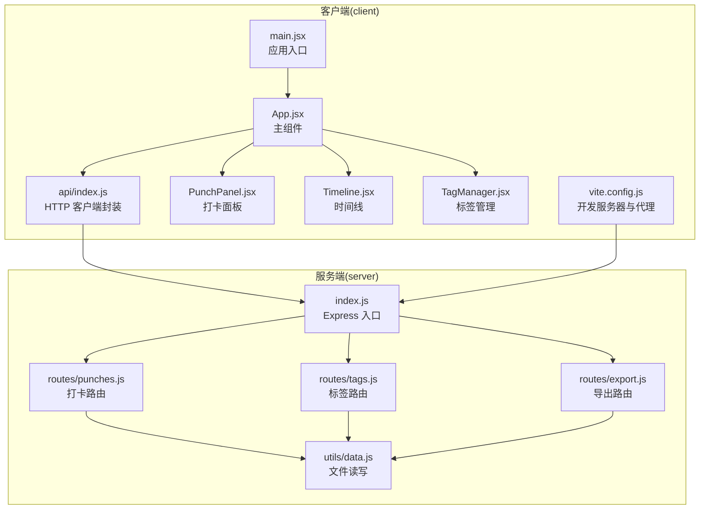
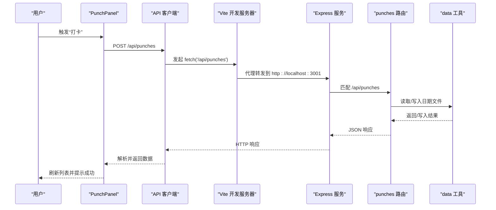
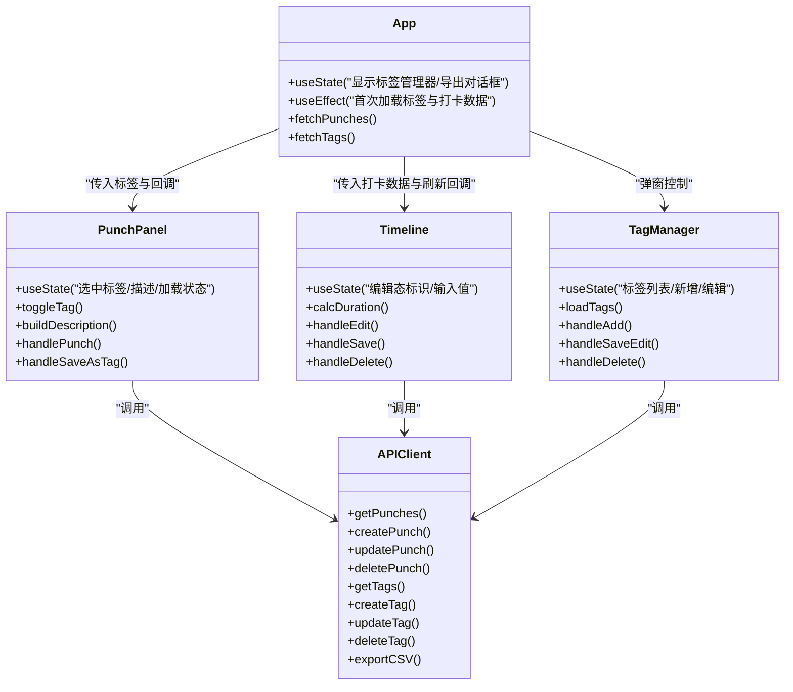
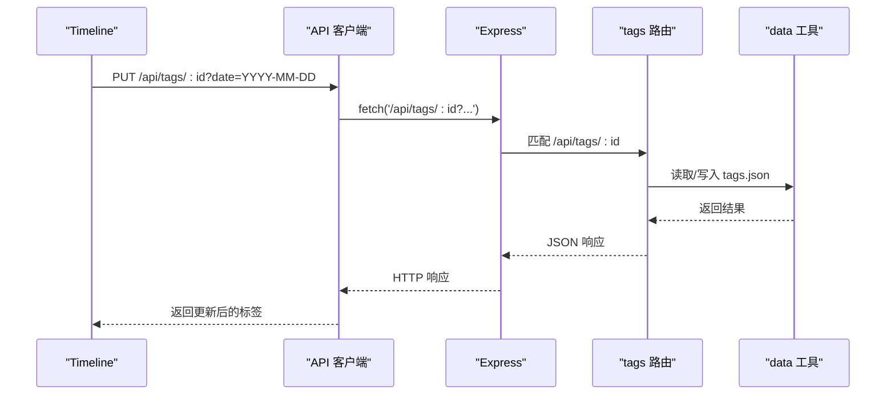
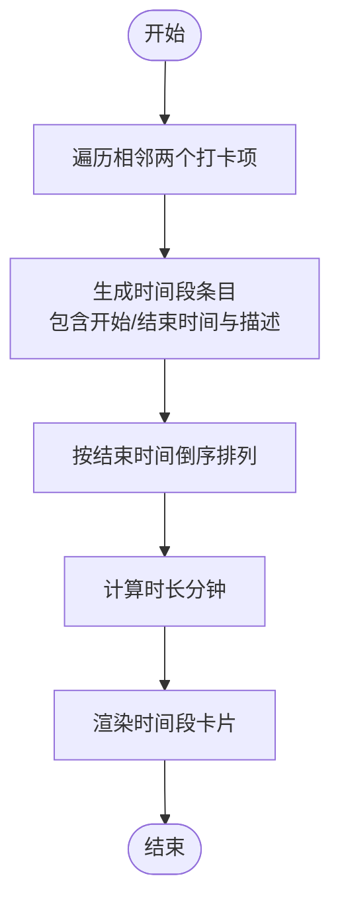
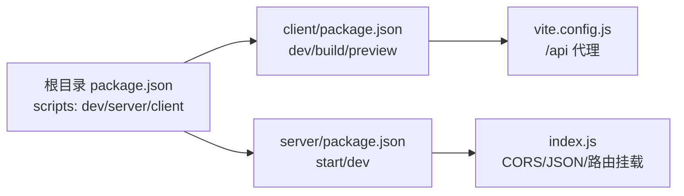

# 故障排除与常见问题

<cite>
**本文引用的文件**
- [client/src/main.jsx](file://client/src/main.jsx)
- [client/src/App.jsx](file://client/src/App.jsx)
- [client/src/api/index.js](file://client/src/api/index.js)
- [client/vite.config.js](file://client/vite.config.js)
- [client/src/components/PunchPanel.jsx](file://client/src/components/PunchPanel.jsx)
- [client/src/components/Timeline.jsx](file://client/src/components/Timeline.jsx)
- [client/src/components/TagManager.jsx](file://client/src/components/TagManager.jsx)
- [server/index.js](file://server/index.js)
- [server/routes/punches.js](file://server/routes/punches.js)
- [server/utils/data.js](file://server/utils/data.js)
- [server/routes/tags.js](file://server/routes/tags.js)
- [server/routes/export.js](file://server/routes/export.js)
- [package.json](file://package.json)
- [client/package.json](file://client/package.json)
- [server/package.json](file://server/package.json)
</cite>

## 目录
1. [简介](#简介)
2. [项目结构](#项目结构)
3. [核心组件](#核心组件)
4. [架构总览](#架构总览)
5. [详细组件分析](#详细组件分析)
6. [依赖关系分析](#依赖关系分析)
7. [性能考虑](#性能考虑)
8. [故障排除指南](#故障排除指南)
9. [结论](#结论)
10. [附录](#附录)

## 简介
本文件面向 taskRecordre 项目的开发者与运维人员，提供一套系统化的故障排除与常见问题解答。内容覆盖开发、测试与生产环境中的网络请求失败、API 调用错误、组件渲染问题、数据同步异常等场景，并给出调试工具使用、日志分析、性能排查、浏览器与移动端兼容性、跨域处理、内存泄漏与并发冲突识别与缓解策略，以及预防性维护与健康检查清单。

## 项目结构
- 客户端采用 Vite + React 架构，通过代理将 /api 请求转发至本地服务端。
- 服务端基于 Express，提供打卡、标签与导出三个子路由，数据以 JSON 文件形式按日期存储于 server/data 目录。
- 顶层脚本通过 concurrently 同时启动前端与后端，便于本地联调。

图表来源
- [client/src/main.jsx:1-11](file://client/src/main.jsx#L1-L11)
- [client/src/App.jsx:1-86](file://client/src/App.jsx#L1-L86)
- [client/src/api/index.js:1-75](file://client/src/api/index.js#L1-L75)
- [client/vite.config.js:1-15](file://client/vite.config.js#L1-L15)
- [server/index.js:1-35](file://server/index.js#L1-L35)
- [server/routes/punches.js:1-117](file://server/routes/punches.js#L1-L117)
- [server/utils/data.js:1-57](file://server/utils/data.js#L1-L57)
- [server/routes/tags.js:1-75](file://server/routes/tags.js#L1-L75)
- [server/routes/export.js:1-88](file://server/routes/export.js#L1-L88)

章节来源
- [package.json:1-14](file://package.json#L1-L14)
- [client/package.json:1-20](file://client/package.json#L1-L20)
- [server/package.json:1-15](file://server/package.json#L1-L15)

## 核心组件
- 应用入口与主组件：负责初始化状态、拉取初始数据、组织页面布局与弹窗控制。
- API 客户端：统一封装 /api 前缀的请求，集中处理响应状态与错误抛出。
- 打卡面板：支持标签选择、描述输入、保存为标签、触发打卡并刷新数据。
- 时间线：将相邻打卡配对为时间段，支持编辑描述与结束时间、删除时间段并触发刷新。
- 标签管理：提供增删改查标签能力，变更后通知父组件刷新标签列表。
- 服务端路由与数据层：提供 CRUD 接口、CSV 导出、按日期文件存储，保证数据一致性与排序。

章节来源
- [client/src/App.jsx:1-86](file://client/src/App.jsx#L1-L86)
- [client/src/api/index.js:1-75](file://client/src/api/index.js#L1-L75)
- [client/src/components/PunchPanel.jsx:1-119](file://client/src/components/PunchPanel.jsx#L1-L119)
- [client/src/components/Timeline.jsx:1-138](file://client/src/components/Timeline.jsx#L1-L138)
- [client/src/components/TagManager.jsx:1-135](file://client/src/components/TagManager.jsx#L1-L135)
- [server/routes/punches.js:1-117](file://server/routes/punches.js#L1-L117)
- [server/routes/tags.js:1-75](file://server/routes/tags.js#L1-L75)
- [server/routes/export.js:1-88](file://server/routes/export.js#L1-L88)
- [server/utils/data.js:1-57](file://server/utils/data.js#L1-L57)

## 架构总览
下图展示了从用户交互到数据持久化的完整链路，包括代理转发、路由分发、数据读写与响应返回。

图表来源
- [client/src/components/PunchPanel.jsx:28-45](file://client/src/components/PunchPanel.jsx#L28-L45)
- [client/src/api/index.js:9-17](file://client/src/api/index.js#L9-L17)
- [client/vite.config.js:6-12](file://client/vite.config.js#L6-L12)
- [server/index.js:16-34](file://server/index.js#L16-L34)
- [server/routes/punches.js:39-60](file://server/routes/punches.js#L39-L60)
- [server/utils/data.js:17-34](file://server/utils/data.js#L17-L34)

## 详细组件分析

### 组件类图（代码级）

图表来源
- [client/src/App.jsx:10-86](file://client/src/App.jsx#L10-L86)
- [client/src/components/PunchPanel.jsx:4-119](file://client/src/components/PunchPanel.jsx#L4-L119)
- [client/src/components/Timeline.jsx:4-138](file://client/src/components/Timeline.jsx#L4-L138)
- [client/src/components/TagManager.jsx:5-135](file://client/src/components/TagManager.jsx#L5-L135)
- [client/src/api/index.js:1-75](file://client/src/api/index.js#L1-L75)

章节来源
- [client/src/App.jsx:1-86](file://client/src/App.jsx#L1-L86)
- [client/src/components/PunchPanel.jsx:1-119](file://client/src/components/PunchPanel.jsx#L1-L119)
- [client/src/components/Timeline.jsx:1-138](file://client/src/components/Timeline.jsx#L1-L138)
- [client/src/components/TagManager.jsx:1-135](file://client/src/components/TagManager.jsx#L1-L135)
- [client/src/api/index.js:1-75](file://client/src/api/index.js#L1-L75)

### API 调用序列（时间线编辑）

图表来源
- [client/src/components/Timeline.jsx:46-57](file://client/src/components/Timeline.jsx#L46-L57)
- [client/src/api/index.js:52-60](file://client/src/api/index.js#L52-L60)
- [server/routes/tags.js:41-57](file://server/routes/tags.js#L41-L57)
- [server/utils/data.js:40-56](file://server/utils/data.js#L40-L56)

### 数据流与排序算法（时间线配对）

图表来源
- [client/src/components/Timeline.jsx:9-29](file://client/src/components/Timeline.jsx#L9-L29)
- [client/src/components/Timeline.jsx:81-134](file://client/src/components/Timeline.jsx#L81-L134)

## 依赖关系分析
- 前端依赖：React、Vite、@vitejs/plugin-react；开发时通过 concurrently 并行启动前后端。
- 后端依赖：Express、CORS、UUID；通过中间件启用跨域与 JSON 解析。
- 代理配置：Vite 将 /api 前缀代理到本地服务端口，避免开发环境跨域问题。

图表来源
- [package.json:5-8](file://package.json#L5-L8)
- [client/package.json:6-10](file://client/package.json#L6-L10)
- [server/package.json:5-8](file://server/package.json#L5-L8)
- [client/vite.config.js:6-12](file://client/vite.config.js#L6-L12)
- [server/index.js:16-34](file://server/index.js#L16-L34)

章节来源
- [package.json:1-14](file://package.json#L1-L14)
- [client/package.json:1-20](file://client/package.json#L1-L20)
- [server/package.json:1-15](file://server/package.json#L1-L15)
- [client/vite.config.js:1-15](file://client/vite.config.js#L1-L15)
- [server/index.js:1-35](file://server/index.js#L1-L35)

## 性能考虑
- 数据读写为同步文件操作，单机小规模数据可用；若并发高或数据量大，建议引入数据库与连接池，或在服务端增加锁机制与队列。
- 时间线渲染涉及相邻配对与排序，复杂度 O(n)；当 n 较大时，建议虚拟滚动与分页加载。
- 导出 CSV 为一次性生成，时间复杂度 O(n log n)（排序）+ O(n)（拼接），建议后台任务与异步导出，前端轮询或消息通知。
- 打卡/标签变更后立即刷新，避免重复请求；可通过防抖与去抖减少频繁刷新带来的抖动。

## 故障排除指南

### 一、网络请求失败与跨域问题
- 症状
  - 控制台出现跨域错误或 404/500。
  - 本地开发时 /api 请求无法到达服务端。
- 诊断步骤
  - 确认 Vite 代理已启用且目标地址正确。
  - 确认服务端已启用 CORS 中间件。
  - 使用浏览器 Network 面板查看请求是否被代理转发。
- 解决方案
  - 在开发环境下保持代理配置不变；生产环境需在反向代理处开启 CORS。
  - 如需自定义 CORS 策略，可在服务端调整 CORS 配置。

章节来源
- [client/vite.config.js:6-12](file://client/vite.config.js#L6-L12)
- [server/index.js:20-21](file://server/index.js#L20-L21)

### 二、API 调用错误
- 常见错误类型
  - 参数缺失：如更新/删除打卡未携带日期查询参数。
  - 资源不存在：如按 ID 查找失败。
  - 响应非 OK：fetch 对非 2xx 抛错。
- 诊断方法
  - 检查请求路径、方法与查询参数。
  - 在 API 客户端捕获异常并打印堆栈。
  - 使用服务端日志定位具体路由与数据层错误。
- 解决方案
  - 补齐必填字段与校验逻辑。
  - 在前端统一处理 4xx/5xx 并提示用户。

章节来源
- [client/src/api/index.js:3-7](file://client/src/api/index.js#L3-L7)
- [client/src/api/index.js:19-27](file://client/src/api/index.js#L19-L27)
- [client/src/api/index.js:62-67](file://client/src/api/index.js#L62-L67)
- [server/routes/punches.js:63-101](file://server/routes/punches.js#L63-L101)
- [server/routes/tags.js:42-57](file://server/routes/tags.js#L42-L57)

### 三、组件渲染问题
- 症状
  - 首次加载空白、标签不显示、时间线为空。
- 诊断步骤
  - 检查 App 初始化时是否调用获取标签与打卡数据。
  - 检查 PunchPanel 的标签列表 props 是否传递正确。
  - 检查 Timeline 的 punches 是否按预期配对。
- 解决方案
  - 确保 useEffect 正确执行并设置状态。
  - 确保数据排序与相邻配对逻辑正常。

章节来源
- [client/src/App.jsx:35-38](file://client/src/App.jsx#L35-L38)
- [client/src/components/PunchPanel.jsx:67-86](file://client/src/components/PunchPanel.jsx#L67-L86)
- [client/src/components/Timeline.jsx:9-20](file://client/src/components/Timeline.jsx#L9-L20)

### 四、数据同步异常
- 症状
  - 刷新后数据未更新、编辑无效、删除后仍可见。
- 诊断步骤
  - 确认调用回调（如 onDataChange/onPunch/onTagsChange）是否触发。
  - 检查服务端写入是否成功与文件是否被正确覆盖。
- 解决方案
  - 在成功分支调用回调刷新数据。
  - 服务端写入后确保文件落盘成功。

章节来源
- [client/src/components/PunchPanel.jsx:38-44](file://client/src/components/PunchPanel.jsx#L38-L44)
- [client/src/components/Timeline.jsx:53-69](file://client/src/components/Timeline.jsx#L53-L69)
- [client/src/components/TagManager.jsx:32-36](file://client/src/components/TagManager.jsx#L32-L36)
- [server/utils/data.js:31-34](file://server/utils/data.js#L31-L34)

### 五、调试工具与日志分析
- 浏览器端
  - 使用 DevTools Console 查看错误堆栈与 API 抛错。
  - 使用 Network 面板确认请求路径、状态码与响应体。
  - 使用 Application 面板检查本地存储与缓存。
- 服务端
  - 查看控制台输出的启动日志与错误堆栈。
  - 在路由中增加必要日志（如收到请求、读写文件、返回状态）。
- 日志要点
  - 请求参数与查询参数是否完整。
  - 文件读写是否成功、是否存在权限问题。
  - 排序与配对逻辑是否符合预期。

章节来源
- [server/index.js:32-34](file://server/index.js#L32-L34)
- [server/routes/punches.js:33-37](file://server/routes/punches.js#L33-L37)
- [server/utils/data.js:17-24](file://server/utils/data.js#L17-L24)

### 六、性能问题排查
- 症状
  - 页面卡顿、导出耗时过长、频繁刷新导致抖动。
- 排查流程
  - 使用 Performance 面板观察主线程占用。
  - 检查时间线渲染与排序是否成为瓶颈。
  - 评估导出 CSV 的数据规模与生成策略。
- 优化建议
  - 虚拟滚动与分页加载。
  - 将导出改为后台任务，前端轮询或推送通知。
  - 合并多次刷新为一次批量更新。

### 七、浏览器兼容性与移动端适配
- 兼容性
  - 确保使用现代浏览器特性（如 fetch、async/await、CSS 变量）。
  - 对旧版浏览器考虑 polyfill 或降级方案。
- 移动端
  - 输入控件（时间输入）在移动端行为差异较大，建议提供备用输入方式。
  - 触摸点击与键盘事件需同时支持，避免仅依赖鼠标。

### 八、跨域请求处理
- 开发环境
  - 通过 Vite 代理将 /api 请求转发至服务端，避免跨域。
- 生产环境
  - 在网关或反向代理上开启 CORS，允许前端域名与方法白名单。
  - 服务端中间件仅在开发环境使用，生产环境由网关统一处理。

章节来源
- [client/vite.config.js:6-12](file://client/vite.config.js#L6-L12)
- [server/index.js:20-21](file://server/index.js#L20-L21)

### 九、内存泄漏与并发访问冲突
- 内存泄漏
  - 检查是否存在未清理的定时器、事件监听器或闭包持有。
  - React 组件卸载时确保取消副作用（如未完成的请求）。
- 并发冲突
  - 多用户同时修改同一天的数据可能导致覆盖。
  - 建议引入乐观锁或版本号，或在服务端加写锁/队列。
  - 对高频写入场景，考虑引入数据库事务与重试机制。

### 十、预防性维护与健康检查清单
- 健康检查
  - 服务端启动日志是否正常。
  - /api/punches、/api/tags、/api/export 路由是否可达。
  - data 目录是否存在且可读写。
- 预防措施
  - 增加接口幂等性与参数校验。
  - 对外暴露的 API 增加速率限制与鉴权。
  - 定期备份 data 目录，防止意外丢失。
  - 对导出与大数据操作增加进度反馈与超时处理。

## 结论
本指南围绕 taskRecordre 的前端代理、服务端路由与文件存储，给出了从请求链路、组件行为到数据一致性的全栈故障排除方法。建议在开发阶段即建立完善的日志与监控，在生产阶段完善跨域与安全策略，并针对性能与并发进行持续优化与回归验证。

## 附录

### A. 常见错误对照表
- 错误类型：缺少日期参数
  - 触发位置：更新/删除打卡
  - 处理建议：在前端补齐查询参数，服务端返回明确错误信息
- 错误类型：资源不存在
  - 触发位置：按 ID 查询标签/打卡
  - 处理建议：前端提示并引导用户刷新或检查输入
- 错误类型：文件读写失败
  - 触发位置：data 工具层
  - 处理建议：检查权限、磁盘空间与路径

章节来源
- [server/routes/punches.js:67-101](file://server/routes/punches.js#L67-L101)
- [server/routes/tags.js:47-71](file://server/routes/tags.js#L47-L71)
- [server/utils/data.js:17-34](file://server/utils/data.js#L17-L34)