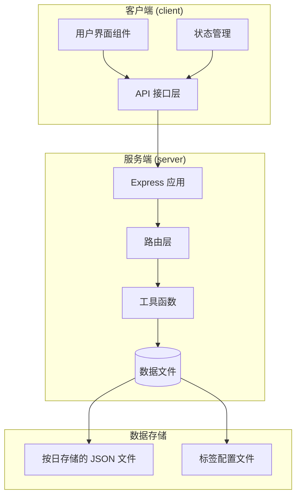
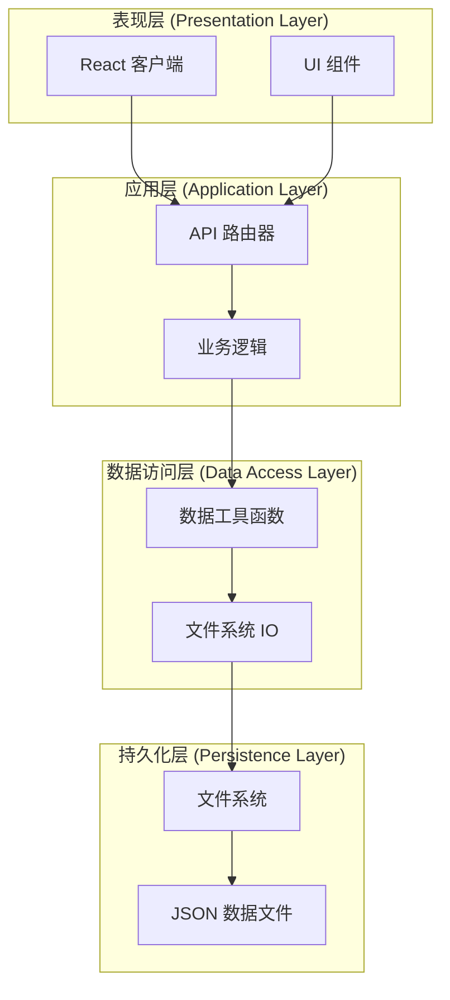
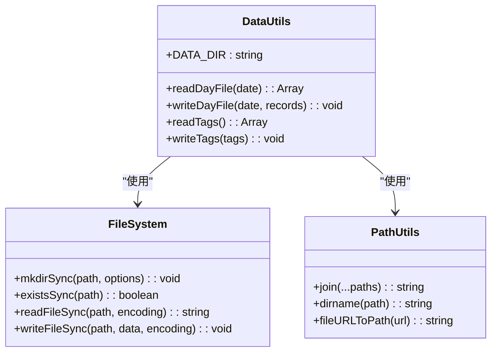
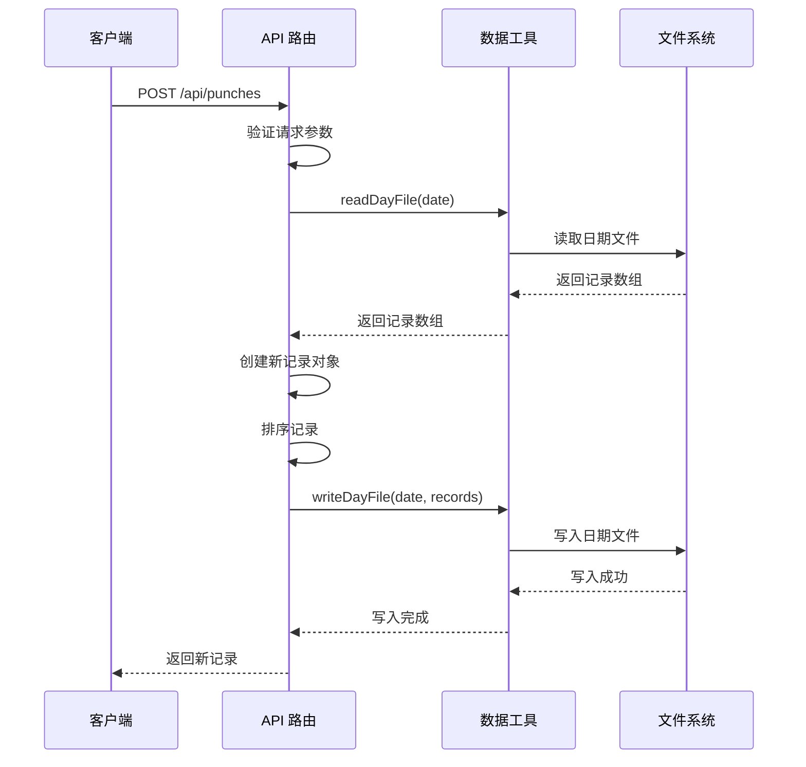
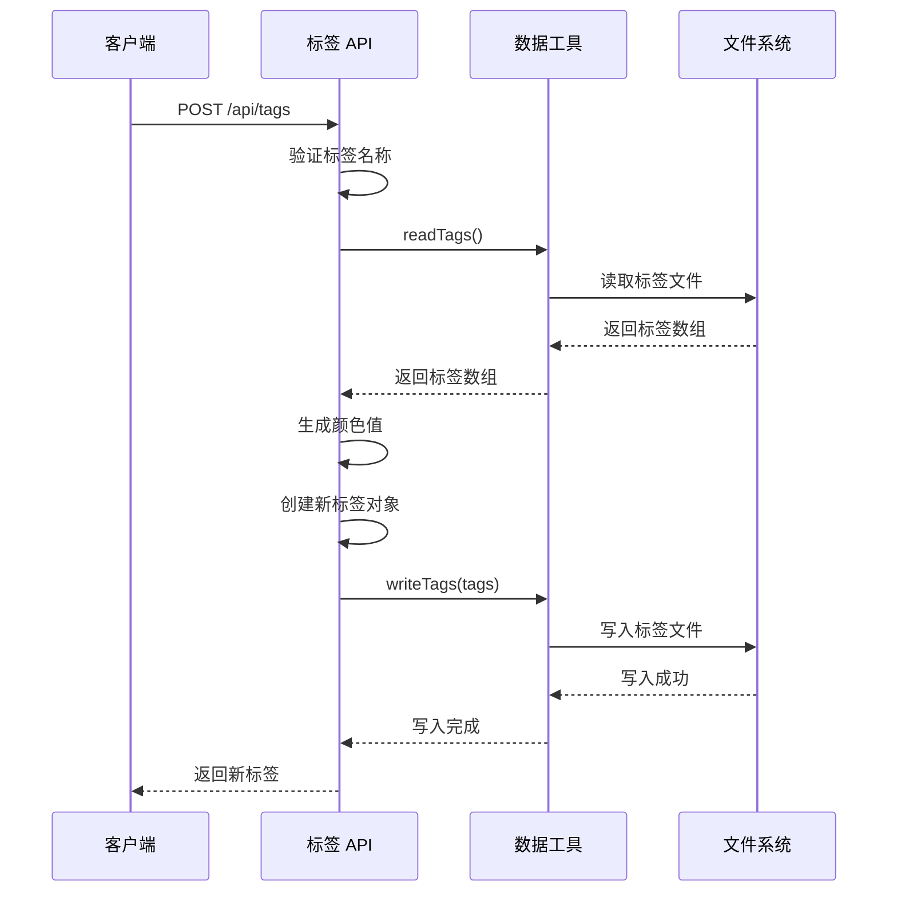
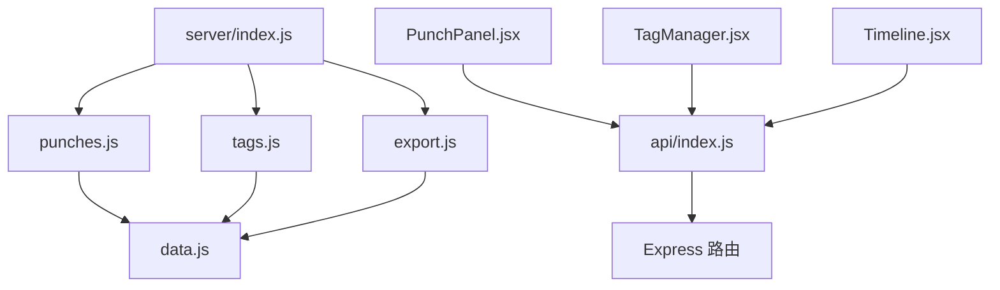
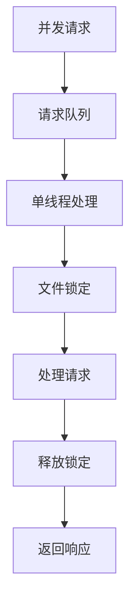
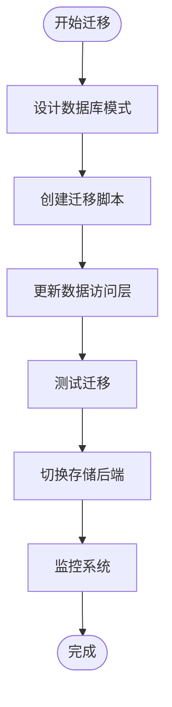

# 数据存储设计

<cite>
**本文档引用的文件**
- [server/utils/data.js](file://server/utils/data.js)
- [server/routes/punches.js](file://server/routes/punches.js)
- [server/routes/tags.js](file://server/routes/tags.js)
- [server/routes/export.js](file://server/routes/export.js)
- [server/index.js](file://server/index.js)
- [client/src/api/index.js](file://client/src/api/index.js)
- [client/src/components/PunchPanel.jsx](file://client/src/components/PunchPanel.jsx)
- [client/src/components/TagManager.jsx](file://client/src/components/TagManager.jsx)
- [client/src/components/Timeline.jsx](file://client/src/components/Timeline.jsx)
- [server/package.json](file://server/package.json)
- [client/package.json](file://client/package.json)
</cite>

## 目录
1. [简介](#简介)
2. [项目结构](#项目结构)
3. [核心组件](#核心组件)
4. [架构概览](#架构概览)
5. [详细组件分析](#详细组件分析)
6. [依赖关系分析](#依赖关系分析)
7. [性能考虑](#性能考虑)
8. [故障排除指南](#故障排除指南)
9. [结论](#结论)
10. [附录](#附录)

## 简介

taskRecordre 是一个基于文件系统的数据存储系统，采用 Node.js + Express 构建的轻量级时间记录应用。该系统通过文件系统实现数据持久化，每个日期对应一个独立的 JSON 文件，标签信息存储在单独的文件中。系统提供了完整的 CRUD 操作接口，支持数据导出为 CSV 格式，并具备基本的数据验证和错误处理机制。

## 项目结构

项目采用前后端分离的架构设计，主要分为以下模块：



**图表来源**
- [server/index.js:1-35](file://server/index.js#L1-L35)
- [server/utils/data.js:1-57](file://server/utils/data.js#L1-L57)

**章节来源**
- [server/index.js:1-35](file://server/index.js#L1-L35)
- [client/src/api/index.js:1-75](file://client/src/api/index.js#L1-L75)

## 核心组件

### 数据存储核心 (Data Storage Core)

系统的核心数据存储逻辑集中在 `server/utils/data.js` 文件中，实现了以下关键功能：

#### 目录结构设计
- **主数据目录**: `server/data/`
- **按日文件**: `YYYY-MM-DD.json` (例如: `2024-01-15.json`)
- **标签文件**: `tags.json`

#### 数据模型设计

**打卡记录数据结构**:
```javascript
{
  id: string,           // 唯一标识符 (UUID v4)
  time: string,         // ISO 时间字符串 (YYYY-MM-DDTHH:mm:ss.sssZ)
  description: string   // 描述信息
}
```

**标签数据结构**:
```javascript
{
  id: string,           // 唯一标识符 (UUID v4)
  name: string,         // 标签名称
  color: string         // 颜色值 (HSL 格式)
}
```

**章节来源**
- [server/utils/data.js:12-56](file://server/utils/data.js#L12-L56)
- [server/routes/punches.js:48-52](file://server/routes/punches.js#L48-L52)
- [server/routes/tags.js:30-34](file://server/routes/tags.js#L30-L34)

## 架构概览

系统采用分层架构设计，实现了清晰的关注点分离：



**图表来源**
- [server/index.js:16-30](file://server/index.js#L16-L30)
- [server/utils/data.js:17-56](file://server/utils/data.js#L17-L56)

## 详细组件分析

### 数据访问工具 (Data Access Utilities)

#### 文件系统操作封装

数据访问工具提供了统一的文件操作接口：



**图表来源**
- [server/utils/data.js:17-56](file://server/utils/data.js#L17-L56)

#### 实现特点

1. **自动目录创建**: 启动时自动创建 `data` 目录
2. **文件存在性检查**: 读取前检查文件是否存在
3. **JSON 序列化**: 自动处理 JSON 数据的读写
4. **UTF-8 编码**: 统一使用 UTF-8 编码进行文件读写

**章节来源**
- [server/utils/data.js:9-10](file://server/utils/data.js#L9-L10)
- [server/utils/data.js:17-34](file://server/utils/data.js#L17-L34)
- [server/utils/data.js:40-56](file://server/utils/data.js#L40-L56)

### 打卡记录管理 (Punch Records Management)

#### API 接口设计

打卡记录模块提供了完整的 CRUD 操作：



**图表来源**
- [server/routes/punches.js:39-60](file://server/routes/punches.js#L39-L60)
- [server/utils/data.js:17-34](file://server/utils/data.js#L17-L34)

#### 数据验证规则

1. **时间字段验证**: 必须提供 `time` 参数
2. **日期格式验证**: 自动从 ISO 时间字符串提取日期部分
3. **记录排序**: 自动按时间升序排列
4. **唯一标识**: 使用 UUID v4 生成唯一 ID

**章节来源**
- [server/routes/punches.js:40-60](file://server/routes/punches.js#L40-L60)
- [server/routes/punches.js:28-30](file://server/routes/punches.js#L28-L30)

### 标签管理系统 (Tag Management System)

#### 标签颜色生成算法

系统实现了基于黄金角的标签颜色生成算法：

```mermaid
flowchart TD
Start([开始]) --> GetCount[获取现有标签数量]
GetCount --> CalcHue[计算色调值<br/>hue = (count × 137.5) % 360]
CalcHue --> GenerateColor[生成 HSL 颜色<br/>HSL(hue, 65%, 55%)]
GenerateColor --> ReturnColor[返回颜色值]
ReturnColor --> End([结束])
```

**图表来源**
- [server/routes/tags.js:8-14](file://server/routes/tags.js#L8-L14)

#### 标签操作流程



**图表来源**
- [server/routes/tags.js:22-39](file://server/routes/tags.js#L22-L39)
- [server/utils/data.js:40-56](file://server/utils/data.js#L40-L56)

**章节来源**
- [server/routes/tags.js:16-72](file://server/routes/tags.js#L16-L72)

### 数据导出功能 (Data Export)

#### CSV 导出机制

系统支持将指定日期范围内的打卡记录导出为 CSV 文件：

```mermaid
flowchart TD
Start([开始导出]) --> ValidateParams[验证参数<br/>start & end]
ValidateParams --> ValidParams{参数有效?}
ValidParams --> |否| ReturnError[返回错误]
ValidParams --> |是| GenerateDates[生成日期范围]
GenerateDates --> IterateDates[遍历每个日期]
IterateDates --> ReadRecords[读取打卡记录]
ReadRecords --> SortRecords[按时间排序]
SortRecords --> PairRecords[相邻记录配对]
PairRecords --> CalculateDuration[计算时长(分钟)]
CalculateDuration --> FormatCSV[格式化 CSV 行]
FormatCSV --> AppendRow[追加到结果]
AppendRow --> NextDate{还有日期?}
NextDate --> |是| IterateDates
NextDate --> |否| AddHeader[添加表头]
AddHeader --> CreateResponse[创建响应]
CreateResponse --> DownloadFile[下载 CSV 文件]
ReturnError --> End([结束])
DownloadFile --> End
```

**图表来源**
- [server/routes/export.js:46-85](file://server/routes/export.js#L46-L85)

**章节来源**
- [server/routes/export.js:46-85](file://server/routes/export.js#L46-L85)

## 依赖关系分析

### 外部依赖

系统使用了以下关键依赖：

```mermaid
graph LR
subgraph "运行时依赖"
Express[express ^4.18.0]
CORS[cors ^2.8.5]
UUID[uuid ^9.0.0]
end
subgraph "开发依赖"
React[react ^19.1.0]
ReactDOM[react-dom ^19.1.0]
Vite[@vitejs/plugin-react ^4.4.1]
end
subgraph "应用"
Server[服务器端]
Client[客户端]
end
Express --> Server
CORS --> Server
UUID --> Server
React --> Client
ReactDOM --> Client
Vite --> Client
```

**图表来源**
- [server/package.json:9-13](file://server/package.json#L9-L13)
- [client/package.json:11-18](file://client/package.json#L11-L18)

### 内部模块依赖



**图表来源**
- [server/index.js:3-5](file://server/index.js#L3-L5)
- [client/src/api/index.js:1-75](file://client/src/api/index.js#L1-L75)

**章节来源**
- [server/package.json:1-15](file://server/package.json#L1-L15)
- [client/package.json:1-20](file://client/package.json#L1-L20)

## 性能考虑

### 文件系统性能优化

1. **单文件读写**: 每个日期使用单一文件存储，避免复杂的数据库查询
2. **内存缓存**: 在内存中维护当前活跃数据，减少频繁的文件 IO
3. **批量操作**: 支持批量导入导出，提高大体量数据处理效率

### 并发访问处理



**图表来源**
- [server/utils/data.js:17-34](file://server/utils/data.js#L17-L34)

### 存储空间优化

1. **JSON 压缩**: 使用适当的缩进级别平衡可读性和存储空间
2. **数据清理**: 提供删除操作，及时清理不再需要的历史数据
3. **索引优化**: 按日期组织文件，便于快速定位和清理

## 故障排除指南

### 常见问题及解决方案

#### 文件权限问题
- **症状**: 无法创建或写入数据文件
- **原因**: 目录权限不足
- **解决**: 确保应用程序对 `server/data/` 目录具有读写权限

#### JSON 解析错误
- **症状**: 读取文件时报 JSON 解析错误
- **原因**: 文件损坏或格式不正确
- **解决**: 检查文件完整性，必要时手动修复或删除

#### 并发访问冲突
- **症状**: 数据不一致或文件锁定错误
- **原因**: 多个进程同时访问同一文件
- **解决**: 实施适当的锁机制或使用单实例部署

#### 内存溢出
- **症状**: 处理大量数据时内存使用过高
- **原因**: 将整个数据集加载到内存
- **解决**: 实现流式处理或分页加载

**章节来源**
- [server/utils/data.js:17-24](file://server/utils/data.js#L17-L24)
- [server/utils/data.js:40-47](file://server/utils/data.js#L40-L47)

## 结论

taskRecordre 的数据存储系统采用简洁而有效的文件系统方案，通过合理的数据模型设计和严格的文件管理机制，实现了可靠的时间记录功能。系统的主要优势包括：

1. **简单可靠**: 基于文件系统的纯 JavaScript 实现，易于理解和维护
2. **性能良好**: 单文件存储模式避免了复杂的数据库开销
3. **扩展性强**: 清晰的模块分离为未来扩展其他存储后端提供了基础
4. **功能完整**: 提供了完整的 CRUD 操作和数据导出功能

对于生产环境部署，建议考虑增加数据库支持、改进并发控制机制和增强数据备份策略。

## 附录

### 数据备份策略

#### 手动备份
```bash
# 创建备份目录
mkdir backup_$(date +%Y%m%d_%H%M%S)

# 复制数据文件
cp -r server/data/* backup_$(date +%Y%m%d_%H%M%S)/
```

#### 自动备份脚本
```bash
#!/bin/bash
# 备份脚本示例
BACKUP_DIR="/path/to/backup"
DATA_DIR="server/data"

# 创建时间戳目录
TIMESTAMP=$(date +%Y%m%d_%H%M%S)
mkdir -p "$BACKUP_DIR/$TIMESTAMP"

# 复制数据文件
cp -r "$DATA_DIR"/* "$BACKUP_DIR/$TIMESTAMP/"
```

### 版本兼容性说明

#### 当前版本特性
- **数据格式**: JSON 文件格式
- **API 版本**: v1.0
- **存储格式**: 文件系统

#### 迁移指南

**从旧版本升级**:
1. 备份现有数据文件
2. 检查数据格式是否符合新版本要求
3. 更新应用程序版本
4. 验证数据完整性

**向数据库迁移**:
1. 设计数据库表结构
2. 编写数据迁移脚本
3. 更新数据访问层
4. 测试数据迁移
5. 切换到新存储后端

### 扩展存储后端指导

#### 数据库集成步骤



#### 新存储后端接口规范

```javascript
// 数据访问接口规范
interface StorageInterface {
  // 打卡记录操作
  getPunchesByDate(date: string): Promise<PunchRecord[]>
  createPunch(record: PunchRecord): Promise<PunchRecord>
  updatePunch(id: string, updates: Partial<PunchRecord>): Promise<PunchRecord>
  deletePunch(id: string): Promise<void>
  
  // 标签操作
  getAllTags(): Promise<Tag[]>
  createTag(tag: Tag): Promise<Tag>
  updateTag(id: string, updates: Partial<Tag>): Promise<Tag>
  deleteTag(id: string): Promise<void>
}
```

**章节来源**
- [server/utils/data.js:17-56](file://server/utils/data.js#L17-L56)
- [server/routes/punches.js:32-114](file://server/routes/punches.js#L32-L114)
- [server/routes/tags.js:16-72](file://server/routes/tags.js#L16-L72)