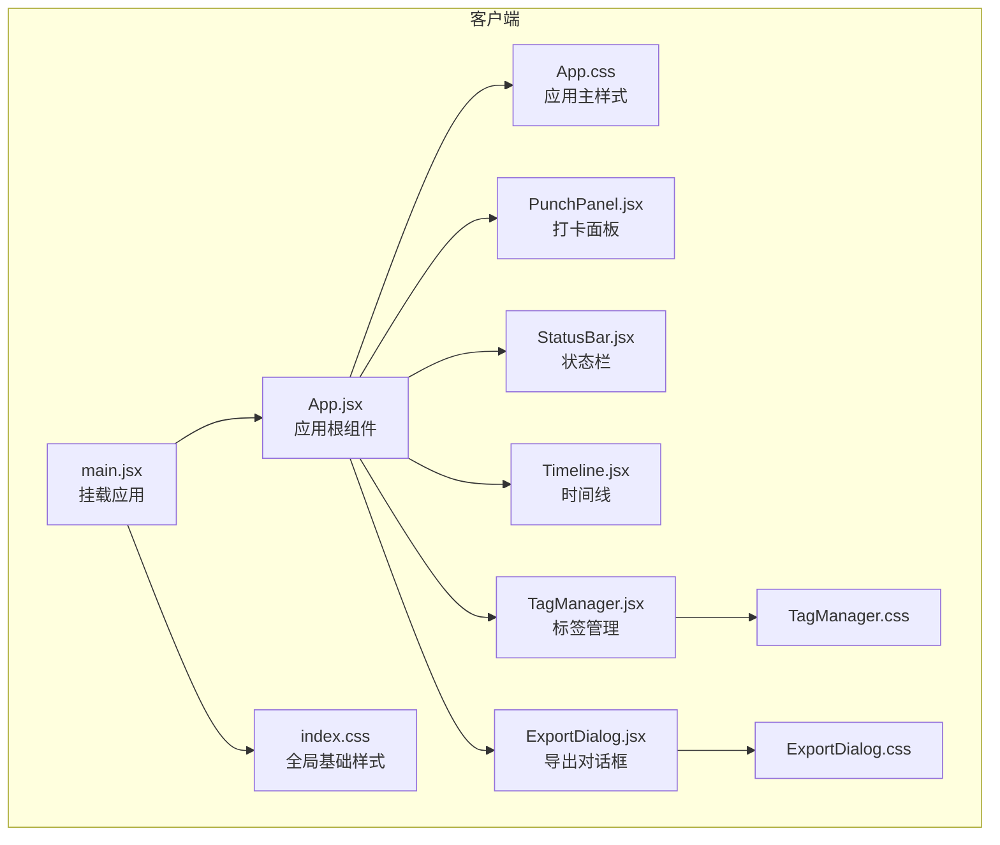
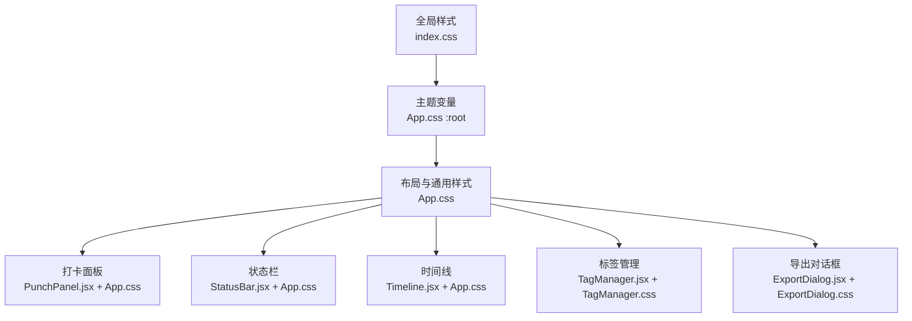
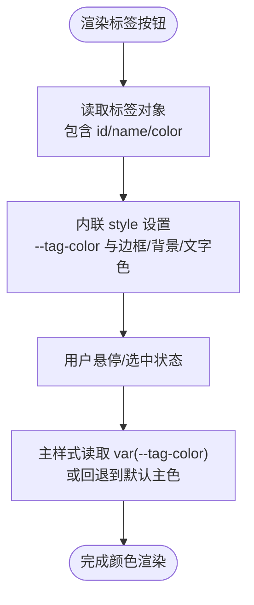
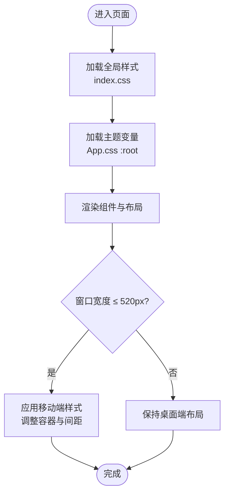
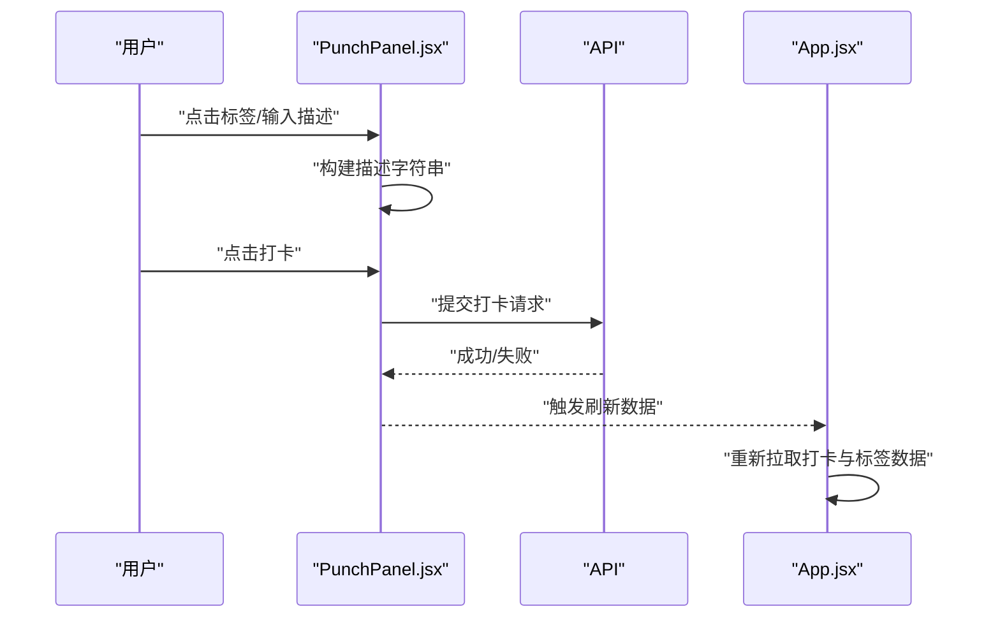
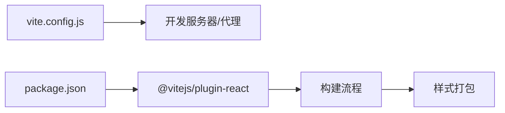

# 样式与主题

<cite>
**本文引用的文件**
- [client/src/index.css](file://client/src/index.css)
- [client/src/App.css](file://client/src/App.css)
- [client/src/App.jsx](file://client/src/App.jsx)
- [client/src/main.jsx](file://client/src/main.jsx)
- [client/src/components/PunchPanel.jsx](file://client/src/components/PunchPanel.jsx)
- [client/src/components/StatusBar.jsx](file://client/src/components/StatusBar.jsx)
- [client/src/components/Timeline.jsx](file://client/src/components/Timeline.jsx)
- [client/src/components/TagManager.jsx](file://client/src/components/TagManager.jsx)
- [client/src/components/ExportDialog.jsx](file://client/src/components/ExportDialog.jsx)
- [client/src/components/TagManager.css](file://client/src/components/TagManager.css)
- [client/src/components/ExportDialog.css](file://client/src/components/ExportDialog.css)
- [client/vite.config.js](file://client/vite.config.js)
- [client/package.json](file://client/package.json)
</cite>

## 目录
1. [简介](#简介)
2. [项目结构](#项目结构)
3. [核心组件](#核心组件)
4. [架构总览](#架构总览)
5. [详细组件分析](#详细组件分析)
6. [依赖关系分析](#依赖关系分析)
7. [性能考量](#性能考量)
8. [故障排查指南](#故障排查指南)
9. [结论](#结论)
10. [附录](#附录)

## 简介
本文件系统性梳理 taskRecordre 的样式系统与主题设计，覆盖 CSS 架构设计原则、样式组织策略、响应式布局实现、标签颜色系统、全局样式与组件样式的管理方式、CSS Modules 使用现状与替代方案、主题变量管理、移动端适配与跨浏览器兼容性、自定义主题指南以及样式性能优化最佳实践。文档面向不同技术背景的读者，既提供高层概览也包含代码级细节与可视化图示。

## 项目结构
客户端采用 Vite 构建，样式通过原生 CSS 文件组织，配合 React 组件按需引入。整体结构清晰：全局基础样式位于入口样式文件，应用主样式集中于 App.css，各功能组件拥有独立样式文件，便于维护与复用。

图表来源
- [client/src/main.jsx:1-11](file://client/src/main.jsx#L1-L11)
- [client/src/App.jsx:1-86](file://client/src/App.jsx#L1-L86)
- [client/src/index.css:1-25](file://client/src/index.css#L1-L25)
- [client/src/App.css:1-385](file://client/src/App.css#L1-L385)
- [client/src/components/PunchPanel.jsx:1-119](file://client/src/components/PunchPanel.jsx#L1-L119)
- [client/src/components/StatusBar.jsx:1-46](file://client/src/components/StatusBar.jsx#L1-L46)
- [client/src/components/Timeline.jsx:1-138](file://client/src/components/Timeline.jsx#L1-L138)
- [client/src/components/TagManager.jsx:1-135](file://client/src/components/TagManager.jsx#L1-L135)
- [client/src/components/ExportDialog.jsx:1-98](file://client/src/components/ExportDialog.jsx#L1-L98)
- [client/src/components/TagManager.css:1-180](file://client/src/components/TagManager.css#L1-L180)
- [client/src/components/ExportDialog.css:1-77](file://client/src/components/ExportDialog.css#L1-L77)

章节来源
- [client/src/main.jsx:1-11](file://client/src/main.jsx#L1-L11)
- [client/src/App.jsx:1-86](file://client/src/App.jsx#L1-L86)
- [client/src/index.css:1-25](file://client/src/index.css#L1-L25)
- [client/src/App.css:1-385](file://client/src/App.css#L1-L385)

## 核心组件
- 全局样式与基础排版：通过入口样式统一字体、行高、字号与基础盒模型，确保页面一致的视觉基线。
- 应用主样式：集中定义主题变量、容器布局、通用组件样式与响应式断点，作为组件样式的“主题层”。
- 组件样式：每个功能组件拥有独立样式文件，复用主样式中的变量与类名，保证一致性与可维护性。
- 主题变量：以 CSS 自定义属性形式集中管理主色、背景、表面、边框、文字、圆角半径与阴影等，支持动态切换与扩展。

章节来源
- [client/src/index.css:1-25](file://client/src/index.css#L1-L25)
- [client/src/App.css:1-11](file://client/src/App.css#L1-L11)
- [client/src/App.css:13-30](file://client/src/App.css#L13-L30)
- [client/src/App.css:49-72](file://client/src/App.css#L49-L72)
- [client/src/components/TagManager.css:1-22](file://client/src/components/TagManager.css#L1-L22)
- [client/src/components/ExportDialog.css:1-23](file://client/src/components/ExportDialog.css#L1-L23)

## 架构总览
样式系统遵循“全局基础 → 主样式主题 → 组件样式”的分层架构。全局样式负责基础排版与字体；主样式负责主题变量与通用布局；组件样式负责局部交互与视觉细节。组件通过 className 与内联 style 动态注入主题变量，实现标签颜色等动态主题效果。

图表来源
- [client/src/index.css:1-25](file://client/src/index.css#L1-L25)
- [client/src/App.css:1-11](file://client/src/App.css#L1-L11)
- [client/src/App.css:13-30](file://client/src/App.css#L13-L30)
- [client/src/components/PunchPanel.jsx:60-86](file://client/src/components/PunchPanel.jsx#L60-L86)
- [client/src/components/TagManager.jsx:77-132](file://client/src/components/TagManager.jsx#L77-L132)
- [client/src/components/ExportDialog.jsx:52-96](file://client/src/components/ExportDialog.jsx#L52-L96)

## 详细组件分析

### 标签颜色系统
- 设计理念：标签颜色由服务端返回，前端通过内联 style 注入到组件元素，同时在主样式中使用 CSS 变量作为默认回退，确保在无颜色或加载期间的可用性。
- 使用方法：组件在渲染标签按钮时，将标签颜色写入 style 的自定义属性，并在 hover 等状态中读取该变量，实现颜色联动。
- 可扩展性：新增标签颜色无需修改主样式，仅需在标签对象中提供 color 字段即可生效。

图表来源
- [client/src/components/PunchPanel.jsx:69-84](file://client/src/components/PunchPanel.jsx#L69-L84)
- [client/src/components/PunchPanel.jsx:73-78](file://client/src/components/PunchPanel.jsx#L73-L78)
- [client/src/App.css:296-298](file://client/src/App.css#L296-L298)

章节来源
- [client/src/components/PunchPanel.jsx:69-84](file://client/src/components/PunchPanel.jsx#L69-L84)
- [client/src/components/PunchPanel.jsx:73-78](file://client/src/components/PunchPanel.jsx#L73-L78)
- [client/src/App.css:296-298](file://client/src/App.css#L296-L298)

### 响应式布局与移动端适配
- 断点策略：在主样式中设置一个移动端断点，针对窄屏设备调整容器最大宽度与内边距，保证在小屏幕下的可读性与可触达性。
- 移动端适配：容器采用弹性布局与间距统一，输入控件与按钮尺寸适中，避免在移动设备上出现滚动与点击困难问题。
- 跨浏览器兼容：通过基础字体栈与抗锯齿设置提升可读性；未发现针对旧版本浏览器的特殊 polyfill 或前缀处理。

图表来源
- [client/src/index.css:1-25](file://client/src/index.css#L1-L25)
- [client/src/App.css:1-11](file://client/src/App.css#L1-L11)
- [client/src/App.css:379-384](file://client/src/App.css#L379-L384)

章节来源
- [client/src/App.css:379-384](file://client/src/App.css#L379-L384)
- [client/src/index.css:1-25](file://client/src/index.css#L1-L25)

### 主题变量管理与样式隔离
- 主题变量：集中于主样式 :root，包括主色、悬停色、背景、表面、边框、文字、圆角与阴影等，组件通过 var() 读取，便于统一风格与动态切换。
- 样式隔离：组件样式文件独立，避免相互污染；组件内部通过 className 限定作用域，减少全局污染风险。
- 复用策略：通用按钮、输入框、列表项等采用通用类名，结合组件状态类（如编辑态）实现差异化表现。

章节来源
- [client/src/App.css:1-11](file://client/src/App.css#L1-L11)
- [client/src/App.css:56-72](file://client/src/App.css#L56-L72)
- [client/src/App.css:169-185](file://client/src/App.css#L169-L185)
- [client/src/components/TagManager.css:75-89](file://client/src/components/TagManager.css#L75-L89)
- [client/src/components/ExportDialog.css:56-76](file://client/src/components/ExportDialog.css#L56-L76)

### 组件样式组织与交互流程
- PunchPanel：包含标签选择区、描述输入区与打卡按钮，标签按钮根据选中状态改变边框、背景与文字色，描述输入聚焦时突出主色边框。
- Timeline：展示时间段列表，支持编辑/删除，编辑态下显示输入控件与保存/取消按钮。
- StatusBar：显示最近一次打卡时间与累计时长，基于传入的时间计算并定时更新。
- TagManager 与 ExportDialog：均采用模态弹窗结构，包含遮罩、标题、输入与操作按钮，样式独立于主样式，通过通用类名复用主题变量。

图表来源
- [client/src/components/PunchPanel.jsx:28-45](file://client/src/components/PunchPanel.jsx#L28-L45)
- [client/src/App.jsx:26-38](file://client/src/App.jsx#L26-L38)

章节来源
- [client/src/components/PunchPanel.jsx:1-119](file://client/src/components/PunchPanel.jsx#L1-L119)
- [client/src/components/Timeline.jsx:31-70](file://client/src/components/Timeline.jsx#L31-L70)
- [client/src/components/StatusBar.jsx:6-17](file://client/src/components/StatusBar.jsx#L6-L17)
- [client/src/App.jsx:26-38](file://client/src/App.jsx#L26-L38)

## 依赖关系分析
- 样式依赖：组件通过 import 方式引入各自样式文件，形成“组件 → 样式”的单向依赖，避免循环依赖。
- 构建工具：Vite 提供开发服务器与代理配置，便于前后端联调；未使用 CSS Modules，采用原生 CSS 类名管理。
- 浏览器支持：通过基础字体与渲染优化提升跨浏览器体验，未见针对旧版浏览器的特殊处理。

图表来源
- [client/vite.config.js:1-15](file://client/vite.config.js#L1-L15)
- [client/package.json:15-17](file://client/package.json#L15-L17)

章节来源
- [client/vite.config.js:1-15](file://client/vite.config.js#L1-L15)
- [client/package.json:1-20](file://client/package.json#L1-L20)

## 性能考量
- 样式体积控制：组件样式独立，按需引入，避免一次性加载过多无关样式。
- 变量复用：通过 CSS 变量集中管理颜色与尺寸，减少重复定义，降低维护成本与体积。
- 渲染优化：组件内部状态驱动样式变化（如编辑态），避免频繁重排；输入框聚焦态使用过渡动画，提升交互流畅度。
- 图标与字体：使用系统字体栈与抗锯齿设置，减少字体加载开销与渲染抖动。

## 故障排查指南
- 样式不生效
  - 检查组件是否正确引入对应样式文件。
  - 确认类名拼写与大小写一致。
  - 验证主题变量是否在 :root 中定义且未被覆盖。
- 颜色异常
  - 确认标签对象是否包含颜色字段，或组件内联 style 是否正确注入。
  - 检查 hover/选中态是否读取到正确的 CSS 变量。
- 响应式问题
  - 在窄屏设备上确认断点条件与容器样式是否生效。
  - 检查媒体查询范围与设备像素比影响。
- 交互异常
  - 检查按钮禁用态与 hover 态的样式逻辑。
  - 确认输入框焦点态与过渡动画未被其他规则覆盖。

## 结论
taskRecordre 的样式系统以简洁、可维护为核心目标：通过全局基础样式奠定一致的视觉基线，以主样式集中管理主题变量与通用布局，再由各组件样式文件实现局部差异化。标签颜色系统通过内联 style 与 CSS 变量实现灵活的主题扩展。整体采用原生 CSS，未使用 CSS Modules，但通过严格的命名规范与样式隔离策略，仍能保证良好的可维护性与可扩展性。建议在后续迭代中继续强化变量体系与组件复用策略，并关注跨浏览器兼容与性能优化。

## 附录
- 自定义主题指南
  - 新增主题变量：在主样式 :root 中添加新变量，组件通过 var() 读取。
  - 切换主题：通过切换根元素上的类名或数据属性，配合 CSS 条件规则实现主题切换。
  - 扩展组件样式：在组件样式文件中复用通用类名与变量，避免硬编码颜色与尺寸。
- 样式扩展方法
  - 优先使用通用类名与状态类，减少特异性选择器。
  - 对高频使用的交互反馈（如 hover、focus、disabled）统一抽象为通用样式。
  - 对复杂组件拆分子样式块，保持文件内聚与职责单一。