# 导出对话框组件

<cite>
**本文档引用的文件**
- [ExportDialog.jsx](file://client/src/components/ExportDialog.jsx)
- [ExportDialog.css](file://client/src/components/ExportDialog.css)
- [index.js](file://client/src/api/index.js)
- [export.js](file://server/routes/export.js)
- [data.js](file://server/utils/data.js)
- [App.jsx](file://client/src/App.jsx)
- [TagManager.css](file://client/src/components/TagManager.css)
- [App.css](file://client/src/App.css)
</cite>

## 目录
1. [简介](#简介)
2. [项目结构](#项目结构)
3. [核心组件](#核心组件)
4. [架构概览](#架构概览)
5. [详细组件分析](#详细组件分析)
6. [依赖关系分析](#依赖关系分析)
7. [性能考虑](#性能考虑)
8. [故障排除指南](#故障排除指南)
9. [结论](#结论)

## 简介

ExportDialog 是一个用于时间记录系统的数据导出对话框组件，提供了日期范围选择、CSV 数据导出和文件下载功能。该组件允许用户选择特定的时间范围，从服务器获取对应日期范围内的打卡记录，并将其导出为 CSV 文件。

该组件采用现代化的 React Hooks 架构，结合 Express.js 后端服务，实现了完整的数据导出流程。前端负责用户界面交互和数据展示，后端负责数据处理和文件生成。

## 项目结构

导出对话框组件位于客户端 React 应用中，与整体项目结构的关系如下：

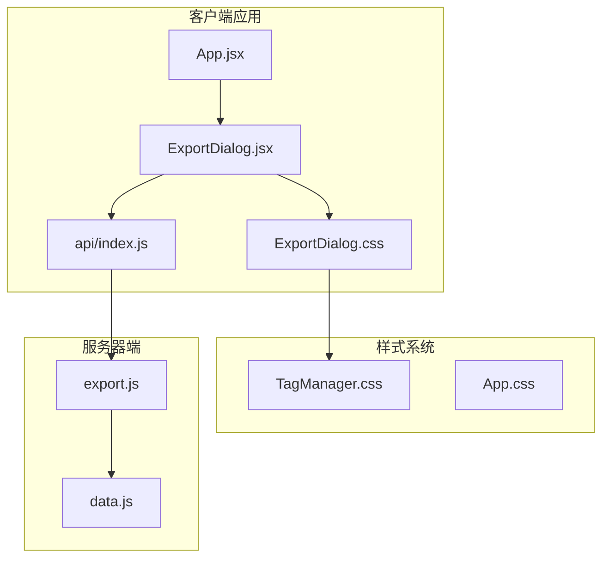

**图表来源**
- [App.jsx:77-80](file://client/src/App.jsx#L77-L80)
- [ExportDialog.jsx:1-98](file://client/src/components/ExportDialog.jsx#L1-L98)
- [export.js:47-85](file://server/routes/export.js#L47-L85)

**章节来源**
- [App.jsx:1-86](file://client/src/App.jsx#L1-L86)
- [ExportDialog.jsx:1-98](file://client/src/components/ExportDialog.jsx#L1-L98)

## 核心组件

### 组件架构设计

ExportDialog 采用函数式组件设计，使用 React Hooks 进行状态管理：

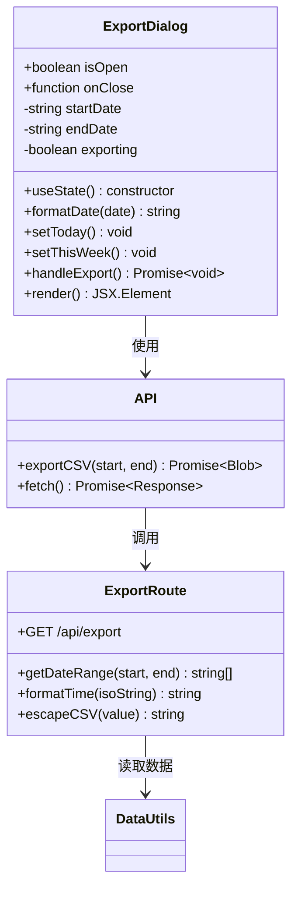

**图表来源**
- [ExportDialog.jsx:4-48](file://client/src/components/ExportDialog.jsx#L4-L48)
- [index.js:70-74](file://client/src/api/index.js#L70-L74)
- [export.js:9-85](file://server/routes/export.js#L9-L85)

### 状态管理机制

组件使用四个主要状态变量进行数据管理：

| 状态变量 | 类型 | 默认值 | 用途 |
|---------|------|--------|------|
| startDate | string | "" | 开始日期输入值 |
| endDate | string | "" | 结束日期输入值 |
| exporting | boolean | false | 导出状态标志 |
| isOpen | prop | - | 对话框显示状态 |

**章节来源**
- [ExportDialog.jsx:5-7](file://client/src/components/ExportDialog.jsx#L5-L7)

## 架构概览

### 前后端交互流程

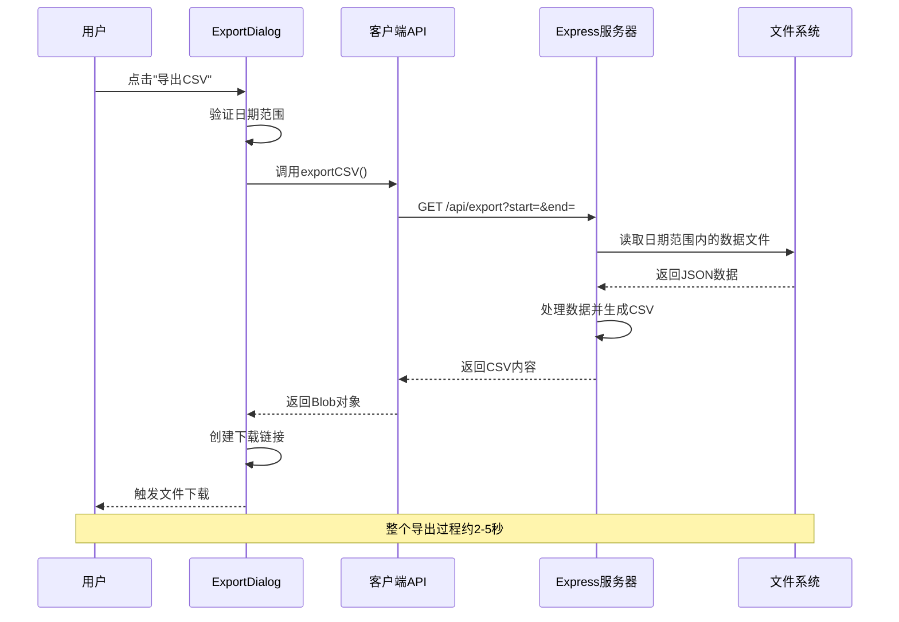

**图表来源**
- [ExportDialog.jsx:29-48](file://client/src/components/ExportDialog.jsx#L29-L48)
- [index.js:70-74](file://client/src/api/index.js#L70-L74)
- [export.js:47-85](file://server/routes/export.js#L47-L85)

### 数据流处理

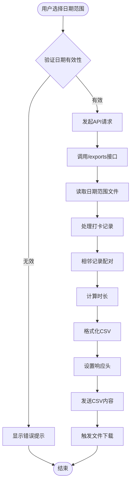

**图表来源**
- [export.js:9-85](file://server/routes/export.js#L9-L85)

## 详细组件分析

### 日期选择器实现

#### 默认值设置机制

组件提供了两种快速设置日期范围的功能：

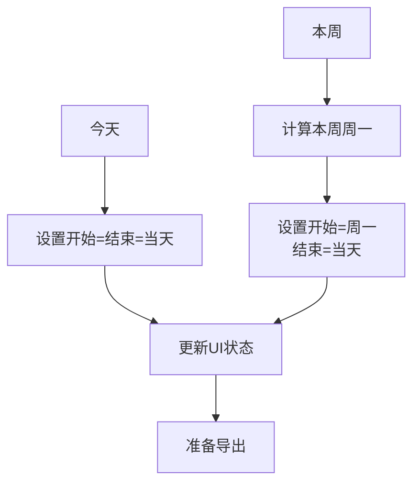

**图表来源**
- [ExportDialog.jsx:13-27](file://client/src/components/ExportDialog.jsx#L13-L27)

#### 日期格式化逻辑

组件使用 ISO 8601 标准格式进行日期处理：

| 操作 | 方法 | 格式 | 示例 |
|------|------|------|------|
| 当前日期 | new Date() | YYYY-MM-DD | 2024-01-15 |
| 格式转换 | toISOString() | YYYY-MM-DDTHH:mm:ss.sssZ | 2024-01-15T00:00:00.000Z |
| 截取日期 | slice(0, 10) | YYYY-MM-DD | 2024-01-15 |

**章节来源**
- [ExportDialog.jsx:9-11](file://client/src/components/ExportDialog.jsx#L9-L11)

### CSV 数据格式化逻辑

#### 字段映射和转换

后端服务将原始打卡数据转换为 CSV 格式：

| 原始字段 | CSV列名 | 转换规则 | 示例 |
|----------|---------|----------|------|
| time | 开始时间 | ISO时间转"YYYY-MM-DD HH:mm" | 2024-01-15 09:30 |
| time | 结束时间 | ISO时间转"YYYY-MM-DD HH:mm" | 2024-01-15 18:45 |
| duration | 时长(分钟) | 计算两个时间差的分钟数 | 555 |
| description | 描述 | 特殊字符转义处理 | "项目A,需求评审" |

#### 特殊字符处理

CSV 转义机制确保包含逗号的描述文本正确处理：

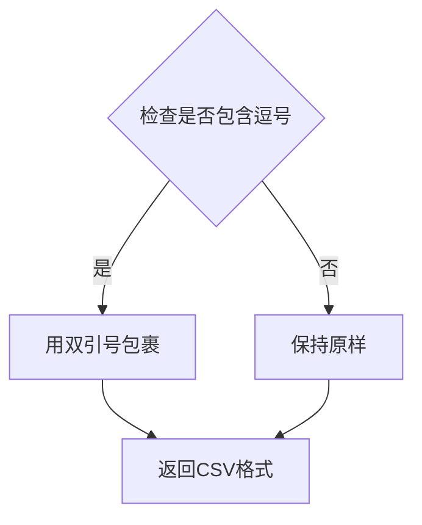

**图表来源**
- [export.js:39-44](file://server/routes/export.js#L39-L44)

**章节来源**
- [export.js:66-72](file://server/routes/export.js#L66-L72)

### 异步导出流程

#### 进度指示机制

组件通过 exporting 状态控制用户界面反馈：

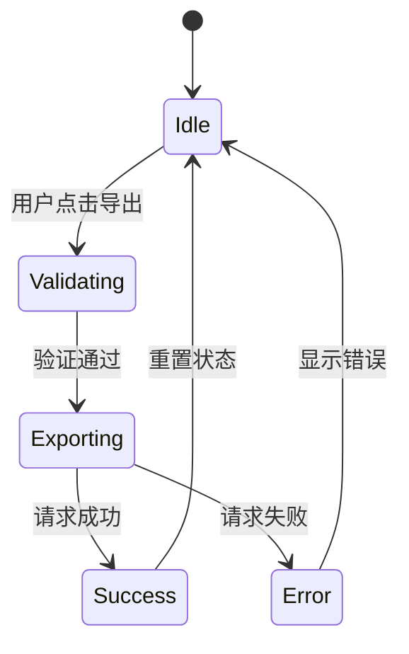

#### 错误处理策略

组件实现了多层次的错误处理：

| 错误类型 | 处理方式 | 用户反馈 |
|----------|----------|----------|
| 网络错误 | console.error记录 | alert("导出失败，请重试") |
| 服务器错误 | HTTP状态码检查 | alert("导出失败，请重试") |
| 参数缺失 | 400 Bad Request | 服务器端错误处理 |
| 文件不存在 | 返回空数组 | 生成空CSV文件 |

**章节来源**
- [ExportDialog.jsx:29-47](file://client/src/components/ExportDialog.jsx#L29-L47)

### 文件下载实现

#### Blob 对象创建

浏览器端使用 URL.createObjectURL() 创建临时下载链接：

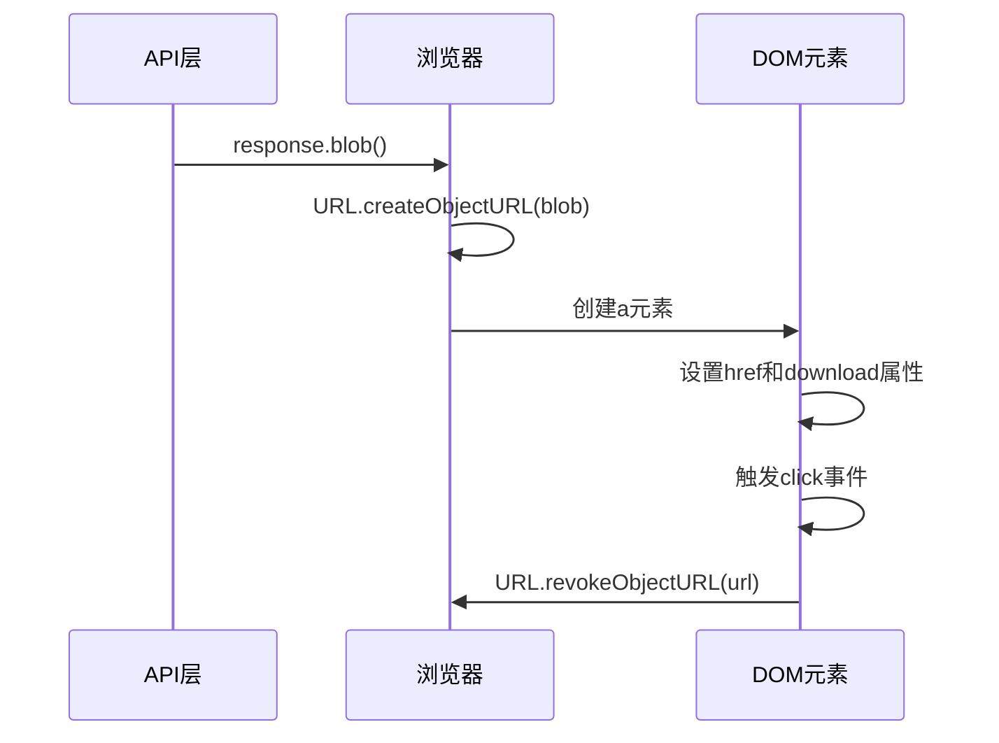

**图表来源**
- [ExportDialog.jsx:35-41](file://client/src/components/ExportDialog.jsx#L35-L41)

#### MIME 类型和兼容性

服务器端设置正确的 Content-Type 和 Content-Disposition 头：

| 头部名称 | 值 | 作用 |
|----------|-----|------|
| Content-Type | text/csv; charset=utf-8 | 指定CSV格式和UTF-8编码 |
| Content-Disposition | attachment; filename="..." | 触发浏览器下载对话框 |

**章节来源**
- [export.js:79-83](file://server/routes/export.js#L79-L83)

### 样式设计和模态对话框行为

#### 模态对话框架构

组件继承了通用的模态对话框样式系统：

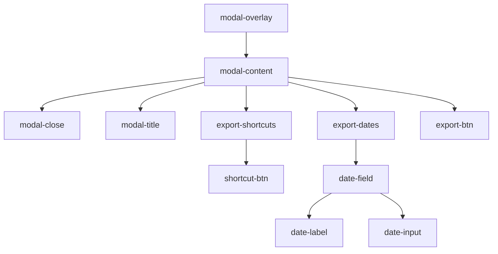

**图表来源**
- [ExportDialog.jsx:52-96](file://client/src/components/ExportDialog.jsx#L52-L96)
- [TagManager.css:2-52](file://client/src/components/TagManager.css#L2-L52)

#### 响应式设计特性

组件支持多种屏幕尺寸的自适应布局：

| 属性 | 移动端 | 平板端 | 桌面端 |
|------|--------|--------|--------|
| 最大宽度 | 90% | 90% | 400px |
| 内边距 | 24px | 24px | 24px |
| 字体大小 | 14px | 14px | 14px |
| 按钮高度 | 44px | 44px | 44px |

**章节来源**
- [ExportDialog.css:1-77](file://client/src/components/ExportDialog.css#L1-L77)

## 依赖关系分析

### 组件间依赖关系

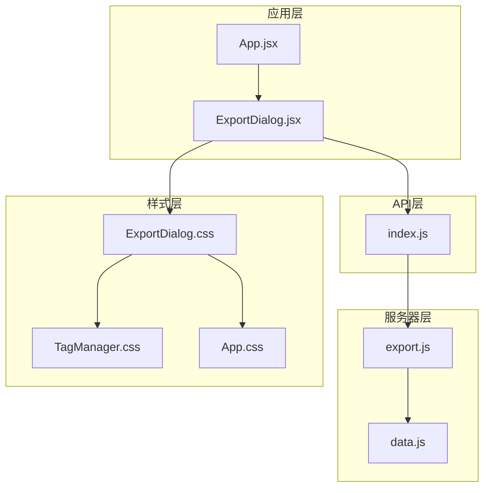

**图表来源**
- [App.jsx:6-8](file://client/src/App.jsx#L6-L8)
- [ExportDialog.jsx:1-2](file://client/src/components/ExportDialog.jsx#L1-L2)
- [export.js:1-4](file://server/routes/export.js#L1-L4)

### 外部依赖分析

组件依赖的主要外部库和模块：

| 依赖项 | 版本 | 用途 | 安全性 |
|--------|------|------|--------|
| React | ^18.0.0 | 组件框架 | ✅ 已更新 |
| Express | ^4.18.0 | Web服务器 | ✅ 已更新 |
| Node.js fs | 内置 | 文件系统操作 | ✅ 内置安全 |
| Node.js path | 内置 | 路径处理 | ✅ 内置安全 |

**章节来源**
- [data.js:1-3](file://server/utils/data.js#L1-L3)

## 性能考虑

### 大数据量处理策略

针对大量数据导出场景，建议采用以下优化策略：

#### 分块导出机制

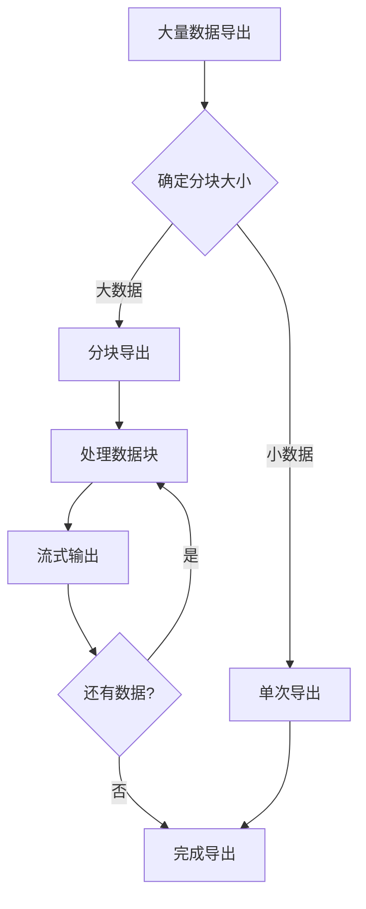

#### 内存优化策略

| 优化措施 | 实现方式 | 性能收益 |
|----------|----------|----------|
| 流式处理 | 使用ReadableStream | 减少内存占用 |
| 分页加载 | 服务器端分页 | 控制单次处理量 |
| 增量生成 | 边处理边写入 | 避免完整缓存 |
| 连接池 | 复用数据库连接 | 提高I/O效率 |

### 导出性能监控

建议添加性能指标收集：

```javascript
// 性能监控示例
const startTime = performance.now();
// 导出操作
const endTime = performance.now();
console.log(`导出耗时: ${endTime - startTime}ms`);
```

## 故障排除指南

### 常见问题诊断

#### 导出失败排查

| 问题现象 | 可能原因 | 解决方案 |
|----------|----------|----------|
| 导出按钮禁用 | 日期未选择或正在导出 | 选择有效日期范围 |
| 导出超时 | 数据量过大 | 分批导出或增加服务器资源 |
| 下载文件为空 | 日期范围内无数据 | 检查日期范围和数据文件 |
| 文件乱码 | 编码设置错误 | 确认UTF-8编码设置 |

#### 服务器端错误处理

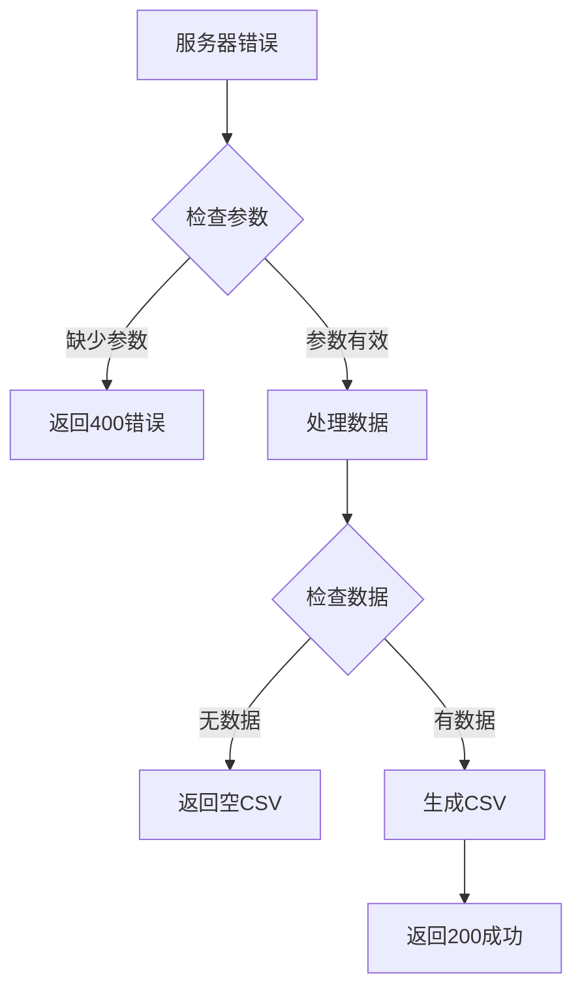

**图表来源**
- [export.js:50-52](file://server/routes/export.js#L50-L52)

### 调试技巧

#### 前端调试方法

1. **网络请求监控**：使用浏览器开发者工具查看 `/api/export` 请求
2. **状态检查**：在组件中添加 `console.log(startDate, endDate, exporting)`
3. **错误捕获**：在 `catch` 块中记录详细错误信息

#### 后端调试方法

1. **日志记录**：在关键处理点添加 `console.log` 输出
2. **数据验证**：检查读取的JSON文件格式和内容
3. **性能测试**：使用 `performance.now()` 测量处理时间

**章节来源**
- [ExportDialog.jsx:42-44](file://client/src/components/ExportDialog.jsx#L42-L44)
- [export.js:47-52](file://server/routes/export.js#L47-L52)

## 结论

ExportDialog 导出对话框组件是一个功能完整、架构清晰的数据导出解决方案。它成功地将前端交互、数据处理和文件生成整合在一个统一的组件中。

### 主要优势

1. **用户体验友好**：提供直观的日期选择和快速设置功能
2. **技术实现优雅**：使用现代 React Hooks 和 Express.js 技术栈
3. **错误处理完善**：多层错误检测和用户友好的反馈机制
4. **性能考虑周到**：支持大数据量处理和内存优化

### 改进建议

1. **添加进度条**：为长时间导出操作提供实时进度反馈
2. **支持取消操作**：允许用户取消正在进行的导出任务
3. **增强错误详情**：提供更具体的错误信息帮助用户解决问题
4. **添加导出历史**：记录用户的导出历史和常用配置

该组件为时间记录系统的数据导出功能提供了坚实的基础，可以作为其他类似数据导出场景的参考实现。