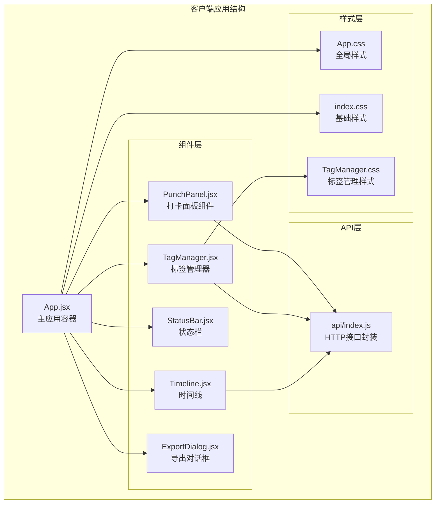
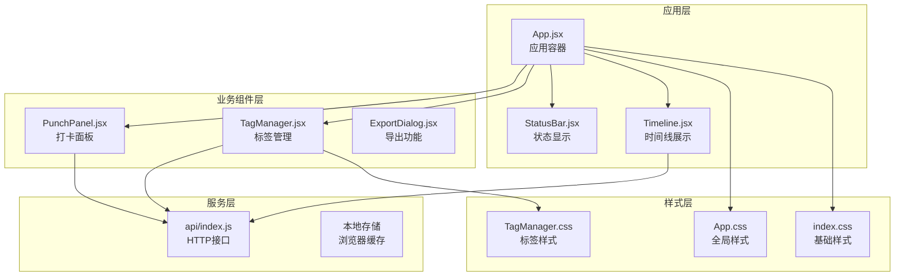
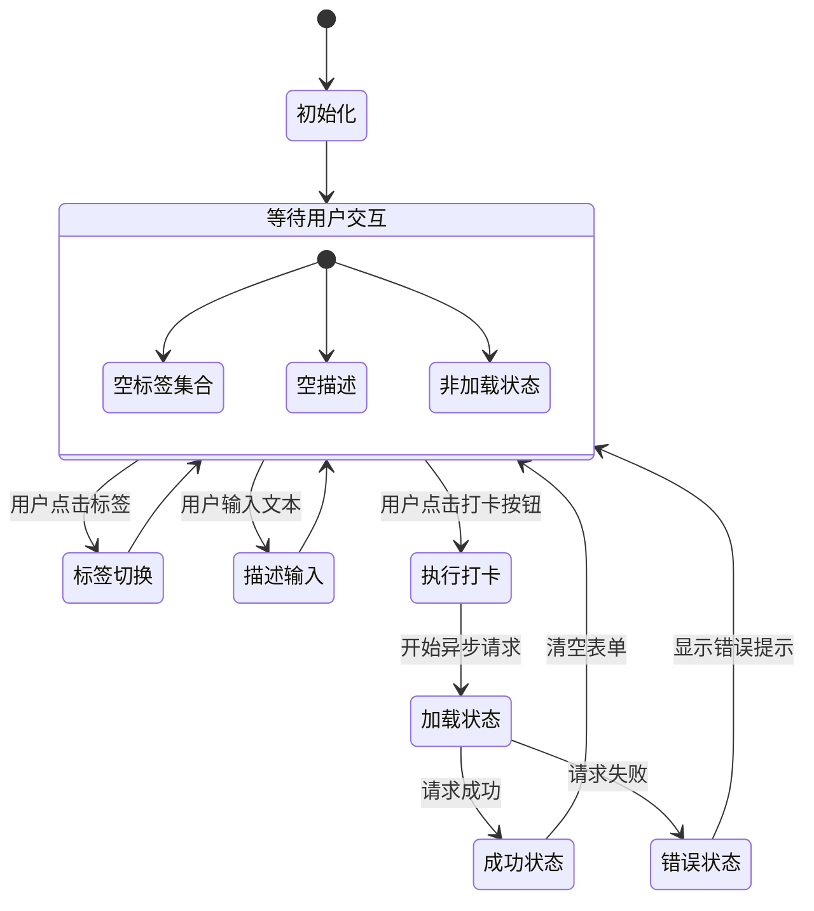
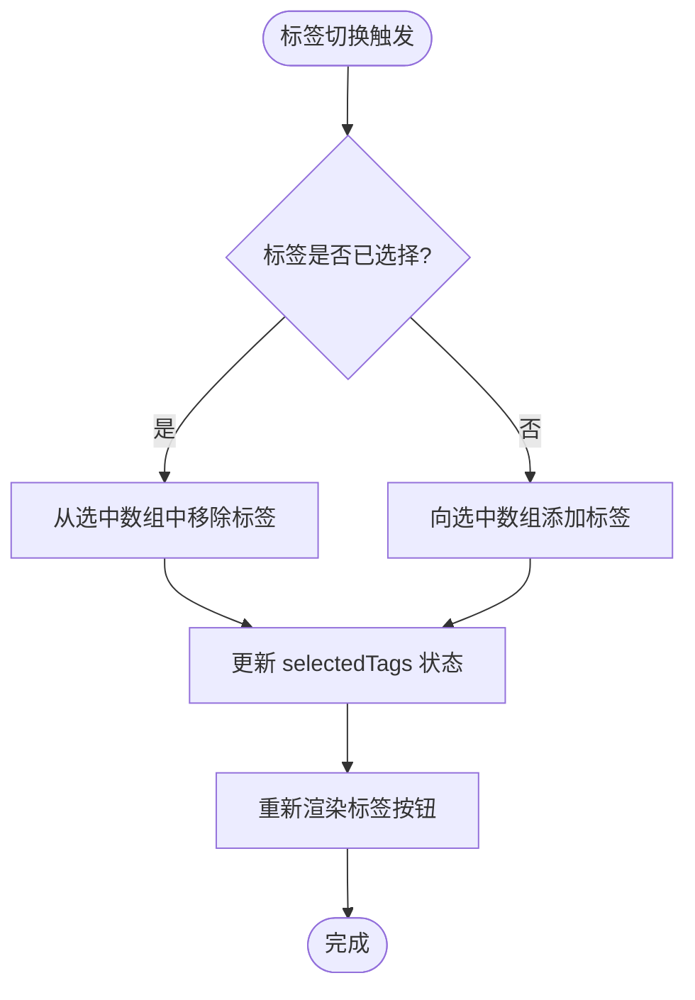
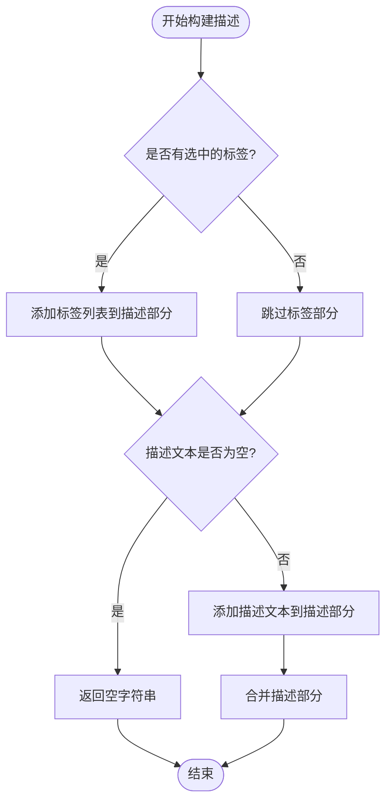
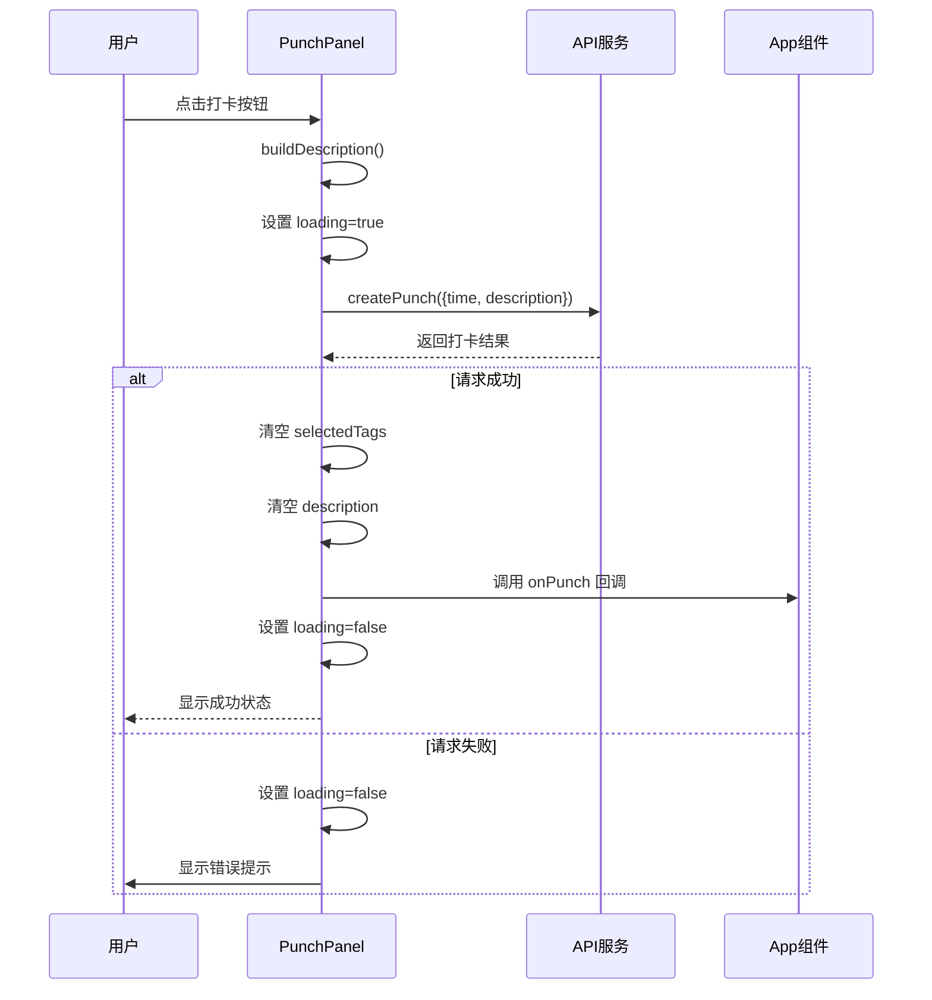
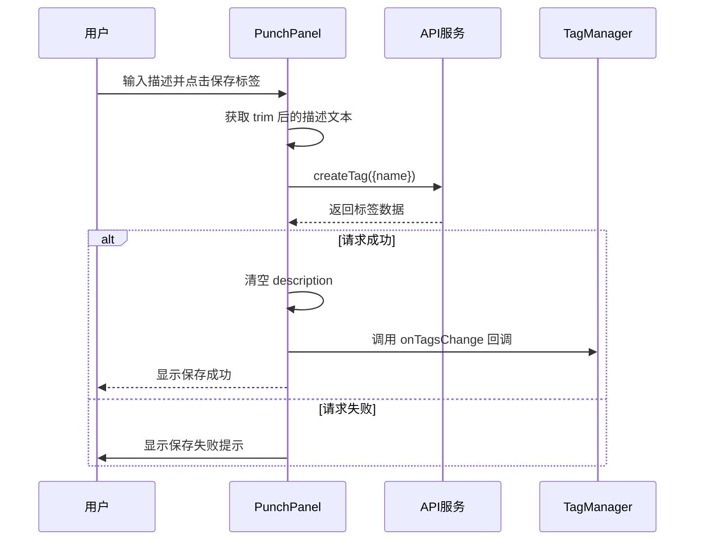
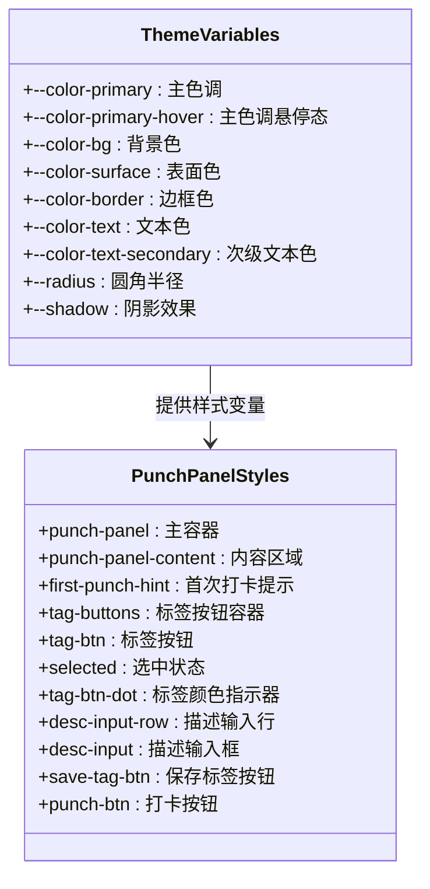
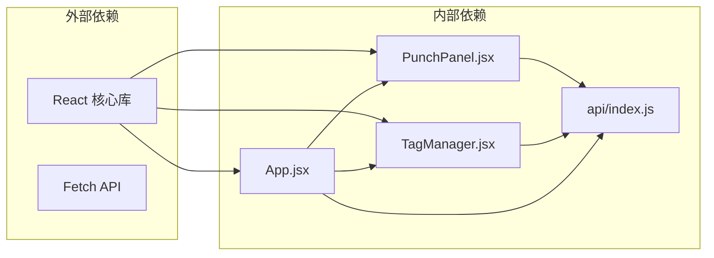
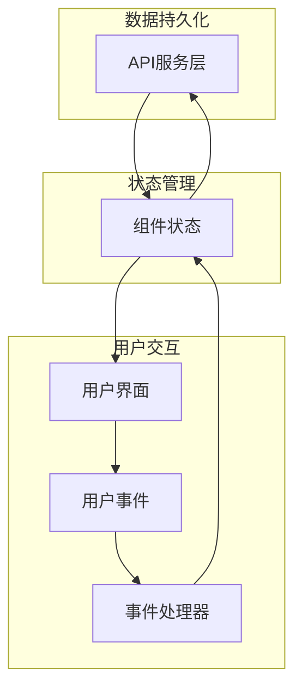

# 打卡面板组件

<cite>
**本文档引用的文件**
- [PunchPanel.jsx](file://client/src/components/PunchPanel.jsx)
- [App.jsx](file://client/src/App.jsx)
- [api/index.js](file://client/src/api/index.js)
- [App.css](file://client/src/App.css)
- [index.css](file://client/src/index.css)
- [TagManager.jsx](file://client/src/components/TagManager.jsx)
- [TagManager.css](file://client/src/components/TagManager.css)
- [StatusBar.jsx](file://client/src/components/StatusBar.jsx)
- [Timeline.jsx](file://client/src/components/Timeline.jsx)
</cite>

## 目录
1. [简介](#简介)
2. [项目结构](#项目结构)
3. [核心组件](#核心组件)
4. [架构概览](#架构概览)
5. [详细组件分析](#详细组件分析)
6. [依赖关系分析](#依赖关系分析)
7. [性能考虑](#性能考虑)
8. [故障排除指南](#故障排除指南)
9. [结论](#结论)
10. [附录](#附录)

## 简介

PunchPanel 打卡面板组件是任务记录系统中的核心交互组件，负责提供用户友好的打卡界面。该组件实现了完整的打卡工作流，包括标签选择、描述输入、打卡操作和标签保存功能。通过简洁直观的界面设计，用户可以快速完成日常打卡记录，并支持标签管理和自定义描述。

组件采用 React 函数式组件设计，结合 Hooks 实现状态管理，提供流畅的用户体验和良好的可维护性。

## 项目结构

该项目采用模块化的前端架构，主要文件组织如下：



**图表来源**
- [App.jsx:10-86](file://client/src/App.jsx#L10-L86)
- [PunchPanel.jsx:1-119](file://client/src/components/PunchPanel.jsx#L1-L119)
- [TagManager.jsx:1-135](file://client/src/components/TagManager.jsx#L1-L135)

**章节来源**
- [App.jsx:1-86](file://client/src/App.jsx#L1-L86)
- [PunchPanel.jsx:1-119](file://client/src/components/PunchPanel.jsx#L1-L119)

## 核心组件

### PunchPanel 组件概述

PunchPanel 是一个功能完整的打卡面板组件，提供以下核心功能：

- **标签选择**：动态渲染标签按钮，支持多选和单选模式
- **描述输入**：文本输入框支持自定义描述
- **打卡操作**：一键完成打卡记录，包含异步处理
- **标签保存**：将描述内容保存为新标签

组件通过 props 接口与父组件通信，实现数据传递和回调处理。

**章节来源**
- [PunchPanel.jsx:4-119](file://client/src/components/PunchPanel.jsx#L4-L119)

## 架构概览

组件采用分层架构设计，确保关注点分离和代码可维护性：



**图表来源**
- [App.jsx:10-86](file://client/src/App.jsx#L10-L86)
- [PunchPanel.jsx:1-119](file://client/src/components/PunchPanel.jsx#L1-L119)
- [api/index.js:1-75](file://client/src/api/index.js#L1-L75)

## 详细组件分析

### Props 接口定义

PunchPanel 组件通过以下 props 接口与父组件通信：

| 属性名 | 类型 | 必需 | 默认值 | 描述 |
|--------|------|------|--------|------|
| tags | Array | ✓ | [] | 标签数组，包含标签的 id、name、color 属性 |
| isFirstPunch | Boolean | ✓ | false | 是否为当天第一次打卡 |
| onPunch | Function | ✗ | undefined | 打卡成功后的回调函数 |
| onTagsChange | Function | ✗ | undefined | 标签变更后的回调函数 |

**章节来源**
- [PunchPanel.jsx:4](file://client/src/components/PunchPanel.jsx#L4)
- [App.jsx:52-57](file://client/src/App.jsx#L52-L57)

### 状态管理机制

组件使用 React Hooks 实现状态管理，包含三个核心状态：



**图表来源**
- [PunchPanel.jsx:5-7](file://client/src/components/PunchPanel.jsx#L5-L7)

#### selectedTags 状态
- **类型**：字符串数组
- **用途**：跟踪用户选择的标签名称
- **管理**：通过 toggleTag 函数实现标签的添加和移除
- **特性**：支持多选，自动去重

#### description 状态
- **类型**：字符串
- **用途**：存储用户输入的描述文本
- **管理**：通过 useState Hook 管理双向绑定
- **特性**：自动去除首尾空白字符

#### loading 状态
- **类型**：布尔值
- **用途**：控制组件的加载状态和按钮禁用
- **管理**：在异步操作期间设置为 true，在 finally 块中重置为 false

**章节来源**
- [PunchPanel.jsx:5-7](file://client/src/components/PunchPanel.jsx#L5-L7)

### 标签切换逻辑

标签切换功能通过 toggleTag 函数实现，采用条件判断和数组过滤的方式：



**图表来源**
- [PunchPanel.jsx:9-15](file://client/src/components/PunchPanel.jsx#L9-L15)

标签切换的核心算法：
1. 检查目标标签是否已在选中数组中
2. 如果存在，则过滤掉该标签
3. 如果不存在，则将该标签添加到数组末尾
4. 使用函数式更新确保状态同步

**章节来源**
- [PunchPanel.jsx:9-15](file://client/src/components/PunchPanel.jsx#L9-L15)

### 描述构建算法

描述构建功能通过 buildDescription 函数实现，遵循以下规则：



**图表来源**
- [PunchPanel.jsx:17-26](file://client/src/components/PunchPanel.jsx#L17-L26)

描述构建规则：
1. 如果有选中的标签，先添加标签列表
2. 如果描述文本非空，再添加描述内容
3. 使用逗号和空格连接各个部分
4. 自动去除首尾空白字符

**章节来源**
- [PunchPanel.jsx:17-26](file://client/src/components/PunchPanel.jsx#L17-L26)

### 异步操作处理

组件实现了完整的异步操作处理流程，包括打卡和标签保存两个主要功能：

#### 打卡操作流程



**图表来源**
- [PunchPanel.jsx:28-45](file://client/src/components/PunchPanel.jsx#L28-L45)
- [api/index.js:9-17](file://client/src/api/index.js#L9-L17)

#### 标签保存流程



**图表来源**
- [PunchPanel.jsx:47-58](file://client/src/components/PunchPanel.jsx#L47-L58)
- [api/index.js:42-50](file://client/src/api/index.js#L42-L50)

**章节来源**
- [PunchPanel.jsx:28-58](file://client/src/components/PunchPanel.jsx#L28-L58)

### 样式定制选项

组件提供了丰富的样式定制选项，支持主题化和响应式设计：

#### 主题变量系统



**图表来源**
- [App.css:1-11](file://client/src/App.css#L1-L11)
- [App.css:250-377](file://client/src/App.css#L250-L377)

#### 响应式设计实现

组件采用移动优先的设计理念，支持多种屏幕尺寸：

| 断点 | 最大宽度 | 特性 |
|------|----------|------|
| 移动端 | 520px | 适配小屏设备，优化触摸体验 |
| 平板端 | 768px | 适配平板设备，调整布局间距 |
| 桌面端 | 1024px | 充分利用大屏空间，优化信息密度 |

**章节来源**
- [App.css:379-385](file://client/src/App.css#L379-L385)

### 使用示例和最佳实践

#### 基础使用示例

```jsx
// 在 App 组件中使用 PunchPanel
function App() {
  const [tags, setTags] = useState([]);
  const [punches, setPunches] = useState([]);
  
  return (
    <div className="app">
      <section className="app-section punch-panel">
        <PunchPanel
          tags={tags}
          isFirstPunch={punches.length === 0}
          onPunch={async () => {
            const data = await getPunches(new Date().toISOString().slice(0, 10));
            setPunches(data);
          }}
          onTagsChange={async () => {
            const data = await getTags();
            setTags(data);
          }}
        />
      </section>
    </div>
  );
}
```

#### 最佳实践建议

1. **状态管理**：确保父组件正确处理异步回调，及时更新状态
2. **错误处理**：在回调函数中实现适当的错误处理和用户反馈
3. **性能优化**：避免不必要的重新渲染，合理使用 useCallback
4. **用户体验**：提供清晰的加载状态和错误提示

**章节来源**
- [App.jsx:52-57](file://client/src/App.jsx#L52-L57)

## 依赖关系分析

### 组件间依赖关系



**图表来源**
- [PunchPanel.jsx:1](file://client/src/components/PunchPanel.jsx#L1)
- [App.jsx:1-8](file://client/src/App.jsx#L1-L8)

### 数据流分析

组件的数据流遵循单向数据流原则，确保状态的一致性和可预测性：



**图表来源**
- [api/index.js:1-75](file://client/src/api/index.js#L1-L75)
- [PunchPanel.jsx:28-58](file://client/src/components/PunchPanel.jsx#L28-L58)

**章节来源**
- [PunchPanel.jsx:1-119](file://client/src/components/PunchPanel.jsx#L1-L119)
- [api/index.js:1-75](file://client/src/api/index.js#L1-L75)

## 性能考虑

### 优化策略

1. **状态更新优化**：使用函数式更新避免不必要的重渲染
2. **事件处理优化**：合理使用 useCallback 包装事件处理器
3. **条件渲染**：根据状态变化进行条件渲染，减少 DOM 操作
4. **样式优化**：使用 CSS 变量减少样式计算开销

### 内存管理

- 及时清理定时器和事件监听器
- 避免内存泄漏，特别是在组件卸载时
- 合理使用闭包，避免捕获不必要的变量

## 故障排除指南

### 常见问题及解决方案

#### 打卡失败问题

**症状**：点击打卡按钮后出现错误提示

**可能原因**：
1. 网络连接异常
2. API 服务器不可用
3. 请求参数格式错误

**解决步骤**：
1. 检查网络连接状态
2. 验证 API 服务可用性
3. 查看浏览器开发者工具中的网络请求
4. 确认请求参数格式正确

#### 标签保存失败

**症状**：点击保存标签按钮后无响应或显示错误

**可能原因**：
1. 描述文本为空
2. 标签名称重复
3. 服务器验证失败

**解决步骤**：
1. 确保描述文本非空
2. 检查标签名称唯一性
3. 查看服务器返回的具体错误信息

#### 样式显示异常

**症状**：组件样式显示不正确或响应式效果异常

**可能原因**：
1. CSS 变量未正确设置
2. 样式冲突
3. 浏览器兼容性问题

**解决步骤**：
1. 检查 CSS 变量定义
2. 验证样式优先级
3. 测试不同浏览器兼容性

**章节来源**
- [PunchPanel.jsx:39-41](file://client/src/components/PunchPanel.jsx#L39-L41)
- [PunchPanel.jsx:54-56](file://client/src/components/PunchPanel.jsx#L54-L56)

## 结论

PunchPanel 打卡面板组件是一个设计精良、功能完整的 React 组件，具有以下特点：

1. **功能完整性**：实现了标签选择、描述输入、打卡操作和标签保存的完整工作流
2. **用户体验优秀**：提供直观的界面设计和流畅的交互体验
3. **代码质量高**：采用现代 React 开发模式，代码结构清晰，易于维护
4. **扩展性强**：通过 props 接口和回调函数实现良好的可扩展性
5. **样式定制灵活**：支持主题化和响应式设计，适应不同需求

该组件为任务记录系统提供了可靠的打卡功能基础，通过合理的架构设计和实现细节，确保了系统的稳定性和可维护性。

## 附录

### API 接口规范

组件使用的 API 接口遵循 RESTful 设计原则：

| 方法 | 端点 | 功能 | 请求体 | 响应 |
|------|------|------|--------|------|
| GET | /api/punches?date={date} | 获取打卡记录 | 无 | 打卡记录数组 |
| POST | /api/punches | 创建打卡记录 | {time, description} | 新创建的打卡记录 |
| PUT | /api/punches/{id}?date={date} | 更新打卡记录 | {time, description} | 更新后的打卡记录 |
| DELETE | /api/punches/{id}?date={date} | 删除打卡记录 | 无 | 无 |
| GET | /api/tags | 获取标签列表 | 无 | 标签数组 |
| POST | /api/tags | 创建标签 | {name} | 新创建的标签 |
| PUT | /api/tags/{id} | 更新标签 | {name, color} | 更新后的标签 |
| DELETE | /api/tags/{id} | 删除标签 | 无 | 删除确认 |

### 样式变量参考

组件使用的主要 CSS 变量：

- `--color-primary`: 主色调 (#4f46e5)
- `--color-primary-hover`: 主色调悬停态 (#4338ca)
- `--color-bg`: 背景色 (#f8f9fa)
- `--color-surface`: 表面色 (#ffffff)
- `--color-border`: 边框色 (#e2e8f0)
- `--color-text`: 文本色 (#1e293b)
- `--color-text-secondary`: 次级文本色 (#64748b)
- `--radius`: 圆角半径 (8px)
- `--shadow`: 阴影效果 (0 1px 3px rgba(0, 0, 0, 0.08))