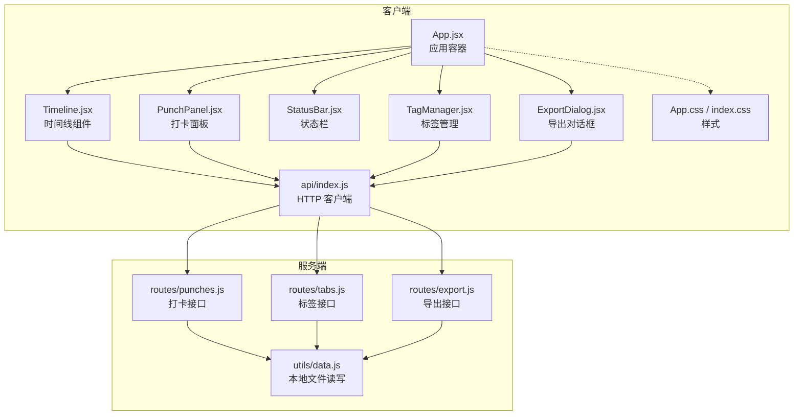
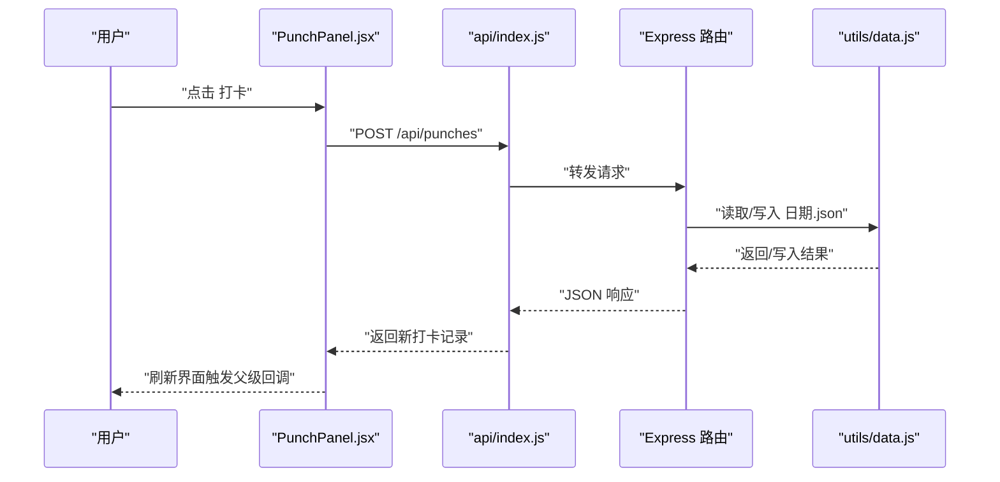
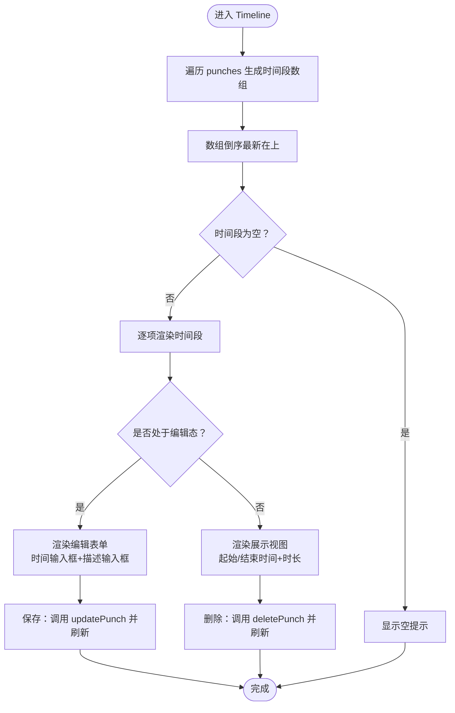
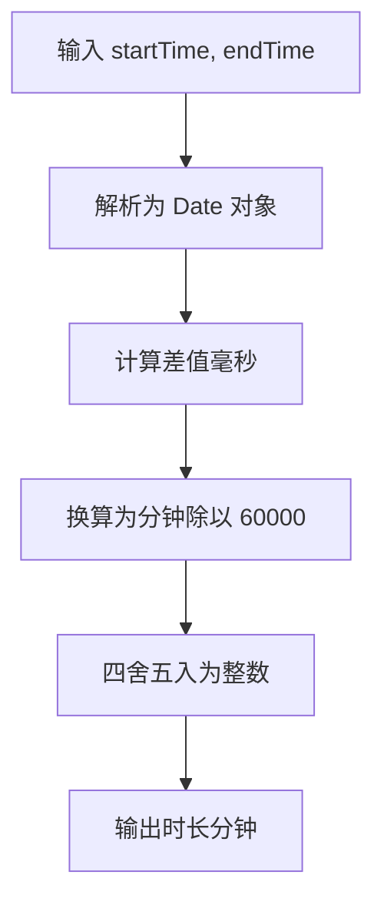
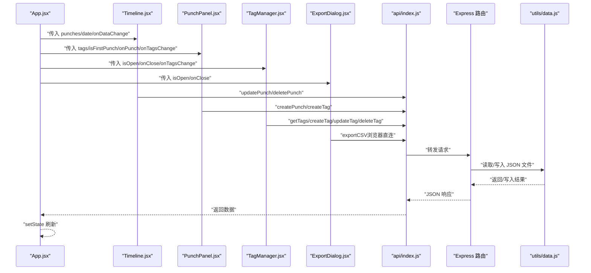
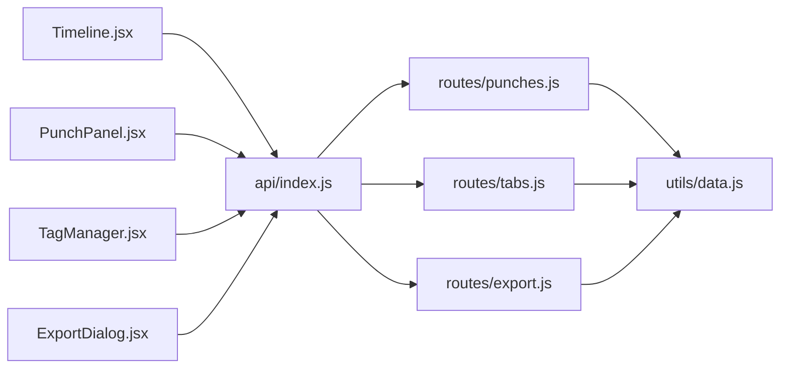

# 时间线组件

<cite>
**本文引用的文件**
- [client/src/components/Timeline.jsx](file://client/src/components/Timeline.jsx)
- [client/src/App.jsx](file://client/src/App.jsx)
- [client/src/api/index.js](file://client/src/api/index.js)
- [client/src/components/PunchPanel.jsx](file://client/src/components/PunchPanel.jsx)
- [client/src/components/StatusBar.jsx](file://client/src/components/StatusBar.jsx)
- [client/src/components/TagManager.jsx](file://client/src/components/TagManager.jsx)
- [client/src/components/ExportDialog.jsx](file://client/src/components/ExportDialog.jsx)
- [client/src/App.css](file://client/src/App.css)
- [client/src/index.css](file://client/src/index.css)
- [server/routes/punches.js](file://server/routes/punches.js)
- [server/utils/data.js](file://server/utils/data.js)
- [server/routes/tabs.js](file://server/routes/tabs.js)
- [server/routes/export.js](file://server/routes/export.js)
</cite>

## 目录
1. [简介](#简介)
2. [项目结构](#项目结构)
3. [核心组件](#核心组件)
4. [架构总览](#架构总览)
5. [详细组件分析](#详细组件分析)
6. [依赖关系分析](#依赖关系分析)
7. [性能考虑](#性能考虑)
8. [故障排查指南](#故障排查指南)
9. [结论](#结论)
10. [附录](#附录)

## 简介
本文件为 Timeline 时间线组件的全面技术文档，覆盖以下主题：
- 核心功能：时间段展示、自动计算、编辑模式与删除操作
- 时间段计算算法：起止时间到时长的逻辑处理
- 数据结构与状态管理：时间段数组组织与实时更新机制
- 交互模式：点击编辑、时间输入框、确认删除等
- 视觉设计：时间段格式化、颜色编码与视觉反馈
- 性能优化与大数据量处理建议
- 组件间数据交互与事件传递机制

## 项目结构
客户端采用 React 单页应用，组件按功能分层组织；服务端使用 Express 提供 REST 接口，数据以 JSON 文件形式存储。

图表来源
- [client/src/App.jsx:10-82](file://client/src/App.jsx#L10-L82)
- [client/src/components/Timeline.jsx:1-138](file://client/src/components/Timeline.jsx#L1-L138)
- [client/src/api/index.js:1-75](file://client/src/api/index.js#L1-L75)
- [server/routes/punches.js:1-117](file://server/routes/punches.js#L1-L117)
- [server/routes/tabs.js:1-75](file://server/routes/tabs.js#L1-L75)
- [server/routes/export.js:1-88](file://server/routes/export.js#L1-L88)
- [server/utils/data.js:1-57](file://server/utils/data.js#L1-L57)

章节来源
- [client/src/App.jsx:1-86](file://client/src/App.jsx#L1-L86)
- [client/src/components/Timeline.jsx:1-138](file://client/src/components/Timeline.jsx#L1-L138)
- [client/src/api/index.js:1-75](file://client/src/api/index.js#L1-L75)

## 核心组件
- Timeline.jsx：负责将打卡记录转换为时间段条目，倒序展示，支持编辑描述与结束时间、删除时间段，并通过回调触发刷新。
- PunchPanel.jsx：提供标签选择、描述输入、快速保存为标签、触发打卡等交互。
- StatusBar.jsx：显示最近一次打卡时间与自上次以来的分钟数。
- TagManager.jsx：维护标签集合，支持增删改查与颜色管理。
- ExportDialog.jsx：提供日期范围选择与 CSV 导出能力。
- api/index.js：封装 /api 前缀下的 HTTP 请求，包括获取/创建/更新/删除打卡与标签，以及导出 CSV。
- 服务端 routes：提供 /api/punches、/api/tags、/api/export 的 REST 接口；数据持久化于 /server/data 下的 JSON 文件。

章节来源
- [client/src/components/Timeline.jsx:1-138](file://client/src/components/Timeline.jsx#L1-L138)
- [client/src/components/PunchPanel.jsx:1-119](file://client/src/components/PunchPanel.jsx#L1-L119)
- [client/src/components/StatusBar.jsx:1-46](file://client/src/components/StatusBar.jsx#L1-L46)
- [client/src/components/TagManager.jsx:1-135](file://client/src/components/TagManager.jsx#L1-L135)
- [client/src/components/ExportDialog.jsx:1-98](file://client/src/components/ExportDialog.jsx#L1-L98)
- [client/src/api/index.js:1-75](file://client/src/api/index.js#L1-L75)
- [server/routes/punches.js:1-117](file://server/routes/punches.js#L1-L117)
- [server/routes/tabs.js:1-75](file://server/routes/tabs.js#L1-L75)
- [server/routes/export.js:1-88](file://server/routes/export.js#L1-L88)
- [server/utils/data.js:1-57](file://server/utils/data.js#L1-L57)

## 架构总览
下图展示了从用户操作到数据持久化的完整链路，以及组件间的调用关系。

图表来源
- [client/src/components/PunchPanel.jsx:28-45](file://client/src/components/PunchPanel.jsx#L28-L45)
- [client/src/api/index.js:9-17](file://client/src/api/index.js#L9-L17)
- [server/routes/punches.js:39-60](file://server/routes/punches.js#L39-L60)
- [server/utils/data.js:17-34](file://server/utils/data.js#L17-L34)

## 详细组件分析

### Timeline 时间线组件
- 功能职责
  - 将打卡数组转换为时间段条目：相邻两条打卡记录配对，形成一个时间段，包含起始时间、结束时间、描述、起止打卡 ID。
  - 倒序展示：最新的时间段排在最上方，便于用户关注最新记录。
  - 自动时长计算：基于结束时间减去开始时间，单位为分钟，四舍五入。
  - 编辑模式：进入编辑态后，允许修改结束时间与描述，保存后调用父级回调刷新数据。
  - 删除操作：删除某个时间段对应的结束打卡，删除后相邻时间段会重新配对，删除前有二次确认提示。
  - 空态提示：当打卡次数少于两次时，显示“暂无时间段记录”的提示信息。

- 数据结构与状态管理
  - 输入属性：punches（按时间升序的打卡数组）、date（当前日期字符串）、onDataChange（用于刷新数据的回调）。
  - 内部状态：editingId、editDesc、editTime，分别控制当前编辑项与编辑表单值。
  - 时间段数组：timeEntries 由循环遍历 punches 生成，key 为结束打卡 ID；最终渲染前进行 reverse 倒序。

- 处理逻辑与算法
  - 时间段生成：i 从 1 到 length-1，以 punches[i-1] 作为起点，punches[i] 作为终点，构造 {id, startTime, endTime, description, startPunchId, endPunchId}。
  - 时长计算：new Date(endTime) - new Date(startTime)，单位毫秒，除以 60000 得到分钟数并四舍五入。
  - 删除流程：确认对话框 -> 调用 deletePunch -> 成功后调用 onDataChange 刷新。

- 交互与视觉反馈
  - 编辑态高亮：当前编辑项添加 timeline-item--editing 类名，背景色变化。
  - 输入控件：时间输入框为原生 time 类型，描述输入为文本框。
  - 按钮行为：编辑/删除/保存/取消，悬停与禁用状态具备基础样式。

- 错误处理
  - 编辑保存与删除均使用 try/catch 包裹，出现异常弹出提示，避免 UI 崩溃。

- 关键路径参考
  - 时间段生成与倒序：[client/src/components/Timeline.jsx:10-23](file://client/src/components/Timeline.jsx#L10-L23)
  - 时长计算函数：[client/src/components/Timeline.jsx:26-29](file://client/src/components/Timeline.jsx#L26-L29)
  - 编辑入口与取消：[client/src/components/Timeline.jsx:32-43](file://client/src/components/Timeline.jsx#L32-L43)
  - 保存与删除：[client/src/components/Timeline.jsx:46-70](file://client/src/components/Timeline.jsx#L46-L70)
  - 渲染与空态：[client/src/components/Timeline.jsx:72-134](file://client/src/components/Timeline.jsx#L72-L134)

图表来源
- [client/src/components/Timeline.jsx:10-70](file://client/src/components/Timeline.jsx#L10-L70)

章节来源
- [client/src/components/Timeline.jsx:1-138](file://client/src/components/Timeline.jsx#L1-L138)

### 时间段计算算法详解
- 输入：两个时间字符串（ISO 8601），分别代表起始与结束。
- 步骤：
  - 解析为 Date 对象；
  - 计算毫秒差；
  - 除以 60000 得到分钟数；
  - 四舍五入得到整数分钟。
- 特性：
  - 支持跨日计算；
  - 负差值将得到负时长，表示顺序错误或未来时间早于过去时间。

图表来源
- [client/src/components/Timeline.jsx:26-29](file://client/src/components/Timeline.jsx#L26-L29)

章节来源
- [client/src/components/Timeline.jsx:26-29](file://client/src/components/Timeline.jsx#L26-L29)

### 交互模式与键盘快捷键
- 点击编辑：点击“编辑”按钮进入编辑态，时间输入框为原生 time 控件，描述输入框为文本框。
- 保存/取消：编辑态底部提供保存与取消按钮，保存成功后退出编辑态并刷新数据。
- 删除：点击“删除”按钮触发确认对话框，确认后删除对应结束打卡并刷新。
- 键盘快捷键：描述输入框支持回车键直接触发打卡（在 PunchPanel 中定义），便于快速录入。

章节来源
- [client/src/components/Timeline.jsx:32-70](file://client/src/components/Timeline.jsx#L32-L70)
- [client/src/components/PunchPanel.jsx:96-96](file://client/src/components/PunchPanel.jsx#L96-L96)

### 视觉设计与颜色编码
- 时间线列表采用细间距边框与圆角背景，条目在编辑态时背景变为浅蓝色以示强调。
- 时间显示使用等宽字体，突出时间字段的可读性；时长以小型标签形式展示。
- 按钮采用主色与危险色区分，悬停时提供过渡动画。
- 标签颜色在前端通过 CSS 变量注入，TagManager 支持为标签设置颜色，PunchPanel 在选择标签时即时应用颜色。

章节来源
- [client/src/App.css:73-224](file://client/src/App.css#L73-L224)
- [client/src/components/PunchPanel.jsx:73-78](file://client/src/components/PunchPanel.jsx#L73-L78)
- [client/src/components/TagManager.jsx:10-10](file://client/src/components/TagManager.jsx#L10-L10)

### 与其他组件的数据交互与事件传递
- App.jsx 作为根组件，负责：
  - 通过 getPunches/getTags 获取初始数据；
  - 将 punches、date 传给 Timeline，将 onDataChange（即 fetchPunches）传给 Timeline；
  - 将标签数据传给 PunchPanel 与 TagManager。
- Timeline.jsx 通过 updatePunch/deletePunch 与服务端交互，成功后调用 onDataChange 刷新。
- PunchPanel.jsx 通过 createPunch/createTag 与服务端交互，成功后调用 onPunch/onTagsChange 刷新。
- TagManager.jsx 通过 getTags/createTag/updateTag/deleteTag 与服务端交互，成功后调用 onTagsChange 刷新。
- ExportDialog.jsx 通过 /api/export 获取 CSV Blob 并触发下载。

图表来源
- [client/src/App.jsx:10-82](file://client/src/App.jsx#L10-L82)
- [client/src/components/Timeline.jsx:46-70](file://client/src/components/Timeline.jsx#L46-L70)
- [client/src/components/PunchPanel.jsx:28-58](file://client/src/components/PunchPanel.jsx#L28-L58)
- [client/src/components/TagManager.jsx:16-69](file://client/src/components/TagManager.jsx#L16-L69)
- [client/src/components/ExportDialog.jsx:29-48](file://client/src/components/ExportDialog.jsx#L29-L48)
- [client/src/api/index.js:3-74](file://client/src/api/index.js#L3-L74)
- [server/routes/punches.js:32-114](file://server/routes/punches.js#L32-L114)
- [server/routes/tabs.js:16-72](file://server/routes/tabs.js#L16-L72)
- [server/routes/export.js:46-84](file://server/routes/export.js#L46-L84)
- [server/utils/data.js:17-56](file://server/utils/data.js#L17-L56)

章节来源
- [client/src/App.jsx:10-82](file://client/src/App.jsx#L10-L82)
- [client/src/components/Timeline.jsx:46-70](file://client/src/components/Timeline.jsx#L46-L70)
- [client/src/components/PunchPanel.jsx:28-58](file://client/src/components/PunchPanel.jsx#L28-L58)
- [client/src/components/TagManager.jsx:16-69](file://client/src/components/TagManager.jsx#L16-L69)
- [client/src/components/ExportDialog.jsx:29-48](file://client/src/components/ExportDialog.jsx#L29-L48)
- [client/src/api/index.js:3-74](file://client/src/api/index.js#L3-L74)

## 依赖关系分析
- 组件耦合
  - Timeline 仅依赖外部传入的 punches、date、onDataChange，内部状态仅限于编辑态标识与表单值，低耦合。
  - PunchPanel 依赖标签数据与回调，负责构建描述并触发打卡。
  - TagManager 与 ExportDialog 与 App 的状态解耦，通过 isOpen/onClose/onTagsChange 与 App 协作。
- 外部依赖
  - api/index.js 封装了所有 /api 请求，统一错误处理与响应格式。
  - 服务端 routes 与 utils/data.js 实现数据持久化，保证前后端一致的 CRUD 行为。

图表来源
- [client/src/components/Timeline.jsx:1-2](file://client/src/components/Timeline.jsx#L1-L2)
- [client/src/components/PunchPanel.jsx:1-2](file://client/src/components/PunchPanel.jsx#L1-L2)
- [client/src/components/TagManager.jsx:1-3](file://client/src/components/TagManager.jsx#L1-L3)
- [client/src/components/ExportDialog.jsx:1-2](file://client/src/components/ExportDialog.jsx#L1-L2)
- [client/src/api/index.js:1-75](file://client/src/api/index.js#L1-L75)
- [server/routes/punches.js:1-117](file://server/routes/punches.js#L1-L117)
- [server/routes/tabs.js:1-75](file://server/routes/tabs.js#L1-L75)
- [server/routes/export.js:1-88](file://server/routes/export.js#L1-L88)
- [server/utils/data.js:1-57](file://server/utils/data.js#L1-L57)

章节来源
- [client/src/components/Timeline.jsx:1-2](file://client/src/components/Timeline.jsx#L1-L2)
- [client/src/components/PunchPanel.jsx:1-2](file://client/src/components/PunchPanel.jsx#L1-L2)
- [client/src/components/TagManager.jsx:1-3](file://client/src/components/TagManager.jsx#L1-L3)
- [client/src/components/ExportDialog.jsx:1-2](file://client/src/components/ExportDialog.jsx#L1-L2)
- [client/src/api/index.js:1-75](file://client/src/api/index.js#L1-L75)
- [server/routes/punches.js:1-117](file://server/routes/punches.js#L1-L117)
- [server/routes/tabs.js:1-75](file://server/routes/tabs.js#L1-L75)
- [server/routes/export.js:1-88](file://server/routes/export.js#L1-L88)
- [server/utils/data.js:1-57](file://server/utils/data.js#L1-L57)

## 性能考虑
- 渲染层面
  - 时间段数组在组件内生成并倒序，复杂度 O(n)；渲染时使用 key 为结束打卡 ID，有利于 React Diff。
  - 编辑态仅影响单个条目，避免全量重渲染。
- 数据获取与更新
  - App 使用 useCallback 包装 fetchPunches/fetchTags，减少不必要的重渲染。
  - 保存/删除后统一调用 onDataChange 刷新，避免重复拉取。
- 大数据量处理建议
  - 当打卡记录较多时，可考虑：
    - 分页加载：按日期分页或按条数分页；
    - 虚拟滚动：仅渲染可视区域内的时间段；
    - 服务端分页：在 /api/punches 增加分页参数；
    - 本地缓存：对当天数据做内存缓存，减少重复 IO。
- 网络与错误处理
  - 所有异步操作均包含 try/catch 与用户提示，避免 UI 卡死；
  - 服务端接口对缺失参数与未找到资源返回明确状态码，便于前端处理。

[本节为通用性能指导，不直接分析具体文件，故无章节来源]

## 故障排查指南
- 无法看到时间段
  - 检查是否至少打卡两次；若少于两次，Timeline 将显示空提示。
  - 确认 App.jsx 已正确调用 getPunches 并将结果传入 Timeline。
- 编辑保存失败
  - 查看网络面板，确认 updatePunch 请求返回 2xx；若失败，前端会弹出错误提示。
  - 检查服务端 routes/punches.js 的 PUT 路由是否正确接收 date 参数。
- 删除失败
  - 确认 deletePunch 请求返回 204；若失败，前端会弹出错误提示。
  - 检查服务端 routes/punches.js 的 DELETE 路由与 data 文件写入逻辑。
- 标签颜色不生效
  - 确认 TagManager 已保存颜色并触发 onTagsChange；
  - 确认 PunchPanel 能正确读取标签列表并应用颜色变量。
- 导出 CSV 失败
  - 检查 ExportDialog 的日期范围是否填写完整；
  - 确认 /api/export 路由返回 2xx 且 Content-Type 为 text/csv；
  - 检查服务端 routes/export.js 的日期范围解析与 CSV 生成逻辑。

章节来源
- [client/src/components/Timeline.jsx:46-70](file://client/src/components/Timeline.jsx#L46-L70)
- [client/src/components/TagManager.jsx:44-69](file://client/src/components/TagManager.jsx#L44-L69)
- [client/src/components/ExportDialog.jsx:29-48](file://client/src/components/ExportDialog.jsx#L29-L48)
- [server/routes/punches.js:62-114](file://server/routes/punches.js#L62-L114)
- [server/routes/export.js:46-84](file://server/routes/export.js#L46-L84)

## 结论
Timeline 组件以简洁的状态机与清晰的职责划分实现了“时间段展示—自动计算—编辑—删除”的完整闭环。其与 PunchPanel、TagManager、ExportDialog 等组件通过统一的 API 层协作，形成良好的扩展性与可维护性。对于大规模数据场景，建议引入分页与虚拟滚动等优化手段，进一步提升用户体验。

[本节为总结性内容，不直接分析具体文件，故无章节来源]

## 附录
- API 接口概览
  - 获取打卡列表：GET /api/punches?date=YYYY-MM-DD
  - 创建打卡：POST /api/punches
  - 更新打卡：PUT /api/punches/:id?date=YYYY-MM-DD
  - 删除打卡：DELETE /api/punches/:id?date=YYYY-MM-DD
  - 获取标签：GET /api/tags
  - 创建标签：POST /api/tags
  - 更新标签：PUT /api/tags/:id
  - 删除标签：DELETE /api/tags/:id
  - 导出 CSV：GET /api/export?start=YYYY-MM-DD&end=YYYY-MM-DD

章节来源
- [client/src/api/index.js:3-74](file://client/src/api/index.js#L3-L74)
- [server/routes/punches.js:32-114](file://server/routes/punches.js#L32-L114)
- [server/routes/tabs.js:16-72](file://server/routes/tabs.js#L16-L72)
- [server/routes/export.js:46-84](file://server/routes/export.js#L46-L84)