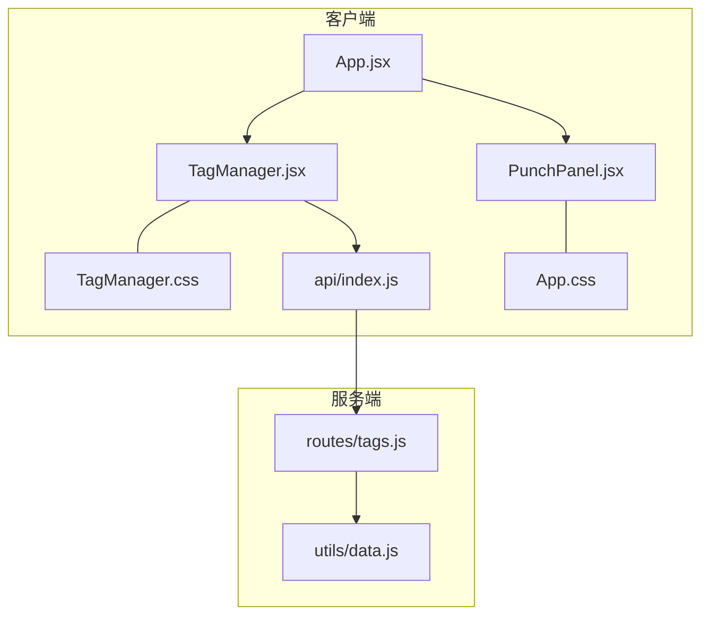
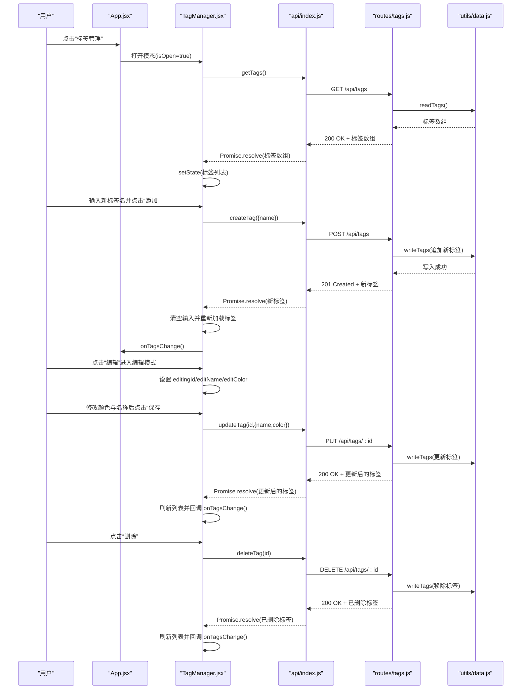
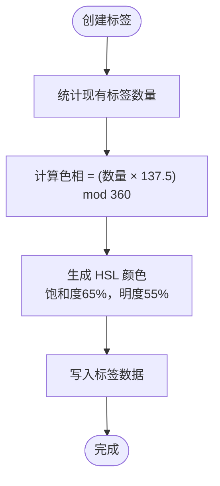
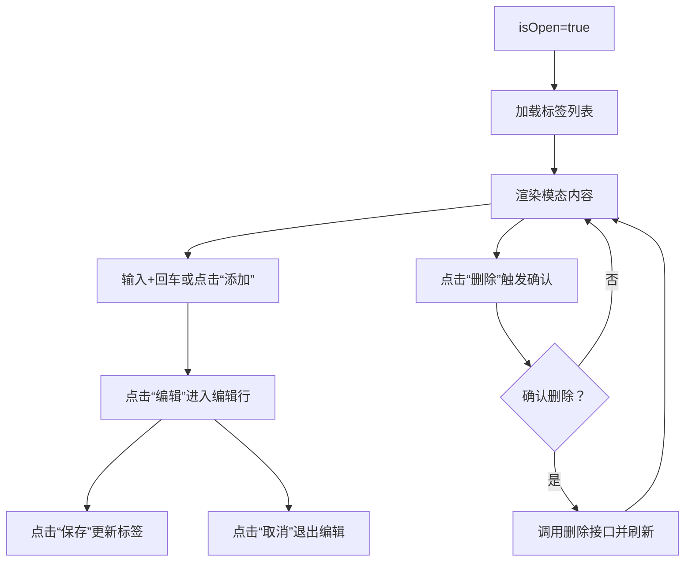
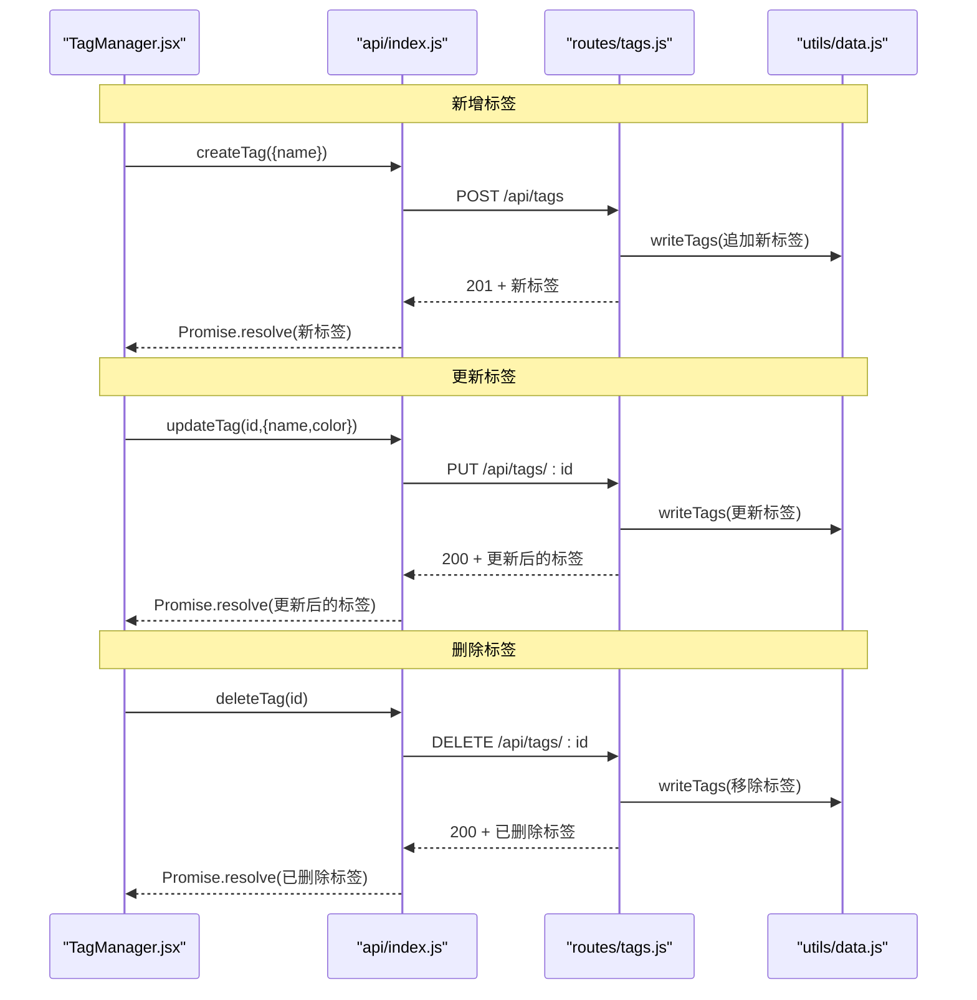
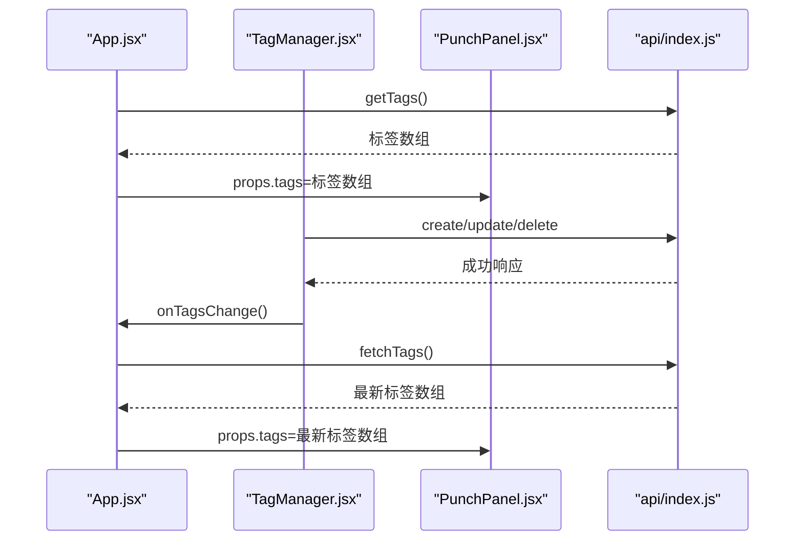
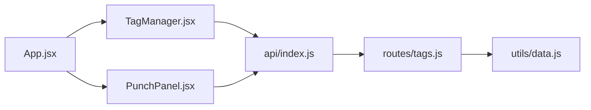

# 标签管理组件

<cite>
**本文档引用的文件**
- [TagManager.jsx](file://client/src/components/TagManager.jsx)
- [TagManager.css](file://client/src/components/TagManager.css)
- [index.js](file://client/src/api/index.js)
- [tags.js](file://server/routes/tags.js)
- [data.js](file://server/utils/data.js)
- [App.jsx](file://client/src/App.jsx)
- [PunchPanel.jsx](file://client/src/components/PunchPanel.jsx)
- [App.css](file://client/src/App.css)
- [index.css](file://client/src/index.css)
</cite>

## 目录
1. [简介](#简介)
2. [项目结构](#项目结构)
3. [核心组件](#核心组件)
4. [架构总览](#架构总览)
5. [详细组件分析](#详细组件分析)
6. [依赖关系分析](#依赖关系分析)
7. [性能考虑](#性能考虑)
8. [故障排除指南](#故障排除指南)
9. [结论](#结论)
10. [附录](#附录)

## 简介
本文件为 TagManager 标签管理组件的全面技术文档，涵盖以下方面：
- 完整功能：标签列表展示、新增标签、编辑标签、删除标签
- 颜色系统：颜色生成算法、预设颜色与自定义颜色支持
- 表单验证：标签名称的有效性与唯一性保障
- 模态对话框设计与用户交互流程
- CRUD 操作的实现细节：API 调用、错误处理、状态更新
- 组件与主应用的数据同步机制与实时刷新策略
- 可访问性与键盘导航支持
- 组件的扩展性与定制化选项

## 项目结构
TagManager 组件位于客户端组件目录中，通过 API 层与服务端路由交互，并与主应用进行状态同步。

图表来源
- [TagManager.jsx:1-135](file://client/src/components/TagManager.jsx#L1-L135)
- [TagManager.css:1-180](file://client/src/components/TagManager.css#L1-L180)
- [index.js:1-75](file://client/src/api/index.js#L1-L75)
- [tags.js:1-75](file://server/routes/tags.js#L1-L75)
- [data.js:1-57](file://server/utils/data.js#L1-L57)
- [App.jsx:1-86](file://client/src/App.jsx#L1-L86)
- [PunchPanel.jsx:1-118](file://client/src/components/PunchPanel.jsx#L1-L118)
- [App.css:260-385](file://client/src/App.css#L260-L385)

章节来源
- [TagManager.jsx:1-135](file://client/src/components/TagManager.jsx#L1-L135)
- [App.jsx:1-86](file://client/src/App.jsx#L1-L86)

## 核心组件
- TagManager：负责标签的增删改查、颜色选择、模态对话框交互与数据刷新
- API 层：封装对 /api/tags 的 HTTP 请求
- 服务端路由：提供标签的 CRUD 接口与颜色生成逻辑
- 数据持久化：基于本地文件存储标签数据
- 主应用：作为容器，控制模态开关与全局数据刷新

章节来源
- [TagManager.jsx:1-135](file://client/src/components/TagManager.jsx#L1-L135)
- [index.js:36-68](file://client/src/api/index.js#L36-L68)
- [tags.js:16-72](file://server/routes/tags.js#L16-L72)
- [data.js:40-56](file://server/utils/data.js#L40-L56)
- [App.jsx:10-86](file://client/src/App.jsx#L10-L86)

## 架构总览
TagManager 采用“组件-API-服务端”的分层架构：
- 视图层：React 组件负责渲染与交互
- 业务层：API 封装网络请求
- 服务层：Express 路由处理标签 CRUD
- 数据层：文件系统持久化

图表来源
- [TagManager.jsx:12-69](file://client/src/components/TagManager.jsx#L12-L69)
- [index.js:36-68](file://client/src/api/index.js#L36-L68)
- [tags.js:16-72](file://server/routes/tags.js#L16-L72)
- [data.js:40-56](file://server/utils/data.js#L40-L56)
- [App.jsx:72-76](file://client/src/App.jsx#L72-L76)

## 详细组件分析

### 组件职责与生命周期
- 状态管理：维护标签列表、新增输入、编辑状态与颜色
- 生命周期：在模态打开时自动拉取标签列表
- 用户交互：添加、编辑、删除、颜色选择、回车提交

章节来源
- [TagManager.jsx:5-14](file://client/src/components/TagManager.jsx#L5-L14)

### 颜色系统实现
- 颜色生成算法：使用黄金角（约 137.5°）在 HSL 色环上均匀分布颜色，确保新标签颜色与现有标签明显区分
- 预设颜色：服务端根据已有标签数量动态计算色相，生成 HSL 颜色值
- 自定义颜色：编辑模式下允许用户通过颜色选择器修改颜色

图表来源
- [tags.js:7-14](file://server/routes/tags.js#L7-L14)

章节来源
- [tags.js:7-14](file://server/routes/tags.js#L7-L14)
- [TagManager.jsx:100-107](file://client/src/components/TagManager.jsx#L100-L107)

### 表单验证机制
- 新增标签：去除前后空白后校验非空；服务端进一步校验名称非空
- 编辑标签：去除前后空白后校验非空；服务端允许部分字段更新（name 或 color）
- 错误处理：统一捕获异常并打印日志；UI 层通过提示或确认框进行用户反馈

章节来源
- [TagManager.jsx:25-27](file://client/src/components/TagManager.jsx#L25-L27)
- [TagManager.jsx:44-46](file://client/src/components/TagManager.jsx#L44-L46)
- [tags.js:24-27](file://server/routes/tags.js#L24-L27)
- [tags.js:51-53](file://server/routes/tags.js#L51-L53)

### 模态对话框设计与交互流程
- 打开条件：父组件通过 isOpen 控制显示
- 关闭方式：点击遮罩层、关闭按钮或内部点击不冒泡
- 布局结构：标题、新增区域、标签列表、空状态提示
- 交互细节：编辑模式切换、颜色选择器、确认删除对话框

图表来源
- [TagManager.jsx:71-73](file://client/src/components/TagManager.jsx#L71-L73)
- [TagManager.jsx:77-134](file://client/src/components/TagManager.jsx#L77-L134)

章节来源
- [TagManager.jsx:75-134](file://client/src/components/TagManager.jsx#L75-L134)
- [TagManager.css:1-180](file://client/src/components/TagManager.css#L1-L180)

### CRUD 操作实现细节
- 获取标签：GET /api/tags
- 新增标签：POST /api/tags，服务端自动生成颜色
- 更新标签：PUT /api/tags/:id，支持仅更新 name 或 color
- 删除标签：DELETE /api/tags/:id

图表来源
- [index.js:42-68](file://client/src/api/index.js#L42-L68)
- [tags.js:22-72](file://server/routes/tags.js#L22-L72)
- [data.js:53-56](file://server/utils/data.js#L53-L56)

章节来源
- [index.js:36-68](file://client/src/api/index.js#L36-L68)
- [tags.js:16-72](file://server/routes/tags.js#L16-L72)
- [data.js:40-56](file://server/utils/data.js#L40-L56)

### 数据同步与实时刷新策略
- TagManager 在 isOpen 为真时自动加载标签列表
- 每次新增、编辑、删除后重新加载并调用 onTagsChange 回调
- 主应用 App.jsx 通过 fetchTags 与 PunchPanel.jsx 共享标签数据，实现跨组件同步

图表来源
- [App.jsx:17-24](file://client/src/App.jsx#L17-L24)
- [App.jsx:52-57](file://client/src/App.jsx#L52-L57)
- [TagManager.jsx:32-32](file://client/src/components/TagManager.jsx#L32-L32)
- [TagManager.jsx:50-50](file://client/src/components/TagManager.jsx#L50-L50)

章节来源
- [App.jsx:10-86](file://client/src/App.jsx#L10-L86)
- [TagManager.jsx:12-14](file://client/src/components/TagManager.jsx#L12-L14)
- [TagManager.jsx:32-32](file://client/src/components/TagManager.jsx#L32-L32)
- [TagManager.jsx:50-50](file://client/src/components/TagManager.jsx#L50-L50)

### 可访问性与键盘导航
- 键盘支持：新增标签支持 Enter 键快速提交
- 焦点管理：输入框获得焦点时有视觉反馈
- 语义化结构：使用语义化 HTML 结构与按钮元素
- 颜色对比：颜色系统保证标签颜色在界面中有良好对比度

章节来源
- [TagManager.jsx:71-73](file://client/src/components/TagManager.jsx#L71-L73)
- [TagManager.css:61-73](file://client/src/components/TagManager.css#L61-L73)
- [App.css:282-314](file://client/src/App.css#L282-L314)

### 扩展性与定制化选项
- 颜色定制：编辑模式下支持任意 HSL 颜色值
- 标签数量：颜色生成算法随标签数量线性扩展
- UI 定制：CSS 变量与类名便于主题定制
- 功能扩展：可增加标签分组、排序、搜索等能力

章节来源
- [TagManager.jsx:100-107](file://client/src/components/TagManager.jsx#L100-L107)
- [tags.js:10-14](file://server/routes/tags.js#L10-L14)
- [TagManager.css:1-180](file://client/src/components/TagManager.css#L1-L180)

## 依赖关系分析

图表来源
- [TagManager.jsx:1-3](file://client/src/components/TagManager.jsx#L1-L3)
- [index.js:1-75](file://client/src/api/index.js#L1-L75)
- [tags.js:1-75](file://server/routes/tags.js#L1-L75)
- [data.js:1-57](file://server/utils/data.js#L1-L57)
- [App.jsx:1-86](file://client/src/App.jsx#L1-L86)
- [PunchPanel.jsx:1-118](file://client/src/components/PunchPanel.jsx#L1-L118)

章节来源
- [TagManager.jsx:1-3](file://client/src/components/TagManager.jsx#L1-L3)
- [index.js:1-75](file://client/src/api/index.js#L1-L75)
- [tags.js:1-75](file://server/routes/tags.js#L1-L75)
- [data.js:1-57](file://server/utils/data.js#L1-L57)
- [App.jsx:1-86](file://client/src/App.jsx#L1-L86)
- [PunchPanel.jsx:1-118](file://client/src/components/PunchPanel.jsx#L1-L118)

## 性能考虑
- 网络请求：每次 CRUD 后重新加载标签列表，避免重复请求
- 渲染优化：列表项使用 key=id，减少不必要的重渲染
- 存储效率：标签数据以 JSON 文件形式存储，读写简单高效
- 主题变量：使用 CSS 变量减少样式重算成本

## 故障排除指南
- 无法打开标签管理：检查 isOpen 是否正确传递
- 新增失败：确认服务端返回 400 且提示“标签名称不能为空”
- 更新失败：确认标签 ID 存在且服务端返回 404
- 删除失败：确认确认对话框未被阻止
- 颜色异常：检查编辑模式下的颜色值是否为合法 HSL 值

章节来源
- [TagManager.jsx:60-69](file://client/src/components/TagManager.jsx#L60-L69)
- [tags.js:24-27](file://server/routes/tags.js#L24-L27)
- [tags.js:47-49](file://server/routes/tags.js#L47-L49)

## 结论
TagManager 组件通过清晰的职责划分与简洁的交互设计，实现了完整的标签管理功能。其颜色生成算法确保了良好的视觉区分度，而与主应用的数据同步机制则保证了跨组件的一致性。组件具备良好的扩展性与可定制性，适合在复杂场景中进一步增强功能。

## 附录
- 样式变量参考：组件使用 CSS 变量实现主题化，便于整体风格统一
- 主题适配：可在根样式中调整变量值以适配不同主题

章节来源
- [index.css:1-24](file://client/src/index.css#L1-L24)
- [TagManager.css:1-180](file://client/src/components/TagManager.css#L1-L180)
- [App.css:260-385](file://client/src/App.css#L260-L385)