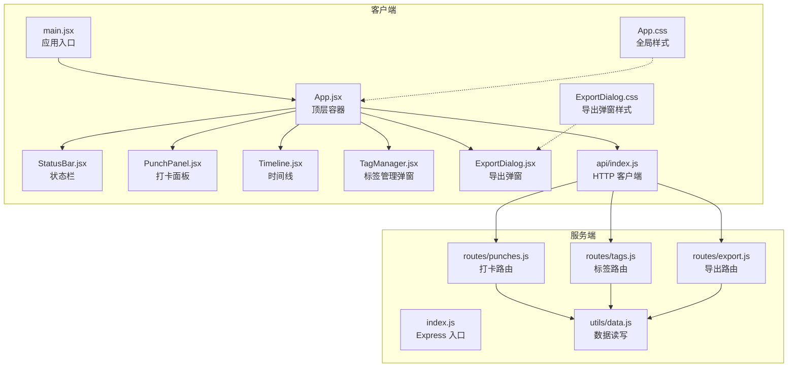
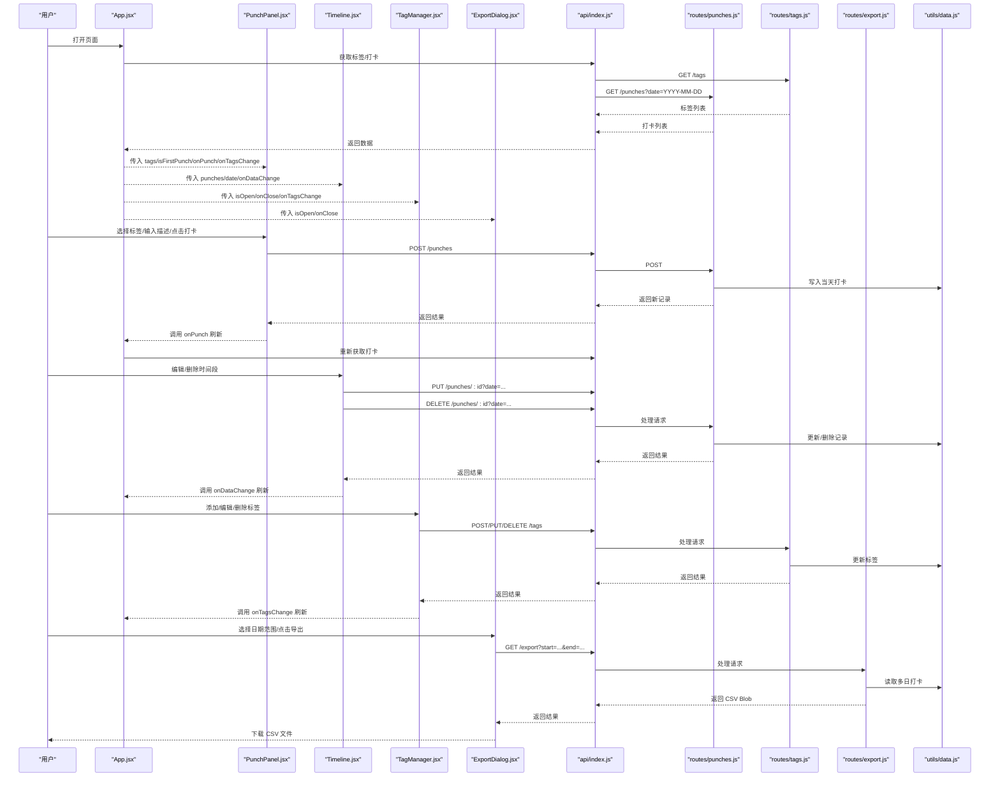
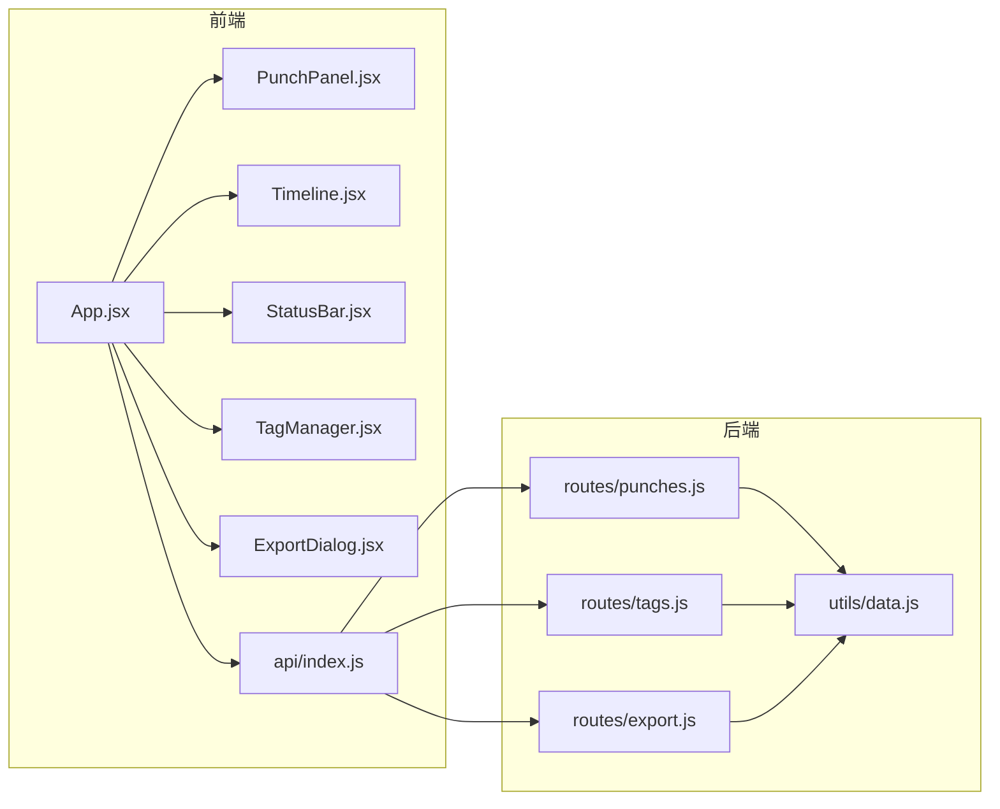

# 核心组件

<cite>
**本文引用的文件**
- [client/src/App.jsx](file://client/src/App.jsx)
- [client/src/main.jsx](file://client/src/main.jsx)
- [client/src/components/PunchPanel.jsx](file://client/src/components/PunchPanel.jsx)
- [client/src/components/StatusBar.jsx](file://client/src/components/StatusBar.jsx)
- [client/src/components/TagManager.jsx](file://client/src/components/TagManager.jsx)
- [client/src/components/ExportDialog.jsx](file://client/src/components/ExportDialog.jsx)
- [client/src/components/Timeline.jsx](file://client/src/components/Timeline.jsx)
- [client/src/api/index.js](file://client/src/api/index.js)
- [client/src/App.css](file://client/src/App.css)
- [client/src/components/ExportDialog.css](file://client/src/components/ExportDialog.css)
- [server/routes/punches.js](file://server/routes/punches.js)
- [server/routes/tags.js](file://server/routes/tags.js)
- [server/routes/export.js](file://server/routes/export.js)
- [server/utils/data.js](file://server/utils/data.js)
- [package.json](file://package.json)
- [client/package.json](file://client/package.json)
- [server/package.json](file://server/package.json)
</cite>

## 目录
1. [简介](#简介)
2. [项目结构](#项目结构)
3. [核心组件](#核心组件)
4. [架构总览](#架构总览)
5. [详细组件分析](#详细组件分析)
6. [依赖分析](#依赖分析)
7. [性能考虑](#性能考虑)
8. [故障排查指南](#故障排查指南)
9. [结论](#结论)
10. [附录](#附录)

## 简介
本项目是一个轻量的时间段记录与导出应用，前端基于 React，后端基于 Express。核心功能包括：
- 打卡记录：支持按日记录时间点，并自动生成相邻打卡之间的时间段。
- 标签系统：可创建、编辑、删除标签，并在打卡时快速选择。
- 时间线展示：以倒序方式展示时间段列表，支持编辑与删除。
- 导出功能：按日期范围导出 CSV 文件，便于统计与归档。

组件间通过统一的 API 层进行数据交互，状态集中在顶层组件中管理，子组件通过回调函数进行联动更新。

## 项目结构
前端采用按组件分层的组织方式，核心组件位于 client/src/components，API 请求封装于 client/src/api，入口文件位于 client/src/main.jsx。后端路由位于 server/routes，数据持久化工具位于 server/utils/data.js。

图表来源
- [client/src/main.jsx:1-11](file://client/src/main.jsx#L1-L11)
- [client/src/App.jsx:1-86](file://client/src/App.jsx#L1-L86)
- [client/src/components/StatusBar.jsx:1-46](file://client/src/components/StatusBar.jsx#L1-L46)
- [client/src/components/PunchPanel.jsx:1-119](file://client/src/components/PunchPanel.jsx#L1-L119)
- [client/src/components/Timeline.jsx:1-138](file://client/src/components/Timeline.jsx#L1-L138)
- [client/src/components/TagManager.jsx:1-135](file://client/src/components/TagManager.jsx#L1-L135)
- [client/src/components/ExportDialog.jsx:1-98](file://client/src/components/ExportDialog.jsx#L1-L98)
- [client/src/api/index.js:1-75](file://client/src/api/index.js#L1-L75)
- [client/src/App.css:1-385](file://client/src/App.css#L1-L385)
- [client/src/components/ExportDialog.css:1-77](file://client/src/components/ExportDialog.css#L1-L77)
- [server/routes/punches.js:1-117](file://server/routes/punches.js#L1-L117)
- [server/routes/tags.js:1-75](file://server/routes/tags.js#L1-L75)
- [server/routes/export.js:1-88](file://server/routes/export.js#L1-L88)
- [server/utils/data.js:1-57](file://server/utils/data.js#L1-L57)

章节来源
- [client/src/main.jsx:1-11](file://client/src/main.jsx#L1-L11)
- [client/src/App.jsx:1-86](file://client/src/App.jsx#L1-L86)
- [client/src/App.css:1-385](file://client/src/App.css#L1-L385)
- [client/src/components/ExportDialog.css:1-77](file://client/src/components/ExportDialog.css#L1-L77)
- [server/routes/punches.js:1-117](file://server/routes/punches.js#L1-L117)
- [server/routes/tags.js:1-75](file://server/routes/tags.js#L1-L75)
- [server/routes/export.js:1-88](file://server/routes/export.js#L1-L88)
- [server/utils/data.js:1-57](file://server/utils/data.js#L1-L57)

## 核心组件
本节概述顶层容器 App 以及各核心子组件的职责、数据流与交互关系。

- App（顶层容器）
  - 职责：集中管理应用状态（标签、打卡记录、当前日期）、发起数据拉取、协调子组件。
  - 数据流：从 API 拉取标签与打卡记录；向子组件传递 props；接收回调刷新数据。
  - 关键状态：showTagManager、showExportDialog、punches、tags、date。
  - 关键回调：onPunch、onTagsChange。
- PunchPanel（打卡面板）
  - 职责：选择标签、输入描述、触发打卡；支持将描述保存为新标签。
  - 数据流：构建描述字符串，调用 createPunch/createTag，成功后回调通知 App 刷新。
- Timeline（时间线）
  - 职责：将相邻打卡配对为时间段，展示时长；支持编辑结束时间与描述、删除时间段。
  - 数据流：计算时间段列表，调用 updatePunch/deletePunch，完成后回调通知 App 刷新。
- StatusBar（状态栏）
  - 职责：显示最近一次打卡时间与距今已过分钟数。
  - 数据流：根据 lastPunchTime 计算并定时更新。
- TagManager（标签管理弹窗）
  - 职责：增删改查标签；打开时加载标签；变更后通知 App 刷新。
- ExportDialog（导出弹窗）
  - 职责：选择日期范围并触发 CSV 导出；提供“今天”“本周”快捷设置。
  - 数据流：调用 /api/export，下载 CSV 文件。

章节来源
- [client/src/App.jsx:10-86](file://client/src/App.jsx#L10-L86)
- [client/src/components/PunchPanel.jsx:4-119](file://client/src/components/PunchPanel.jsx#L4-L119)
- [client/src/components/Timeline.jsx:4-138](file://client/src/components/Timeline.jsx#L4-L138)
- [client/src/components/StatusBar.jsx:3-46](file://client/src/components/StatusBar.jsx#L3-L46)
- [client/src/components/TagManager.jsx:5-135](file://client/src/components/TagManager.jsx#L5-L135)
- [client/src/components/ExportDialog.jsx:4-98](file://client/src/components/ExportDialog.jsx#L4-L98)

## 架构总览
下图展示了从前端到后端的数据流与交互路径，以及组件之间的依赖关系。

图表来源
- [client/src/App.jsx:17-38](file://client/src/App.jsx#L17-L38)
- [client/src/components/PunchPanel.jsx:28-58](file://client/src/components/PunchPanel.jsx#L28-L58)
- [client/src/components/Timeline.jsx:46-70](file://client/src/components/Timeline.jsx#L46-L70)
- [client/src/components/TagManager.jsx:25-69](file://client/src/components/TagManager.jsx#L25-L69)
- [client/src/components/ExportDialog.jsx:29-48](file://client/src/components/ExportDialog.jsx#L29-L48)
- [client/src/api/index.js:3-75](file://client/src/api/index.js#L3-L75)
- [server/routes/punches.js:32-114](file://server/routes/punches.js#L32-L114)
- [server/routes/tags.js:16-72](file://server/routes/tags.js#L16-L72)
- [server/routes/export.js:46-85](file://server/routes/export.js#L46-L85)
- [server/utils/data.js:17-56](file://server/utils/data.js#L17-L56)

## 详细组件分析

### App（顶层容器）
- 功能职责
  - 初始化当前日期、管理弹窗开关。
  - 并发拉取标签与打卡数据，计算“是否首次打卡”与“最后打卡时间”。
  - 向子组件传递状态与回调，协调数据刷新。
- 关键 Props 与回调
  - 无直接 props；通过内部状态控制子组件渲染。
  - 回调：onPunch、onTagsChange。
- 状态管理
  - showTagManager、showExportDialog 控制弹窗显隐。
  - punches、tags 存储远端数据。
  - date 用于限定查询范围。
- 性能与优化
  - 使用 useCallback 包装异步函数，避免重复渲染导致的重复请求。
  - useEffect 在依赖变化时触发数据拉取，减少无效请求。
- 可定制性
  - 可扩展为支持多日期切换或跨日聚合。
- 响应式设计
  - 应用容器与组件样式均支持移动端宽度适配。

章节来源
- [client/src/App.jsx:10-86](file://client/src/App.jsx#L10-L86)

### PunchPanel（打卡面板）
- 功能职责
  - 提供标签选择区（多选）、描述输入区、保存为标签按钮、打卡按钮。
  - 构建描述字符串（标签名+自定义描述），调用 API 创建打卡或标签。
- 关键 Props
  - tags：标签列表。
  - isFirstPunch：是否为当日首次打卡。
  - onPunch、onTagsChange：成功后的刷新回调。
- 状态与交互
  - selectedTags：多选标签名集合。
  - description：自定义描述。
  - loading：提交中状态。
- 错误处理
  - 打卡与标签创建失败时弹出提示并记录错误。
- 视觉与交互
  - 标签按钮支持选中态与颜色高亮。
  - 输入框聚焦态有边框高亮。
  - Enter 键可直接触发打卡。
- 性能与优化
  - 使用本地状态管理，避免不必要的父级重渲染。
  - 构建描述字符串时去空格与合并，减少冗余信息。

章节来源
- [client/src/components/PunchPanel.jsx:4-119](file://client/src/components/PunchPanel.jsx#L4-L119)

### Timeline（时间线）
- 功能职责
  - 将相邻打卡配对为时间段，展示起止时间与时长。
  - 支持进入/退出编辑模式，修改结束时间与描述，或删除时间段。
- 关键 Props
  - punches：当日打卡列表。
  - date：当前日期。
  - onDataChange：刷新回调。
- 状态与交互
  - editingId、editDesc、editTime：编辑模式下的临时状态。
  - 计算 timeEntries 并倒序展示。
- 数据处理逻辑
  - 两两配对相邻记录，计算时长（分钟）。
  - 编辑保存时调用 updatePunch，删除时调用 deletePunch。
- 错误处理
  - 删除前二次确认；保存/删除失败时弹出提示。
- 视觉与交互
  - 编辑态背景色变化，输入控件高亮。
  - 按钮分组右对齐，支持 hover 效果。
- 性能与优化
  - 仅在需要时计算 timeEntries，避免每次渲染重复计算。
  - 使用不可变更新策略，减少不必要的重渲染。

章节来源
- [client/src/components/Timeline.jsx:4-138](file://client/src/components/Timeline.jsx#L4-L138)

### StatusBar（状态栏）
- 功能职责
  - 显示“上次打卡时间”和“距今已用时（分钟）”。
  - 当未打卡时显示提示文案。
- 关键 Props
  - lastPunchTime：最近一次打卡时间。
- 状态与交互
  - elapsed：分钟数，每分钟更新一次。
  - 使用定时器每分钟刷新。
- 视觉与交互
  - 左右布局，标签与数值分列显示。
  - 数值加粗，标签为次级文字色。

章节来源
- [client/src/components/StatusBar.jsx:3-46](file://client/src/components/StatusBar.jsx#L3-L46)

### TagManager（标签管理弹窗）
- 功能职责
  - 新增标签（自动分配颜色）、编辑标签（名称与颜色）、删除标签。
  - 打开时加载标签，变更后通知 App 刷新。
- 关键 Props
  - isOpen、onClose、onTagsChange。
- 状态与交互
  - tags：标签列表。
  - newName：新增标签名。
  - editingId、editName、editColor：编辑态临时状态。
- 颜色生成
  - 基于黄金角（137.5°）生成可区分的 HSL 颜色。
- 错误处理
  - 输入校验与确认对话框，失败时记录错误。
- 视觉与交互
  - 列表项支持切换为编辑行，颜色选择器与输入框组合。
  - 按钮 hover 效果与禁用态。

章节来源
- [client/src/components/TagManager.jsx:5-135](file://client/src/components/TagManager.jsx#L5-L135)
- [server/routes/tags.js:10-14](file://server/routes/tags.js#L10-L14)

### ExportDialog（导出弹窗）
- 功能职责
  - 选择开始/结束日期，一键导出 CSV。
  - 提供“今天”“本周”快捷设置。
- 关键 Props
  - isOpen、onClose。
- 状态与交互
  - startDate、endDate：日期选择。
  - exporting：导出中状态。
- 导出流程
  - 调用 /api/export，下载 Blob 为 CSV 文件。
- 错误处理
  - 参数缺失、网络异常时弹出提示。
- 视觉与交互
  - 快捷按钮与日期输入区域清晰分层。
  - 导出按钮禁用态与 hover 效果。

章节来源
- [client/src/components/ExportDialog.jsx:4-98](file://client/src/components/ExportDialog.jsx#L4-L98)
- [client/src/components/ExportDialog.css:1-77](file://client/src/components/ExportDialog.css#L1-L77)

### API 客户端（api/index.js）
- 功能职责
  - 封装 /api 下的 CRUD 与导出接口，统一错误处理。
- 关键接口
  - 打卡：GET /punches、POST /punches、PUT /punches/:id、DELETE /punches/:id。
  - 标签：GET /tags、POST /tags、PUT /tags/:id、DELETE /tags/:id。
  - 导出：GET /export。
- 错误处理
  - 对非 OK 响应抛出错误，由调用方捕获并提示。

章节来源
- [client/src/api/index.js:3-75](file://client/src/api/index.js#L3-L75)

### 样式与响应式
- App.css
  - 定义主题变量与通用布局，为各组件提供一致的间距、圆角与阴影。
  - Timeline、PunchPanel、StatusBar 等区域的专用样式块。
  - 移动端断点（max-width: 520px）调整容器内边距与最大宽度。
- ExportDialog.css
  - 为导出弹窗提供独立的快捷按钮、日期输入与导出按钮样式。

章节来源
- [client/src/App.css:1-385](file://client/src/App.css#L1-L385)
- [client/src/components/ExportDialog.css:1-77](file://client/src/components/ExportDialog.css#L1-L77)

## 依赖分析
- 组件耦合
  - App 作为中心节点，耦合 PunchPanel、Timeline、StatusBar、TagManager、ExportDialog。
  - 子组件通过回调与 App 解耦，降低双向依赖。
- 外部依赖
  - 前端：React、React DOM、Vite。
  - 后端：Express、UUID、CORS。
- 数据依赖
  - 所有数据读写通过 /api 路由与 server/utils/data.js 实现，文件系统持久化。

图表来源
- [client/src/App.jsx:1-86](file://client/src/App.jsx#L1-L86)
- [client/src/components/PunchPanel.jsx:1-119](file://client/src/components/PunchPanel.jsx#L1-L119)
- [client/src/components/Timeline.jsx:1-138](file://client/src/components/Timeline.jsx#L1-L138)
- [client/src/components/StatusBar.jsx:1-46](file://client/src/components/StatusBar.jsx#L1-L46)
- [client/src/components/TagManager.jsx:1-135](file://client/src/components/TagManager.jsx#L1-L135)
- [client/src/components/ExportDialog.jsx:1-98](file://client/src/components/ExportDialog.jsx#L1-L98)
- [client/src/api/index.js:1-75](file://client/src/api/index.js#L1-L75)
- [server/routes/punches.js:1-117](file://server/routes/punches.js#L1-L117)
- [server/routes/tags.js:1-75](file://server/routes/tags.js#L1-L75)
- [server/routes/export.js:1-88](file://server/routes/export.js#L1-L88)
- [server/utils/data.js:1-57](file://server/utils/data.js#L1-L57)

章节来源
- [package.json:1-14](file://package.json#L1-L14)
- [client/package.json:1-20](file://client/package.json#L1-L20)
- [server/package.json:1-15](file://server/package.json#L1-L15)

## 性能考虑
- 渲染优化
  - 使用 useCallback 包装异步函数，避免重复渲染导致的重复请求。
  - 子组件使用本地状态，减少父级状态变更引发的重渲染。
- 数据处理
  - Timeline 中仅在需要时计算时间段列表，避免每次渲染重复计算。
  - StatusBar 使用定时器每分钟更新，避免高频重渲染。
- 网络请求
  - App 在挂载时并发拉取标签与打卡，减少等待时间。
  - 导出弹窗在请求期间禁用按钮，防止重复请求。
- 存储与 IO
  - 服务端按天拆分 JSON 文件，避免单文件过大；读写时进行排序与去重处理。

## 故障排查指南
- 打卡失败
  - 现象：点击“打卡”后弹出提示。
  - 排查：检查网络请求是否成功，确认 /api/punches 是否返回 201。
  - 参考
    - [client/src/components/PunchPanel.jsx:39-44](file://client/src/components/PunchPanel.jsx#L39-L44)
    - [client/src/api/index.js:9-17](file://client/src/api/index.js#L9-L17)
    - [server/routes/punches.js:39-60](file://server/routes/punches.js#L39-L60)
- 编辑/删除时间段失败
  - 现象：点击“保存/删除”后弹出提示。
  - 排查：确认 /api/punches/:id 的 date 查询参数是否正确，服务端是否返回 200/204。
  - 参考
    - [client/src/components/Timeline.jsx:46-70](file://client/src/components/Timeline.jsx#L46-L70)
    - [client/src/api/index.js:19-34](file://client/src/api/index.js#L19-L34)
    - [server/routes/punches.js:62-114](file://server/routes/punches.js#L62-L114)
- 标签管理异常
  - 现象：添加/编辑/删除标签失败。
  - 排查：确认 /api/tags 的请求体格式与服务端校验规则。
  - 参考
    - [client/src/components/TagManager.jsx:25-69](file://client/src/components/TagManager.jsx#L25-L69)
    - [client/src/api/index.js:42-68](file://client/src/api/index.js#L42-L68)
    - [server/routes/tags.js:16-72](file://server/routes/tags.js#L16-L72)
- 导出失败
  - 现象：点击“导出 CSV”后无响应或提示失败。
  - 排查：确认 /api/export 的 start/end 参数是否齐全，服务端是否返回 200 且 Content-Type 为 text/csv。
  - 参考
    - [client/src/components/ExportDialog.jsx:29-48](file://client/src/components/ExportDialog.jsx#L29-L48)
    - [client/src/api/index.js:70-75](file://client/src/api/index.js#L70-L75)
    - [server/routes/export.js:46-85](file://server/routes/export.js#L46-L85)

## 结论
本项目以 App 为中心，通过明确的 Props 与回调机制，将状态管理与数据交互解耦至子组件，形成清晰的单向数据流。前端组件覆盖了日常打卡、标签管理、时间线展示与导出等核心场景；后端路由以文件系统为存储，提供简洁稳定的 CRUD 与导出能力。整体架构易于扩展与维护，适合进一步引入认证、权限与更复杂的统计分析功能。

## 附录
- 使用场景示例
  - 首次打卡：PunchPanel 显示“记录一天的开始”，选择标签与描述后点击“打卡”。
  - 编辑时间段：在 Timeline 中点击“编辑”，修改结束时间与描述后“保存”。
  - 管理标签：打开 TagManager，添加/编辑/删除标签，变更后自动刷新。
  - 导出报表：打开 ExportDialog，选择日期范围，点击“导出 CSV”下载文件。
- 可定制性建议
  - 扩展标签颜色策略（如固定色板）。
  - 增加批量导出与筛选条件。
  - 引入本地缓存与离线模式。
- 性能优化建议
  - 对频繁请求的结果进行缓存与去抖。
  - 对大数据集的时间线进行虚拟滚动。
  - 将服务端改为内存数据库或轻量级 KV 存储以提升吞吐。