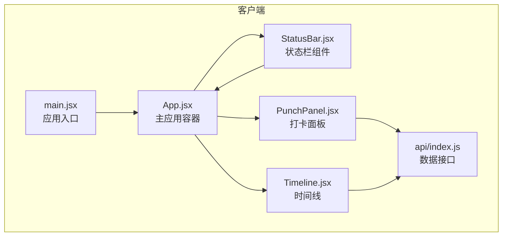
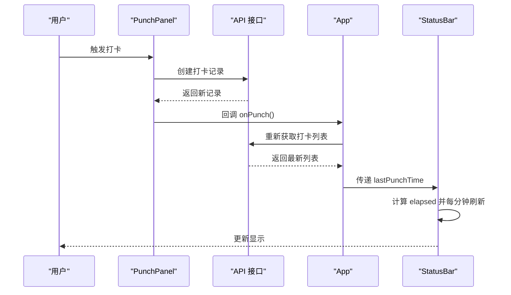
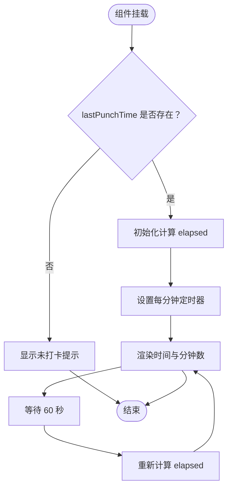
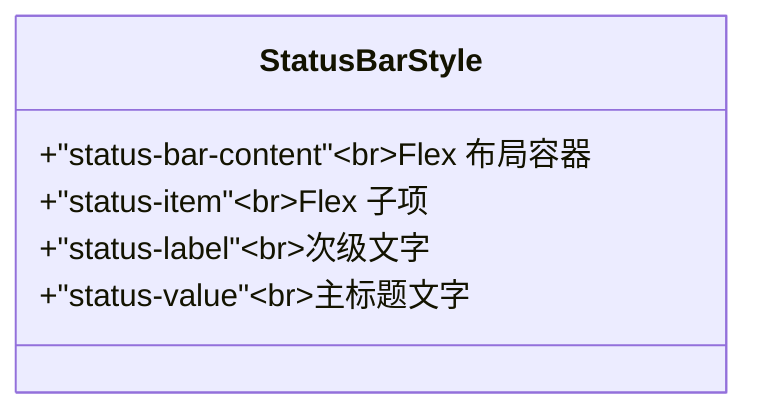
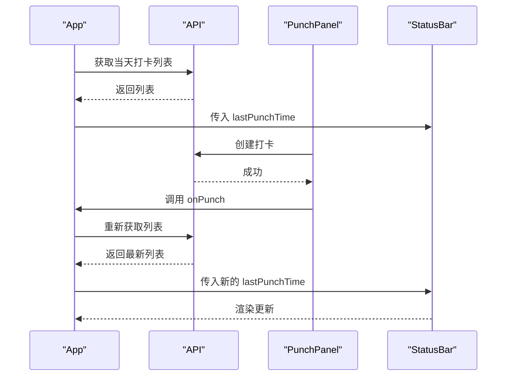
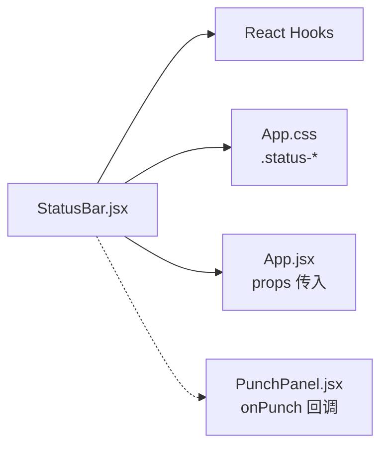

# 状态栏组件

<cite>
**本文引用的文件**
- [StatusBar.jsx](file://client/src/components/StatusBar.jsx)
- [App.jsx](file://client/src/App.jsx)
- [PunchPanel.jsx](file://client/src/components/PunchPanel.jsx)
- [Timeline.jsx](file://client/src/components/Timeline.jsx)
- [index.js](file://client/src/api/index.js)
- [App.css](file://client/src/App.css)
- [index.css](file://client/src/index.css)
- [main.jsx](file://client/src/main.jsx)
</cite>

## 目录
1. [简介](#简介)
2. [项目结构](#项目结构)
3. [核心组件](#核心组件)
4. [架构总览](#架构总览)
5. [详细组件分析](#详细组件分析)
6. [依赖关系分析](#依赖关系分析)
7. [性能考量](#性能考量)
8. [故障排查指南](#故障排查指南)
9. [结论](#结论)
10. [附录](#附录)

## 简介
本文件为 StatusBar 状态栏组件的详细技术文档。该组件负责在应用顶部展示“上次打卡时间”和“自上次打卡以来的已用时（分钟）”，并在时间维度上进行动态更新。组件通过 props 接收来自父组件的最新打卡时间，并基于此计算相对时间，每分钟刷新一次，确保用户界面实时反映当前状态。

## 项目结构
StatusBar 位于客户端前端代码中，作为 App 的子组件之一，与 PunchPanel、Timeline 等组件共同构成完整的打卡与时间线管理界面。其样式定义集中在 App.css 中的状态栏区域，整体采用响应式布局，适配移动端与小屏设备。

图表来源
- [main.jsx:1-11](file://client/src/main.jsx#L1-L11)
- [App.jsx:10-86](file://client/src/App.jsx#L10-L86)
- [StatusBar.jsx:1-46](file://client/src/components/StatusBar.jsx#L1-L46)
- [PunchPanel.jsx:1-119](file://client/src/components/PunchPanel.jsx#L1-L119)
- [Timeline.jsx:1-138](file://client/src/components/Timeline.jsx#L1-L138)
- [index.js:1-75](file://client/src/api/index.js#L1-L75)

章节来源
- [main.jsx:1-11](file://client/src/main.jsx#L1-L11)
- [App.jsx:10-86](file://client/src/App.jsx#L10-L86)
- [App.css:38-250](file://client/src/App.css#L38-L250)

## 核心组件
- 组件名称：StatusBar
- 单一职责：显示“上次打卡时间”和“已用时（分钟）”，并在时间维度上动态刷新。
- 输入参数：lastPunchTime（字符串或空值）
- 输出渲染：
  - 当 lastPunchTime 为空时，显示“今天尚未打卡”的提示文案；
  - 当 lastPunchTime 存在时，显示格式化的打卡时间与相对分钟数。

关键实现要点
- 使用 useState 管理 elapsed（分钟数）状态；
- 使用 useEffect 在 lastPunchTime 变更时启动定时器，每分钟重新计算并更新 elapsed；
- 使用本地化时间格式化输出打卡时间；
- 清理定时器避免内存泄漏。

章节来源
- [StatusBar.jsx:3-46](file://client/src/components/StatusBar.jsx#L3-L46)

## 架构总览
StatusBar 作为 App 的子组件被渲染在 header 区域，其数据由 App 从后端接口获取的打卡记录推导而来。当用户在 PunchPanel 中完成一次打卡后，App 会重新拉取数据并传入新的 lastPunchTime，从而驱动 StatusBar 的重新渲染与更新。

图表来源
- [PunchPanel.jsx:28-45](file://client/src/components/PunchPanel.jsx#L28-L45)
- [index.js:9-17](file://client/src/api/index.js#L9-L17)
- [App.jsx:26-38](file://client/src/App.jsx#L26-L38)
- [StatusBar.jsx:6-17](file://client/src/components/StatusBar.jsx#L6-L17)

## 详细组件分析

### 组件职责与数据流
- 数据来源：App 通过 API 获取当天的打卡记录，取数组最后一个元素的时间戳作为 lastPunchTime 传给 StatusBar。
- 渲染分支：
  - 无打卡记录：显示“尚未打卡”的提示；
  - 有打卡记录：格式化打卡时间为 HH:mm，并计算与当前时间的分钟差，每分钟刷新一次。
- 动态更新机制：使用定时器每 60 秒执行一次计算，保证 UI 实时性；组件卸载时清理定时器，防止内存泄漏。

图表来源
- [StatusBar.jsx:6-17](file://client/src/components/StatusBar.jsx#L6-L17)
- [StatusBar.jsx:19-44](file://client/src/components/StatusBar.jsx#L19-L44)

章节来源
- [StatusBar.jsx:3-46](file://client/src/components/StatusBar.jsx#L3-L46)
- [App.jsx:40-41](file://client/src/App.jsx#L40-L41)

### 样式设计与布局策略
- 容器布局：采用 Flex 布局，左右两端对齐，便于展示两个状态项；
- 文字层级：label 使用较小字号与次级文字色，value 使用较大字号与主文字色，形成清晰的信息层次；
- 响应式适配：在小屏设备下，整体间距与字号保持紧凑，确保在窄屏上仍具可读性；
- 主题变量：使用 CSS 变量统一管理颜色与圆角等视觉属性，便于主题切换与一致性维护。

图表来源
- [App.css:227-248](file://client/src/App.css#L227-L248)

章节来源
- [App.css:227-248](file://client/src/App.css#L227-L248)
- [index.css:1-25](file://client/src/index.css#L1-L25)

### 与主应用的数据同步机制
- 数据获取：App 在初始化时调用 API 获取当天打卡列表；
- 状态推导：取列表最后一个元素的 time 字段作为 lastPunchTime；
- 事件驱动：PunchPanel 完成一次打卡后，回调 onPunch，App 再次拉取数据并重新渲染；
- 组件通信：StatusBar 仅消费 lastPunchTime，不直接发起网络请求，降低耦合度。

图表来源
- [App.jsx:26-38](file://client/src/App.jsx#L26-L38)
- [PunchPanel.jsx:28-45](file://client/src/components/PunchPanel.jsx#L28-L45)
- [index.js:3-7](file://client/src/api/index.js#L3-L7)
- [index.js:9-17](file://client/src/api/index.js#L9-L17)

章节来源
- [App.jsx:26-38](file://client/src/App.jsx#L26-L38)
- [PunchPanel.jsx:28-45](file://client/src/components/PunchPanel.jsx#L28-L45)
- [index.js:3-7](file://client/src/api/index.js#L3-L7)

### 可定制选项与扩展建议
- 显示格式：
  - 当前实现固定为 HH:mm（24 小时制），若需国际化或更多格式，可在组件内部增加配置项；
  - 已用时单位固定为“分钟”，可扩展为“小时/分钟”或“秒”等。
- 颜色主题：
  - 组件使用 App.css 中的 CSS 变量，可通过覆盖变量值实现主题切换；
  - 若需要多套主题，可在组件外部传入 className 或 theme 配置。
- 动画效果：
  - 当前无动画，可考虑在 elapsed 更新时添加淡入/抖动等轻量动画提升交互体验；
  - 注意动画性能，避免频繁重排导致掉帧。
- 可访问性：
  - 可为状态项添加 aria-label，提升屏幕阅读器支持；
  - 提供键盘导航与焦点管理，增强可用性。

章节来源
- [App.css:1-11](file://client/src/App.css#L1-L11)
- [StatusBar.jsx:27-31](file://client/src/components/StatusBar.jsx#L27-L31)

## 依赖关系分析
- 组件内依赖：React Hooks（useState、useEffect）用于状态与副作用管理；
- 外部依赖：无第三方库，纯 React 实现；
- 数据依赖：通过 props 接收 lastPunchTime，不直接访问全局状态；
- 样式依赖：依赖 App.css 中的状态栏样式类名；
- 交互依赖：与 PunchPanel 和 App 的协作通过回调函数完成。

图表来源
- [StatusBar.jsx:1-46](file://client/src/components/StatusBar.jsx#L1-L46)
- [App.jsx:40-48](file://client/src/App.jsx#L40-L48)
- [PunchPanel.jsx:38-39](file://client/src/components/PunchPanel.jsx#L38-L39)
- [App.css:227-248](file://client/src/App.css#L227-L248)

章节来源
- [StatusBar.jsx:1-46](file://client/src/components/StatusBar.jsx#L1-L46)
- [App.jsx:40-48](file://client/src/App.jsx#L40-L48)

## 性能考量
- 定时器粒度：每分钟刷新一次，频率较低，对性能影响微乎其微；
- 渲染范围：仅更新 elapsed，DOM 更新量极小；
- 清理策略：组件卸载时清理定时器，避免内存泄漏；
- 优化建议：
  - 若需要更高精度（秒级），可调整定时器间隔，但需权衡性能；
  - 对于大量用户场景，可考虑服务端推送或 WebSocket 实时更新，减少轮询；
  - 在极端情况下，可引入节流/防抖策略，避免短时间内多次重复计算。

章节来源
- [StatusBar.jsx:6-17](file://client/src/components/StatusBar.jsx#L6-L17)

## 故障排查指南
- 问题：未显示上次打卡时间
  - 检查 App 是否正确获取打卡列表且取到最后一条记录；
  - 确认 lastPunchTime 是否为有效日期字符串。
- 问题：已用时不更新
  - 检查 useEffect 的依赖数组是否包含 lastPunchTime；
  - 确认定时器是否正常启动与清理。
- 问题：样式异常
  - 检查 App.css 中的状态栏类名是否存在；
  - 确认 CSS 变量是否被正确覆盖或冲突。
- 问题：国际化时间格式不符
  - 可在组件内部增加格式化配置项，支持更多语言与时区。

章节来源
- [App.jsx:40-41](file://client/src/App.jsx#L40-L41)
- [StatusBar.jsx:6-17](file://client/src/components/StatusBar.jsx#L6-L17)
- [App.css:227-248](file://client/src/App.css#L227-L248)

## 结论
StatusBar 组件以最小的复杂度实现了“上次打卡时间”和“已用时”的展示与动态更新，与 PunchPanel、App 等组件协同工作，构成了完整的打卡应用前端架构。其简洁的实现、明确的职责以及良好的样式适配，使其成为用户体验中的关键信息节点。通过合理的扩展点（格式化、主题、动画），可进一步提升可定制性与交互体验。

## 附录
- 关键路径参考
  - 组件实现：[StatusBar.jsx:3-46](file://client/src/components/StatusBar.jsx#L3-L46)
  - 数据来源与渲染：[App.jsx:26-48](file://client/src/App.jsx#L26-L48)
  - 打卡流程与回调：[PunchPanel.jsx:28-45](file://client/src/components/PunchPanel.jsx#L28-L45)
  - API 接口定义：[index.js:3-17](file://client/src/api/index.js#L3-L17)
  - 样式定义：[App.css:227-248](file://client/src/App.css#L227-L248)