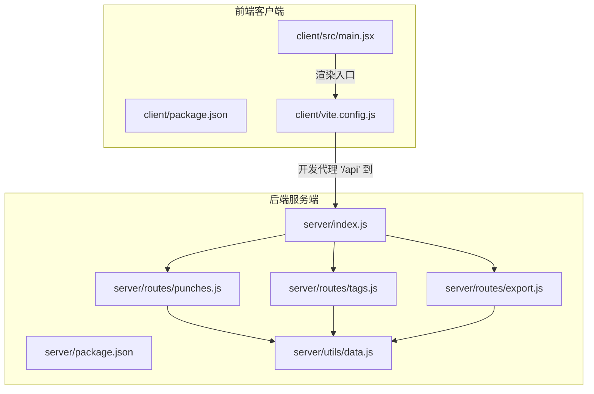
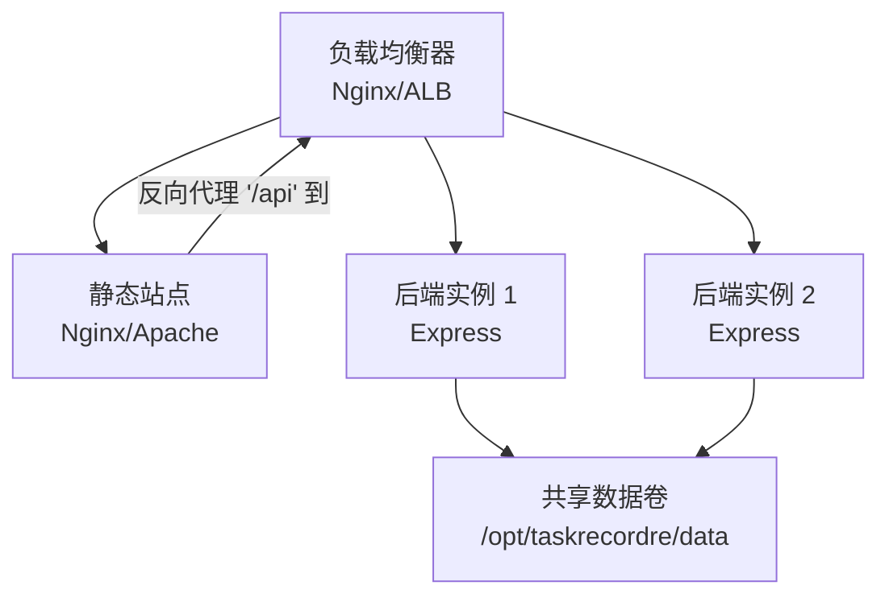
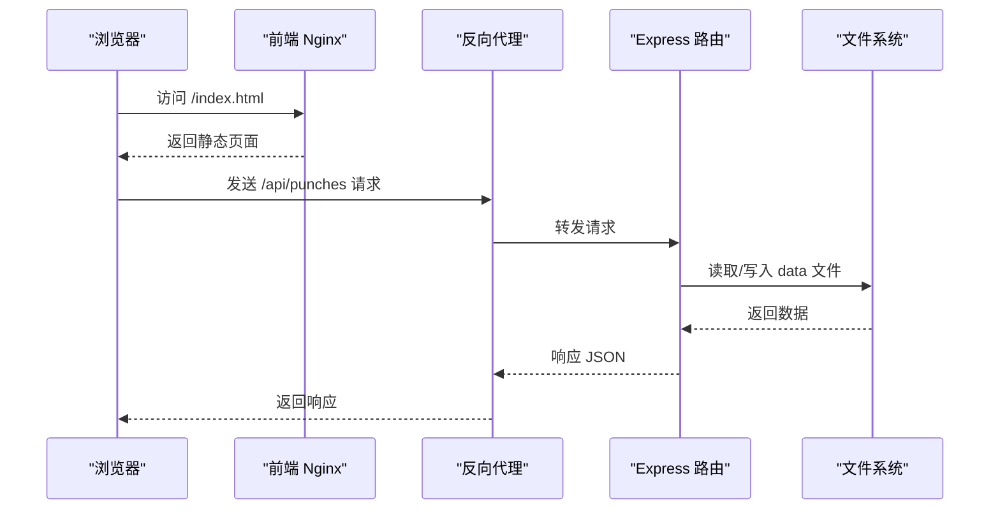
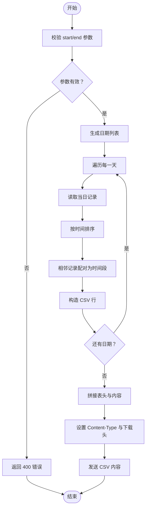
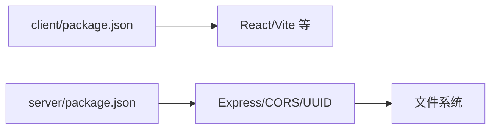

# 部署与运维

<cite>
**本文引用的文件**
- [client/package.json](file://client/package.json)
- [client/vite.config.js](file://client/vite.config.js)
- [client/src/main.jsx](file://client/src/main.jsx)
- [server/package.json](file://server/package.json)
- [server/index.js](file://server/index.js)
- [server/routes/punches.js](file://server/routes/punches.js)
- [server/routes/export.js](file://server/routes/export.js)
- [server/routes/tags.js](file://server/routes/tags.js)
- [server/utils/data.js](file://server/utils/data.js)
</cite>

## 目录
1. [简介](#简介)
2. [项目结构](#项目结构)
3. [核心组件](#核心组件)
4. [架构总览](#架构总览)
5. [详细组件分析](#详细组件分析)
6. [依赖关系分析](#依赖关系分析)
7. [性能考虑](#性能考虑)
8. [故障排除指南](#故障排除指南)
9. [结论](#结论)
10. [附录](#附录)

## 简介
本文件面向运维工程师，提供 taskRecordre 项目的生产级部署与运维指南。内容覆盖环境准备、依赖安装、服务器配置、静态资源构建、环境变量与性能优化、多平台部署（传统服务器、云服务、容器）、监控与日志、错误追踪、负载均衡与缓存、安全加固、版本发布与回滚、灾难恢复，以及故障排除与性能调优建议。

## 项目结构
项目采用前后端分离架构：
- 前端（客户端）：基于 Vite + React 的单页应用（SPA），通过代理访问后端 API。
- 后端（服务端）：基于 Express 的 REST API，提供打卡记录、标签管理与导出功能；数据以 JSON 文件形式存储在本地磁盘目录中。

图表来源
- [client/vite.config.js:1-15](file://client/vite.config.js#L1-L15)
- [client/src/main.jsx:1-11](file://client/src/main.jsx#L1-L11)
- [server/index.js:1-35](file://server/index.js#L1-L35)
- [server/routes/punches.js:1-117](file://server/routes/punches.js#L1-L117)
- [server/routes/tags.js:1-75](file://server/routes/tags.js#L1-L75)
- [server/routes/export.js:1-88](file://server/routes/export.js#L1-L88)
- [server/utils/data.js:1-57](file://server/utils/data.js#L1-L57)

章节来源
- [client/package.json:1-20](file://client/package.json#L1-L20)
- [client/vite.config.js:1-15](file://client/vite.config.js#L1-L15)
- [client/src/main.jsx:1-11](file://client/src/main.jsx#L1-L11)
- [server/package.json:1-15](file://server/package.json#L1-L15)
- [server/index.js:1-35](file://server/index.js#L1-L35)

## 核心组件
- 前端构建与开发
  - 使用 Vite 进行开发与生产构建；开发模式下通过代理将 /api 请求转发至后端服务。
  - 生产构建产物输出到客户端 dist 目录，需由反向代理或静态 Web 服务器提供。
- 后端服务
  - Express 应用，启用 CORS 与 JSON 解析中间件；注册三类路由：打卡、标签、导出。
  - 数据持久化：按日期拆分的 JSON 文件与一个标签清单文件，均位于服务端 data 目录。
- 路由与业务
  - 打卡：支持查询、新增、更新、删除；按时间排序；日期来自请求体中的时间字段。
  - 标签：支持增删改查；自动生成颜色值。
  - 导出：按日期范围聚合记录，相邻记录配对形成时间段，输出 CSV 文件并触发下载。

章节来源
- [client/vite.config.js:1-15](file://client/vite.config.js#L1-L15)
- [server/index.js:1-35](file://server/index.js#L1-L35)
- [server/routes/punches.js:1-117](file://server/routes/punches.js#L1-L117)
- [server/routes/tags.js:1-75](file://server/routes/tags.js#L1-L75)
- [server/routes/export.js:1-88](file://server/routes/export.js#L1-L88)
- [server/utils/data.js:1-57](file://server/utils/data.js#L1-L57)

## 架构总览
生产部署建议采用“反向代理 + 双实例后端 + 单机数据卷”的拓扑，以实现高可用与可扩展性。

图表来源
- [server/index.js:1-35](file://server/index.js#L1-L35)
- [client/vite.config.js:1-15](file://client/vite.config.js#L1-L15)

## 详细组件分析

### 前端构建与部署
- 开发与预览
  - 开发：使用 Vite 提供热更新与代理；代理规则将 /api 请求转发至后端服务端口。
  - 预览：本地预览生产构建结果。
- 生产构建
  - 使用 Vite 生产构建，产物位于客户端 dist 目录。
  - 部署方式：将 dist 目录作为静态站点根目录；Nginx/Apache 配置反向代理，将 /api 转发至后端服务。
- 环境变量
  - 当前仓库未定义前端环境变量；如需运行时配置，可在构建时注入或通过反向代理传递。

章节来源
- [client/package.json:1-20](file://client/package.json#L1-L20)
- [client/vite.config.js:1-15](file://client/vite.config.js#L1-L15)
- [client/src/main.jsx:1-11](file://client/src/main.jsx#L1-L11)

### 后端服务与数据层
- 服务启动
  - 通过 npm/yarn 脚本启动；监听固定端口；自动创建数据目录。
- 路由与接口
  - 打卡：GET/POST/PUT/DELETE，支持按日期查询与更新。
  - 标签：GET/POST/PUT/DELETE，支持自动生成颜色。
  - 导出：GET，按日期范围聚合并输出 CSV。
- 数据存储
  - 每日打卡记录保存为 data/YYYY-MM-DD.json；标签保存为 data/tags.json。
  - 文件读写采用同步 API，注意在高并发场景下的性能与一致性风险。

图表来源
- [server/index.js:1-35](file://server/index.js#L1-L35)
- [server/routes/punches.js:1-117](file://server/routes/punches.js#L1-L117)
- [server/utils/data.js:1-57](file://server/utils/data.js#L1-L57)

章节来源
- [server/package.json:1-15](file://server/package.json#L1-L15)
- [server/index.js:1-35](file://server/index.js#L1-L35)
- [server/utils/data.js:1-57](file://server/utils/data.js#L1-L57)

### 导出流程（CSV）
- 输入参数：start、end（YYYY-MM-DD）。
- 处理逻辑：遍历日期范围，读取每日记录并按时间排序；相邻记录配对计算时长；转义 CSV 字段；输出带 BOM 的 UTF-8 CSV 并设置下载头。

图表来源
- [server/routes/export.js:1-88](file://server/routes/export.js#L1-L88)

章节来源
- [server/routes/export.js:1-88](file://server/routes/export.js#L1-L88)

### 标签管理
- 颜色生成：基于黄金角算法确保颜色分散。
- 接口：支持查询、创建、更新、删除标签。

章节来源
- [server/routes/tags.js:1-75](file://server/routes/tags.js#L1-L75)

## 依赖关系分析
- 前端依赖
  - React 生态与 Vite 工具链；开发代理指向后端服务端口。
- 后端依赖
  - Express 提供 Web 服务；CORS 支持跨域；UUID 用于生成唯一标识；文件系统用于本地数据持久化。

图表来源
- [client/package.json:1-20](file://client/package.json#L1-L20)
- [server/package.json:1-15](file://server/package.json#L1-L15)

章节来源
- [client/package.json:1-20](file://client/package.json#L1-L20)
- [server/package.json:1-15](file://server/package.json#L1-L15)

## 性能考虑
- I/O 与并发
  - 数据读写使用同步 API，高并发下可能导致阻塞；建议引入异步文件操作或数据库替代方案。
- 缓存策略
  - 对只读接口（如标签列表、历史记录查询）可引入内存缓存或 CDN 缓存；对导出接口建议异步处理并提供任务状态查询。
- 压缩与传输
  - 启用 Gzip/Brotli 压缩；静态资源开启长期缓存与 ETag。
- 反向代理优化
  - 合理设置超时、缓冲区大小与连接数；开启健康检查与熔断。
- 数据库迁移建议
  - 将 JSON 文件替换为轻量数据库（如 SQLite 或嵌入式数据库），提升并发与可靠性。

章节来源
- [server/utils/data.js:1-57](file://server/utils/data.js#L1-L57)
- [server/routes/export.js:1-88](file://server/routes/export.js#L1-L88)

## 故障排除指南
- 前端无法访问后端 API
  - 检查反向代理是否正确转发 /api；确认后端服务已启动且端口开放。
- 404/400 错误
  - 打卡/标签接口：确认请求体格式与必需字段；导出接口：确认 start/end 参数格式与范围。
- 数据异常或丢失
  - 检查 data 目录权限与磁盘空间；确认文件读写成功；必要时进行备份与恢复。
- 性能问题
  - 观察 CPU 与 I/O；评估是否需要异步文件操作或数据库迁移；增加缓存与压缩。
- 日志与错误追踪
  - 后端：集中化日志（stdout/stderr）+ 结构化日志；错误统一捕获与上报。
  - 前端：错误边界与网络错误上报；结合浏览器开发者工具定位问题。

章节来源
- [server/index.js:1-35](file://server/index.js#L1-L35)
- [server/routes/punches.js:1-117](file://server/routes/punches.js#L1-L117)
- [server/routes/export.js:1-88](file://server/routes/export.js#L1-L88)
- [server/routes/tags.js:1-75](file://server/routes/tags.js#L1-L75)

## 结论
本指南提供了从环境准备、构建部署到运维监控与故障处理的全链路实践建议。针对当前基于文件系统的数据模型，建议尽快引入数据库与异步 I/O，以满足生产环境的稳定性与性能要求。

## 附录

### A. 生产环境部署流程（通用步骤）
- 环境准备
  - 操作系统：Linux（推荐 Ubuntu/CentOS）；Node.js 版本满足 package.json 要求。
  - 系统依赖：Nginx/Apache（反向代理）、防火墙放通端口、SSL 证书。
- 依赖安装
  - 前端：安装依赖并执行生产构建；产物上传至静态站点根目录。
  - 后端：安装依赖并配置进程管理器（PM2/Docker）。
- 服务器配置
  - Nginx：静态站点根目录、/api 反代、Gzip、HTTPS、限流与安全头。
  - 后端：监听地址与端口、健康检查、日志轮转。
- 验收测试
  - 页面加载、API 调用、导出功能、标签管理。

章节来源
- [client/package.json:1-20](file://client/package.json#L1-L20)
- [server/package.json:1-15](file://server/package.json#L1-L15)
- [client/vite.config.js:1-15](file://client/vite.config.js#L1-L15)
- [server/index.js:1-35](file://server/index.js#L1-L35)

### B. 多平台部署要点
- 传统服务器
  - 使用 Nginx 作为反向代理；PM2 管理 Node 进程；文件系统挂载持久化目录。
- 云服务
  - 使用弹性负载均衡与自动伸缩；对象存储存放静态资源；容器服务托管后端。
- Docker 容器
  - 前端镜像：Nginx + dist；后端镜像：Node + 服务端代码；共享卷或对象存储承载 data 目录。

章节来源
- [client/vite.config.js:1-15](file://client/vite.config.js#L1-L15)
- [server/index.js:1-35](file://server/index.js#L1-L35)

### C. 监控指标与日志
- 指标
  - QPS、响应时间、错误率、CPU/内存/磁盘 I/O、文件句柄数。
- 日志
  - 分离访问日志与应用日志；结构化 JSON；集中收集与检索。
- 错误追踪
  - 统一异常捕获与上报；关键路径埋点；告警阈值与通知。

章节来源
- [server/index.js:1-35](file://server/index.js#L1-L35)

### D. 负载均衡、缓存与安全
- 负载均衡
  - Nginx/ALB 健康检查与会话保持策略。
- 缓存
  - 静态资源强缓存；接口结果缓存；导出任务异步化。
- 安全
  - HTTPS、CSP、X-Frame-Options、X-Content-Type-Options；API 限流与鉴权。

章节来源
- [client/vite.config.js:1-15](file://client/vite.config.js#L1-L15)
- [server/index.js:1-35](file://server/index.js#L1-L35)

### E. 版本发布、回滚与灾备
- 发布
  - Git 标签、CI 构建、灰度发布、滚动升级。
- 回滚
  - 快速回退至上一版本；数据备份与一致性校验。
- 灾难恢复
  - 数据快照与异地备份；演练恢复流程；RTO/RPO 指标。

章节来源
- [server/utils/data.js:1-57](file://server/utils/data.js#L1-L57)