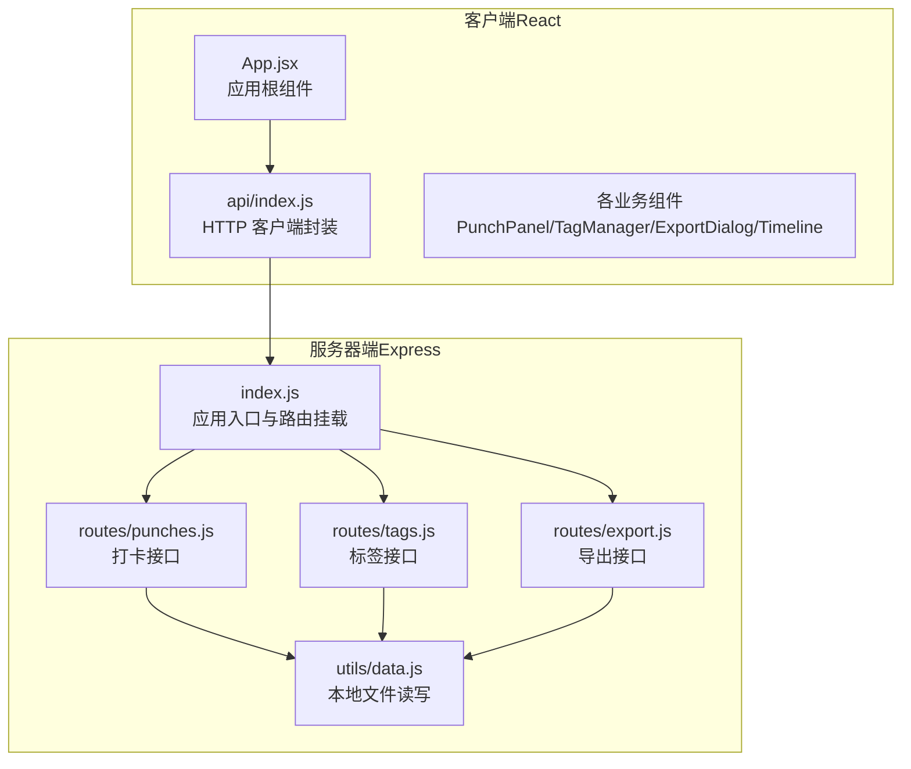
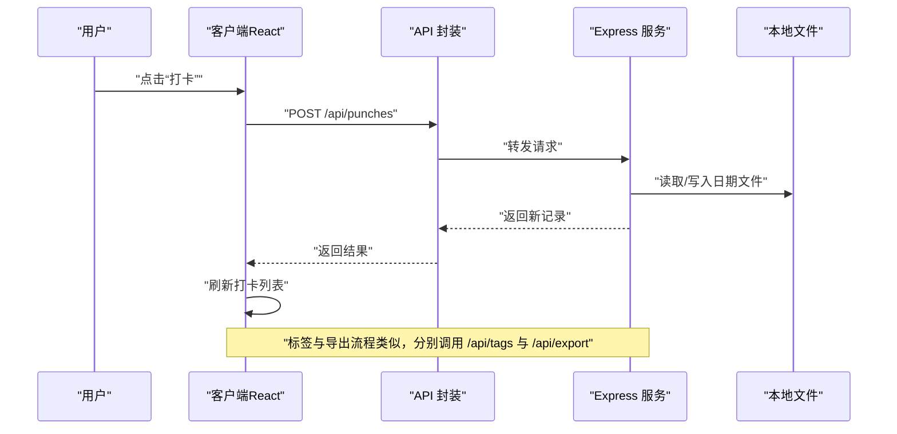
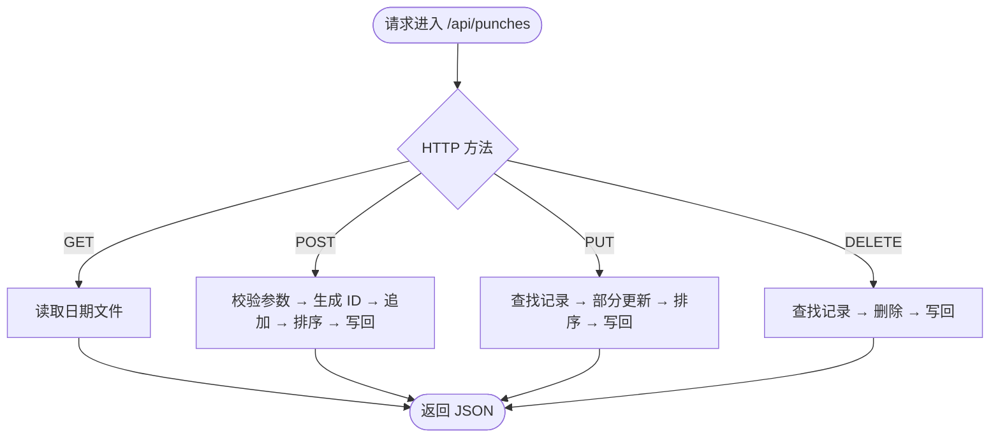
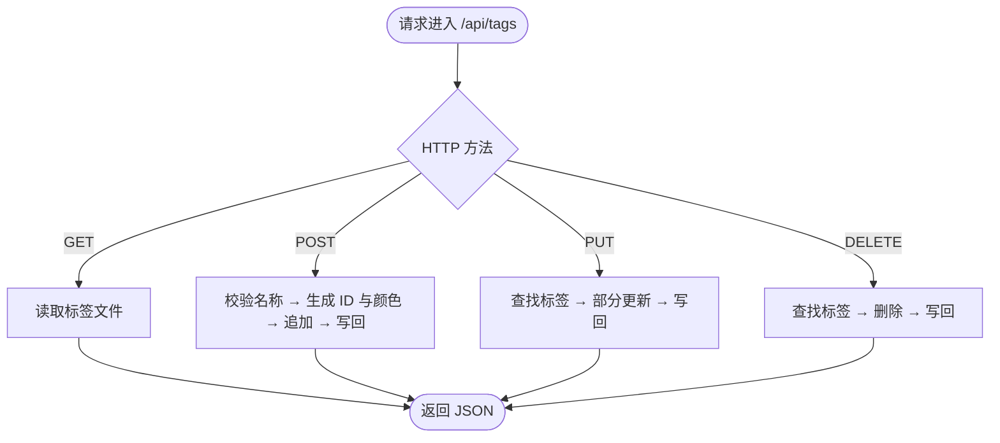
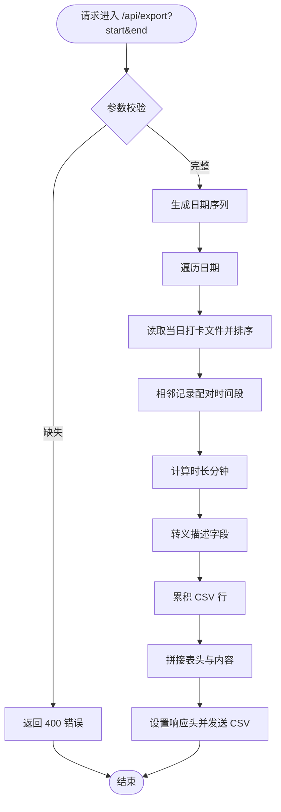
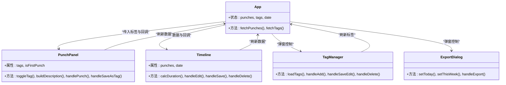
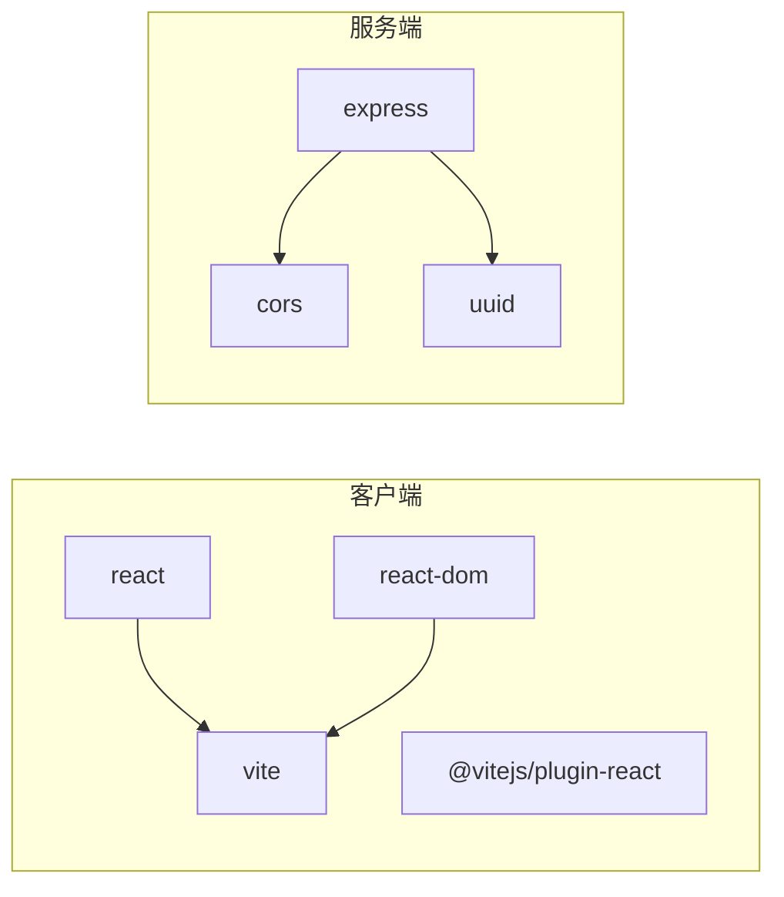

# 项目概述

<cite>
**本文档引用的文件**
- [client/package.json](file://client/package.json)
- [server/package.json](file://server/package.json)
- [client/src/App.jsx](file://client/src/App.jsx)
- [client/src/main.jsx](file://client/src/main.jsx)
- [client/src/api/index.js](file://client/src/api/index.js)
- [client/src/components/PunchPanel.jsx](file://client/src/components/PunchPanel.jsx)
- [client/src/components/TagManager.jsx](file://client/src/components/TagManager.jsx)
- [client/src/components/ExportDialog.jsx](file://client/src/components/ExportDialog.jsx)
- [client/src/components/Timeline.jsx](file://client/src/components/Timeline.jsx)
- [client/src/components/TagManager.css](file://client/src/components/TagManager.css)
- [client/src/components/ExportDialog.css](file://client/src/components/ExportDialog.css)
- [client/src/App.css](file://client/src/App.css)
- [server/index.js](file://server/index.js)
- [server/utils/data.js](file://server/utils/data.js)
- [server/routes/punches.js](file://server/routes/punches.js)
- [server/routes/tags.js](file://server/routes/tags.js)
- [server/routes/export.js](file://server/routes/export.js)
</cite>

## 目录
1. [简介](#简介)
2. [项目结构](#项目结构)
3. [核心组件](#核心组件)
4. [架构总览](#架构总览)
5. [详细组件分析](#详细组件分析)
6. [依赖关系分析](#依赖关系分析)
7. [性能考量](#性能考量)
8. [故障排查指南](#故障排查指南)
9. [结论](#结论)
10. [附录](#附录)

## 简介
taskRecordre 是一个基于 React + Express 的前后端分离任务记录与时间管理应用。其核心目标是帮助用户以“打卡”方式记录每日任务片段，并通过标签系统进行分类，最终支持将一段时间内的记录导出为 CSV 文件，便于统计与归档。

- 用户价值主张
  - 简洁直观的“打卡”入口，快速记录任务开始/结束时间点
  - 标签系统提升记录的可检索性与复用性
  - 时间线视图自动计算相邻打卡之间的时间段与时长
  - 一键导出 CSV，满足报表与数据分析需求

- 技术选型考虑
  - 客户端：React + Vite，轻量高效，开发体验良好
  - 服务端：Express + 原生 fs，零外部依赖，部署简单
  - 数据持久化：按日期拆分的 JSON 文件 + 全局标签文件，易读易备份

- 功能特性概览
  - 任务记录：创建、更新、删除打卡记录
  - 时间管理：自动生成时间段、计算时长、编辑结束时间
  - 标签系统：增删改查标签，支持颜色区分
  - CSV 导出：按日期范围批量导出时间段记录

## 项目结构
项目采用典型的前后端分离结构：
- 客户端（client）：React 应用，负责 UI、交互与 API 调用
- 服务器端（server）：Express 服务，提供 REST 接口与本地文件存储

**图表来源**
- [client/src/App.jsx:1-86](file://client/src/App.jsx#L1-L86)
- [client/src/api/index.js:1-75](file://client/src/api/index.js#L1-L75)
- [server/index.js:1-35](file://server/index.js#L1-L35)
- [server/routes/punches.js:1-117](file://server/routes/punches.js#L1-L117)
- [server/routes/tags.js:1-75](file://server/routes/tags.js#L1-L75)
- [server/routes/export.js:1-88](file://server/routes/export.js#L1-L88)
- [server/utils/data.js:1-57](file://server/utils/data.js#L1-L57)

**章节来源**
- [client/package.json:1-20](file://client/package.json#L1-L20)
- [server/package.json:1-15](file://server/package.json#L1-L15)
- [client/src/main.jsx:1-11](file://client/src/main.jsx#L1-L11)
- [server/index.js:1-35](file://server/index.js#L1-L35)

## 核心组件
- 应用根组件（App）
  - 负责全局状态（打卡列表、标签列表、当前日期）、加载数据与渲染四大区域：状态栏、打卡面板、时间线、操作按钮
  - 提供标签管理与导出对话框的开关控制

- 打卡面板（PunchPanel）
  - 支持多标签选择与自定义描述组合
  - 触发创建打卡请求，并在成功后刷新数据

- 标签管理器（TagManager）
  - 提供标签的增删改查与颜色设置
  - 与 App 协作刷新标签列表

- 时间线（Timeline）
  - 将相邻打卡配对为时间段，计算时长
  - 支持编辑结束时间与描述、删除时间段

- 导出对话框（ExportDialog）
  - 选择起止日期，触发 CSV 导出下载

**章节来源**
- [client/src/App.jsx:1-86](file://client/src/App.jsx#L1-L86)
- [client/src/components/PunchPanel.jsx:1-119](file://client/src/components/PunchPanel.jsx#L1-L119)
- [client/src/components/TagManager.jsx:1-135](file://client/src/components/TagManager.jsx#L1-L135)
- [client/src/components/Timeline.jsx:1-138](file://client/src/components/Timeline.jsx#L1-L138)
- [client/src/components/ExportDialog.jsx:1-98](file://client/src/components/ExportDialog.jsx#L1-L98)

## 架构总览
系统采用“前端单页应用 + 后端 REST API + 本地文件存储”的轻量架构。客户端通过统一的 API 封装调用后端接口；后端按日期拆分 JSON 文件存储打卡记录，单独的标签文件存储标签元数据；导出接口遍历日期范围聚合时间段并生成 CSV。

**图表来源**
- [client/src/api/index.js:1-75](file://client/src/api/index.js#L1-L75)
- [server/routes/punches.js:32-60](file://server/routes/punches.js#L32-L60)
- [server/utils/data.js:17-34](file://server/utils/data.js#L17-L34)

**章节来源**
- [server/index.js:1-35](file://server/index.js#L1-L35)
- [server/utils/data.js:1-57](file://server/utils/data.js#L1-L57)

## 详细组件分析

### 打卡接口（punches）
- 设计要点
  - 按查询参数 date 获取当天记录；若未提供则默认当天
  - 创建时自动生成 UUID，按时间升序排序并写回
  - 更新/删除需携带 date 参数，保证数据定位准确

**图表来源**
- [server/routes/punches.js:32-114](file://server/routes/punches.js#L32-L114)
- [server/utils/data.js:17-34](file://server/utils/data.js#L17-L34)

**章节来源**
- [server/routes/punches.js:1-117](file://server/routes/punches.js#L1-L117)
- [server/utils/data.js:1-57](file://server/utils/data.js#L1-L57)

### 标签接口（tags）
- 设计要点
  - 自动生成颜色：基于黄金角（137.5°）确保颜色分散且辨识度高
  - 支持部分更新（name/color）

**图表来源**
- [server/routes/tags.js:16-72](file://server/routes/tags.js#L16-L72)
- [server/utils/data.js:40-56](file://server/utils/data.js#L40-L56)

**章节来源**
- [server/routes/tags.js:1-75](file://server/routes/tags.js#L1-L75)
- [server/utils/data.js:1-57](file://server/utils/data.js#L1-L57)

### 导出接口（export）
- 设计要点
  - 遍历日期范围，读取每日打卡记录并按时间排序
  - 相邻记录配对为时间段，计算时长（分钟）
  - 对包含逗号的描述进行 CSV 转义，输出带 BOM 的 UTF-8 文本流

**图表来源**
- [server/routes/export.js:46-84](file://server/routes/export.js#L46-L84)
- [server/utils/data.js:17-24](file://server/utils/data.js#L17-L24)

**章节来源**
- [server/routes/export.js:1-88](file://server/routes/export.js#L1-L88)
- [server/utils/data.js:1-57](file://server/utils/data.js#L1-L57)

### 客户端 API 封装
- 统一前缀 /api，封装 CRUD 与导出请求
- 对非 OK 响应抛出错误，便于上层组件处理

**章节来源**
- [client/src/api/index.js:1-75](file://client/src/api/index.js#L1-L75)

### 应用与组件交互
- App 负责初始化数据与状态，驱动子组件协作
- PunchPanel 与 Timeline 通过 API 与后端交互
- TagManager 与 ExportDialog 作为弹窗组件，独立生命周期管理

**图表来源**
- [client/src/App.jsx:1-86](file://client/src/App.jsx#L1-L86)
- [client/src/components/PunchPanel.jsx:1-119](file://client/src/components/PunchPanel.jsx#L1-L119)
- [client/src/components/Timeline.jsx:1-138](file://client/src/components/Timeline.jsx#L1-L138)
- [client/src/components/TagManager.jsx:1-135](file://client/src/components/TagManager.jsx#L1-L135)
- [client/src/components/ExportDialog.jsx:1-98](file://client/src/components/ExportDialog.jsx#L1-L98)

**章节来源**
- [client/src/App.jsx:1-86](file://client/src/App.jsx#L1-L86)
- [client/src/components/PunchPanel.jsx:1-119](file://client/src/components/PunchPanel.jsx#L1-L119)
- [client/src/components/Timeline.jsx:1-138](file://client/src/components/Timeline.jsx#L1-L138)
- [client/src/components/TagManager.jsx:1-135](file://client/src/components/TagManager.jsx#L1-L135)
- [client/src/components/ExportDialog.jsx:1-98](file://client/src/components/ExportDialog.jsx#L1-L98)

## 依赖关系分析
- 客户端依赖
  - React 生态：React、React DOM
  - 开发工具：Vite、@vitejs/plugin-react
- 服务端依赖
  - Web 框架：Express
  - 跨域：CORS
  - 工具：UUID（生成唯一标识）

**图表来源**
- [client/package.json:11-18](file://client/package.json#L11-L18)
- [server/package.json:9-13](file://server/package.json#L9-L13)

**章节来源**
- [client/package.json:1-20](file://client/package.json#L1-L20)
- [server/package.json:1-15](file://server/package.json#L1-L15)

## 性能考量
- 数据规模
  - 每日 JSON 文件较小，读写开销低
  - 标签文件极小，频繁读写影响可忽略
- 排序策略
  - 写入时排序，读取时直接消费，避免运行时排序
- 导出复杂度
  - O(N log N) 排序 + O(N) 遍历配对，N 为日期范围内总记录数
- 建议
  - 大量历史数据时，建议定期清理或迁移至数据库
  - 导出范围尽量缩小，避免一次性处理过长周期

## 故障排查指南
- 常见问题与定位
  - 打卡失败：检查网络与后端日志；确认时间参数与日期查询参数是否正确传递
  - 标签无法更新/删除：确认标签 ID 是否存在；查看后端返回的 404/400
  - 导出为空：确认日期范围有效；检查对应日期文件是否存在
- 日志与调试
  - 客户端：API 封装对非 OK 响应抛错，可在调用处捕获并提示
  - 服务端：Express 默认输出启动与路由访问日志；可结合文件读写异常定位

**章节来源**
- [client/src/api/index.js:3-74](file://client/src/api/index.js#L3-L74)
- [server/routes/punches.js:62-114](file://server/routes/punches.js#L62-L114)
- [server/routes/tags.js:41-72](file://server/routes/tags.js#L41-L72)
- [server/routes/export.js:46-84](file://server/routes/export.js#L46-L84)

## 结论
taskRecordre 以最小化依赖实现了完整的任务记录与时间管理闭环：简洁的前端交互、稳定的后端接口与可靠的本地存储。它适合个人日常记录、小型团队统计与学习演示场景。对于生产环境，可考虑引入数据库、鉴权与缓存等增强能力。

## 附录
- 快速上手
  - 启动服务端：在 server 目录执行开发命令
  - 启动客户端：在 client 目录执行开发命令
  - 访问地址：前端默认端口，后端默认端口
- 数据位置
  - 服务端 data 目录下按日期命名的 JSON 文件存放打卡记录，tags.json 存放标签元数据

**章节来源**
- [server/index.js:16-34](file://server/index.js#L16-L34)
- [server/utils/data.js:17-56](file://server/utils/data.js#L17-L56)